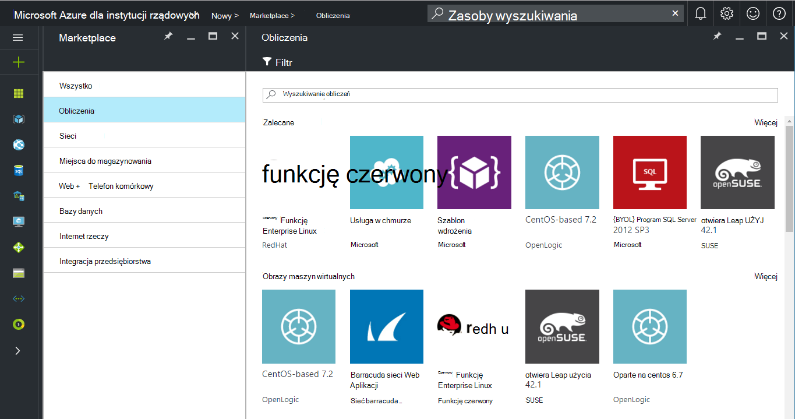
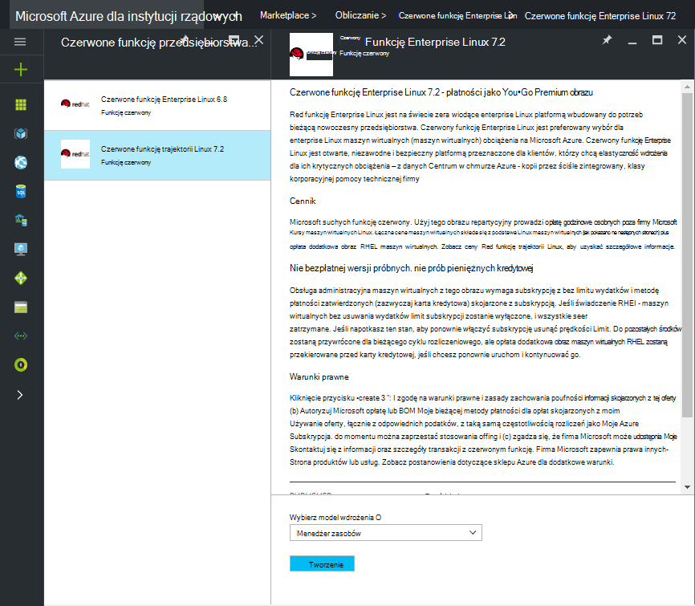
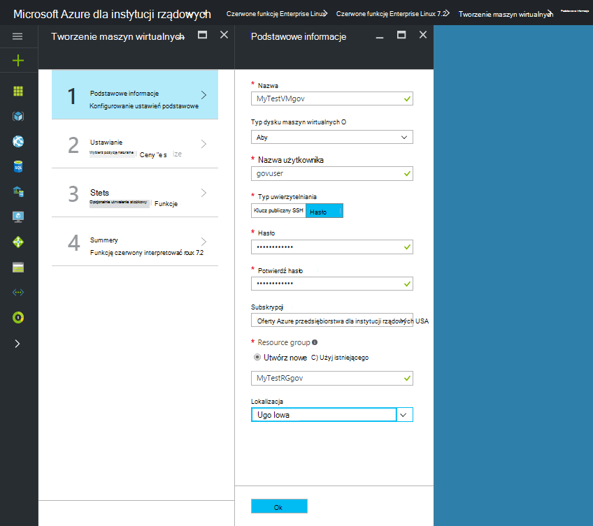
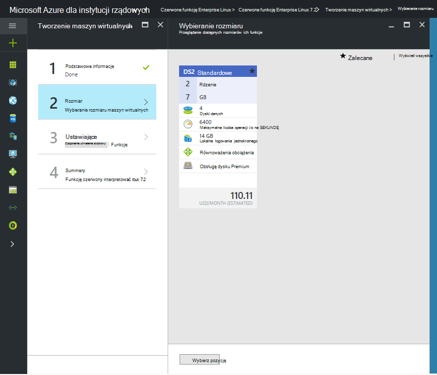

 <properties
    pageTitle="Azure dokumentacji dla instytucji rządowych | Microsoft Azure"
    description="Umożliwia porównanie funkcji i wskazówki dotyczące tworzenia aplikacji dla instytucji rządowych Azure."
    services="Azure-Government"
    cloud="gov"
    documentationCenter=""
    authors="VybavaRamadoss"
    manager="asimm"
    editor=""/>

<tags   ms.service="multiple"
    ms.devlang="na"
    ms.topic="article"
    ms.tgt_pltfrm="na"
    ms.workload="azure-government"
    ms.date="10/20/2016"
    ms.author="zakramer;vybavar"/>

# Azure Marketplace dla instytucji rządowych
Azure Marketplace jest dostępna dla instytucji rządowych Azure z listą zaktualizowanych obrazów z wydawców marketplace. 

## Odmiany
Poniżej wymieniono niektóre zagadnienia, podczas korzystania z usługi Azure Marketplace dla instytucji rządowych:

- Dostępne są tylko obrazy wyświetlić swój własny licencji (BYOL). Nie masz dostępu do innych obrazów, które wymagają transakcji zakupu za pośrednictwem usługi Azure Marketplace
- Tylko niektóre obrazów jest obecnie dostępna w porównaniu z publicznej witryny marketplace. Listę dostępnych obrazów można znaleźć [w tym miejscu](../azure-government-image-gallery.md) 
- Przed rozpoczęciem inicjowania obsługi administracyjnej obrazu, Administrator przedsiębiorstwa, należy włączyć zakupy subskrypcji usługi Azure Marketplace
  - Zaloguj się do portalu jako Administrator przedsiębiorstwa
  - Przejdź do *zarządzania*
  - W obszarze *Szczegóły rejestrowania* kliknij ikonę ołówka obok pozycji *Azure Marketplace*
  - Przełączanie *Włączone/wyłączone* , zależnie od potrzeb
  - Kliknij przycisk *Zapisz*

>[AZURE.NOTE] Jeśli interesuje Cię do przeprowadzenia obrazy dostępne w Azure dla instytucji rządowych zajrzyj do [partnera ułatwiającej rozpoczęcie korzystania wskazówki](documentation-government-manage-marketplace-partners.md) Aby uzyskać więcej informacji.

### Krok 1
Uruchamianie rynku

  

### Krok 2
Przeglądanie różnych produktów do znalezienia tego właściwego.

Program publisher marketplace zawiera listę certyfikaty jako część opis produktu, aby wybrać odpowiednie opcje. 

### Krok 3
Wybierz pozycję product\image

### Krok 4
Uruchamianie przepływu Utwórz, a następnie wprowadź parametry wymagane do wdrożenia

>[AZURE.NOTE] Na liście rozwijanej lokalizacji są widoczne tylko dla instytucji rządowych Azure lokalizacje

### Krok 5
Obserwowanie ceny

### Krok 6
Wykonywanie wszystkich kroków, a następnie kliknij przycisk Ok, aby rozpocząć proces inicjowania obsługi administracyjnej

## Następne kroki

Informacje dodatkowe i aktualizacji Zasubskrybuj [Blog dotyczący programu Microsoft Azure dla instytucji rządowych](https://blogs.msdn.microsoft.com/azuregov/).
