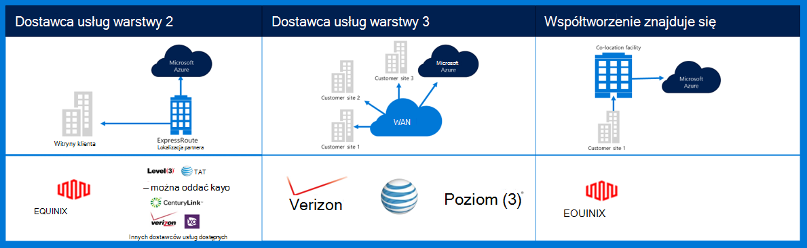
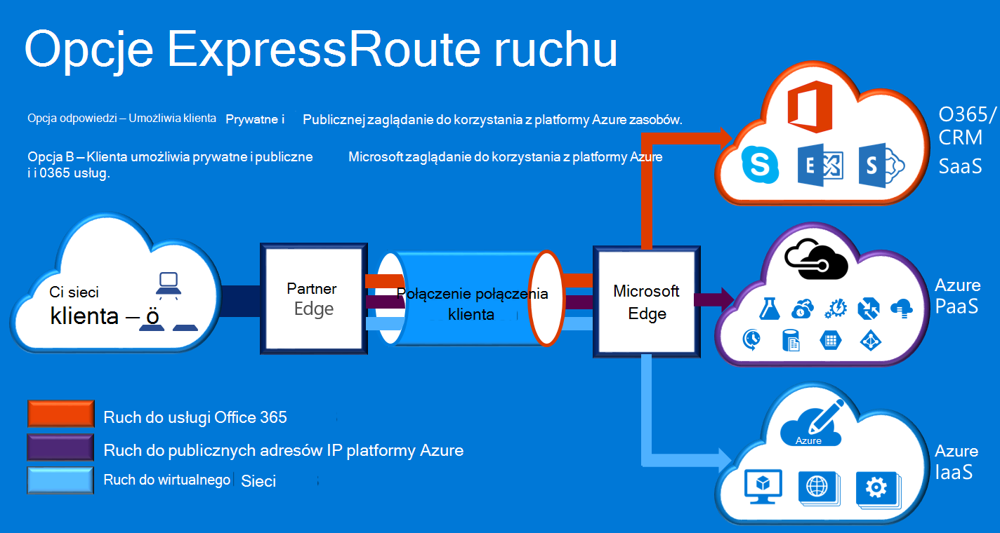

<properties
    pageTitle="Azure dokumentacji Governmenmt | Microsoft Azure"
    description="Dzięki temu w celu porównania funkcji i wskazówki dotyczące prywatnych łączności z programem e dla instytucji rządowych"
    services="Azure-Government"
    cloud="gov" 
    documentationCenter=""
    authors="ryansoc"
    manager="zakramer"
    editor=""/>

<tags
    ms.service="multiple"
    ms.devlang="na"
    ms.topic="article"
    ms.tgt_pltfrm="na"
    ms.workload="azure-government"
    ms.date="09/28/2016"
    ms.author="ryansoc"/>

#  Sieć Azure dla instytucji rządowych

##  ExpressRoute (Connectivity prywatnych)

ExpressRoute jest zazwyczaj dostępny w Azure dla instytucji rządowych. Aby uzyskać więcej informacji (łącznie z partnerami i zaglądanie lokalizacji) zapoznaj się z <a href="https://azure.microsoft.com/en-us/documentation/services/expressroute/">ExpressRoute dokumentacji publicznej </a>.

###  Odmiany

ExpressRoute jest zazwyczaj Dostępnym w Azure dla instytucji rządowych. 

- Klienci dla instytucji rządowych się łączyć pojemności fizycznie odizolowane przez połączenie dedykowane Azure dla instytucji rządowych (Gov) ExpressRoute (Awaryjnych)

- Azure Gov zapewnia dostępność zwiększony i wytrzymałości, korzystając z wielu pary region znajduje się co najmniej 500 mila od siebie 

- Domyślnie wszystkie łączności Azure Gov encja-Relacja jest skonfigurowane aktywny aktywny zbędne z obsługą którym następuje — ta aplikacja zapewnia maksymalnie 10 G elektrycznego pojemności (najmniejszą jest 50MB)

- Azure lokalizacje encja-Relacja Gov zapewniają zoptymalizowane ścieżek (najkrótszy przeskoków, krótki czas oczekiwania, wysoka wydajność itp.) dla klientów i regiony zbędne geo Azure Gov

- Połączenie prywatne encja-Relacja Azure Gov nie są używane, przechodzenia lub zależą w Internecie

- Azure infrastruktury fizycznej i logicznej Gov jest fizycznie zarezerwowane i przecinkami, a dostęp jest ograniczony do osoby z USA

- Microsoft właścicielem i działa wszystkie infrastruktury fiber między regionami Gov Azure i Azure Gov encja-Relacja spełniają-mi lokalizacji

- Azure Awaryjnych Gov zapewnia łączność z usługami w chmurze Microsoft Azure, usługi Office 365 i CRM

### Zagadnienia dotyczące

Są dwa podstawowe usługi, które zapewniają łączność z sieci prywatnej do Azure dla instytucji rządowych: VPN (--witryny dla organizacji typowe) i ExpressRoute.

Azure ExpressRoute służy do tworzenia prywatnych połączeń między centrach danych dla instytucji rządowych Azure i infrastruktury lokalnego lub w środowisku wspólna lokalizacja. ExpressRoute połączenia nie został przekroczony publicznego Internetu — oferują więcej niezawodności, szybsze szybkości i opóźnienia niższej niż typowy połączenia z Internetem. W niektórych przypadkach przy użyciu połączeń ExpressRoute do przenoszenia danych między na środowisko lokalne systemy i Azure plonów znaczną kosztów korzyści.   

W programie ExpressRoute nawiązywania połączeń Azure ExpressRoute w tym miejscu (na przykład mechanizm dostawcy wymiany) lub bezpośrednio nawiązywane Azure z istniejącej sieci WAN (takie jak wiele protokołów etykiety przełączania VPN (MPLS), podanego przez dostawcę usług sieci).

    

Usługi sieci do obsługi aplikacji klienta dla instytucji rządowych Azure i rozwiązań zdecydowanie zaleca się wykonanie nawiązania połączenia dla instytucji rządowych Azure ExpressRoute (connectivity prywatnych). Jeśli zostaną użyte połączeń sieci VPN, należy rozważyć:

- Klienci należy skontaktować się z ich wydające oficjalne/Agencji do określenia, czy jest wymagana łączność prywatne lub innego mechanizmu bezpiecznego połączenia i do identyfikowania należy rozważyć, czy nakładanie dodatkowych ograniczeń.

- Klienci należy zdecydować, czy zwana że VPN witryny do witryny odbywa się za pośrednictwem strefę prywatne łączności.

- Klienci powinni pobrać obwód MPLS lub sieci VPN z Dostawca dostępu licencjonowanego łączności prywatne.

Wszystkich klientów, którzy są używane architektura prywatne łączności należy sprawdzić, czy że właściwe wdrożenie jest ustanowioną i obsługiwane dla połączenia klienta do bramy sieć i Internet (CN-I) krawędź punktu granic router administracji Azure. Podobnie Twoja organizacja musi ustanowienia połączenia z siecią między lokalnego środowiska i bramy sieci/klienta (CN-C) krawędź routera granic punktu administracji Azure.

## Następne kroki

Aby uzyskać dodatkowe informacje i aktualizacje Zasubskrybuj <a href="https://blogs.msdn.microsoft.com/azuregov/">Blog dotyczący programu Microsoft Azure dla instytucji rządowych.</a>
