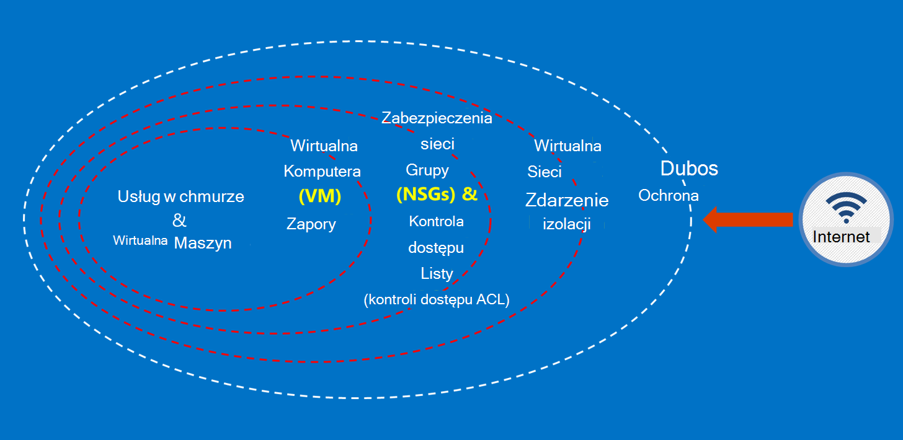

<properties
    pageTitle="Azure dokumentacji dla instytucji rządowych | Microsoft Azure"
    description="Umożliwia porównanie funkcji i wskazówki dotyczące tworzenia aplikacji dla instytucji rządowych Azure"
    services="Azure-Government"
    cloud="gov" 
    documentationCenter=""
    authors="ryansoc"
    manager="zakramer"
    editor=""/>

<tags
    ms.service="multiple"
    ms.devlang="na"
    ms.topic="article"
    ms.tgt_pltfrm="na"
    ms.workload="azure-government"
    ms.date="08/25/2016"
    ms.author="ryansoc"/>

#  Omówienie dokumentacji Azure dla instytucji rządowych

##  Wprowadzenie do dokumentacji Azure dla instytucji rządowych

Ta witryna opisano możliwości usługi [Microsoft Azure dla instytucji rządowych](https://azure.microsoft.com/features/gov/) i zawiera ogólne wskazówki dotyczą wszystkich odbiorców. Przed tym specjalnie regulowanym danych w ramach subskrypcji dla instytucji rządowych Azure, należy zapoznać się z funkcjami Azure dla instytucji rządowych i zapoznaj się z zespołem konta, jeśli masz pytania.

Należy zapoznać się do [Strony zgodność w Centrum zaufania Azure firmy Microsoft](http://www.microsoft.com/en-us/TrustCenter/Compliance/default.aspx) dla bieżącego informacji dotyczących usług Azure dla instytucji rządowych objęte określonych akredytacje i przepisów. Dodatkowe usługi firmy Microsoft mogą być także dostępne, ale są w zakresie usług Azure dla instytucji rządowych objęta i nie zostały opisane w tym dokumencie. Azure usług dla instytucji rządowych może również pozwala na używanie różnych dodatkowe zasoby, aplikacji lub usług, które zostały udostępnione przez inne firmy — lub przez firmę Microsoft warunkach osobnych zasad użytkowania i prywatności, które nie są ujęte w zakresie tego dokumentu. Odpowiadają przeglądania warunków wszystkich tych ofert "dodatek", takich jak ofertą Marketplace, aby upewnić się, że ich nie spełnia określonych wymagań dotyczących zgodności.

Azure dla instytucji rządowych jest dostępna dla obiektów, które obsługują dane, które są objęte pewnych przepisów dla instytucji rządowych i wymagania (na przykład NIST 800.171 (DIB), ITAR, 1075 Skarbowego, P4 DoD i CJIS), gdzie stosowania dla instytucji rządowych Azure jest wymagane do zachować zgodność z przepisami. Azure klienci dla instytucji rządowych są objęte weryfikację uprawnienia.

Podmioty pytania dotyczące uprawnień do administracji Azure zajrzeć ich dział obsługi klienta.

##  Zasady dotyczące zabezpieczania danych klientów w Azure dla instytucji rządowych

Azure dla instytucji rządowych zapewnia szeroką gamę funkcji i usług, które umożliwia tworzenie rozwiązań chmury stosownie do potrzeb dane regulacji kontrolowane. Rozwiązanie zgodności klienta nic się nie więcej niż skutecznego stosowania w nowym polu Azure dla instytucji rządowych funkcje, w połączeniu z dotyczącymi zabezpieczeń pełne dane.
Jeśli rozwiązanie w Azure dla instytucji rządowych, Microsoft obsługuje wiele z tych wymagań na poziomie infrastruktury chmury.

Na poniższym diagramie przedstawiono Azure modelu obrony w głębi. Na przykład firma Microsoft udostępnia infrastruktury chmury podstawowe DDOS, oraz funkcje klienta, takie jak urządzenia zabezpieczeń dla aplikacji specyficzna dla klienta, których potrzebuje DDOS.

Ta strona zawiera foundational zasady zabezpieczenia usługi i aplikacje, dostarczając orientacji i najważniejsze wskazówki dotyczące stosowania tych zasad; innymi słowy jak klienci należy wykorzystać inteligentne Azure rząd w celu zapewnienia obowiązków i odpowiedzialności, które są wymagane do rozwiązanie, które obsługuje ITAR informacji.

Zabezpieczanie danych klientów połączonych ze sobą zasady są następujące:
* Ochrona danych za pomocą szyfrowania
* Zarządzanie hasła
* Izolacji, aby ograniczyć dostęp do danych

##  Ochrona danych klientów przy użyciu szyfrowania

Łagodzenia ryzyka i spotkań obowiązki prawne przepisami, prowadząc samochód rosnącymi fokus i znaczenie szyfrowania danych. Ulepszanie bieżącego środków bezpieczeństwa sieci i aplikacji przy użyciu implementacja szyfrowania skutecznych — i zmniejszanie ryzykiem środowiska chmury.

### Szyfrowanie w pozostałych
Szyfrowanie danych spoczynku dotyczy ochrony zawartości klienta przechowywanych w ilość miejsca do magazynowania. Istnieje kilka sposobów, które może się to zdarzyć:

### Szyfrowanie usługi miejsca do magazynowania

Azure szyfrowanie usługi miejsca do magazynowania jest włączona na poziomie konta miejsca do magazynowania, uzyskując blob blok i blob strony są automatycznie szyfrowane zapisywane magazyn Azure. Po przeczytaniu dane z magazynu Azure będzie odszyfrowywane przez usługę Magazyn przed zwracanych. Umożliwia Zabezpieczanie danych bez konieczności modyfikowania lub dodawanie kodu do dowolnych aplikacji.

### Szyfrowanie dysków Azure
Szyfrowanie dyski systemu operacyjnego i dane używane przez maszyn wirtualnych Azure za pomocą szyfrowania dysku Azure. Integracja z magazynu klucza Azure umożliwia sterowanie i ułatwia zarządzanie kluczy szyfrowania dysku.

### Szyfrowania po stronie klienta
Szyfrowania po stronie klienta jest wbudowany w Java i bibliotekach klienta .NET miejsca do magazynowania, które mogą korzystać Azure klucza magazynu API, co to proste do wykonania. Aby uzyskać dostęp do hasła Azure klucza magazynu określonym osobom przy użyciu usługi Azure Active Directory za pomocą Azure klucza magazynu.

### Szyfrowanie w drodze

Podstawowe szyfrowanie dostępne połączenie dla instytucji rządowych Azure obsługuje protokół poziom zabezpieczeń TLS (Transport) 1.2 i certyfikaty X.509. Federalna informacji przetwarzania FIPS (Standard) 140-2 poziomu 1 cryptographic algorytmów są też używane przez infrastruktury połączeń między Azure dla instytucji rządowych centrach danych.  Windows Server 2012 R2 i Windows 8-plus maszyny wirtualne oraz udziałach plików Azure za pomocą SMB 3.0 szyfrowania między maszyn wirtualnych i udostępnianie plików. Szyfrowanie danych przed są przenoszone do magazynu w aplikacji klienckiej i odszyfrować dane po przesłaniu Brak miejsca za pomocą szyfrowania po stronie klienta.

### Najważniejsze wskazówki dotyczące szyfrowania

* Maszyny wirtualne IaaS: Szyfrowania Azure dysku. Włączanie przestrzeni dyskowej usługi szyfrowania do szyfrowania plików wirtualny dysk twardy, które są używane do tworzenia kopii zapasowych tych dysków w magazynie Azure, ale to tylko dane są szyfrowane nowo pisanych. Oznacza to, że jeśli utworzysz maszyny, a następnie włączyć szyfrowanie usługi miejsca do magazynowania na rachunku miejsca do magazynowania, w którym znajduje się plik wirtualnego dysku twardego, tylko zmiany będą szyfrowane, nie oryginalny plik wirtualnego dysku twardego.
* Szyfrowanie po stronie klienta: To najbezpieczniejsza metoda szyfrowania danych, ponieważ są szyfrowane go przed przewozowe, a dane spoczynku są szyfrowane. Jednak wymaga, Dodaj kod aplikacji przy użyciu magazynu, co może chcesz zrobić. W tych przypadkach umożliwiają HTTPs danych na czas przesyłania i przestrzeni dyskowej usługi szyfrowania do szyfrowania danych na pozostałych. Szyfrowania po stronie klienta obejmuje również większe obciążenie na kliencie — masz konto w tym planów skalowalność, zwłaszcza jeśli są szyfrowania i przenoszenia wiele danych.

Aby uzyskać więcej informacji na temat opcji szyfrowania platformy Azure, zobacz [Przewodnik po zabezpieczeniach miejsca do magazynowania](/storage-security-guide).

##  Ochrona danych klientów, korzystając z funkcji zarządzania hasła

Bezpieczny zarządzania kluczami jest istotne znaczenie dla ochrony danych w chmurze. Klienci powinny dążyć do uproszczenia zarządzania kluczami i zachować kontrolę nad klucze używane przez aplikacje w chmurze i usługi szyfrowania danych.

### Najważniejsze wskazówki dotyczące zarządzania hasła

* Minimalizowanie ryzyka związanego z hasła jest dostępne za pośrednictwem pliki stałe konfiguracyjne, skryptów lub kodu źródłowego za pomocą klucza magazynu. Azure magazynu klucza są szyfrowane klucze (na przykład klucze szyfrowania do szyfrowania dysku Azure) i hasła (na przykład hasła), zapisując je w FIPS 140-2 poziomu 2 sprawdzana poprawność moduły sprzętu (HSM). W odniesieniu do zapewnienia dodanego można importować lub wygenerowania kluczy w tych HSM.
* Kod aplikacji i szablony powinien zawierać tylko identyfikatora URI odwołania do hasła (co oznacza, że rzeczywista hasła nie są w kodzie, konfiguracji lub kodu źródłowego repozytoria). Dzięki temu klucza wyłudzania na wewnętrznych i zewnętrznych umowy odkupu, takich jak zbiorów Boty w GitHub.
* Wykorzystanie silnych RBAC kontrolek w obrębie magazynu klucza. Jeśli operatorem zaufanych pozostaną danej firmy lub przeniesienia do nowej grupy w firmie, należy można zapisać przed mieli dostęp do hasła.  

Aby uzyskać dodatkowe informacje, zobacz [Klucz magazynu dla instytucji rządowych Azure](/azure-government/azure-government-tech-keyvault)

##  Izolacji, aby ograniczyć dostęp do danych

Izolacji jest przy użyciu ograniczenia, segmentacji i kontenerów, aby ograniczyć dostęp do danych tylko autoryzowani użytkownicy, usług i aplikacji. Na przykład odstęp między dzierżawami to mechanizm zabezpieczeń podstawowe multitenant chmury platform, takich jak Microsoft Azure. Logiczne izolacji zapobiega opisuje problemy z operacjami wykonywanymi w innej dzierżawie.

### Środowisko izolacji
Środowisko dla instytucji rządowych Azure jest fizycznie wystąpienia, które różni się od pozostałej części sieci firmy Microsoft. Można to osiągnąć przez szereg fizycznej i logicznej kontrolek, które są następujące: zabezpieczenia fizycznie przeszkód przy użyciu urządzenia biometryczne i kamery.  Użyj poświadczeń określonych i uwierzytelnianie wieloskładnikowe przez pracowników firmy Microsoft wymagających dostępu logicznych w środowisku produkcyjnym.  Wszystkie infrastruktura usługi Azure administracji znajduje się w Stanach Zjednoczonych.

#### Izolacji na klienta
Kontrola dostępu do sieci Azure narzędzi i podziału za pośrednictwem VLAN izolacji ACL, załaduj równoważenia i filtry IP

Klienci mogą rozwiązać ich zasobów w subskrypcji, grup zasobów, wirtualnych sieci i podsieci.

Aby uzyskać więcej informacji o izolacji platformy Microsoft Azure zobacz [sekcja izolacji przewodniku zabezpieczeń Azure](/azure-security-getting-started/#isolation).

Aby uzyskać dodatkowe informacje i aktualizacje Zasubskrybuj <a href="https://blogs.msdn.microsoft.com/azuregov/">Blog dotyczący programu Microsoft Azure dla instytucji rządowych.</a>
