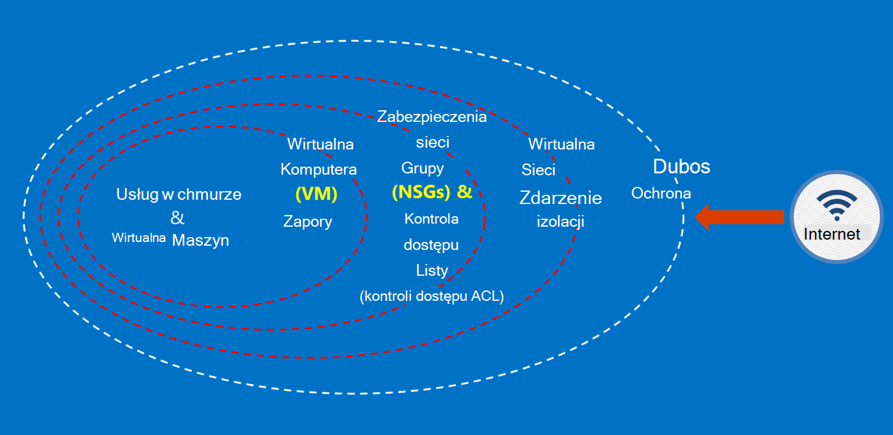

<properties
    pageTitle="Usługi Azure dla instytucji rządowych | Microsoft Azure"
    description="Zawiera omówienie usług dostępnych w Azure dla instytucji rządowych i"
    services="Azure-Government"
    cloud="gov"
    documentationCenter=""
    authors="zakramer"
    manager="liki"
    editor="" />

<tags
    ms.service="multiple"
    ms.devlang="na"
    ms.topic="article"
    ms.tgt_pltfrm="na"
    ms.workload="azure-government"
    ms.date="10/18/2016"
    ms.author="ryansoc" />

#  Zabezpieczenia

##  Zasady dotyczące zabezpieczania danych klientów w Azure dla instytucji rządowych

Azure dla instytucji rządowych zapewnia szeroką gamę funkcji i usług, które umożliwia tworzenie rozwiązań chmury stosownie do potrzeb dane regulacji kontrolowane. Rozwiązanie zgodności klienta nic się nie więcej niż skutecznego stosowania w nowym polu Azure dla instytucji rządowych funkcje, w połączeniu z dotyczącymi zabezpieczeń pełne dane.

Jeśli rozwiązanie w Azure dla instytucji rządowych, Microsoft obsługuje wiele z tych wymagań na poziomie infrastruktury chmury.

Na poniższym diagramie przedstawiono Azure modelu obrony w głębi. Na przykład firma Microsoft udostępnia infrastruktury chmury podstawowe DDOS, oraz funkcje klienta, takie jak urządzenia zabezpieczeń dla aplikacji specyficzna dla klienta, których potrzebuje DDOS.

Ta strona zawiera foundational zasady zabezpieczenia usługi i aplikacje, dostarczając orientacji i najważniejsze wskazówki dotyczące stosowania tych zasad; innymi słowy jak klienci należy wykorzystać inteligentne Azure rząd w celu zapewnienia obowiązków i odpowiedzialności, które są wymagane do rozwiązanie, które obsługuje ITAR informacji.

 Zabezpieczanie danych klientów połączonych ze sobą zasady są następujące:

- Ochrona danych za pomocą szyfrowania
- Zarządzanie hasła
- Izolacji, aby ograniczyć dostęp do danych

###  Ochrona danych klientów przy użyciu szyfrowania

Łagodzenia ryzyka i spotkań obowiązki prawne przepisami, prowadząc samochód rosnącymi fokus i znaczenie szyfrowania danych. Ulepszanie bieżącego środków bezpieczeństwa sieci i aplikacji przy użyciu implementacja szyfrowania skutecznych — i zmniejszanie ryzykiem środowiska chmury.

#### Szyfrowanie w pozostałych
Szyfrowanie danych spoczynku dotyczy ochrony zawartości klienta przechowywanych w ilość miejsca do magazynowania. Istnieje kilka sposobów, które może się to zdarzyć:

#### Szyfrowanie usługi miejsca do magazynowania

Azure szyfrowanie usługi miejsca do magazynowania jest włączona na poziomie konta miejsca do magazynowania, uzyskując blob blok i blob strony są automatycznie szyfrowane zapisywane magazyn Azure. Po przeczytaniu dane z magazynu Azure będzie odszyfrowywane przez usługę Magazyn przed zwracanych. Umożliwia Zabezpieczanie danych bez konieczności modyfikowania lub dodawanie kodu do dowolnych aplikacji.

#### Szyfrowania po stronie klienta
Po stronie klienta szyfrowania jest wbudowany w Java i bibliotekach klienta .NET miejsca do magazynowania, które mogą korzystać Azure klucza magazynu API, co to proste do wykonania. Aby uzyskać dostęp do hasła Azure klucza magazynu określonym osobom przy użyciu usługi Azure Active Directory za pomocą Azure klucza magazynu.

#### Szyfrowanie w drodze

Podstawowe szyfrowanie dostępne połączenie dla instytucji rządowych Azure obsługuje protokół poziom zabezpieczeń TLS (Transport) 1.2 i certyfikaty X.509. Federalna informacji przetwarzania FIPS (Standard) 140-2 poziomu 1 cryptographic algorytmów są też używane przez infrastruktury połączeń między Azure dla instytucji rządowych centrach danych.  Windows Server 2012 R2 i Windows 8-plus maszyny wirtualne oraz udziałach plików Azure za pomocą SMB 3.0 szyfrowania między maszyn wirtualnych i udostępnianie plików. Szyfrowanie danych przed są przenoszone do magazynu w aplikacji klienckiej i odszyfrować dane po przesłaniu Brak miejsca za pomocą szyfrowania po stronie klienta.

#### Najważniejsze wskazówki dotyczące szyfrowania

- Maszyny wirtualne IaaS: Szyfrowania Azure dysku. Włączanie przestrzeni dyskowej usługi szyfrowania do szyfrowania plików wirtualny dysk twardy, które są używane do tworzenia kopii zapasowych tych dysków w magazynie Azure, ale to tylko dane są szyfrowane nowo pisanych. Oznacza to, że jeśli utworzysz maszyny, a następnie włączyć szyfrowanie usługi miejsca do magazynowania na rachunku miejsca do magazynowania, w której znajduje się plik wirtualny dysk twardy, tylko zmiany będą szyfrowane, nie oryginalny plik wirtualnego dysku twardego.
- Szyfrowanie po stronie klienta: To najbezpieczniejsza metoda szyfrowania danych, ponieważ są szyfrowane go przed przewozowe, a dane spoczynku są szyfrowane. Jednak wymaga, Dodaj kod aplikacji przy użyciu magazynu, co może chcesz zrobić. W tych przypadkach umożliwiają HTTPs danych na czas przesyłania i przestrzeni dyskowej usługi szyfrowania do szyfrowania danych na pozostałych. Szyfrowania po stronie klienta obejmuje również większe obciążenie na kliencie — masz konto w tym planów skalowalność, zwłaszcza jeśli są szyfrowania i przenoszenia wiele danych.

###  Ochrona danych klientów, korzystając z funkcji zarządzania hasła

Bezpieczny zarządzania kluczami jest istotne znaczenie dla ochrony danych w chmurze. Klienci powinny dążyć do uproszczenia zarządzania kluczami i zachować kontrolę nad klucze używane przez aplikacje w chmurze i usługi szyfrowania danych.

#### Najważniejsze wskazówki dotyczące zarządzania hasła

- Minimalizowanie ryzyka związanego z hasła jest dostępne za pośrednictwem pliki stałe konfiguracyjne, skryptów lub kodu źródłowego za pomocą klucza magazynu. Azure magazynu klucza są szyfrowane klucze (na przykład klucze szyfrowania do szyfrowania dysku Azure) i hasła (na przykład hasła), zapisując je w FIPS 140-2 poziomu 2 sprawdzana poprawność moduły sprzętu (HSM). W odniesieniu do zapewnienia dodanego można importować lub wygenerowania kluczy w tych HSM.
- Kod aplikacji i szablony powinien zawierać tylko identyfikatora URI odwołania do hasła (co oznacza, że rzeczywista hasła nie są w kodzie, konfiguracji lub kodu źródłowego repozytoria). Dzięki temu klucza wyłudzania na wewnętrznych i zewnętrznych umowy odkupu, takich jak zbiorów Boty w GitHub.
- Wykorzystanie silnych RBAC kontrolek w obrębie magazynu klucza. Jeśli operatorem zaufanych pozostaną danej firmy lub przeniesienia do nowej grupy w firmie, ich powinny się zapobiec mieli dostęp do hasła.

Aby uzyskać więcej informacji <a href="https://azure.microsoft.com/documentation/services/key-vault">Azure klucza magazynu dokumentacji publicznej.</a>

###  Izolacji, aby ograniczyć dostęp do danych

Izolacji jest przy użyciu ograniczenia, segmentacji i kontenerów, aby ograniczyć dostęp do danych tylko autoryzowani użytkownicy, usług i aplikacji. Na przykład odstęp między dzierżawami to mechanizm zabezpieczeń podstawowe multitenant chmury platform, takich jak Microsoft Azure. Logiczne izolacji zapobiega opisuje problemy z operacjami wykonywanymi w innej dzierżawie.

#### Środowisko izolacji
Środowisko dla instytucji rządowych Azure jest fizycznie wystąpienia, które różni się od pozostałej części sieci firmy Microsoft. Jest to realizowane przez szereg fizycznej i logicznej kontrolek, które są następujące:

- Zabezpieczenia fizycznie przeszkód przy użyciu urządzenia biometryczne i kamery.
- Użyj poświadczeń określonych i uwierzytelnianie wieloskładnikowe personelowi Microsoft wymagających dostępu logicznych w środowisku produkcyjnym.
- Wszystkie infrastruktura usługi Azure administracji znajduje się w Stanach Zjednoczonych.

#### Izolacji na klienta
Kontrola dostępu do sieci Azure narzędzi i podziału za pośrednictwem VLAN izolacji ACL, załaduj równoważenia i filtry IP

Klienci mogą rozwiązać ich zasobów w subskrypcji, grup zasobów, wirtualnych sieci i podsieci.

## Kontroli

Ostatnio wprowadzona wysoki FedRAMP i akredytacji działu z obrony wpływ poziomu 4. Ma to uruchamiany na pasku zabezpieczenia i zgodność w środowisku Azure dla instytucji rządowych.

Firma Microsoft są teraz mieszanie naszych operatorów w krajowych agencja kontroli z prawem i kredytowej (NACLC) określone w sekcji 5.6.2.2 z DoD chmurze obliczeniowych zabezpieczeń wymagania przewodnik (SRG):

>[AZURE.NOTE] Dochodzenia tła minimalne wymagane dla personelu dostawcy uzyskanie dostępu do poziomu 4 i 5 informacje dotyczące "niekrytyczne zależne od" (przykład firmy DoD ADP-2) zaznacz krajowych agencji z prawem i kredytowej (NACLC) (w przypadku wykonawcy "niekrytyczne liter") lub średnim ryzyka tła dochodzenia (MBI) dla nazwy pozycji "średniego ryzyka".

W poniższej tabeli podsumowano naszych bieżącego wykrywania dla instytucji rządowych Azure operatory:

Azure jęczmiennego Gov i sprawdzanie w tle | Opis|
---|---|
Obywatelstwo Amerykańskie |Sprawdzanie obywatelstwo Amerykańskie.
Microsoft cloud tła wyboru (dwa lata)|Numer ubezpieczenia społecznego wyszukiwania, wyboru karnych historii, Office obcego składniki majątku kontrolki listy (OFAC), lista Biuro branżowe i zabezpieczenia (BIS), lista Office obrony handlu kontrolek wyłączone osób.
Agencja państwowe skontaktuj się z prawem i kredytowej (NACLC) (co pięć lat) | Dodaje wyboru tła odcisku palca bazach danych FBI. Aby uzyskać dodatkowe informacje przejdź do<a href="https://www.opm.gov/investigations/background-investigations/federal-investigations-notices/1997/fin97-02/"> Witryny zarządzania personelu pakietu Office</a>. | 
<a href="https://www.microsoft.com/en-us/TrustCenter/Compliance/CJIS">Usługi informacyjne kryminalnej (CJIS)</a> | CJIS jest stanu, lokalne i dla instytucji rządowych FBI kontroli odcisku palca jakie procesy rekordów i sprawdza karnych historie operacyjne personelu, kto może świadczyć dostęp do danych informacji (CJI) krytyczne kryminalnej.  Każde Państwo ma własne tła kontroli i zatwierdzeniem pod kątem pracowników o uzyskanie dostępu do CJI.|

Dla personelu Azure operacje zastosowanie następujące zasady dostępu:

- Obowiązki są jasno zdefiniowane przy użyciu oddzielnych obowiązki dotyczące żądania, zatwierdzanie i wdrażanie zmiany.
- Dostęp jest za pośrednictwem interfejsów zdefiniowanych, które mają określoną funkcjonalność.
- Program Access jest just-in-time (JIT) i udzielono tylko na zasadzie na zdarzenie lub zdarzeń konserwacji określonych i zawsze przez ograniczony czas.
- Dostęp jest na podstawie reguł, przy użyciu zdefiniowanych ról tylko przypisanych uprawnień wymaganych do rozwiązywania problemów.

Standardy kontroli obejmuje sprawdzanie poprawności obywatelstwo Amerykańskie wszystkich pomocy technicznej firmy Microsoft i pracownicy obsługi przed udzielić dostępu do systemów hostowanej Azure dla instytucji rządowych. Pracowników pomocy technicznej, którzy chcą transferować dane za pomocą bezpiecznego możliwości w ramach Azure dla instytucji rządowych. Bezpiecznego transferu danych wymaga oddzielny zestaw poświadczeń uwierzytelniania w celu uzyskania dostępu. Na przykład, aby uzyskać dostęp do metadanych systemu, personel za pomocą narzędzi określonych oparte na sieci web wewnętrznego zarządzania, interfejsy API tylko do odczytu i JIT podniesienie uprawnień.

## Następne kroki

Aby uzyskać dodatkowe informacje i aktualizacje Zasubskrybuj <a href="https://blogs.msdn.microsoft.com/azuregov/">Blog dotyczący programu Microsoft Azure dla instytucji rządowych.</a>
