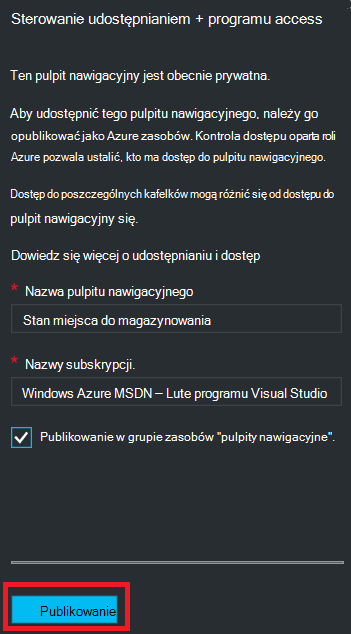

<properties
   pageTitle="Azure portalu pulpitu nawigacyjnego w programie access | Microsoft Azure"
   description="W tym artykule wyjaśniono, jak korzystać z pulpitu nawigacyjnego w portalu Azure."
   services="azure-portal"
   documentationCenter=""
   authors="tfitzmac"
   manager="timlt"
   editor="tysonn"/>

<tags
   ms.service="multiple"
   ms.devlang="NA"
   ms.topic="article"
   ms.tgt_pltfrm="NA"
   ms.workload="na"
   ms.date="08/01/2016"
   ms.author="tomfitz"/>

# Udostępnianie Azure pulpitów nawigacyjnych

Po skonfigurowaniu pulpitu nawigacyjnego, możesz opublikować je i udostępniać je innym użytkownikom w organizacji. Możesz zezwolić innym osobom na dostęp do pulpitu nawigacyjnego za pomocą Azure [Kontrola dostępu oparta roli](../active-directory/role-based-access-control-configure.md). Przypisywanie użytkownika lub grupy użytkowników do roli, a tej roli Określa, czy tych użytkowników można wyświetlić lub zmodyfikować opublikowanych pulpitu nawigacyjnego. 

Wszystkie opublikowane pulpity nawigacyjne są wykonywane jako zasoby Azure, co oznacza istnieje jako łatwiejsze elementów w obrębie subskrypcji i znajdują się w grupie zasobów.  Z perspektywy kontrola dostępu, pulpity nawigacyjne nie różnią się od innych zasobów, takich jak maszyna wirtualna lub konta miejsca do magazynowania.

> [AZURE.TIP] Poszczególne kafelków na pulpicie nawigacyjnym wymusić własne wymagania kontrolki programu access oparte na zasoby, które są one wyświetlane.  W związku z tym można zaprojektować mają być udostępniane ogólnie nadal chroniąc dane na poszczególnych Kafelki pulpitu nawigacyjnego.

## Opis kontroli dostępu dla pulpitów nawigacyjnych

Za pomocą pola Kontrola dostępu oparta na rolach można przypisywać użytkowników do ról na trzech różnych poziomach zakresu:

- subskrypcji
- Grupa zasobów
- zasób

Przypisane uprawnienia są dziedziczone z subskrypcji do tego zasobu. Opublikowanych pulpitu nawigacyjnego jest zasobem. W związku z tym może być już użytkowników przypisane do ról dla subskrypcji, które działają również opublikowanych pulpitu nawigacyjnego. 

Oto przykład.  Załóżmy, że masz subskrypcję usługi Azure i różnych członków zespołu zostały przypisane role **właściciela**, **współautorów**lub **czytnika** dla subskrypcji. Użytkownicy, którzy są właściciele lub współautorów będą mogli listy, wyświetlanie, tworzenie, modyfikowanie i usuwanie pulpitów nawigacyjnych w obrębie subskrypcji.  Użytkownicy, którzy są czytników będą mogli listy i widok pulpitów nawigacyjnych, ale nie można zmodyfikować lub ich usuwanie.  Użytkownicy z dostępem czytelnika będą mogli lokalne zmiany edycyjne opublikowanych pulpitu nawigacyjnego (takich jak podczas rozwiązywania problemu), ale nie będą mogli publikować te zmiany na serwerze.  Ta osoba będzie dostępna opcja Utwórz kopię prywatne wskaźników dla siebie

Ponadto można jednak przypisać uprawnienia, grupa zasobów, który zawiera kilka pulpitów nawigacyjnych lub pojedynczego pulpitu nawigacyjnego. Możesz na przykład określić, że grupy użytkowników należy mającym ograniczoną uprawnienia w subskrypcji, ale większa dostęp do określonego pulpitu nawigacyjnego. Przypisywanie tych użytkowników do roli dla tego pulpitu nawigacyjnego. 

## Publikowanie pulpitu nawigacyjnego

Załóżmy, że zakończeniu konfigurowania pulpitu nawigacyjnego, który chcesz udostępnić grupy użytkowników w ramach subskrypcji. Poniższe kroki przedstawić dostosowane grupę o nazwie Menedżerowie miejsca do magazynowania, ale niezależnie od potem można nazwę grupy. Aby uzyskać informacje o tworzeniu grupy usługi Active Directory i dodawania użytkowników do tej grupy zobacz [Zarządzanie grup w usłudze Azure Active Directory](../active-directory/active-directory-accessmanagement-manage-groups.md).

1. Na pulpicie nawigacyjnym wybierz pozycję **Udostępnij**.

     

2. Przed przypisywanie dostępu, możesz opublikować pulpitu nawigacyjnego. Domyślnie zostanie opublikowana pulpitu nawigacyjnego do grupy zasobów o nazwie **pulpitów nawigacyjnych**. Wybierz pozycję **Publikuj**.

     

Pulpit nawigacyjny zostały opublikowane. W przypadku odpowiednie uprawnienia dziedziczone z subskrypcji, nie trzeba robić nic więcej. Innym użytkownikom w organizacji będą mogli uzyskać dostęp do i modyfikowanie pulpitu nawigacyjnego, w zależności od ich roli poziomu subskrypcji. Jednak dla tego samouczka Przejdźmy przypisać grupy użytkowników do roli dla tego pulpitu nawigacyjnego.

## Przypisywanie dostępu do pulpitu nawigacyjnego

1. Po opublikowaniu pulpitu nawigacyjnego, wybierz pozycję **Zarządzaj użytkownikami**.

     

2. Zobaczysz listę istniejących użytkowników przypisanych ról dla tego pulpitu nawigacyjnego. Na liście istniejących użytkowników będą inne niż na poniższej ilustracji. Najprawdopodobniej przydziałów są dziedziczone z subskrypcji. Aby dodać nowego użytkownika lub grupy, wybierz pozycję **Dodaj**.

     

3. Wybierz rolę, reprezentujący uprawnienia, które chcesz udzielić. W tym przykładzie wybierz **współautorów**.

     

4. Wybierz użytkownika lub grupę, którą chcesz przypisać do roli. Jeśli nie widzisz użytkownika lub grupy, którą chcesz odnaleźć na liście, użyj pola wyszukiwania. Na liście dostępnych grup zależy od grup, do których został utworzony w usługi Active Directory.

      

5. Po zakończeniu dodawania użytkowników lub grup, kliknij przycisk **OK**. 

6. Nowy przydział zostanie dodany do listy użytkowników. Zwróć uwagę, wymieniony **programu Access** jako **przypisane** zamiast **dziedziczone**.

     

## Następne kroki

- Aby uzyskać listę ról, zobacz [RBAC: wbudowane role](../active-directory/role-based-access-built-in-roles.md).
- Aby uzyskać informacje dotyczące zarządzania zasobami, zobacz [Zarządzanie Azure zasoby portalu](resource-group-portal.md).