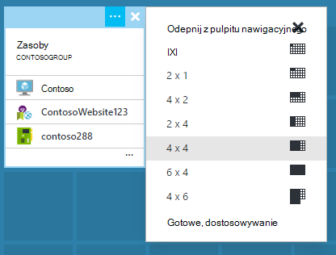

<properties
   pageTitle="Azure portalu pulpity nawigacyjne | Microsoft Azure"
   description="W tym artykule wyjaśniono, jak tworzyć i edytować pulpity nawigacyjne w portalu Azure."
   services="azure-portal"
   documentationCenter=""
   authors="sewatson"
   manager="timlt"
   editor="tysonn"/>

<tags
   ms.service="multiple"
   ms.devlang="NA"
   ms.topic="article"
   ms.tgt_pltfrm="NA"
   ms.workload="na"
   ms.date="09/06/2016"
   ms.author="sewatson"/>

# Tworzenie i udostępnianie pulpitów nawigacyjnych w portalu Azure

Można utworzyć wiele pulpitów nawigacyjnych i udostępniać je innym osobom, które mają dostęp do subskrypcji Azure.  Ten wpis przechodzi podstawy tworzenia i edytowania, publikowania i zarządzanie dostępem do pulpitów nawigacyjnych.

## Dostosowywanie pulpitów nawigacyjnych i karty

Ponieważ uruchamianie pulpitów nawigacyjnych na kilka miesiące temu, nastąpił stały spadek dostosowania karta i szybkie wzrost dostosowania pulpitu nawigacyjnego. Ten trendu silnych zastosowania zawiera wolisz dostosowywanie pulpitów nawigacyjnych na karty. Do obsługi tego trendu, zostanie usunięty możliwość Dostosowywanie karty i przeznaczoną naszych wysiłków w celu zwiększenia funkcjonalności pulpitu nawigacyjnego. Jeśli dostosowany karta dostosowań wkrótce zostaną usunięte. Aby zachować tego dostosowania, kliknij pozycję Przypnij niestandardowych kafelków do pulpitu nawigacyjnego. Po prostu kliknij prawym przyciskiem myszy Kafelek i wybierz pozycję **Przypnij do pulpitu nawigacyjnego** , jak pokazano na poniższej ilustracji.

## Tworzenie pulpitu nawigacyjnego

Aby utworzyć pulpit nawigacyjny, wybierz przycisk **nowy pulpit nawigacyjny** obok nazwy bieżącego pulpitu nawigacyjnego.  

Ta akcja umożliwia utworzenie nowego, pustego, prywatne pulpitu nawigacyjnego i pozwala na Tryb dostosowywania miejsce, w którym można nazwę pulpitu nawigacyjnego i dodawanie lub zmienianie rozmieszczenia kafelków.  W tym trybie galerii zwijany kafelków przejmuje w lewym menu nawigacji.  Galeria kafelków umożliwia znajdowanie Kafelki Azure zasobów na różne sposoby: można przeglądać według [grup zasobów](../azure-resource-manager/resource-group-overview.md#resource-groups), typ zasobu, według [znaczników](../resource-group-using-tags.md)lub przez wyszukiwanie dla zasobu według nazwy.  

Dodawanie kafelków, przeciągając i upuszczając je w dowolnym miejscu na powierzchnię pulpitu nawigacyjnego.

Istnieje nowa kategoria o nazwie **Ogólne** kafelków, które nie są skojarzone z określonego zasobu.  W tym przykładzie możemy przypinanie kafelka promocji cenowych.  Dodawanie niestandardowej zawartości do pulpitu nawigacyjnego za pomocą tego kafelka.  Kafelek obsługuje jako zwykły tekst, [składni promocji cenowych](https://daringfireball.net/projects/markdown/syntax)i ograniczony zestaw HTML.  (Dla bezpieczeństwa, nie można wykonywać czynności takie jak wprowadzić `<script>` znaczniki lub za pomocą niektórych elementów związanych ze stylami CSS, które mogą zakłócać portalu.) 

## Edytowanie pulpitu nawigacyjnego

Po utworzeniu pulpitu nawigacyjnego, można przypiąć Kafelki z galerii sąsiadująco lub reprezentacja kafelków kart. Załóżmy przypiąć reprezentacja naszych grupa zasobów. Możesz albo numeru pin podczas przeglądania element lub karta Grupa zasobów. W obu przypadkach efekt powodują przypinanie reprezentacją kafelków grupy zasobów.

Po przypięciu element, wydaje się na pulpicie nawigacyjnym.

Teraz, gdy mamy kafelka promocji cenowych i grupa zasobów przypięta do pulpitu nawigacyjnego, możemy Zmień rozmiary i zmienianie rozmieszczenia kafelków w odpowiednim układzie.

Umieszczenie wskaźnika myszy i wybierając "..." lub klikając prawym przyciskiem myszy pole, można wyświetlić wszystkie polecenia kontekstowe dla niego. Domyślnie istnieją dwa elementy:

1. **Odepnij od pulpitu nawigacyjnego** — usuwa fragmentu z pulpitu nawigacyjnego
2.  **Dostosowywanie** — wprowadza Dostosowywanie trybu

Wybierając dostosować, można zmieniać rozmiar i zmienianie kolejności kafelków. Aby zmienić rozmiar kafelka, wybierz nowy rozmiar z menu kontekstowego, jak pokazano na poniższej ilustracji.

Lub, jeśli fragmentu obsługuje rozmiarze, możesz przeciągnąć prawym dolnym rogu osiągnie wymagany rozmiar.

Po zmianie rozmiaru Kafelki, wyświetlanie pulpitu nawigacyjnego.

Po zakończeniu dostosowywania pulpitu nawigacyjnego, po prostu wybierz pozycję **Gotowe, dostosowywanie** aby zakończyć dostosowywanie tryb lub kliknij prawym przyciskiem myszy i z menu kontekstowego wybierz pozycję **Gotowe, dostosowywanie** .

## Publikowanie pulpitu nawigacyjnego i zarządzanie nimi kontroli dostępu

Po utworzeniu pulpitu nawigacyjnego jest prywatna domyślnie, co oznacza, że jesteś jedyną osobą, która może go wyświetlać.  Aby umożliwić innym osobom, użyj przycisku **Udostępnij** wyświetlana obok polecenia pulpitu nawigacyjnego.

Zostanie wyświetlony monit, aby wybrać subskrypcji i grupa zasobów dla tego pulpitu nawigacyjnego do opublikowania do. Aby bezproblemowo zintegrować pulpitów nawigacyjnych w ekosystemie, zostały wprowadziliśmy udostępnionych pulpitów nawigacyjnych jako zasoby Azure (tak, aby nie można udostępniać, wpisując adres e-mail).  [Kontrola dostępu oparta roli Azure](../active-directory/role-based-access-control-configure.md )zależą dostęp do informacji wyświetlanych przez większość kafelków w portalu. Z perspektywy kontrola dostępu udostępnione pulpity nawigacyjne są nie różni się od maszyny wirtualnej lub konta miejsca do magazynowania.  

Załóżmy, że masz subskrypcję usługi Azure i członkom zespołu zostały przypisane role **właściciela**, **współautorów**lub **czytnika** subskrypcji.  Użytkownicy, którzy są właściciele lub współautorzy będą mogli listy, wyświetlanie, tworzenie, modyfikowanie i usuwanie pulpitów nawigacyjnych w tej subskrypcji.  Użytkownicy, którzy są czytników będą mogli listy i widok pulpitów nawigacyjnych, ale nie można zmodyfikować lub ich usuwanie.  Użytkownicy z dostępem czytelnika będą mogli lokalne zmiany edycyjne udostępnionego pulpitu nawigacyjnego, ale nie będą mogli publikować te zmiany na serwerze.  Jednak mogą one ułatwić prywatną kopię pulpitu nawigacyjnego na własny użytek.  Jak zawsze poszczególnych kafelków na pulpicie nawigacyjnym wymusić własnych zasad kontroli dostępu do według zasobów, które są zgodne.  

Dla wygody portal publikowania obsługi przeprowadzi Cię kierunku deseń gdzie umieścić pulpitów nawigacyjnych w grupie zasobów o nazwie **pulpitów nawigacyjnych**.  

Możesz również wybrać publikowanie pulpitu nawigacyjnego do określonej grupy zasobów.  Kontrola dostępu dla tego pulpitu nawigacyjnego zastępuje kontrola dostępu dla grupy zasobów.  Użytkownicy, którzy mogą zarządzać zasobów w danej grupy zasobów mieć również dostęp do pulpitów nawigacyjnych.

Po opublikowaniu pulpitu nawigacyjnego Panelu sterowania **Udostępnianie + dostęp** Odśwież i wyświetlona informacji na temat opublikowanych pulpitu nawigacyjnego, łącznie z łączem do zarządzanie dostępem użytkowników do pulpitu nawigacyjnego.  To łącze otwiera standardowy karta kontrola dostępu oparta roli umożliwia zarządzanie dostępem dla każdego zasobu Azure.  Możesz zawsze wrócić do tego widoku, wybierając pozycję **Udostępnij**.

## Następne kroki

- Aby zarządzać zasobami, zobacz [Zarządzanie Azure zasoby portalu](resource-group-portal.md).
- Aby wdrożyć zasobów, zobacz [zasoby rozmieszczanie z szablonami Menedżera zasobów i Azure portal](../resource-group-template-deploy-portal.md).