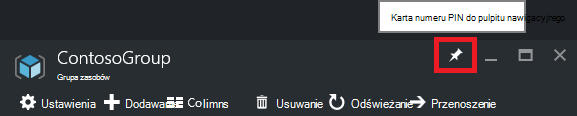

<properties 
    pageTitle="Zarządzanie zasobami Azure za pomocą Azure portal | Microsoft Azure" 
    description="Zarządzanie zasobami za pomocą Azure portal i zarządzanie zasobu Azure. Pokazano, jak pracować z pulpitów nawigacyjnych monitorowanie zasobów." 
    services="azure-resource-manager,azure-portal" 
    documentationCenter="" 
    authors="tfitzmac" 
    manager="timlt" 
    editor="tysonn"/>

<tags 
    ms.service="azure-resource-manager" 
    ms.workload="multiple" 
    ms.tgt_pltfrm="na" 
    ms.devlang="na" 
    ms.topic="article" 
    ms.date="09/12/2016" 
    ms.author="tomfitz"/>

# Zarządzanie zasobami Azure za pomocą portalu

> [AZURE.SELECTOR]
- [Azure programu PowerShell](../powershell-azure-resource-manager.md)
- [Polecenie Azure](../xplat-cli-azure-resource-manager.md)
- [Portal](resource-group-portal.md) 
- [INTERFEJSU API USŁUGI REST](../resource-manager-rest-api.md)

W tym temacie przedstawiono sposób za pomocą [Azure portal](https://portal.azure.com) [Azure Menedżera zasobów](../azure-resource-manager/resource-group-overview.md) do zarządzania zasobami Azure. Aby dowiedzieć się o wdrażaniu zasobów za pośrednictwem portalu, zobacz [zasoby rozmieszczanie z szablonami Menedżera zasobów i Azure portal](../resource-group-template-deploy-portal.md).

Obecnie nie każdy usługa obsługuje portalu lub Menedżer zasobów. Dla tych usług należy korzystać z [portalu klasyczny](https://manage.windowsazure.com). Stan każdej usługi zobacz [dostępność portal Azure wykresu](https://azure.microsoft.com/features/azure-portal/availability/).

## Zarządzanie grupami zasobów

1. Aby wyświetlić wszystkie grupy zasobów w ramach subskrypcji, wybierz pozycję **grupy zasobów**.

    

1. Aby utworzyć grupę pustego zasobu, wybierz pozycję **Dodaj**.

    

1. Podaj nazwę i lokalizację nowej grupy zasobów. Wybierz polecenie **Utwórz**.

    

1. Może być konieczne wybierz pozycję **Odśwież** , aby zobaczyć grupie ostatnio utworzonych zasobów.

    

1. Aby dostosować informacje wyświetlane dla grupy zasobów, zaznacz **kolumny**.

    

1. Zaznacz kolumny, które chcesz dodać, a następnie wybierz pozycję **Aktualizuj**.

    

1. Aby dowiedzieć się o wdrażaniu zasobów do nowej grupy zasobów, zobacz [zasoby rozmieszczanie z szablonami Menedżera zasobów i Azure portal](../resource-group-template-deploy-portal.md).

1. Aby uzyskać szybki dostęp do grupy zasobów można przypiąć karta do pulpitu nawigacyjnego.

    

1. Pulpit nawigacyjny Wyświetla grupa zasobów i jego zasobów. Można wybrać pozycję grup zasobów lub dowolną z jej zasobów przejdź do elementu.

    

## Zasoby znacznika

Znaczniki możesz zastosować do grupy zasobów i zasoby w logiczny sposób organizować aktywów. Aby uzyskać informacji dotyczących pracy ze znacznikami zobacz [Używanie znaczników w celu organizowania Azure zasobów](../resource-group-using-tags.md).

[AZURE.INCLUDE [resource-manager-tag-resource](../../includes/resource-manager-tag-resources.md)]

## Monitor zasobów

Po wybraniu zasobu karta zasobu przedstawiono domyślne wykresy i tabele, monitorowania tego typu zasobów.

1. Wybierz zasób i zwróć uwagę sekcji **monitorowania** . Zawiera wykresy, które dotyczą typ zasobu. Na poniższej ilustracji przedstawiono domyślne monitorowanie danych konta miejsca do magazynowania.

    

1. Sekcji karta do pulpitu nawigacyjnego można przypiąć, wybierając wielokropek (...) powyżej sekcji. Można także dostosować rozmiar w sekcji karta lub całkowicie usunąć. Poniższa ilustracja przedstawia, jak przypiąć, dostosowywanie i usuwanie sekcji Procesora i pamięci.

    

1. Po przypięciu sekcji do pulpitu nawigacyjnego, zostanie wyświetlony podsumowania na pulpicie nawigacyjnym. I od razu jej zaznaczenie powoduje przejście do szczegółowe informacje o danych.

    

1. Aby dostosować dane, które można monitorować za pośrednictwem portalu, przejdź do pulpitu nawigacyjnego domyślny i wybierz **nowy pulpit nawigacyjny**.

    

1. Nadaj nazwę pulpitu nawigacyjnego nowych i przeciągnij Kafelki pulpitu nawigacyjnego. Kafelki są filtrowane według różne opcje.

    

     Aby uzyskać informacje o pracy z pulpitów nawigacyjnych, zobacz [Tworzenie i udostępnianie pulpitów nawigacyjnych w portalu Azure](azure-portal-dashboards.md).

## Zarządzanie zasobami

W karta dla zasobu zostaną wyświetlone opcje zarządzania zasobu. Portalu przedstawia opcje zarządzania dla tego typu zasobu. Polecenia dotyczące zarządzania są wyświetlane u góry karta zasobów i po lewej stronie.

Z tych opcji można wykonywać operacje, takie jak uruchamianie i zatrzymywanie maszyny wirtualnej lub ponowne konfigurowanie właściwości maszyny wirtualnej.

## Przenoszenie zasobów

Jeśli potrzebujesz przenieść zasoby do innej grupy zasobów lub innej subskrypcji, zobacz [Przenoszenie zasobów do nowej grupy zasobów lub innej subskrypcji](../resource-group-move-resources.md).

## Blokowanie zasobów

Można zablokować subskrypcji, grupa zasobów lub zasobu uniemożliwić innym użytkownikom w organizacji przypadkowemu usunięciu lub modyfikowanie krytycznych zasobów. Aby uzyskać więcej informacji zobacz [Blokowanie zasoby przy użyciu Menedżera zasobów Azure](../resource-group-lock-resources.md).

[AZURE.INCLUDE [resource-manager-lock-resources](../../includes/resource-manager-lock-resources.md)]

## Wyświetlanie kosztów i subskrypcji

Można wyświetlić informacje o subskrypcji i rzutowane koszty dla wszystkich zasobów. Wybierz **Subskrypcje** i subskrypcję, którą chcesz wyświetlić. Może mieć tylko jedną subskrypcję, aby zaznaczyć.

W ramach karta subskrypcji zostanie wyświetlony stawki nagrywania.

I podział kosztów według typów zasobów.

## Eksportowanie szablonu

Po skonfigurowaniu grupy zasobów, można wyświetlić szablonu Menedżera zasobów dla grupy zasobów. Eksportowanie szablon oferuje dwie korzyści:

1. Można łatwo zautomatyzować przyszłych wdrożeń rozwiązanie, ponieważ szablon zawiera pełną infrastruktury.

2. Czy zapoznanie się ze składni szablonu, wyświetlając w notacji obiektu JavaScript (JSON), reprezentująca rozwiązania.

Aby uzyskać instrukcje krok po kroku zobacz [Eksportowanie Menedżera zasobów Azure szablonu z istniejących zasobów](../resource-manager-export-template.md).

## Usuwanie grupy zasobów lub zasobów

Usunięcie grupy zasobów powoduje usunięcie wszystkich zasobów w nim zawarte. Możesz również usunąć poszczególnych zasobów w grupie zasobów. Należy zachować ostrożność po usunięciu grupa zasobów, ponieważ inne grupy zasobów, które są połączone mogą być zasobów. Menedżer zasobów nie powoduje usunięcia połączonego zasoby, ale może nie działają poprawnie bez oczekiwanych zasobów.

## Następne kroki

- Wyświetlanie dzienników inspekcji, zobacz [Inspekcja operacji przy użyciu Menedżera zasobów](../resource-group-audit.md).
- W rozwiązywaniu problemów dotyczących błędów wdrażania, zobacz [Rozwiązywanie problemów z zasobów grupy wdrożeń Portal Azure](../resource-manager-troubleshoot-deployments-portal.md).
- Aby wdrożyć zasoby za pośrednictwem portalu, zobacz [zasoby rozmieszczanie z szablonami Menedżera zasobów i Azure portal](../resource-group-template-deploy-portal.md).
- Aby zarządzać dostępem do zasobów, zobacz [Używanie przypisania roli zarządzać dostępem do zasobów Azure subskrypcji](../active-directory/role-based-access-control-configure.md).

