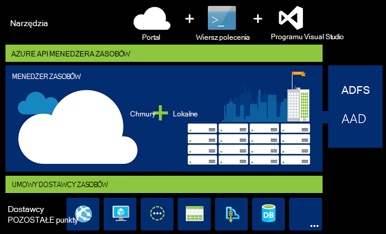
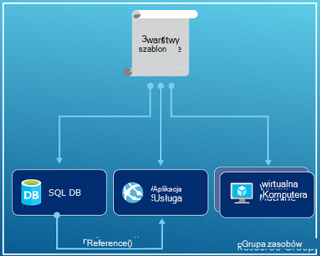
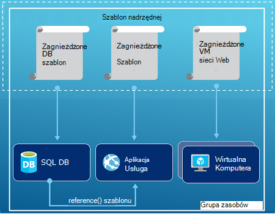
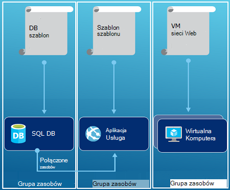

<properties
   pageTitle="Omówienie Menedżera zasobów Azure | Microsoft Azure"
   description="W tym artykule opisano, jak za pomocą Menedżera zasobów Azure wdrożenia, zarządzanie i kontroli zasobów Azure dostępu."
   services="azure-resource-manager"
   documentationCenter="na"
   authors="tfitzmac"
   manager="timlt"
   editor="tysonn"/>

<tags
   ms.service="azure-resource-manager"
   ms.devlang="na"
   ms.topic="get-started-article"
   ms.tgt_pltfrm="na"
   ms.workload="na"
   ms.date="10/21/2016"
   ms.author="tomfitz"/>

# Omówienie Menedżera zasobów Azure

Infrastruktura aplikacji zwykle składa się z wielu składników — może maszyny wirtualnej, konto miejsca do magazynowania i wirtualnej sieci lub aplikacji sieci web, bazy danych, serwer bazy danych i 3 usług innych firm. Nie widzisz tych składników jako odrębne osoby, zamiast tego możesz zobaczyć je jako powiązane i zależne od siebie części całość. Chcesz wdrażać, zarządzanie i monitorowanie ich jako grupy. Azure Menedżera zasobów umożliwia pracę z zasobami w rozwiązaniu jako grupy. Możesz wdrożyć, aktualizowanie lub usuwanie wszystkich zasobów dotyczących rozwiązania w jednym, skoordynowanego operacji. Używanie szablonu do wdrożenia i tego szablonu można pracować w różnych środowiskach takich jak badania, organizowanie i produkcji. Menedżer zasobów udostępnia zabezpieczeń, inspekcji i znakowanie funkcje ułatwiające zarządzanie zasobami po wdrożeniu. 

## Terminologia

Jeśli korzystasz z Menedżera zasobów Azure, istnieje niektóre terminy, które może nie być ze znanych.

- **zasób** - łatwiejsze element, który jest dostępny za pośrednictwem Azure. Niektóre typowe zasoby są maszyn wirtualnych, konto miejsca do magazynowania, aplikacji sieci web, bazy danych i wirtualnej sieci, ale istnieje wiele innych.
- **Grupa zasobów** - kontener zasoby pokrewne Azure rozwiązania. Grupa zasobów może zawierać wszystkie zasoby rozwiązania lub tylko tych zasobów, które mają być zarządzane jako grupy. Możesz określić, jak chcesz przydzielić zasoby do grup zasobów według co sprawia, że najbardziej odpowiednie dla Twojej organizacji. Wyświetlanie [grup zasobów](#resource-groups).
- **dostawcy zasobów** — usługa, która dostarcza zasobów można wdrożyć i zarządzać nimi za pomocą Menedżera zasobów. Każdy dostawca zasobów udostępnia operacje dotyczące pracy z zasobów, które są wdrożone. Niektóre typowe dostawców zasobu to Microsoft.Compute, która dostarcza zasób maszyny wirtualnej, Microsoft.Storage, która dostarcza zasobów konta miejsca do magazynowania, i Microsoft.Web, która dostarcza zasoby dotyczące aplikacji sieci web. Zobacz [dostawcy zasobów](#resource-providers).
- **Szablon Menedżera zasobów** — plik JavaScript Object Notation (JSON), który definiuje jeden lub więcej zasobów do wdrożenia do grupy zasobów. Definiuje zależności między wdrożonym zasobów. Ten szablon umożliwia wdrażanie zasobów, spójne i wielokrotnie. Zobacz [rozmieszczania szablonu](#template-deployment).
- **Składnia deklaracyjnych** - składni, która umożliwia Województwo, "Oto co przeznaczonych do tworzenia" bez konieczności pisania sekwencji programowania polecenia go utworzyć. Szablon Menedżera zasobów jest przykładem deklaracyjnych składni. W polu plik do definiowania właściwości infrastruktury wdrożenia Azure. 

## Korzyści wynikające z używania Menedżera zasobów

Menedżer zasobów daje następujące korzyści:

- Możesz wdrożyć, zarządzanie i monitorowanie wszystkich zasobów dotyczących rozwiązania jako grupy, a nie indywidualnie obsługi te zasoby.
- Można wielokrotnie wdrażanie rozwiązania w całej Cykl opracowywania i mieć pewność, które zasoby są rozmieszczane spójna.
- Możesz zarządzać infrastruktury dzięki deklaracyjnych szablony, a nie skryptów.
- Można zdefiniować zależności między zasoby, więc ich wdrożeniem w odpowiedniej kolejności.
- Można zastosować kontrola dostępu do wszystkich usług w grupie zasobów, ponieważ Kontrola dostępu oparta na rolach (RBAC) oryginalnie jest zintegrowany z platformy zarządzania.
- Znaczniki można zastosować do zasobów logicznie organizowanie wszystkich zasobów w ramach subskrypcji.
- Rozliczenia organizacji może zawierać wyjaśnienie, wyświetlając kosztów dla grupy zasobów udostępniania ten sam znacznik.  

Menedżer zasobów udostępnia nowy sposób wdrażanie i zarządzanie nią rozwiązanie. Używane wcześniejszego modelu wdrażania, aby dowiedzieć się więcej o zmianach zobacz [wdrożenia opis Menedżera zasobów i wdrażania klasyczny](../resource-manager-deployment-model.md).

## Spójne zarządzanie warstwy

Menedżer zasobów udostępnia warstwy spójne zarządzanie dla zadania, które można wykonywać za pomocą programu PowerShell Azure, polecenie Azure Azure portal, interfejsu API usługi REST i narzędzi do tworzenia. Wszystkie narzędzia za pomocą wspólnego zestawu czynności. Użyj narzędzia, które Najlepsza i ich zastosowań są używane zamiennie bez zamieszania. 

Poniższy obraz przedstawiający sposób wszystkich narzędzi korzystać z tego samego interfejsu API Menedżera zasobów Azure. Interfejs API przekazuje żądania do usługę Menedżera zasobów, która uwierzytelnia i zezwala na żądania. Menedżer zasobów kieruje następnie żądania do dostawców odpowiedni zasób.

## Wskazówki

Następujące sugestie pomagają w pełni korzystać z Menedżera zasobów podczas pracy z rozwiązanie.

1. Definiowanie i wdrażanie infrastruktury za pośrednictwem deklaracyjnych składni w szablonach Menedżera zasobów, a nie polecenia konieczne.
2. Definiowanie wszystkich kroków wdrażania i konfiguracji w szablonie. Należy użyć nie ręcznego instrukcje dotyczące konfigurowania tego rozwiązania.
3. Uruchomienie konieczne poleceń do zarządzania zasobami, tak aby uruchomić lub zatrzymać aplikacji lub komputera.
4. Rozmieść zasoby z tym samym cyklem w grupie zasobów. Za pomocą znaczników dla wszystkich innych organizowanie zasobów.

Aby uzyskać więcej zalecenia zobacz [Najważniejsze wskazówki dotyczące tworzenia szablonów Azure Menedżera zasobów](../resource-manager-template-best-practices.md).

## Grupy zasobów

Istnieje kilka ważnych kwestie do rozważenia podczas definiowania grupy zasobów:

1. Wszystkie zasoby w grupie należy udostępnić samym cyklu życia. Wdrażanie, aktualizowanie i usuwanie ich ze sobą. Jeden zasób, takie jak serwer bazy danych, musi istnieć w cyklu rozmieszczania należy go w innej grupie zasobów.
2. Każdy zasób może istnieć tylko w jednej grupy zasobów.
3. Można dodawać i usuwać zasobu do grupy zasobów w dowolnym momencie.
4. Zasób można przenieść z jednej grupy zasobów do innej grupy. Aby uzyskać więcej informacji zobacz [Przenoszenie zasobów do nowej grupy zasobów lub innej subskrypcji](../resource-group-move-resources.md).
4. Grupa zasobów może zawierać zasoby, które znajdują się w różnych regionów.
5. Grupa zasobów może służyć do ograniczania zakresu kontroli dostępu do działań administracyjnych.
6. Zasób można wchodzić w interakcje z zasobami w innych grup zasobów. Ta interakcja jest typowych, gdy dwa zasoby są pokrewne, ale nie udostępniaj samego cyklu życia (na przykład aplikacji web apps połączenie z bazą danych).

Podczas tworzenia grupy zasobów, musisz podać lokalizację dla danej grupy zasobów. Być może zastanawiasz się, "Dlaczego usługa grupa zasobów musi lokalizację? I, jeśli zasoby może mieć lokalizacji innej niż grupa zasobów, dlaczego lokalizacji grupa zasobów ma znaczenie na wszystkich?" Grupa zasobów przechowywanych metadanych o zasobach. W związku z tym określając lokalizację, w której grupa zasobów, określisz przechowywania metadane. Ze względów zgodności może być konieczne upewnić się, że dane są przechowywane w wybranym obszarze.

## Zasób dostawców

Każdy dostawca zasobów udostępnia zestaw zasobów i operacje dotyczące pracy z usługą Azure. Na przykład jeśli chcesz przechowywać klucze i hasła, pracujesz z **Microsoft.KeyVault** dostawcy zasobów. Ten dostawca zasobów udostępnia typ zasobu o nazwie **magazynów** do tworzenia klucza magazynu i typ zasobu o nazwie **magazynów i hasła** do tworzenia hasła w klucza magazynu. 

Przed rozpoczęciem z wdrożeniem zasobów, należy uzyskać zrozumienia dostawców dostępne zasobów. Informacje o nazwy zasobów dostawców i zasobów ułatwia definiowanie zasoby, które chcesz wdrożyć Azure.

Pobieranie wszystkich dostawców zasobów z następującego polecenia cmdlet programu PowerShell:

    Get-AzureRmResourceProvider -ListAvailable

Lub z polecenie Azure pobierania wszystkich dostawców zasobów przy użyciu następującego polecenia:

    azure provider list

Możesz przejrzeć zwrócone listy dostawców zasobów, których należy użyć.

Aby uzyskać szczegółowe informacje o dostawcy zasobów, Dodaj nazw dostawcy do polecenia. Polecenie zwraca typów zasobów obsługiwane dla dostawcy zasobów i obsługiwane lokalizacji i wersje interfejsu API dla każdego typu zasobu. Następujące polecenia cmdlet programu PowerShell otrzymuje szczegółowe informacje o Microsoft.Compute:

    (Get-AzureRmResourceProvider -ProviderNamespace Microsoft.Compute).ResourceTypes

Lub z polecenie Azure pobieranie typów zasobów obsługiwanych, lokalizacji i wersje interfejsu API dla Microsoft.Compute, przy użyciu następującego polecenia:

    azure provider show Microsoft.Compute --json > c:\Azure\compute.json

Aby uzyskać więcej informacji zobacz [dostawców Menedżera zasobów, regiony, wersje interfejsu API i schematów](../resource-manager-supported-services.md).

## Wdrożenie szablonu

Przy użyciu Menedżera zasobów można utworzyć szablonu (w formacie JSON), który definiuje infrastruktury i konfiguracji Azure rozwiązania. Za pomocą szablonu, można wielokrotnie wdrażanie rozwiązania w całej jej cyklu życia i mieć pewność, które zasoby są rozmieszczane spójna. Po utworzeniu rozwiązanie z portalu rozwiązanie automatycznie zawiera szablon wdrożenia. Nie musisz utworzyć szablonu od podstaw, ponieważ można uruchomić przy użyciu szablonu w celu rozwiązania i dostosować go do określonych potrzeb. Eksportowanie bieżącego stanu Grupa zasobów lub wyświetlanie szablon używany dla danego wdrożenia, można pobrać szablonu do istniejącej grupy zasobów. Wyświetlanie [wyeksportowane szablon](../resource-manager-export-template.md) jest pomocny sposób informacje na temat składni szablonu.

Aby dowiedzieć się więcej o formacie szablonu i jak go utworzyć, zobacz [Tworzenie szablony Menedżera zasobów Azure](../resource-group-authoring-templates.md) i [Instruktaż szablonu Menedżera zasobów](../resource-manager-template-walkthrough.md).

Menedżer zasobów przetwarza szablon, taki jak inne żądania (zobacz obraz dla [warstwy spójne zarządzanie](#consistent-management-layer)). Analizuje szablon, a konwertuje jego składni operacje interfejsu API usługi REST dotyczące dostawców odpowiedni zasób. Na przykład gdy Menedżer zasobów otrzymuje szablonu z definicją następujących zasobów:

    "resources": [
      {
        "apiVersion": "2016-01-01",
        "type": "Microsoft.Storage/storageAccounts",
        "name": "mystorageaccount",
        "location": "westus",
        "sku": {
          "name": "Standard_LRS"
        },
        "kind": "Storage",
        "properties": {
        }
      }
      ]

Definicja jest konwertowany na następujących operacji interfejsu API usługi REST, która jest wysyłana do dostawcy zasobów Microsoft.Storage:

    PUT
    https://management.azure.com/subscriptions/{subscriptionId}/resourceGroups/{resourceGroupName}/providers/Microsoft.Storage/storageAccounts/mystorageaccount?api-version=2016-01-01
    REQUEST BODY
    {
      "location": "westus",
      "properties": {
      }
      "sku": {
        "name": "Standard_LRS"
      },   
      "kind": "Storage"
    }

Jak zdefiniować szablony i grup zasobów jest całkowicie i jak chcesz zarządzać rozwiązania. Na przykład należy wdrożyć aplikację trzy warstwy za pomocą jednego szablonu do pojedynczej grupy zasobów.

Ale nie należy zdefiniować infrastruktury całej w jednym szablonie. Często jest to właściwe rozwiązanie do dzielenia wymagań wdrożenia do zestaw szablonów docelowy, określonego celu. Można łatwo ponownie użyć tych szablonów dla różnych rozwiązań. Aby wdrożyć danego rozwiązania, możesz utworzyć szablon wzorca, który łączy wszystkie wymagane szablony. Poniższa ilustracja przedstawia sposób wdrażania rozwiązania trzy warstwy w ramach szablonu nadrzędnej, który zawiera trzy zagnieżdżone szablony.

Jeśli zgodnie z warstwy o oddzielnych cyklów, należy wdrożyć usługi trzy warstwy, aby rozdzielić grupy zasobów. Zwróć uwagę, że zasoby nadal można połączyć z zasobów w innych grup zasobów.

Aby uzyskać więcej wskazówek dotyczących projektowania szablonów zobacz [wzorców projektowania szablonów Azure Menedżera zasobów](../best-practices-resource-manager-design-templates.md). Uzyskać informacji na temat szablonów zagnieżdżonych zobacz [korzystania z szablonów połączone z Menedżerem zasobów Azure](../resource-group-linked-templates.md).

Menedżer zasobów Azure analizuje zależności, aby upewnić się, że zasoby są tworzone w odpowiedniej kolejności. Jeśli jeden zasób zależy od wartości na inny zasób (na przykład maszyny wirtualnej wymagających konto miejsca do magazynowania dla dysków), należy ustawić współzależność. Aby uzyskać więcej informacji zobacz [Definiowanie zależności w szablonach Azure Menedżera zasobów](../resource-group-define-dependencies.md).

Za pomocą szablonu aktualizacji infrastruktury. Można na przykład dodać zasób do rozwiązania i dodawanie reguły konfiguracji dla zasobów, które są już zainstalowane. Jeśli szablon określa tworzenia zasobu, ale ten zasób już istnieje, Menedżer zasobów Azure wykonuje aktualizację zamiast tworzenia nowej zawartości. Azure Menedżer zasobów aktualizuje istniejącego trwałego stanu, tak jak jako nowy.  

Menedżer zasobów udostępnia rozszerzenia w sytuacjach, gdy potrzebujesz dodatkowych operacji, takich jak instalowanie oprogramowania określonego, który nie znajduje się w ustawieniach. Jeśli już korzystasz z usługi zarządzania konfiguracji, takie jak DSC, Kuchmistrz lub Puppet, za pomocą rozszerzeń można kontynuować pracę z tej usługi. Aby uzyskać informacje o rozszerzeniach maszyn wirtualnych zobacz [informacje o rozszerzenia maszyn wirtualnych i funkcje](../virtual-machines/virtual-machines-windows-extensions-features.md). 

Na koniec szablon staje się częścią kodu źródłowego aplikacji. Można to sprawdzić do repozytorium kodu źródłowego i ją aktualizować rozwoju aplikacji. Szablon za pośrednictwem programu Visual Studio można edytować.

Po zdefiniowaniu szablonu, możesz przystąpić do wdrożenia zasobów Azure. Aby uzyskać polecenia wdrażanie zasobów Zobacz:

- [Wdrażanie zasobów z szablonami Menedżera zasobów i Azure programu PowerShell](../resource-group-template-deploy.md)
- [Wdrażanie zasobów z szablonami Menedżera zasobów i polecenie Azure](../resource-group-template-deploy-cli.md)
- [Wdrażanie zasobów z szablonami Menedżera zasobów i Azure portal](../resource-group-template-deploy-portal.md)
- [Wdrażanie zasobów z szablonami Menedżera zasobów i interfejsu API usługi REST Menedżera zasobów](../resource-group-template-deploy-rest.md)

## Znaczniki

Menedżer zasobów udostępnia znakowania funkcję, która umożliwia kategoryzowanie zasobów zgodnie z własnymi potrzebami za zarządzanie lub rozliczenia. Gdy zbiór złożonych grupy zasobów i zasoby, a następnie trzeba wizualizowanie aktywa w taki sposób, najodpowiedniejszego dla Ciebie za pomocą znaczników. Na przykład może oznaczać zasoby, które służą podobne ról w organizacji lub należą do tego samego działu. Bez znaczniki użytkownicy w Twojej organizacji mogą tworzyć wielu zasobów, które mogą być trudne do późniejszego identyfikowania i zarządzania nim. Na przykład możesz usunąć wszystkie zasoby do poszczególnych projektów. Jeśli te zasoby nie są oznakowane dla projektu, należy ręcznie je znaleźć. Znakowanie może być ważny sposób zmniejszenie niepotrzebnych kosztów w ramach subskrypcji. 

Zasoby nie muszą znajdować się w tej samej grupy zasobów, aby udostępnić znacznik. Możesz utworzyć własne taksonomii znacznik, aby upewnić się, że wszyscy użytkownicy w organizacji za pomocą typowych znaczniki, a nie do użytkowników przypadkowo stosowanie nieco inne znaczniki (na przykład "działu" zamiast "działu").

W poniższym przykładzie pokazano znacznika zastosowane maszyn wirtualnych.

    "resources": [    
      {
        "type": "Microsoft.Compute/virtualMachines",
        "apiVersion": "2015-06-15",
        "name": "SimpleWindowsVM",
        "location": "[resourceGroup().location]",
        "tags": {
            "costCenter": "Finance"
        },
        ...
      }
    ]

Aby pobrać wszystkie zasoby z wartością znacznik, użyj następującego polecenia cmdlet programu PowerShell:

    Find-AzureRmResource -TagName costCenter -TagValue Finance

Możesz też następujące polecenie Azure polecenie:

    azure resource list -t costCenter=Finance --json

Możesz także wyświetlić oznakowane zasobów za pośrednictwem portalu Azure.

[Raport użycia](../billing/billing-understand-your-bill.md) dla subskrypcji zawiera nazwy znaczników i wartości, która umożliwia rozbicie kosztów według znaczników. Aby uzyskać więcej informacji na temat znaczników zobacz [Używanie znaczników w celu organizowania Azure zasobów](../resource-group-using-tags.md).

## Kontrola dostępu

Menedżer zasobów umożliwia kontrolowanie, kto ma dostęp do określonych akcji dla Twojej organizacji. Macierzyste integruje kontrola dostępu oparta na rolach (RBAC) platformy zarządzania i zastosowanie tego kontrola dostępu do wszystkich usług w grupie zasobów. 

Istnieją dwa główne pojęcia, aby poznać podczas pracy z kontrola dostępu oparta na rolach:

- Definicje ról - opisują zestaw uprawnień i mogą być używane w wielu przydziałów.
- Przypisania roli - skojarzyć definicji przy użyciu tożsamości (użytkownika lub grupy) dla określonego zakresu (subskrypcji, grupa zasobów lub zasobu). Przydziału jest dziedziczona przez dolnym zakresów.

Można dodać użytkowników do wstępnie zdefiniowanych platformy i ról specyficzne dla zasobów. Na przykład użytkownik może korzystać z wstępnie zdefiniowanej roli o nazwie czytnika, która umożliwia użytkownikom przeglądanie zasobów, ale nie zmieniać ich. Dodawanie użytkowników w organizacji, które potrzebują tego typu dostępu do roli czytnika i stosowanie roli do subskrypcji, grupa zasobów lub zasobu.

Azure udostępnia następujące role cztery platformy:

1.  Właściciel - można zarządzać wszystko, łącznie z programu access
2.  Współpracownik — można zarządzać wszystkich z wyjątkiem programu access
3.  Czytnik — można wyświetlić wszystkie elementy, ale nie można wprowadzać zmian
4.  Administrator programu Access użytkownika — może zarządzać dostępu użytkowników do zasobów Azure

Azure udostępnia kilka ról specyficzne dla zasobów. Niektóre typowe są:

1.  Współautor maszyn wirtualnych — można zarządzać maszyn wirtualnych, ale nie zezwalaj na dostęp do nich i nie mogą zarządzać wirtualnych konta sieci lub miejsce do magazynowania, z którym jest połączony
2.  Sieć współautorów — Zarządzanie wszystkich zasobów sieciowych, ale nie udzielić dostępu do nich
3.  Miejsca do magazynowania konta współautorów — Zarządzanie kontami miejsca do magazynowania, ale nie udzielić dostępu do nich
4. Program SQL Server współautorów — można zarządzać serwerów SQL i baz danych, ale nie ich zasady dotyczące zabezpieczeń
5. Współautor witryny sieci Web — można zarządzać witryn sieci Web, ale nie w planach sieci web, z którymi są połączone

Aby uzyskać pełną listę ról i dozwolone akcje, zobacz [RBAC: wbudowana role](../active-directory/role-based-access-built-in-roles.md). Aby uzyskać więcej informacji na temat kontrola dostępu oparta na rolach zobacz [Kontrola dostępu oparta na rolach Azure](../active-directory/role-based-access-control-configure.md). 

W niektórych przypadkach aby uruchomić kod lub skrypt, który uzyskuje dostęp do zasobów, ale nie chcesz uruchamiana poświadczeń użytkownika. Zamiast tego chcesz tworzenie tożsamości o nazwie Usługa głównej aplikacji i przypisywanie roli odpowiednie dla głównej usługi. Menedżer zasobów umożliwia tworzenie poświadczeń dla aplikacji i programowy uwierzytelniania aplikacji. Aby dowiedzieć się o tworzeniu głównych usługi, zobacz jeden z następujących tematów:

- [Tworzenie wystawcy usługi dostępu do zasobów przy użyciu programu PowerShell Azure](../resource-group-authenticate-service-principal.md)
- [Tworzenie wystawcy usługi dostępu do zasobów za pomocą interfejsu wiersza polecenia Azure](../resource-group-authenticate-service-principal-cli.md)
- [Tworzenie aplikacji usługi Active Directory i wystawcy usługi, która ma dostęp do zasobów za pomocą portalu](../resource-group-create-service-principal-portal.md)

Można również jawnie zablokować krytycznych zasobów, aby uniemożliwić użytkownikom usuwanie i modyfikowanie ich. Aby uzyskać więcej informacji zobacz [Blokowanie zasoby przy użyciu Menedżera zasobów Azure](../resource-group-lock-resources.md).

## Dzienniki aktywności

Menedżer zasobów, gdy wszystkie operacje, które tworzenie, modyfikowanie i usuwanie zasobu. Można użyć dzienników aktywności, aby znaleźć komunikat o błędzie podczas rozwiązywania problemów lub monitorowanie, jak zmienić zasobu przez użytkownika w Twojej organizacji. Aby wyświetlić dzienniki, zaznacz **dzienników aktywności** w karta **Ustawienia** dla grupy zasobów. Dzienniki można filtrować według wielu różnych wartości w tym użytkownika, który rozpoczął operację. Aby uzyskać informacje o pracy z dzienników aktywności zobacz [inspekcji działania przy użyciu Menedżera zasobów](../resource-group-audit.md).

## Zasady niestandardowe

Menedżer zasobów umożliwia tworzenie niestandardowych zasad zarządzania zasobami. Typy zasad utworzonych może zawierać różnych scenariuszach. Można wymusić konwencji nazewnictwa na zasoby, limit, które typy i wystąpienia zasobów mogą być rozmieszczone lub limit regiony mogą obsługiwać typ zasobu. Można zażądać Etykieta Wartość na zasoby, aby uporządkować rozliczeń, działów. Tworzenie zasad, aby zmniejszyć koszty i zachować spójność w ramach subskrypcji. 

Definiowanie zasady z JSON, a następnie Zastosuj te zasady przez subskrypcję lub w grupie zasobów. Zasady są inne niż kontrola dostępu oparta na rolach, ponieważ są stosowane do typów zasobów.

W poniższym przykładzie pokazano zasady, które zapewnia spójność znacznik, określając, że wszystkie zasoby umieścić znacznik costCenter.

    {
      "if": {
        "not" : {
          "field" : "tags",
          "containsKey" : "costCenter"
        }
      },
      "then" : {
        "effect" : "deny"
      }
    }

Istnieje wiele więcej rodzajów zasady, które można utworzyć. Aby uzyskać więcej informacji zobacz [Używanie zasad zarządzania zasobami i kontrolować dostęp](../resource-manager-policy.md).

## SDK

Azure SDK są dostępne dla wielu języków i platformach.
Każdy z tych implementacji języka jest dostępne za pośrednictwem jego Menedżera pakietów ekosystemu i GitHub.

Kod w każdej z tych SDK jest generowany z specyfikacje interfejsów API RESTful Azure.
Specyfikacje te są Otwórz źródło i na podstawie specyfikacji Swagger 2.0.
Kod SDK jest generowany przez projektu Otwórz źródło o nazwie AutoRest.
AutoRest przy użyciu specyfikacji RESTful interfejsu API do bibliotek klienta w wielu językach.
Jeśli chcesz poprawić wszelkie aspekty wygenerowany kod w SDK, cały zestaw narzędzi w celu utworzenia SDK są otwarte, bezpłatnie i oparte na powszechnie przyjęta format specyfikacja interfejsu API.

Poniżej przedstawiono naszych repozytoria SDK Otwórz źródło. Pracujemy Zapraszamy opinię, problemy i pobierają żądania.

[.NET](https://github.com/Azure/azure-sdk-for-net) | [Java](https://github.com/Azure/azure-sdk-for-java) | [Node.js](https://github.com/Azure/azure-sdk-for-node) | [PHP](https://github.com/Azure/azure-sdk-for-php) | [Python](https://github.com/Azure/azure-sdk-for-python) | [dopiskiem](https://github.com/Azure/azure-sdk-ruby)

> [AZURE.NOTE]Jeśli zestawu SDK nie udostępnia funkcji wymagane, można również wywołać [Interfejsu API usługi REST Azure](https://msdn.microsoft.com/library/azure/dn790568.aspx) bezpośrednio.

## Przykłady

### .NET

- [Zarządzanie Azure zasobów i grup zasobów](https://azure.microsoft.com/documentation/samples/resource-manager-dotnet-resources-and-groups/)
- [Wdrażanie SSH włączone maszyn wirtualnych za pomocą szablonu](https://azure.microsoft.com/documentation/samples/resource-manager-dotnet-template-deployment/)

### Java

- [Zarządzanie zasobami Azure](https://azure.microsoft.com/documentation/samples/resources-java-manage-resource/)
- [Zarządzanie grupami Azure zasobów](https://azure.microsoft.com/documentation/samples/resources-java-manage-resource-group/)
- [Wdrażanie SSH włączone maszyn wirtualnych za pomocą szablonu](https://azure.microsoft.com/documentation/samples/resources-java-deploy-using-arm-template/)

### Node.js

- [Zarządzanie Azure zasobów i grup zasobów](https://azure.microsoft.com/documentation/samples/resource-manager-node-resources-and-groups/)
- [Wdrażanie SSH włączone maszyn wirtualnych za pomocą szablonu](https://azure.microsoft.com/documentation/samples/resource-manager-node-template-deployment/)

### Python

- [Zarządzanie Azure zasobów i grup zasobów](https://azure.microsoft.com/documentation/samples/resource-manager-python-resources-and-groups/)
- [Wdrażanie SSH włączone maszyn wirtualnych za pomocą szablonu](https://azure.microsoft.com/documentation/samples/resource-manager-python-template-deployment/)

### Dopiskiem

- [Zarządzanie Azure zasobów i grup zasobów](https://azure.microsoft.com/documentation/samples/resource-manager-ruby-resources-and-groups/)
- [Wdrażanie SSH włączone maszyn wirtualnych za pomocą szablonu](https://azure.microsoft.com/documentation/samples/resource-manager-ruby-template-deployment/)

Oprócz próbki te można przeszukiwać galerię próbki.

[.NET](https://azure.microsoft.com/documentation/samples/?service=azure-resource-manager&platform=dotnet) | [Java](https://azure.microsoft.com/documentation/samples/?service=azure-resource-manager&platform=java) | [Node.js](https://azure.microsoft.com/documentation/samples/?service=azure-resource-manager&platform=nodejs) | [Python](https://azure.microsoft.com/documentation/samples/?service=azure-resource-manager&platform=python) | [dopiskiem](https://azure.microsoft.com/documentation/samples/?service=azure-resource-manager&platform=ruby)

## Następne kroki

- Aby uzyskać krótkie wprowadzenie do pracy z szablonami zobacz [Eksportowanie szablonu Menedżera zasobów Azure z istniejących zasobów](../resource-manager-export-template.md).
- Aby bardziej szczegółowego instrukcje tworzenia szablonu zobacz [Instruktaż szablonu Menedżera zasobów](../resource-manager-template-walkthrough.md).
- Aby poznać funkcje, których można używać w szablonie, zobacz [funkcje szablonu](../resource-group-template-functions.md)
- Aby dowiedzieć się, jak przy użyciu programu Visual Studio przy użyciu Menedżera zasobów zobacz [Tworzenie i wdrażanie grupy zasobów Azure za pomocą programu Visual Studio](../vs-azure-tools-resource-groups-deployment-projects-create-deploy.md).
- Aby dowiedzieć się, jak za pomocą kodu w PORÓWNANIU z Menedżera zasobów zobacz [Praca z szablonów Menedżera zasobów Azure w kodzie programu Visual Studio](../resource-manager-vs-code.md).

Oto obejrzeć pokaz wideo to omówienie:

[AZURE.VIDEO azure-resource-manager-overview]

[powershellref]: https://msdn.microsoft.com/library/azure/dn757692(v=azure.200).aspx
