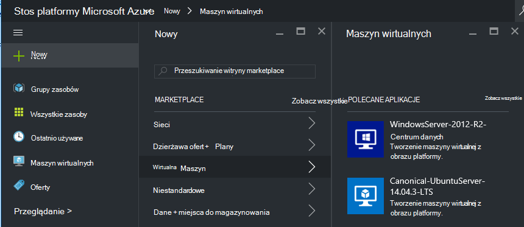
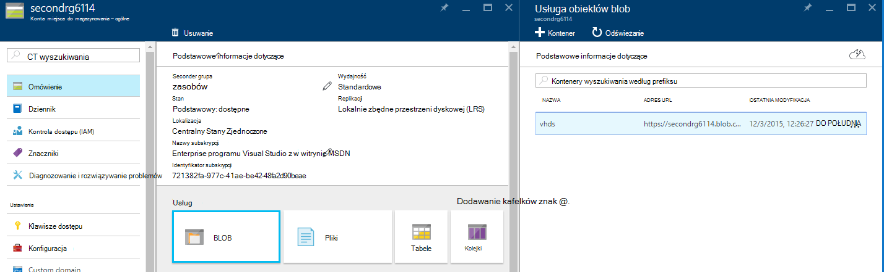
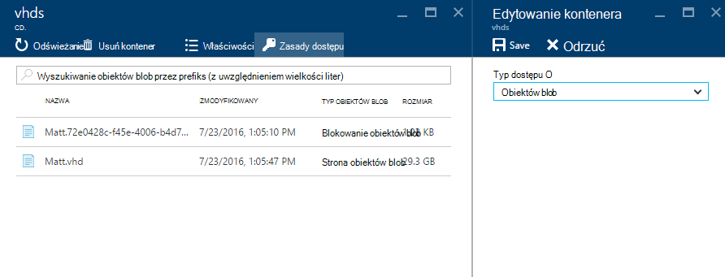
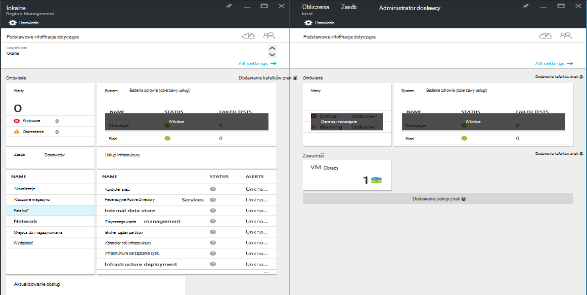
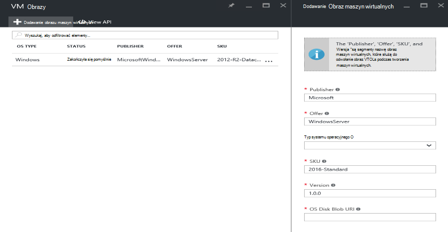

<properties
    pageTitle="Dodawanie obrazu maszyn wirtualnych stos Azure | Microsoft Azure"
    description="Dodawanie organizacji niestandardowe systemu Windows i Linux oraz maszyn wirtualnych obrazu dla dzierżaw używać"
    services="azure-stack"
    documentationCenter=""
    authors="mattmcg"
    manager="darmour"
    editor=""/>

<tags
    ms.service="azure-stack"
    ms.workload="na"
    ms.tgt_pltfrm="na"
    ms.devlang="na"
    ms.topic="get-started-article"
    ms.date="09/26/2016"
    ms.author="mattmcg"/>

# <a name="make-a-custom-virtual-machine-image-available-in-azure-stack"></a>Udostępnić obraz niestandardowy maszyn wirtualnych w stos Azure


Stos Azure umożliwia administratorom udostępnić obrazów maszyn wirtualnych, takich jak VHD niestandardowe organizacji, ich dzierżaw. Obrazy można odwołuje się szablony Menedżera zasobów Azure lub dodane do interfejs Azure Marketplace z tworzeniem elementu Marketplace. Obraz systemu Windows Server 2012 R2 jest domyślnie dostępne w stos Azure Technical Preview.

> [AZURE.NOTE] Obrazów maszyn wirtualnych z elementami Marketplace mogą być rozmieszczone w interfejsie użytkownika wybierz pozycję **Nowy** , a następnie wybierając kategorii **maszyn wirtualnych** . Elementy obrazu maszyn wirtualnych są wyświetlane.


## <a name="add-a-vm-image-to-marketplace-with-powershell"></a>Dodaj obraz maszyn wirtualnych do witryny Marketplace przy użyciu programu PowerShell

Jeśli obraz maszyn wirtualnych wirtualny dysk twardy jest dostępny lokalnie na konsoli maszyn wirtualnych (lub innego urządzenia podłączonego zewnętrznie), wykonaj następujące czynności:

1. Przygotuj obraz wirtualnego dysku twardego systemu operacyjnego Windows i Linux oraz w formacie wirtualnego dysku twardego (nie VHDX).
    -   Dla obrazów systemu Windows ten artykuł [Przekaż obraz maszyn wirtualnych systemu Windows Azure w przypadku wdrożeń Menedżera zasobów](virtual-machines-windows-upload-image.md) zawiera instrukcje przygotowania obrazu w sekcji **Przygotowywanie wirtualnego dysku twardego do przekazania** .
    -   Linux obrazów postępuj zgodnie z instrukcjami, aby przygotować obraz lub użyj istniejącego obrazu Linux stos Azure, zgodnie z opisem w artykule [maszyn wirtualnych wdrażanie Linux stosu Azure](azure-stack-linux.md).

2. Klonowanie [repozytorium Azure stosem narzędzia](https://aka.ms/azurestackaddvmimage), a następnie zaimportuj moduł **ComputeAdmin**

    ```powershell
    Import-Module .\ComputeAdmin\AzureStack.ComputeAdmin.psm1
    ```

3. Dodaj obraz maszyn wirtualnych przez dodawanie VMImage polecenia cmdlet.
    -  Uwzględnianie programu publisher, oferty, SKU i wersji obrazu maszyn wirtualnych. Parametry te są używane przez Menedżera zasobów Azure szablony, które odwołują się do obrazu maszyn wirtualnych.
    -  Określ osType jako systemu Windows i Linux oraz.
    -  Uwzględnienie Identyfikatora dzierżawy usługi Azure Active Directory w formularzu * &lt;myaadtenant&gt;*. onmicrosoft.com.
    - Oto przykład wywołanie skryptu:

    ```powershell
       Add-VMImage -publisher "Canonical" -offer "UbuntuServer" -sku "14.04.3-LTS" -version "1.0.0" -osType Linux -osDiskLocalPath 'C:\Users\AzureStackAdmin\Desktop\UbuntuServer.vhd' -tenantID <myaadtenant>.onmicrosoft.com
    ```

    > [AZURE.NOTE] Polecenie cmdlet żąda poświadczeń dodawania obrazu maszyn wirtualnych. Poświadczenia administratora usługi Azure Active Directory, takich jak serviceadmin@ * &lt;myaadtenant&gt;*. onmicrosoft.com na monit.  

Polecenie wykonuje następujące czynności:
- Uwierzytelnianie dla środowiska stos Azure
- Przekazywanie lokalne wirtualny dysk twardy na konto nowo utworzonego tymczasowego przechowywania
- Dodaje obraz maszyn wirtualnych do repozytorium obrazów maszyn wirtualnych
- Umożliwia utworzenie elementu Marketplace

Aby sprawdzić, czy polecenie działał poprawnie, przejdź do witryny Marketplace w portalu, a następnie sprawdź, czy obraz maszyn wirtualnych jest dostępne w kategorii **maszyn wirtualnych** .

> 

Oto opis parametry polecenia.


| Parametr | Opis |
|----------| ------------ |
|**tenantID** | Identyfikator dzierżawy usługi Azure Active Directory w formularzu * &lt;AADTenantID*. onmicrosoft.com&gt;. |
|**Program Publisher** | Część nazwy programu publisher obraz maszyn wirtualnych dzierżaw Użyj podczas wdrażania obrazu. Przykładem jest "Microsoft". W tym polu nie zawiera spacji lub inne znaki specjalne.|
|**oferty** | Część nazwy oferty obraz maszyn wirtualnych dzierżaw Użyj podczas wdrażania obrazu maszyn wirtualnych. Przykładem jest "WindowsServer". W tym polu nie zawiera spacji lub inne znaki specjalne. |
| **Jednostka SKU** | Część nazwy SKU obraz maszyn wirtualnych dzierżaw Użyj podczas wdrażania obrazu maszyn wirtualnych. Przykładem jest "Datacenter2016". W tym polu nie zawiera spacji lub inne znaki specjalne. |
|**Wersja** | Wersja obrazu maszyn wirtualnych, który dzierżaw Użyj podczas wdrażania obrazu maszyn wirtualnych. Ta wersja jest w formacie * \#.\#. \#*. Przykładem jest "1.0.0". W tym polu nie zawiera spacji lub inne znaki specjalne.|
| **osType** | OsType obrazu musi być "Windows" lub "Linux". |
|**osDiskLocalPath** | Lokalna ścieżka na dysk z systemem operacyjnym wirtualny dysk twardy, którego wysyłasz jako obraz maszyn wirtualnych stos Azure. |
|**dataDiskLocalPaths**| Opcjonalna tablica ścieżki lokalne dysków danych, które można przekazywać jako część obrazu maszyn wirtualnych.|
|**CreateGalleryItem**| Flagę logiczną, która określa, czy utworzyć nowy element w witrynie Marketplace. Domyślnie jest ustawiona na PRAWDA.|
|**Tytuł**| Nazwy wyświetlanej elementu Marketplace. Domyślnie jest ustawiona jako programu Publisher Sku oferty obrazu maszyn wirtualnych.|
|**Opis**| Opis elementu Marketplace. |
|**osDiskBlobURI**| Opcjonalnie tego skryptu akceptuje także magazyn obiektów Blob identyfikatora URI dla osDisk.|
|**dataDiskBlobURIs**| Opcjonalnie tego skryptu również akceptuje tablicę magazyn obiektów Blob identyfikatory URI dodawania dyski danych do obrazu.|


## <a name="add-a-vm-image-through-the-portal"></a>Dodawanie obrazu maszyn wirtualnych za pośrednictwem portalu

> [AZURE.NOTE] Ta metoda wymaga tworzenia elementu Marketplace oddzielnie.

Jeden wymóg obrazów jest, że można się odwoływać za magazyn obiektów Blob identyfikatora URI. Przygotowania obrazu wirtualnego dysku twardego systemu operacyjnego Windows i Linux oraz w formacie wirtualnego dysku twardego (nie VHDX), a następnie Przekaż obraz do konta magazynu platformy Azure lub w stos Azure. Jeśli już przekazanego obrazu magazynem obiektów Blob platformy Azure lub skumulowanym Azure, możesz pominąć ten krok.

Postępuj zgodnie z instrukcjami z artykułu [Przekaż obraz maszyn wirtualnych systemu Windows Azure wdrożeniach Menedżera zasobów](https://azure.microsoft.com/documentation/articles/virtual-machines-windows-upload-image/) za pomocą krok **Przekaż obraz maszyn wirtualnych do swojego konta miejsca do magazynowania**. Należy pamiętać o następujących:

-   Obrazem Linux postępuj zgodnie z instrukcjami, aby przygotować obraz lub użyj istniejącego obrazu Linux stos Azure, zgodnie z opisem w artykule [maszyn wirtualnych wdrażanie Linux Azure stosu](azure-stack-linux.md).

- Jest bardziej efektywne, aby przekazać obraz z magazynem obiektów Blob stos Azure niż magazynem obiektów Blob platformy Azure, ponieważ trwa mniej czasu, aby przekazać obraz maszyn wirtualnych do repozytorium obrazów stos Azure. Podczas zgodnie z instrukcjami przekazywania, upewnij się zastąpić kroku [Uwierzytelniania programu PowerShell z Microsoft Azure stos](azure-stack-deploy-template-powershell.md) kroku "Logowania Azure".

- Zanotuj magazyn obiektów Blob URI przekazywania obrazu. Ma następujący format: * &lt;storageAccount&gt;/&lt;blobContainer&gt;/&lt;targetVHDName&gt;*VHD

2.  Aby udostępnić to anonimowe, przejdź do sekcji obiektów blob konta miejsca do magazynowania, w którym obraz maszyn wirtualnych wirtualnego dysku twardego przekazano do **obiektów Blob,** a następnie wybierz **Zasadę dostępu**. Jeśli chcesz, możesz zamiast tego Generowanie podpisu udostępnienia kontenera i dołączyć go jako część obiektów blob identyfikatora URI.





1.  Zaloguj się do stosu Azure jako administrator. Przejdź do **obszaru zarządzania**. Następnie w obszarze **RPs**, zaznacz **Obliczyć dostawcy zasobów** > **Obrazów maszyn wirtualnych** > **Dodaj.**

    

2.  Na następujących karta wprowadź programu publisher, oferty, SKU i wersję obrazu maszyn wirtualnych. Te segmenty nazwy dotyczą obraz maszyn wirtualnych w szablonach Azure Menedżera zasobów. Upewnij się zaznaczyć **osType** poprawnie. Wprowadź identyfikator URI miejsce, w którym przekazano obraz **osDiskBlobURI**w kroku 1. Kliknij przycisk **Utwórz** , aby rozpocząć tworzenie obraz maszyn wirtualnych.

    

3.  Stan maszyn wirtualnych obraz zmieni się na "Powiodło się" po pomyślnym dodaniu obrazu.

4.  Dzierżaw można wdrażać obraz maszyn wirtualnych, określając programu publisher, oferty, SKU i wersję obrazu maszyn wirtualnych w szablonie Azure Menedżera zasobów. Aby udostępnić obraz maszyn wirtualnych łatwiej zużycia dzierżawy w interfejsie użytkownika, najlepiej [utworzyć element Marketplace](azure-stack-create-and-publish-marketplace-item.md).
