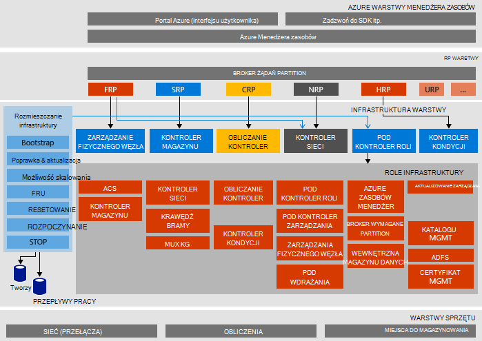

<properties
    pageTitle="Architektura Microsoft Azure stos dowód z koncepcja (aby Zapewnić) | Microsoft Azure"
    description="Wyświetlanie architektura Microsoft Azure stos Zapewnić."
    services="azure-stack"
    documentationCenter=""
    authors="heathl17"
    manager="byronr"
    editor=""/>

<tags
    ms.service="azure-stack"
    ms.workload="na"
    ms.tgt_pltfrm="na"
    ms.devlang="na"
    ms.topic="article"
    ms.date="10/25/2016"
    ms.author="helaw"/>

# Aby Zapewnić stos Microsoft Azure architektura

Zapewnić stos Azure jest wdrożeniu jeden węzeł Azure stos Technical Preview 2. Wszystkie składniki są instalowane w środowisku maszyn wirtualnych uruchomione na komputerze jednego hosta. 

## Diagram architektury logicznych.
Na poniższym diagramie przedstawiono architekturze logicznej Zapewnić stos Azure i jej elementów.

## Role maszyn wirtualnych
Zapewnić stos Azure oferuje usług przy użyciu następujących maszyny wirtualne na hoście, aby Zapewnić:

 - **MAS ACS01** Stos Azure przestrzeni dyskowej usługi hostingu maszyny wirtualnej.

 - **MAS ADFS01** Maszyny wirtualnej hostingu Active Directory Federation Services.  Tej maszyny wirtualnej nie jest używany w Technical Preview 2.  

 - **MAS ASQL01**  Przechowywanie maszyn wirtualnych dostarczania wewnętrznych danych dla ról infrastruktury stos Azure.  

 - **MAS BGPNAT01** Wirtualna maszyna działająca jako router krawędzi, a także możliwości translatora adresów Sieciowych i sieci VPN dotyczące stos Azure.

 - **MAS CA01** Maszyn wirtualnych usługi Urząd certyfikacji stos Azure roli usług.

 - **MAS CON01** Maszyn wirtualnych jest dostępna dla deweloperów dotyczące instalowania programu PowerShell, Visual Studio i inne narzędzia.

 - **MAS DC01** Maszyny wirtualnej hostingu usługi Active Directory, DNS i DHCP Microsoft Azure stosu.

 - **MAS GWY01** Maszyn wirtualnych, dostarczając krawędzi bramy usług, takich jak połączenia witryny do witryny sieci VPN sieciach dzierżawy.

 - **MAS NC01**  Maszyny wirtualnej hostingu Kontroler sieci, który zarządza usług sieciowych stos Azure.  

 - **MAS SLB01**  Maszyn wirtualnych zawiera równoważenia obciążenia usług w stos Azure dla zarówno dzierżawami, jak i usługi infrastruktury stos Azure.  

 - **MAS SUS01**  Wirtualna stanowiska hostingu Windows Server Update Services i odpowiedzialne za dostarczanie aktualizacji do innych maszyn wirtualnych stos Azure.

 - **MAS WAS01**  Maszyna wirtualna hostingu portalu i usługi Azure Menedżera zasobów.

 - **MAS XRP01** Maszyny wirtualnej, która obsługuje dostawców zasobów core Microsoft Azure stosu, w tym dostawców zasobów obliczeń, sieci i miejsca do magazynowania.

## Usług magazynu
Usługi miejsca do magazynowania w systemie operacyjnym na hoście fizycznym obejmują:

 - **Usługa ACS Blob** Azure usługa spójne magazyn obiektów Blob, która zapewnia usługi Magazyn obiektów blob i tabeli.

 - **SoFS** Serwer wychodzący skali plików.

 - **Odwołań CSV** Klaster System plików mechanizm udostępniane głośność.

 - **Dysk wirtualny**, **Ilości miejsca do magazynowania**i **Miejsca do magazynowania spacje bezpośrednie** są odpowiednich technologii miejsca do magazynowania w systemie Windows Server umożliwiające dostawcy zasobów firmy Microsoft Azure stos core miejsca do magazynowania.

## Następne kroki

[Wdrażanie stos Azure](azure-stack-deploy.md)

[Scenariusze pierwszej próby](azure-stack-first-scenarios.md)

