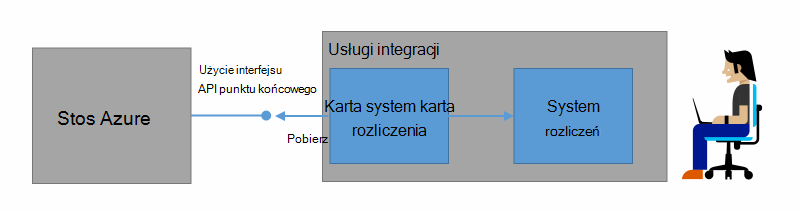
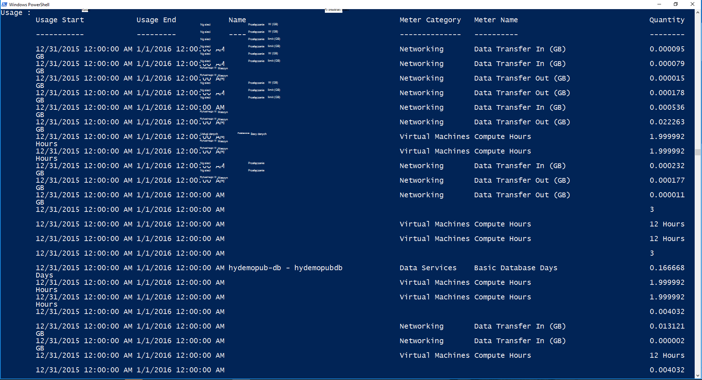

<properties
    pageTitle="Rozliczenia klienta i obciążenia zwrotnego w stos Azure | Microsoft Azure"
    description="Dowiedz się, jak pobrać informacje o użyciu zasobów z stos Azure."
    services="azure-stack"
    documentationCenter=""
    authors="AlfredoPizzirani"
    manager="byronr"
    editor=""/>

<tags
    ms.service="azure-stack"
    ms.workload="na"
    ms.tgt_pltfrm="na"
    ms.devlang="na"
    ms.topic="article"
    ms.date="10/18/2016"
    ms.author="alfredop"/>

# Fakturowanie klientów i obciążenia zwrotnego w stos Azure

Teraz, gdy używasz stos Azure, jest dobrym pomysłem jest Pomyśl o śledzeniu zastosowania. Dostawcy usług zależne od zastosowania informacji do swoich klientów i opis koszt świadczenia usług.
Przedsiębiorstw, zwykle śledzenie użycia według działów.

Stos Azure nie jest system rozliczeń. Nie można go opłatę z dzierżawami dla zasobów, które mogą używać. Ale, stos Azure infrastruktury do gromadzenia i agregowanie danych dotyczących użycia dla każdego dostawcy pojedynczego zasobu. Można uzyskać dostęp do danych i je wyeksportować z systemem rozliczeń za pomocą karty rozliczeń lub go wyeksportować do narzędzie analiz biznesowych, takie jak Microsoft Power BI.

## Jakie informacje dotyczące użycia można znaleźć i w jaki sposób?

Azure dostawców zasobów stos wygenerować rekordów zastosowania co godzinę. Rekordy pokazują każdego zasobu, która została wykorzystana i subskrypcji, które zużyte zasobu. Te dane są przechowywane. Masz dostęp do danych za pośrednictwem interfejsu API usługi REST.

Administrator usługi można pobrać danych dotyczących użycia dla wszystkich subskrypcji dzierżawy. Poszczególne dzierżaw pobierać tylko własne informacje.

Użycie rekordy mają informacji na temat miejsca do magazynowania, sieci i zastosowania obliczeń. Aby uzyskać listę liczników zobacz [Ten artykuł](azure-stack-usage-related-faq.md).

## Pobieranie informacji o zastosowania

Aby wygenerować rekordów, istotne jest, że zasoby z i aktywnie przy użyciu systemu. Jeśli nie wiesz, czy masz wszystkie zasoby uruchomiony, w Azure Marketplace stos wdrażanie, a następnie uruchom maszyny wirtualnej (maszyn wirtualnych). Przegląd monitorowania karta maszyn wirtualnych się upewnić, że jest uruchomiony.

Zalecamy, aby uruchomić polecenia cmdlet programu Windows PowerShell, aby wyświetlić danych dotyczących użycia.
PowerShell połączeń za pośrednictwem interfejsów API użycia zasobów.

1.  [Instalowanie i konfigurowanie programu PowerShell Azure](https://azure.microsoft.com/en-us/documentation/articles/powershell-install-configure/).

2.  Aby zalogować się do Menedżera zasobów Azure, należy użyć polecenia cmdlet programu PowerShell **AzureRmAccount logowania**.

3.  Aby zaznaczyć subskrypcji, która umożliwia tworzenie zasobów, wpisz **Get-AzureRmSubscription — SubscriptionName "sub" | Wybierz pozycję AzureRmSubscription**.

4.  Do pobierania danych, należy użyć polecenia cmdlet [**Get-UsageAggregates**](https://msdn.microsoft.com/en-us/library/mt619285.aspx)programu PowerShell.
    Jeśli danych dotyczących użycia jest dostępna, tak jak w poniższym przykładzie jest zwracana w programie PowerShell. PowerShell zwraca 1000 linie zastosowania na połączenie.
    Argument *kontynuacji* służy do pobierania zestawów linie oprócz pierwszego 1000. Aby uzyskać więcej informacji na temat danych dotyczących użycia zobacz [odwołanie interfejsu API użycia zasobów](azure-stack-provider-resource-api.md).

    

## Następne kroki

[Użycie zasobu dostawcy interfejsu API](azure-stack-provider-resource-api.md)

[Dzierżawa użycie zasobu interfejsu API](azure-stack-tenant-resource-usage-api.md)

[Często zadawane pytania dotyczące użycia](azure-stack-usage-related-faq.md)
