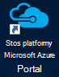
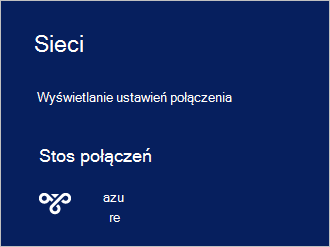

<properties
    pageTitle="Nawiązywanie połączenia z Azure stos | Microsoft Azure"
    description="Dowiedz się, jak połączyć stos Azure"
    services="azure-stack"
    documentationCenter=""
    authors="ErikjeMS"
    manager="byronr"
    editor=""/>

<tags
    ms.service="azure-stack"
    ms.workload="na"
    ms.tgt_pltfrm="na"
    ms.devlang="na"
    ms.topic="get-started-article"
    ms.date="10/18/2016"
    ms.author="erikje"/>

# <a name="connect-to-azure-stack"></a>Nawiązywanie połączenia z stos Azure
Aby zarządzać zasobami, umożliwia nawiązanie połączenia z komputerem Zapewnić stos Azure. Można wykonać jedną z następujących opcji połączenia:

 - Pulpit zdalny: umożliwia jednego użytkownika równoczesne szybką komunikację z komputera, aby Zapewnić.
 - Wirtualna sieć prywatna (VPN): umożliwia wielu użytkowników jednocześnie łączyć z klientami poza infrastruktury stos Azure (wymaga konfiguracji).

## <a name="connect-with-remote-desktop"></a>Łączenie się z pulpitu zdalnego
Za pomocą połączenia pulpitu zdalnego jednego użytkownika jednocześnie można pracować z portalu zarządzania zasobami. Za pomocą narzędzia na komputerze wirtualnych MAS CON01.

1.  Zaloguj się do komputera fizycznie Zapewnić stos Azure.

2.  Otwórz Podłączanie pulpitu zdalnego i nawiązać MAS CON01. Wprowadź **AzureStack\AzureStackAdmin** jako nazwa użytkownika i hasło administratora, podanych podczas instalacji stos Azure.  

3.  Na pulpicie MAS CON01 kliknij dwukrotnie ikonę **Portal stos Microsoft Azure** (https://portal.azurestack.local/), aby otworzyć [portal](azure-stack-key-features.md#portal).

    

4.  Zaloguj się przy użyciu poświadczeń usługi Azure Active Directory określonej podczas instalacji.

## <a name="connect-with-vpn"></a>Nawiązywanie połączenia z siecią VPN
Połączenia wirtualnej sieci prywatnej umożliwić wielu użytkownikom jednocześnie łączyć z klientami poza infrastruktury stos Azure. Za pomocą portalu zarządzania resoures. Za pomocą narzędzi, takich jak Visual Studio i programu PowerShell, na komputerze klienckim lokalny.

1.  Zainstaluj moduł AzureRM przy użyciu następującego polecenia:
   
    ```PowerShell
    Install-Module -Name AzureRm -RequiredVersion 1.2.6 -Scope CurrentUser
    ```   
   
2. Pobierz skryptów narzędzia stos Azure.  Pliki można pobrać przeglądania [repozytorium GitHub](https://github.com/Azure/AzureStack-Tools)lub uruchamianie tego skryptu programu Windows PowerShell jako administrator pomocy technicznej:
    
    >[AZURE.NOTE]  Poniższe czynności wymagają 5.0 programu PowerShell.  Aby sprawdzić swoją wersję, uruchom $PSVersionTable.PSVersion i porównywanie wersji "Głównej".  

    ```PowerShell
       
       #Download the tools archive
       invoke-webrequest https://github.com/Azure/AzureStack-Tools/archive/master.zip -OutFile master.zip

       #Expand the downloaded files. 
       expand-archive master.zip -DestinationPath . -Force

       #Change to the tools directory
       cd AzureStack-Tools-master
    ````

3.  W tej samej sesji programu PowerShell przejdź do folderu, **Łączenie** i zaimportować moduł AzureStack.Connect.psm1:

    ```PowerShell
    cd Connect
    import-module .\AzureStack.Connect.psm1
    ```

4.  Aby utworzyć połączenie VPN stos Azure, uruchom następujące środowiska Windows PowerShell. Przed uruchomieniem, wypełnij hasło administratora i pola adresu hosta stos Azure. 
    
    ```PowerShell
    #Change the IP Address below to match your Azure Stack host
    $hostIP = "<HostIP>"

    # Change password below to reference the password provided for administrator during Azure Stack installation
    $Password = ConvertTo-SecureString "<Admin Password>" -AsPlainText -Force

    # Add Azure Stack One Node host & CA to the trusted hosts on your client computer
    Set-Item wsman:\localhost\Client\TrustedHosts -Value $hostIP -Concatenate
    Set-Item wsman:\localhost\Client\TrustedHosts -Value mas-ca01.azurestack.local -Concatenate  

    # Update Azure Stack host address to be the IP Address of the Azure Stack POC Host
    $natIp = Get-AzureStackNatServerAddress -HostComputer $hostIP -Password $Password

    # Create VPN connection entry for the current user
    Add-AzureStackVpnConnection -ServerAddress $natIp -Password $Password

    # Connect to the Azure Stack instance. This command (or the GUI steps in step 5) can be used to reconnect
    Connect-AzureStackVpn -Password $Password 
    ```

5. Po wyświetleniu monitu zaufania hosta stos Azure.

6. Gdy zostanie wyświetlony monit, należy zainstalować certyfikat (za oknem sesji programu Powershell zostanie wyświetlony monit).

7. Aby przetestować portalu połączenia, w przeglądarce internetowej, przejdź do *https://portal.azurestack.local*.

8. Aby przejrzeć i zarządzać połączenia stos Azure, należy użyć **sieci** na komputerze klienckim:

    

>[AZURE.NOTE] To połączenie VPN nie umożliwia łączności maszyny wirtualne i inne zasoby. Aby uzyskać informacje połączenie z zasobami zobacz [Jedno połączenie VPN węzeł](azure-stack-create-vpn-connection-one-node-tp2.md)


## <a name="next-steps"></a>Następne kroki
[Pierwszego zadania](azure-stack-first-scenarios.md)

[Instalowanie i łączenie się z programu PowerShell](azure-stack-connect-powershell.md)

[Instalowanie i łączenie się z interfejsu wiersza polecenia](azure-stack-connect-cli.md)


