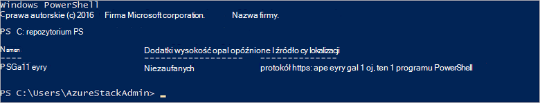

<properties
    pageTitle="Nawiązywanie połączenia z Azure stosowo przy użyciu programu PowerShell | Microsoft Azure"
    description="Dowiedz się, jak zarządzać stosem Azure przy użyciu programu PowerShell"
    services="azure-stack"
    documentationCenter=""
    authors="HeathL17"
    manager="byronr"
    editor=""/>

<tags
    ms.service="azure-stack"
    ms.workload="na"
    ms.tgt_pltfrm="na"
    ms.devlang="na"
    ms.topic="article"
    ms.date="10/19/2016"
    ms.author="helaw"/>

# Instalowanie programu PowerShell i nawiązać stos Azure
W tym przewodniku firma Microsoft szczegółową procedurę nawiązywania połączenia stos Azure przy użyciu programu PowerShell. Po wykonaniu tych czynności pomogą także wdrażanie zasobów i zarządzanie nimi.

## Instalowanie poleceń cmdlet środowiska PowerShell stos Azure

1.  Polecenia cmdlet AzureRM są instalowane z galerii programu PowerShell. Aby rozpocząć, otwórz konsoli programu PowerShell na MAS CON01 i uruchom następujące polecenie, aby powrócić do listy dostępne repozytoria programu PowerShell:

        Get-PSRepository

      

2.  Uruchom następujące polecenie, aby zainstalować moduł AzureRM:

        Install-Module -Name AzureRM -RequiredVersion 1.2.6 -Scope CurrentUser

    >[AZURE.NOTE] *-CurrentUser zakres* jest opcjonalna. Jeśli chcesz mieć dostęp do modułów więcej niż bieżącego użytkownika za pomocą wiersz polecenia z podwyższonym poziomem uprawnień i pozostaw wyłączanie parametru *zakresu* .

3.  Aby sprawdzić, czy moduły AzureRM, wykonaj następujące polecenia:

        Get-Command -Module AzureRM.AzureStackAdmin

## Nawiązywanie połączenia z stos Azure
Moduł jest dostępna do pobrania, obsługujący Konfigurowanie połączenia programu PowerShell stos Azure za Ciebie.  Odwiedź stronę [Narzędzia stos Azure](http://aka.ms/ConnectToAzureStackPS) modułu oraz dodatkowych czynności. 

## Pobieranie listy subskrypcji
W tej sekcji można Sprawdź, czy poleceń cmdlet programu PowerShell uruchomionego przed stosem Azure, pobierania i wybierając subskrypcji do użytku.

Uruchom następujące polecenie, aby pobrać listę subskrypcji stosem Azure skojarzonego z kontem:

    Get-AzureRmSubscription

## Następne kroki
[Wdrażanie szablonów z programu PowerShell](azure-stack-deploy-template-powershell.md)

[Łączenie się z polecenie Azure](azure-stack-connect-cli.md)

[Wdrażanie szablonów z programu Visual Studio](azure-stack-deploy-template-visual-studio.md)

