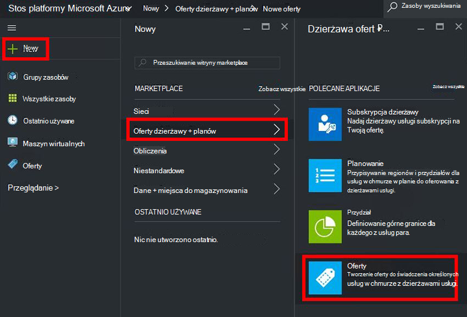
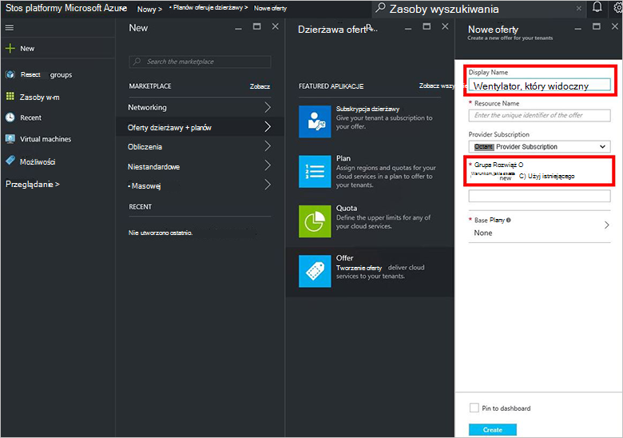
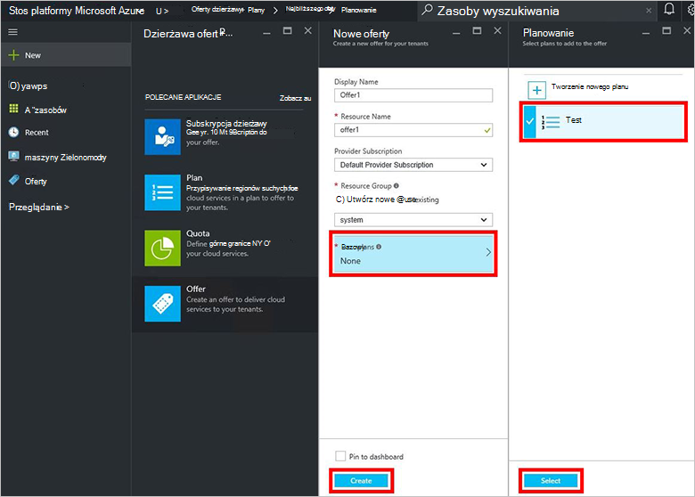
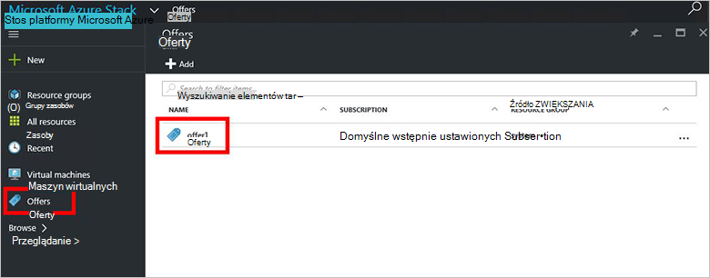
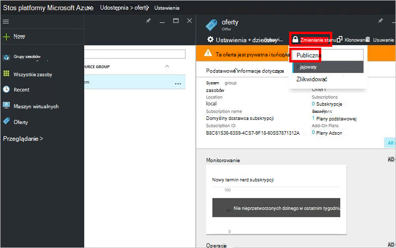

<properties
    pageTitle="Tworzenie oferty w stos Azure | Microsoft Azure"
    description="Jako administrator usługi Dowiedz się, jak utworzyć ofertę dla swojego dzierżawami w stos Azure."
    services="azure-stack"
    documentationCenter=""
    authors="ErikjeMS"
    manager="byronr"
    editor=""/>

<tags
    ms.service="azure-stack"
    ms.workload="na"
    ms.tgt_pltfrm="na"
    ms.devlang="na"
    ms.topic="get-started-article"
    ms.date="09/26/2016"
    ms.author="erikje"/>

# Tworzenie oferty w stos Azure

[Oferty](azure-stack-key-features.md#services-plans-offers-and-subscriptions) są grup jeden lub więcej planów, które prowadzą dostawców z dzierżawami do zakupu lub subskrybowanie. Ten dokument pokazano, jak utworzyć ofertę, która zawiera [utworzony plan](azure-stack-create-plan.md) w ostatnim kroku. Ta oferta umożliwia subskrybenci do zapewniania obsługi maszyn wirtualnych.

1.  [Zaloguj się](azure-stack-connect-azure-stack.md#log-in-as-a-service-administrator) do portalu jako administrator usługi, a następnie kliknij przycisk **Nowy** > **oferuje dzierżawy + planów** > **oferty**.
    

2.  W karta **Nowe oferty** wpisz **Nazwę wyświetlaną** i **Nazwę zasobu**, a następnie wybierz nowej lub istniejącej **Grupy zasobów**. Nazwa wyświetlana jest jej przyjazną nazwę. Tylko administrator może wyświetlać nazwy zasobu. Jest to nazwa, którego administratorzy do pracy z oferty jako zasób Azure Menedżera zasobów.

    

3.  Kliknij pozycję **Base plany** i, karta **Plan** wybierz plany, do których ma być zawarta w ofercie, a następnie kliknij **Wybierz**. Kliknij przycisk **Utwórz** , aby utworzyć ofertę.

    
    
4. Kliknij pozycję **oferuje** , a następnie kliknij właśnie utworzonego oferty.

    

5.  Kliknij przycisk **Zmień stan**, a następnie kliknij **publicznej**.
  
    

Oferty musi być udostępniane dzierżawami uzyskać pełny widok, po zakupieniu subskrypcji. Oferty może być:

- **Publiczne**: widoczne dla dzierżaw.

- **Prywatne**: widoczne tylko dla administratorów usługi. Przydatne podczas opracowywania planu lub oferty, lub jeśli administrator usługi chce zatwierdzanie każdej subskrypcji.

- **Decommissioned**: zamknięte dla nowych subskrybentów. Administrator usługi można użyć likwidowanego aby zapobiec przyszłych subskrypcje, ale pozostawić bez zmian bieżącej subskrybentów.

Zmiany na ofertę nie są widoczne natychmiast do dzierżawy. Aby zobaczyć zmiany, może być konieczne Wyloguj się i zaloguj się do nowej subskrypcji w selektorze"subskrypcji" Zobacz podczas tworzenia zasoby lub grupy zasobów.

## Następne kroki

[Subskrybowanie oferty i obsługi administracyjnej maszyny](azure-stack-subscribe-plan-provision-vm.md)
