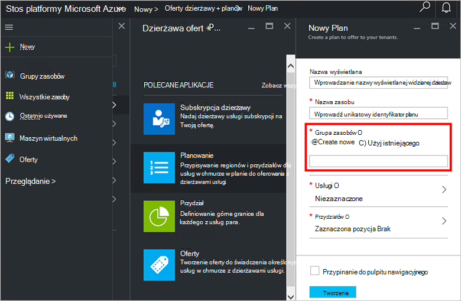

<properties
    pageTitle="Tworzenie planu w stos Azure | Microsoft Azure"
    description="Jako administrator usługi Utwórz plan umożliwiający maszyn wirtualnych należy subskrybentów."
    services="azure-stack"
    documentationCenter=""
    authors="ErikjeMS"
    manager="byronr"
    editor=""/>

<tags
    ms.service="azure-stack"
    ms.workload="na"
    ms.tgt_pltfrm="na"
    ms.devlang="na"
    ms.topic="get-started-article"
    ms.date="09/26/2016"
    ms.author="erikje"/>

# Tworzenie planu w stos Azure

[Plany](azure-stack-key-features.md#services-plans-offers-and-subscriptions) są grupami co najmniej jednej usługi. Jako dostawca można utworzyć plany do oferowania z dzierżawami usługi. Z kolei z dzierżawami subskrybować oferty korzystać z planów i usług, które zawierają. W tym przykładzie pokazano, jak utworzyć plan, który zawiera obliczeń, sieci i dostawców zasobów miejsca do magazynowania. Ten plan umożliwia subskrybentów do zapewniania obsługi maszyn wirtualnych.

1.  W przeglądarce internetowej przejdź do https://portal.azurestack.local.

2.  [Zaloguj się](azure-stack-connect-azure-stack.md#log-in-as-a-service-administrator) do portalu stos Azure jako administrator usługi i wprowadź poświadczenia administratora usługi (konto utworzone w kroku 5 sekcji [uruchomić skrypt programu PowerShell](azure-stack-run-powershell-script.md) ), a następnie kliknij, **Zaloguj się**.

    Administratorzy usługi można utworzyć oferty i planów i zarządzanie użytkownikami.

3.  Aby utworzyć plan i oferty, które subskrybować dzierżaw, kliknij przycisk **Nowy** > **oferuje dzierżawy + planów** > **planu**.

    

4.  Karta **Nowy Plan** wypełnij **Nazwę wyświetlaną** i **Nazwę zasobu**. Nazwa wyświetlana jest planu przyjazną nazwę, która Zobacz dzierżaw. Tylko administrator może wyświetlać nazwy zasobu. Jest to nazwa, których administratorzy pracować z planem jako zasób Azure Menedżera zasobów.

    

5.  Tworzenie nowej **Grupy zasobów**, lub wybierz istniejący, jako kontenera dla planu (np. "OffersAndPlans")

    

6.  Kliknij **usług**, wybierz **Microsoft.Compute**, **Microsoft.Network**i **Microsoft.Storage**, a następnie kliknij przycisk **Wybierz**.

    

7.  Kliknij pozycję **przydziałów**, kliknij **Microsoft.Storage (lokalny)**i następnie wybierz pozycję przydział domyślny lub kliknij polecenie **Utwórz nowy przydział** Dostosowywanie przydziału.

    

8.  Wpisz nazwę dla przydziału, kliknij pozycję **Ustawienia przydziału**, ustaw wartości przydziału i kliknij **przycisk OK**i kliknij przycisk **Utwórz**.

    

9. Kliknij **Microsoft.Network (lokalny)**, a następnie wybierz przydział domyślny albo kliknij polecenie **Utwórz nowy przydział** Dostosowywanie przydziału.

    

10. Wpisz nazwę dla przydziału, kliknij pozycję **Ustawienia przydziału**, ustaw wartości przydziału i kliknij **przycisk OK**i kliknij przycisk **Utwórz**.

    

11. Kliknij **Microsoft.Compute (lokalny)**, a następnie wybierz przydział domyślny albo kliknij polecenie **Utwórz nowy przydział** Dostosowywanie przydziału.

    

12.  Wpisz nazwę dla przydziału, kliknij pozycję **Ustawienia przydziału**, ustaw wartości przydziału i kliknij **przycisk OK**i kliknij przycisk **Utwórz**.

    

13. W karta **przydziałów** kliknij **przycisk OK**, a następnie w karta **Nowy Plan** kliknij **Utwórz** , aby utworzyć plan.

    

14. Aby wyświetlić nowy plan, kliknij opcję **wszystkie zasoby**, a następnie wyszukaj planu i kliknij jej nazwę.

    

## Następne kroki

[Tworzenie oferty](azure-stack-create-offer.md)
