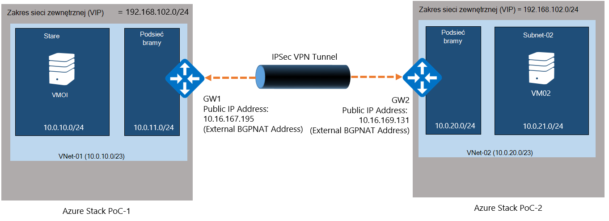
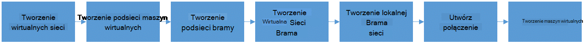
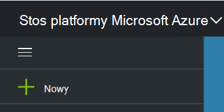
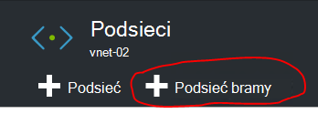
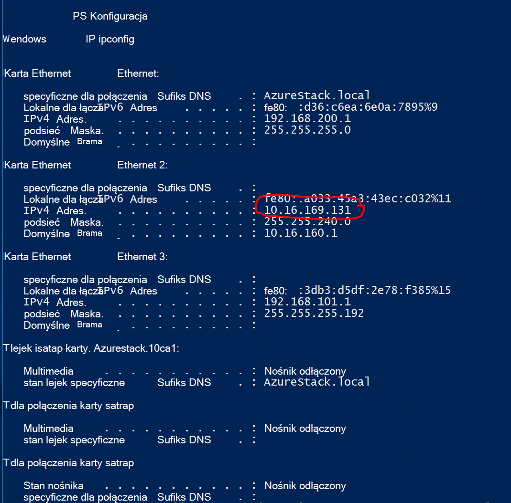
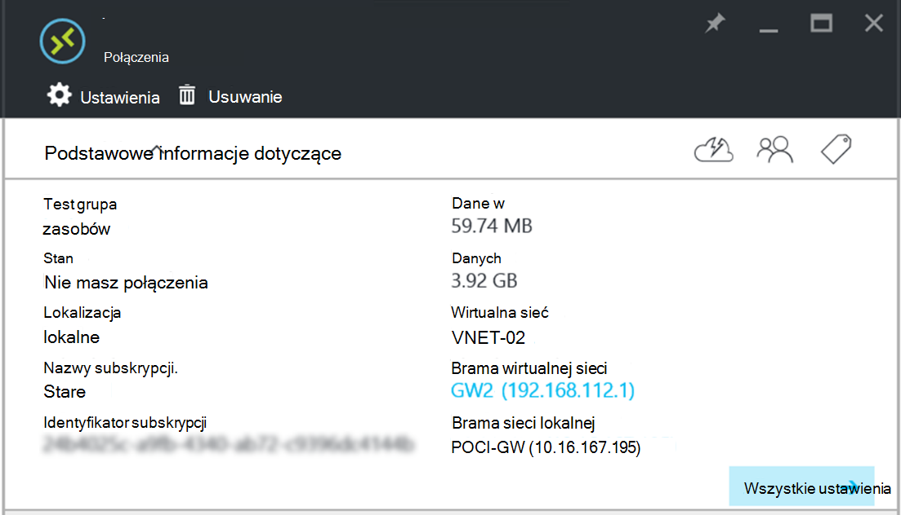

<properties
    pageTitle="Tworzenie połączenia VPN witryny do witryny między dwoma wirtualnych sieci w różnych środowiskach zapewnić stos Azure | Microsoft Azure"
    description="Szczegółową procedurę umożliwiającą administratorem chmurze, aby utworzyć połączenie VPN witryny do witryny między dwoma środowiskami Zapewnić jeden węzeł w TP2."
    services="azure-stack"
    documentationCenter=""
    authors="ScottNapolitan"
    manager="darmour"
    editor=""/>

<tags
    ms.service="azure-stack"
    ms.workload="na"
    ms.tgt_pltfrm="na"
    ms.devlang="na"
    ms.topic="get-started-article"
    ms.date="09/26/2016"
    ms.author="scottnap"/>

# Tworzenie połączenia VPN witryny do witryny między dwoma wirtualnych sieci w różnych środowiskach zapewnić stos Azure

## Omówienie

W tym artykule opisano czynności, aby utworzyć połączenie VPN witryny do witryny między dwoma wirtualnych sieci w dwóch oddzielnych środowiskach stos Azure dowód z koncepcji. To ma na celu ułatwić użytkownikom ocenia witryny do witryny bram zrozumieć, jak skonfigurować połączenia VPN między wirtualnych sieci w dwóch różnych wdrożeń stos Azure.  Proces ten sposób uzyskają opis działania sieci VPN bram w stos Azure.

>[AZURE.NOTE] Tego dokumentu dotyczy w szczególności Zapewnić TP2 stos Azure.

### Diagram połączenia

Oto diagram przedstawiający, co nasze konfiguracji powinna wyglądać podobnie do możemy po wprowadzeniu zmian.

### Przed rozpoczęciem

Aby wykonać tę konfigurację, potrzebne następujące elementy, upewnij się, że masz kwestie, o których przed rozpoczęciem pracy.

-   Dwa serwery, które spełniają wymagania sprzętowe Zapewnić stos Azure określają [Warunki wstępne wdrażania stos Azure](azure-stack-deploy.md)i innych wstępnie zdefiniowanych przez tego dokumentu.

-   Stos Azure pakietu wdrażania Technical Preview 2.

## Wdrażanie środowiskach zatwierdzania Koncepcji

Zostanie wdrożony dwóch środowiskach Zapewnić stos Azure, aby ukończyć tej konfiguracji.

-   Do każdego zatwierdzenia Koncepcji, który można wdrożyć możesz po prostu wykonaj instrukcje wdrożenia szczegółowe w artykule [Wdrażanie Zapewnić stos Azure](azure-stack-run-powershell-script.md).
    Odnoszą się do każdego środowiska zatwierdzenia Koncepcji, w tym dokumencie ogólnie jako POC1 i POC2.

## Konfigurowanie przydziałów dla obliczeń, sieci i miejsca do magazynowania

Musisz skonfigurować przydziałów do obliczeń, sieci i przechowywania, tak aby te usługi mogą być skojarzone z planem, a następnie subskrybować ofertę dzierżaw.

>[AZURE.NOTE] Należy wykonać te kroki dla każdego środowiska Zapewnić stos Azure.

Środowisko do tworzenia przydziałów dla usług został zmieniony z TP1. Czynności dotyczące tworzenia przydziałów w TP2 można znaleźć w <http://aka.ms/mas-create-quotas>. Możesz zaakceptować ustawienia domyślne dla wszystkich ustawień przydziałów w tym celu.

## Utworzenie planu i oferty

[Plany](azure-stack-key-features.md) są grupami co najmniej jednej usługi. Jako dostawca można utworzyć plany do oferowania z dzierżawami usługi. Z kolei z dzierżawami subskrybować oferty korzystać z planów i usług, które zawierają.

>[AZURE.NOTE] Konieczne będzie wykonaj te kroki dla każdego środowiska Zapewnić stos Azure.

1.  Najpierw utwórz Plan. Aby to zrobić, możesz wykonać czynności opisane w artykule online [Utwórz Plan](azure-stack-create-plan.md) .

2.  Tworzenie oferty, wykonując kroki opisane w sekcji [Tworzenie oferty w stos Azure](azure-stack-create-offer.md).

3.  Zaloguj się do portalu jako Administrator dzierżawy i [subskrybowanie oferty utworzono] (azure stos subskrypcji — plan-Obsługa administracyjna vm.md.

## Tworzenie zasobów sieciowych w Zapewnić 1

Teraz możemy będą faktycznie utworzyć zasoby, które należy ustawić naszych konfiguracji. Poniższe kroki przedstawiają, co będzie się robimy. Te instrukcje będą przedstawiająca sposób tworzenia zasobów za pośrednictwem portalu, ale to samo można wykonywać przy użyciu programu PowerShell.

### Zaloguj się jako dzierżawy

Administrator usługi można zalogować się jako dzierżawy, aby przetestować plany, oferty i subskrypcje, które mogą używać ich dzierżaw. Jeśli nie masz jeszcze jedną [Tworzenie konta dzierżawy](azure-stack-add-new-user-aad.md) przed Zaloguj się.

### Tworzenie wirtualnych sieci i podsieci maszyn wirtualnych

1.  Zaloguj się przy użyciu konta dzierżawy.

2.  W portalu Azure kliknij ikonę **Nowy** .

     
3.  Wybierz pozycję **sieć** z Marketplace menu.

4.  Kliknij pozycję **wirtualnej sieci** w menu.

5.  Kliknij przycisk **Utwórz** w dolnej części karta opis zasobu. Wprowadź następujące wartości w odpowiednich polach zgodnie z tej tabeli.

  	| **Pole**             | **Wartość** |
  	|----------------------- | ------ |
  	| Nazwa                  |vnet-01 |
  	| Przestrzeń adresów         | 10.0.10.0/23 |
  	| Nazwa podsieci           | podsieć-01 |
  	| Zakres adresów podsieci  | 10.0.10.0/24 |

6.  Powinien zostać wyświetlony subskrypcji został utworzony wcześniej wpisanymi w polu **subskrypcji** .

7.  Dla grupy zasobów możesz utworzyć nową grupę zasobów lub jeśli już istnieje, wybierz pozycję Użyj istniejącego.

8.  Sprawdź domyślnej lokalizacji.

9.  Kliknij przycisk **Utwórz** .

### Tworzenie podsieci bramy

1.  Otwórz zasobu sieciowego wirtualnych właśnie utworzony (Vnet-01) z pulpitu nawigacyjnego.

2.  Wybieranie podsieci na karta Ustawienia

3.  Kliknij przycisk **Podsieci bramy** , aby dodać podsieci bramy do wirtualnej sieci.

     
4.  Nazwa podsieci ustawiono **GatewaySubnet** domyślnie.
    Brama podsieci są specjalne i musi mieć ta nazwa określonego celu poprawnego.

5.  W polu **zakres adresów** wpisz **10.0.11.0/24**.

6.  Kliknij przycisk **Utwórz** , aby utworzyć podsieci bramy.

### Tworzenie bramy wirtualnej sieci

1.  W portalu Azure kliknij ikonę **Nowa** .

    

2.  Wybierz pozycję **sieć** z Marketplace menu.

3.  **Brama wirtualnej sieci** wybierz z listy zasobów.

4.  Przejrzyj opis, a następnie kliknij przycisk **Utwórz**.

5.  W polu **Nazwa** wpisz **GW1**.

6.  Kliknij element **wirtualnej sieci** , aby wybrać wirtualnej sieci.
    Z listy wybierz **Vnet-01** .

7.  Kliknij element menu **publiczny adres IP** . Gdy zostanie otwarta karta wybierz adres IP publicznej kliknij na przycisku Utwórz nowy.

8.  W polu **Nazwa** wprowadź **GW1 PiP** i kliknij przycisk **Ok.**

9.  **Typ bramy** powinien mieć **VPN** domyślnie zaznaczone. Zachowaj to ustawienie.

10. **Typ VPN** powinien mieć **oparte na rozsyłania** domyślnie zaznaczone.
    Zachowaj to ustawienie.

11. Sprawdź **subskrypcję** i **lokalizacji** są poprawne. W razie potrzeby można przypiąć zasobów do pulpitu nawigacyjnego. Kliknij przycisk **Utwórz**.

### Tworzenie bramy sieci lokalnej

Zasób bramy sieci lokalnej jest nieco dziwna naszych scenariusz.
Ten sam zasób, które można znaleźć w Azure, jest jednak platformy Azure reprezentują urządzenia fizycznego, lokalna zwykle występują mają służących do połączyć się z bramą wirtualną sieć platformy Azure. W naszym przykładzie obydwa końce połączenia są bram faktycznie wirtualnej sieci!

Sposób wziąć pod uwagę to bardziej ogólnie zasobów lokalnych Brama sieci jest zawsze ma wskazać brama zdalna na końcu połączenia. Ze względu na sposób, aby Zapewnić została zaprojektowana potrzebujemy faktycznie wprowadź adres karty sieci zewnętrznej na maszyn wirtualnych translatora adresów Sieciowych z innymi Zapewnić jako publiczny adres IP bramy sieci lokalnej. Firma Microsoft spowoduje to utworzenie mapowania translatora adresów Sieciowych na maszyn wirtualnych translatora adresów Sieciowych, aby upewnić się, że obydwa końce są poprawnie połączone.

### Uzyskiwanie adresu IP zewnętrznej karty maszyn wirtualnych translatora adresów Sieciowych

1.  Zaloguj się do komputera fizycznie stos Azure dla POC2.

2.  [Klawisz systemu Windows] + R, aby otworzyć menu **Uruchom** i wpisz **mstsc** i naciśnij enter.

3.  W polu **komputer** wprowadź nazwę **MAS BGPNAT01** i kliknij przycisk **Połącz** .

4.  Kliknij Start Menu i kliknij prawym przyciskiem myszy programu PowerShell i wybierz pozycję **Uruchom jako Administrator**.

5.  Typ **IPConfig/all**.

6.  Znajdowanie karty Ethernet, który jest połączony z siecią w wersji lokalnej i zanotować adres IP protokołu IPv4 związane z tej karty. Moje środowisko jest **10.16.167.195** , ale Twoje będzie czegoś innego.

7.  Rekord ten adres. To jest użyjemy jako publiczny adres IP zasobu bramy sieci lokalnej utworzone w POC1.

### Tworzenie zasobu bramy sieci lokalnej

1.  Zaloguj się do komputera fizycznie stos Azure dla POC1.

2.  W polu **komputer** wprowadź nazwę **MAS CON01** i kliknij przycisk **Połącz** .

3.  W portalu Azure kliknij ikonę **Nowy** .

    

4.  Wybierz pozycję **sieć** z Marketplace menu.

5.  Z listy zasobów, wybierz pozycję **bramy sieci lokalnej** .

6.  W polu **Nazwa** wprowadź **POC2 GW**.

7.  Adres IP naszych innych bramy nie można określić jeszcze, ale jest to ok powodu można wrócić i zmienić jej później. Teraz wprowadź **10.16.167.195** w **polu adresu IP**.

8.  W polu **Przestrzeni adresów** wpisz obszaru adresów Vnet, którzy będą tworzyli możemy w POC2. To ma być **10.0.20.0/23** tak wprowadź tę wartość.

9.  Upewnij się, że **subskrypcję**, **Grupa zasobów** i **lokalizacji** są wszystkie poprawne i kliknij przycisk **Utwórz**.

### Utwórz połączenie

1.  W portalu Azure kliknij ikonę **Nowy** .

     

2.  Wybierz pozycję **sieć** z Marketplace menu.

3.  Wybierz **połączenie** z listy zasobów.

4.  W **podstawowych** karta Ustawienia wybierz **witryny do witryny (IPSec)** jako **typu połączenia**.

5.  Wybierz **subskrypcję**, **Grupa zasobów** i **lokalizacji** , a następnie kliknij przycisk **Ok**.

6.  Karta **Ustawienia** wybierz polecenie **Brama wirtualnej sieci** (**GW1**) został utworzony wcześniej.

7.  Wybierz pozycję **lokalny** **Brama sieci** (**POC2 GW**) utworzony wcześniej.

8.  W polu **Nazwa połączenia** wprowadź **POC1 POC2**.

9.  W polu **Udostępniony klucz (PSK)** wprowadź **12345**. Kliknij przycisk **Ok**.

### Tworzenie maszyn wirtualnych

Aby sprawdzić poprawność danych przesyłanych przez połączenie VPN, potrzebujesz pośrednictwem SMS do wysyłania i odbierania danych w każdym Zapewnić. Przejdźmy teraz utworzyć maszyny w POC1 i umieszczanie go w naszym podsieć maszyn wirtualnych w naszym wirtualnej sieci.

1. W portalu Azure kliknij ikonę  **Nowa** .

     

2.  Wybierz pozycję **maszyn wirtualnych** z Marketplace menu.

3.  Na liście maszyn wirtualnych obrazów wybierz obraz **Systemu Windows Server 2012 R2 w centrum danych** .

4.  Na karta **podstawowe informacje** w polu **Nazwa** wprowadź wartość **VM01**.

5.  Wprowadź prawidłową nazwę użytkownika i hasło. Za pomocą tego konta logować się do maszyn wirtualnych po jego utworzeniu.

6.  Podaj **subskrypcji**, **Grupa zasobów** i **lokalizacji** , a następnie kliknij przycisk **Ok**.

7.  Na karta **rozmiar** wybierz rozmiar pamięci Wirtualnej dla tego wystąpienia, a następnie kliknij przycisk **Wybierz**.

8.  Na karta Ustawienia możesz zaakceptować wartości domyślne, upewnij się, że wirtualnej sieci zaznaczona jest **VNET-01** i podsieci jest ustawiona na **10.0.10.0/24**. Kliknij przycisk **Ok**.

9.  Przejrzyj ustawienia na karta **Podsumowanie** i kliknij przycisk **Ok**.

## Tworzenie zasobów sieciowych w Zapewnić 2

### Zaloguj się jako dzierżawy

Administrator usługi można zalogować się jako dzierżawy, aby przetestować plany, oferty i subskrypcje, które mogą używać ich dzierżaw. Jeśli nie masz jeszcze jedną [Tworzenie konta dzierżawy](azure-stack-add-new-user-aad.md) przed Zaloguj się.

### Tworzenie wirtualnych sieci i podsieci maszyn wirtualnych

1. Zaloguj się przy użyciu konta dzierżawy.

2. W portalu Azure kliknij ikonę  **Nowa** .

     

3.  Wybierz pozycję **sieć** z Marketplace menu.

4.  Kliknij pozycję **wirtualnej sieci** w menu.

5.  Kliknij przycisk **Utwórz** w dolnej części karta opis zasobu. Wprowadź następujące wartości dla odpowiednich pól wymienionych w poniższej tabeli.

  	|**Pole**              |**Wartość** |
  	| ----------------------|----------|
  	| Nazwa                  | vnet-02 |
  	| Przestrzeń adresów         | 10.0.20.0/23 |
  	| Nazwa podsieci           | podsieć-02 |
  	| Zakres adresów podsieci  | 10.0.20.0/24 |

6.  Powinien zostać wyświetlony subskrypcji został utworzony wcześniej wpisanymi w polu **subskrypcji** .

7.  Dla grupy zasobów możesz utworzyć nową grupę zasobów lub jeśli już istnieje, wybierz pozycję Użyj istniejącego.

8.  Sprawdź domyślnej **lokalizacji**. Jeśli chcesz, możesz przypiąć wirtualną sieć do pulpitu nawigacyjnego w celu ułatwienia dostępu.

9.  Kliknij przycisk **Utwórz** .

### Tworzenie podsieci bramy

1.  Otwórz zasób sieciowy wirtualnej utworzone (**Vnet-02**) z pulpitu nawigacyjnego.

2.  Wybieranie na karta **Ustawienia** **podsieci.**

3.  Kliknij przycisk **Podsieci bramy** , aby dodać podsieci bramy do wirtualnej sieci.

     

4.  Nazwa podsieci ustawiono **GatewaySubnet** domyślnie.
    Brama podsieci są specjalne i musi mieć ta nazwa określonego celu poprawnego.

5.  W polu **zakres adresów** wpisz **10.0.20.0/24**.

6.  Kliknij przycisk **Utwórz** , aby utworzyć podsieci bramy.

### Tworzenie bramy wirtualnej sieci

1. W portalu Azure kliknij ikonę  **Nowy** .

     

2.  Wybierz pozycję **sieć** z Marketplace menu.

3.  **Brama wirtualnej sieci** wybierz z listy zasobów.

4.  Przejrzyj opis, a następnie kliknij przycisk **Utwórz**.

5.  W polu **Nazwa** wpisz **GW2**.

6.  Kliknij element **wirtualnej sieci** , aby wybrać wirtualnej sieci.
    Z listy wybierz **Vnet-02** .

7.  Kliknij element menu **publiczny adres IP** . Gdy zostanie otwarta karta wybierz adres IP publicznej kliknij na przycisku Utwórz nowy.

8.  W polu **Nazwa** wprowadź **GW2 PiP** i kliknij przycisk **Ok.**

9.  **Typ bramy** powinien mieć **VPN** domyślnie zaznaczone. Zachowaj to ustawienie.

10. **Typ VPN** powinien mieć **oparte na rozsyłania** domyślnie zaznaczone.
    Zachowaj to ustawienie.

11. Sprawdź **subskrypcję** i **lokalizacji** są poprawne. W razie potrzeby można przypiąć zasobów do pulpitu nawigacyjnego. Kliknij przycisk **Utwórz**.

### Tworzenie bramy sieci lokalnej

#### Uzyskiwanie adresu IP zewnętrznej karty maszyn wirtualnych translatora adresów Sieciowych

1.  Zaloguj się do komputera fizycznie stos Azure dla POC1.

2.  Naciśnij i przytrzymaj [klawisz systemu Windows] + R, aby otworzyć menu **Uruchom** i wpisz **mstsc** i naciśnij wprowadź.

3.  W polu **komputer** wprowadź nazwę **MAS BGPNAT01** i kliknij przycisk **Połącz** .

4.  Kliknij Start Menu i kliknij prawym przyciskiem myszy programu PowerShell i wybierz polecenie **Uruchom jako Administrator**.

5.  Typ **IPConfig/all**.

6.  Znajdowanie karty Ethernet, który jest połączony z siecią w wersji lokalnej i zanotować adres IP protokołu IPv4 związane z tej karty. Moje środowisko jest **10.16.169.131** , ale Twoje będzie czegoś innego.

7.  Rekord ten adres. Jest to, co później użyjemy jako publiczny adres IP zasobu bramy sieci lokalnej utworzone w POC1.

#### Tworzenie zasobu bramy sieci lokalnej

1.  Zaloguj się do komputera fizycznie stos Azure dla POC2.

2.  W polu **komputer** wprowadź nazwę **MAS CON01** i kliknij przycisk **Połącz** .

3. W portalu Azure kliknij ikonę **Nowy** .

     

4.  Wybierz pozycję **sieć** z Marketplace menu.

5.  Z listy zasobów, wybierz pozycję **bramy sieci lokalnej** .

6.  W polu **Nazwa** wprowadź **POC1 GW**.

7.  Teraz potrzebujemy publiczny adres IP, możemy zarejestrować bramy sieci wirtualnej w POC1. W **polu adresu IP**wprowadź **10.16.169.131** .

8.  W polu **Przestrzeni adresów** należy wprowadzić wielkość odstępu adres 01 **Vnet** z POC1 - **10.0.0.0/16**.

9.  Upewnij się, że **subskrypcję**, **Grupa zasobów** i **lokalizacji** są wszystkie poprawne i kliknij przycisk **Utwórz**.

## Utwórz połączenie

1. W portalu Azure kliknij ikonę  **Nowy** .

     

2.  Wybierz pozycję **sieć** z Marketplace menu.

3.  Wybierz **połączenie** z listy zasobów.

4.  W **podstawowych** karta Ustawienia wybierz **witryny do witryny (IPSec)** jako **typu połączenia**.

5.  Wybierz **subskrypcję**, **Grupa zasobów** i **lokalizacji** , a następnie kliknij przycisk **Ok**.

6.  Karta **Ustawienia** wybierz polecenie **Brama wirtualnej sieci** (**GW1**) został utworzony wcześniej.

7.  Wybierz pozycję **lokalny** **Brama sieci** (**POC1 GW**) utworzony wcześniej.

8.  W polu **Nazwa połączenia** wprowadź **POC2 POC1**.

9.  W polu **Udostępniony klucz (PSK)** wprowadź **12345**. Jeśli wybierzesz inną wartość, należy pamiętać, że musi odpowiadać wartości klucza udostępnionego przydzielonych w POC1. Kliknij przycisk **Ok**.

## Tworzenie maszyn wirtualnych

Teraz utworzyć maszyny w POC1 i umieszczanie go w naszym podsieć maszyn wirtualnych w naszym wirtualnej sieci.

1.  W portalu Azure kliknij ikonę **Nowa** .

     

2.  Wybierz pozycję **maszyn wirtualnych** z Marketplace menu.

3.  Na liście maszyn wirtualnych obrazów wybierz obraz **Systemu Windows Server 2012 R2 w centrum danych** .

4.  Na karta **podstawowe informacje** w polu **Nazwa** wprowadź wartość **VM02**.

5.  Wprowadź prawidłową nazwę użytkownika i hasło. Za pomocą tego konta logować się do maszyn wirtualnych po jego utworzeniu.

6.  Podaj **subskrypcji**, **Grupa zasobów** i **lokalizacji** , a następnie kliknij przycisk **Ok**.

7.  Na karta **rozmiar** wybierz rozmiar pamięci Wirtualnej dla tego wystąpienia, a następnie kliknij przycisk **Wybierz**.

8.  Na karta Ustawienia możesz zaakceptować wartości domyślne, upewnij się, że wirtualnej sieci zaznaczona jest **VNET-02** i podsieci jest ustawiona na **20.0.0.0/24**. Kliknij przycisk **Ok**.

9.  Przejrzyj ustawienia na karta **Podsumowanie** i kliknij przycisk **Ok**.

## Konfigurowanie maszyn wirtualnych translatora adresów Sieciowych w każdym Zapewnić dla bramy przechodzenie

Ponieważ Zapewnić utworzonym samodzielne i odizolowanych z sieci, na którym jest wdrożona hoście fizycznie, bram podłączonych do sieci VIP "Zewnętrzne" nie jest faktycznie zewnętrznych, ale zamiast tego jest ukryty za routera, wykonując tłumaczenia adresów sieciowych (NAT). Router jest faktycznie systemu Windows Server maszyn wirtualnych (**MAS BGPNAT01**) z roli Routing i zdalny dostęp usług () w infrastrukturze Zapewnić. Należy skonfigurować translatora adresów Sieciowych na maszyn wirtualnych MAS BGPNAT01 umożliwia połączenie VPN witryny do witryny połączyć na obu końcach.

>[AZURE.NOTE] Ta konfiguracja jest wymagane na potrzeby Zapewnić środowisk tylko.

### Konfigurowanie translatora adresów Sieciowych

Musisz wykonaj poniższe czynności w środowiskach zarówno Zapewnić.

1.  Zaloguj się do komputera fizycznie stos Azure dla POC1.

2.  Naciśnij i przytrzymaj [klawisz systemu Windows] + R, aby otworzyć menu **Uruchom** i wpisz **mstsc** i naciśnij wprowadź.

3.  W polu **komputer** wprowadź nazwę **MAS BGPNAT01** i kliknij przycisk **Połącz** .

4.  Kliknij Start Menu i kliknij prawym przyciskiem myszy programu PowerShell i wybierz polecenie **Uruchom jako Administrator**.

5.  Typ **IPConfig/all**.

6.  Znajdowanie karty Ethernet, który jest połączony z siecią w wersji lokalnej i zanotować adres IP protokołu IPv4 związane z tej karty. Moje środowisko jest **10.16.169.131** (w kółku w kolorze czerwonym poniżej), ale Twoje będzie czegoś innego.

     

7.  Wpisz następujące polecenie programu PowerShell, aby wyznaczyć zewnętrzny adres translatora adresów Sieciowych dla portów, które uwierzytelniania IKE. Pamiętaj, aby zmienić adres IP do szablonu, który pasuje do środowiska.

        Add-NetNatExternalAddress -NatName BGPNAT -IPAddress 10.16.169.131 PortStart 499 -PortEnd 501

8. Następnie zostanie utworzony mapowanie statyczne translatora adresów Sieciowych do zamapować zewnętrzny adres publiczny adres IP bramy do zamapować ISAKMP port 500 fazy 1 tunelem IPSEC.

        Add-NetNatStaticMapping -NatName BGPNAT -Protocol UDP -ExternalIPAddress 10.16.169.131 -InternalIPAddress 192.168.102.1 -ExternalPort 500 -InternalPort 500

9.  Na koniec potrzebne przechodzenia translatora adresów Sieciowych, która korzysta z portu 4500 ustalenie pomyślnie wykonano tunelem IPEC przez urządzenia translatora adresów Sieciowych.

         Add-NetNatStaticMapping -NatName BGPNAT -Protocol UDP -ExternalIPAddress 10.16.169.131 -InternalIPAddress 192.168.102.1 -ExternalPort 4500 -InternalPort 4500

10.  Powtórz kroki 1-9 w POC2.

## Testowanie połączenia

Teraz, gdy nawiązaniu połączenia witryny do witryny, że firma Microsoft należy sprawdzić, czy będziemy mogli korzystać z ruch ułożony przez niego. To zadanie jest proste, jak tylko obejmuje logować się do jednej z pośrednictwem SMS, możemy utworzyć z jednego środowiska zatwierdzenia Koncepcji i polecenie ping maszyn wirtualnych, utworzonych w drugim środowisku. W celu zapewnienia, możemy umieszczania ruch za pośrednictwem połączenia witryny do witryny, chcemy upewnij się, że firma Microsoft Zbadaj adres IP bezpośredni (DIP) maszyn wirtualnych w podsieci zdalnej nie VIP. W tym celu potrzebne Dowiedz się, co adres po drugiej stronie naszego połączenia.

### Zaloguj się do dzierżawy maszyn wirtualnych w POC1

1.  Logowanie się do komputera fizycznego stosu Azure dla POC1, a następnie zaloguj się do portalu przy użyciu konta dzierżawy.

3.  Kliknij ikonę **maszyn wirtualnych** na pasku nawigacyjnym po lewej stronie.

4.  Znajdowanie **VM01** utworzony wcześniej na liście maszyny wirtualne i kliknij go.

5. Wybierz polecenie **Połącz**z karta maszyny wirtualnej.

     

6.  Otwórz wiersz polecenia z wewnątrz maszyn wirtualnych i wpisz **IPConfig/all**.

7.  Znajdź **Adres IP protokołu IPv4** w wyniku kwerendy i zwrócenia uwagi. Jest to adres, który będzie ping z POC2. W tym środowisku adres jest **10.0.10.4**, ale w środowisku mogą się różnić. Należy jednak się mieścić w podsieci **10.0.10.0/24** , który został utworzony wcześniej.

### Zaloguj się do dzierżawy maszyn wirtualnych w POC2

1.  Zaloguj się do stosu Azure fizyczny komputer POC2 i logowanie do portalu przy użyciu konta dzierżawy.

3.  Kliknij ikonę **maszyn wirtualnych** na pasku nawigacyjnym po lewej stronie.

4.  Znajdowanie **VM02** utworzony wcześniej na liście maszyny wirtualne i kliknij go.

5.  Wybierz polecenie **Połącz**z karta maszyny wirtualnej.

     

6.  Otwórz wiersz polecenia z wewnątrz maszyn wirtualnych i wpisz **IPConfig/all**.

7.  Powinien zostać wyświetlony adres IP protokołu IPv4 przypadające w 10.0.20.0/24. W moim testowym adres jest 10.0.20.4, ale Twoje może być różna.

8.  Teraz z maszyn wirtualnych w POC2 chcemy ping maszyn wirtualnych w POC1, za pośrednictwem tunelem. W tym celu możemy ping DIP, które możemy zarejestrowane z VM01.
    W moim ćwiczenia jest 10.0.10.4, ale pamiętaj sprawdzić, czy adres e-mail został znaleziony w swojej ćwiczenia. Powinien zostać wyświetlony wynik, który wygląda następująco.

     

9.  Odpowiedź od zdalnego maszyn wirtualnych wskazuje pomyślnym teście! Możesz zamknąć okno Łączenie maszyn wirtualnych lub, jeśli chcesz, spróbuj, wykonując kilka przesyłania danych sprawdź połączenie (na przykład kopię pliku).

### Wyświetlanie danych przenieść statystyki za pośrednictwem połączenia bramy

Jeśli chcesz się dowiedzieć, ile danych jest przechodzących przez połączenie witryny do witryny, te informacje są dostępne w karta połączenia. Ten test jest również innym dobrym sposobem zweryfikować, że ping, po prostu wysłania faktycznie nawiązaniem połączenia VPN.

1.  Gdy nadal zalogowany do **ClientVM** w POC2, zaloguj się do usługi **Microsoft Azure stos Zapewnić portalu** przy użyciu swojego konta dzierżawy.

2.  Kliknij element menu **Przeglądaj** i wybierz pozycję **połączenia**.

3.  Kliknij pozycję połączenie **POC2 POC1** na liście.

4.  Na karta połączenia można wyświetlić statystyki dla danych i danych. Na poniższym obrazie pojawi się, czy chcesz uwzględnić kilka liczb większych niż tylko ping. Jest tak, ponieważ nas także niektóre transfer plików. Powinien zostać wyświetlony niektórych wartości zera.

     
