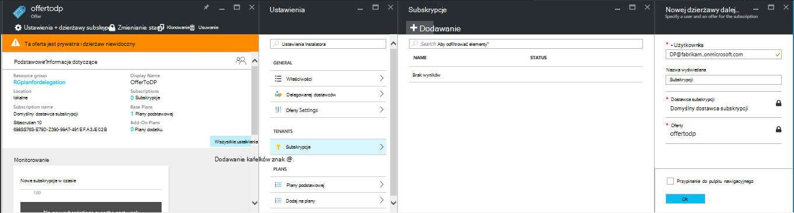
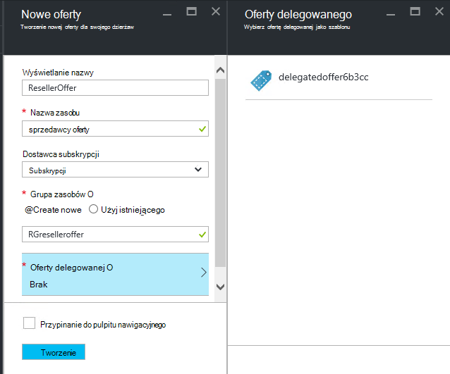

<properties
    pageTitle="Delegowanie oferty w stos Azure | Microsoft Azure"
    description="Dowiedz się, jak umieścić innych osób odpowiedzialnych za tworzenia ofert i subskrybowania użytkowników."
    services="azure-stack"
    documentationCenter=""
    authors="AlfredoPizzirani"
    manager="byronr"
    editor=""/>

<tags
    ms.service="azure-stack"
    ms.workload="na"
    ms.tgt_pltfrm="na"
    ms.devlang="na"
    ms.topic="article"
    ms.date="10/07/2016"
    ms.author="alfredop"/>

#Delegowanie oferty w stos Azure

Jako administrator usługi często chcesz umieścić innych osób odpowiedzialnych za tworzenia ofert i subskrybowania użytkowników. Na przykład to może się zdarzyć, gdy dostawca usług i chcesz odsprzedawców mogą rejestrować się klientów i zarządzać nimi w Twoim imieniu. Można go również wystąpić w przedsiębiorstwie, jeśli są częścią centralnej grupy IT i mają działy albo przedstawicielstwami kont użytkowników bez Twojego udziału.

Delegowanie pomaga tych zadań, ułatwiając osiągnięcia i zarządzanie użytkownikami więcej niż będzie można wykonać bezpośrednio. Na poniższej ilustracji przedstawiono jeden poziom delegowanie, ale stos Azure obsługuje wiele poziomów. Delegowanej dostawców z kolei może przekazać innych dostawców do pięciu poziomów.

Administratorzy mogą delegowanie tworzenia ofert i dzierżaw innym użytkownikom za pomocą funkcji udzielania pełnomocnictwa.

##Role i etapami delegowania

Aby zrozumieć delegowanie, należy pamiętać, że obejmuje trzy role związane:

-   **Administrator usługi** zarządza infrastruktury stos Azure, tworzy szablon oferty i deleguje innym umożliwiają użytkownikom.

-   Delegowanej użytkowników są nazywane **delegowane dostawców**. Czy należą do innych organizacji (na przykład innych dzierżaw usługi Azure Active Directory).

-   **Użytkownicy** Załóż ofert i używać ich do zarządzania ich obciążenie pracą, tworzenia maszyny wirtualne, przechowywanie danych itp.

Jak pokazano na poniższym rysunku, zawierają dwa kroki konfigurowania delegowania.

1.  Identyfikowanie delegowanej dostawców. W tym celu subskrybowania oferty na podstawie planu, zawierający tylko usługę subskrypcji.
    Użytkownicy, którzy subskrybowanie tej oferty uzyskiwanie niektóre funkcje administrator usługi, łącznie z możliwością rozszerzanie ofert i użytkowników dla nich.

2.  Delegowanie oferty delegowanej dostawcy. Ta oferta działa jako szablonu w celu co mogą oferować delegowanej dostawcy. Dostawca delegowanej może potrwać oferty, wybierz jego nazwę (ale nie zmieniać jego usług i przydziałów), a zaoferować klientom.

Ma pełnić rolę delegowanej dostawców, użytkownicy muszą ustanowienia relacji z głównego dostawcy; innymi słowy są potrzebne do utworzenia subskrypcji. W tym scenariuszu tej subskrypcji służy do identyfikowania delegowanej dostawców jako prawo do prezentowania ofert w imieniu głównego dostawcy.

Po utworzeniu tej relacji, administrator systemu delegować ofertę delegowanych dostawcy. Dostawca delegowanej może potrwać oferty, zmień jej nazwę (ale nie zmienia się substancji), a zaoferuje jej klientów.

W celu ustalenia delegowanej dostawcy, pełnomocników oferty i sprawdź, czy użytkownicy mogą zamów je wykonać instrukcje w poniższych sekcjach.

##Konfigurowanie ról

Aby wyświetlić dostawcę delegowanej w miejscu pracy, potrzebne kolejne konta usługi Azure Active Directory oprócz konta administratora usługi. Jeśli nie masz ich, należy utworzyć dwa konta. Konta mogą należeć do dowolnego dzierżawy AAD. Odnoszą się do ich jako dostawca delegowanej (DP) i użytkownika.

| **Rola** | **Uprawnienia organizacji** |
| -------------------- | ----------------------- |
|  Dostawca delegowanego | Użytkownika |
| Użytkownika | Użytkownika |

##Identyfikowanie delegowanych dostawców

1.  Zaloguj się jako administrator usługi.

2.  Tworzenie oferty, umożliwiające dzierżaw zostać delegowanej dostawców. W tym celu tworzenia planu i oferty oparte na nim:

    .  [Utwórz plan](azure-stack-create-plan.md).
        Ten plan obejmuje usługę subskrypcji. W tym artykule firma Microsoft korzysta z planu o nazwie PlanForDelegation.

    b.  [Tworzenie oferty](azure-stack-create-offer.md) 
     na podstawie tego planu. W tym artykule firma Microsoft korzysta z oferty o nazwie OfferToDP.

    c.  Po zakończeniu tworzenia oferty Dodawanie Identyfikatora delegowanej dostawcy jako dzierżawy dla tej oferty, klikając pozycję     **Subskrypcje** &gt; **Dodaj** &gt; **Nowej subskrypcji dzierżawy**.

  

> [AZURE.NOTE]Z wszystkie stos Azure oferty, jeśli masz z opcji tworzenia oferty użytkowników publicznych i pozwolić Załóż, ani zachować poufność i konieczności administrator usługi Zarządzanie zakładanie konta. Delegowanej dostawców są zwykle niewielkiej grupy i chcesz kontrolować, kto jest wpuszczenie Cię do niej, aby zachować poufność tej oferty będą miały znaczenie w większości przypadków.

##Administrator usługi tworzy delegowanej oferty

Teraz masz ustanowione dostawcy delegowanej. Następnym krokiem jest utworzenie planu i oferty, który ma być pełnomocnika i które Twoi klienci będą używać. Ta oferta należy zdefiniować zgodnie z oczekiwaniami klientów, aby zobaczyć, ponieważ delegowanej dostawcy nie będą mogli zmieniać plany i przydziałów, które zawiera.

1.  Jako administrator usługi [tworzenia planu](azure-stack-create-plan.md) i [oferty](azure-stack-create-offer.md) oparte na nim. W tym artykule firma Microsoft korzysta z oferty o nazwie DelegatedOffer.
> [AZURE.NOTE]Ta oferta nie trzeba publicznej. Mogą zostać wprowadzone publicznej możesz wybrać, ale, w większości przypadków chcesz tylko delegowanej dostawców, aby mieć do nich dostęp. Po możesz delegować ofertę prywatnych, zgodnie z opisem w poniższej procedurze, delegowanej dostawcy uzyskuje dostęp do niego.

2.  Delegowanie oferty. Przejdź do DelegatedOffer, a następnie w okienku ustawienia, kliknij przycisk **Delegowane dostawców** &gt; **Dodaj**.

3.  Wybierz dostawcę delegowanej subskrypcję z pola listy rozwijanej, a następnie kliknij pozycję **pełnomocnika**.

> 

##Dostawca delegowanych dostosowuje oferty

Zaloguj się jako dostawcę delegowanej i tworzenie nowej oferty przy użyciu delegowanych oferty jako szablon.

1.  Kliknij przycisk **Nowy** &gt; **dzierżawy oferuje + plany** &gt; **oferty**.

    

2.  Przypisz nazwę do oferty. W tym miejscu wybrać ResellerOffer. Wybierz pozycję delegowanych oferty oparte na, a następnie kliknij przycisk **Utwórz**.
    
    

    >[AZURE.NOTE] Uwaga różnica w porównaniu do oferowania tworzenia jako doświadczonych przez administratora usługi. Delegowanej dostawcy nie skonstruować oferowane przez podstawowy planów i planów dodatku; Anna można wybrać tylko z oferty, które przekazano do niej, a nie zostaną wprowadzone zmiany do nich.

3. Wyślij ofertę publicznej klikając przycisk **Przeglądaj** &gt; **oferuje**, wybierając oferty, a następnie kliknąć przycisk **Zmień stan**.

4. Delegowanej Dostawca udostępnia tych ofert portalu własnego adresu URL. Należy zauważyć, że te oferty są widoczne tylko za pośrednictwem tego delegowanej portalu. Aby znaleźć i zmienić ten adres URL:

    .  Kliknij przycisk **Przeglądaj,** &gt; **Ustawienia usługodawcy** &gt; **adres URL portalu**.

    b.  Jeśli to konieczne, należy zmienić identyfikator dostawcy.

    c.  Kopiowanie portalu adresu URL do innej lokalizacji, takim jak Notatnik.

    
<!-- -->
Ukończono tworzenie oferty delegowanej jako dostawca delegowanej. Wylogowanie się jako dostawca delegowanej. Zamknij kartę przeglądarki, który był używany.

##Załóż konto oferty

1.  W nowym oknie przeglądarki, przejdź do portalu delegowanych adres URL został zapisany w poprzednim kroku. Zaloguj się do portalu jako użytkownika. Uwaga: w tym kroku należy użyć portalu delegowanej. Oferty delegowanej nie będą widoczne w przeciwnym razie.

2.  Na pulpicie nawigacyjnym kliknij przycisk **Pobierz subskrypcji**. Pojawi się, że tylko utworzone przez dostawcę delegowanej delegowanej oferty są dostarczane użytkownikowi:

> 

Zakończenie procesu Delegowanie oferty. Użytkownik może teraz Załóż tej oferty przez uzyskiwania subskrypcji dla niego.

##Delegowanie wielu warstwy

Delegowanie wielu warstwy pozwala delegowanych dostawcy do pełnomocnika oferty z innymi obiektami. Dzięki temu, na przykład tworzenie szczegółowego kanałów odsprzedawców, w których dostawcy Zarządzanie stos Azure deleguje ofertę dystrybutor, która z kolei zobowiązuje sprzedawcy.
Stos Azure obsługuje maksymalnie pięciu poziomów delegowanie.

Aby utworzyć wiele poziomów Delegowanie oferty, delegowanej dostawcy z kolei zobowiązuje oferty następnego dostawcy. Ten proces jest taki sam dla dostawcy delegowanej taka sama jak dla administratora usługi (zobacz [Administrator usługi tworzy delegowanej oferty](#service-admin-creates-the-delegated-offer)).

##Następne kroki
[Inicjowanie obsługi maszyn wirtualnych](azure-stack-provision-vm.md)
