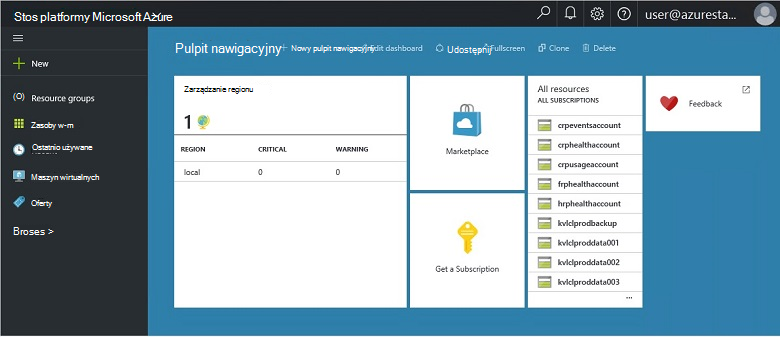

<properties
    pageTitle="Główne funkcje i pojęć w stos Azure | Microsoft Azure"
    description="Informacje na temat pojęcia w stos Azure i kluczowe funkcje."
    services="azure-stack"
    documentationCenter=""
    authors="Heathl17"
    manager="byronr"
    editor=""/>

<tags
    ms.service="azure-stack"
    ms.workload="na"
    ms.tgt_pltfrm="na"
    ms.devlang="na"
    ms.topic="article"
    ms.date="10/25/2016"
    ms.author="helaw"/>

# Najważniejsze funkcje i pojęć w stos Azure

Jeśli jesteś nowym użytkownikiem programu Microsoft Azure stos, tych terminów i opisy funkcji może być przydatne.

## Personas

Istnieją dwa odmian użytkowników dla programu Microsoft Azure stos, administrator usługi i dzierżawy (klienta).

-  **Administrator usługi** można konfigurować i zarządzać dostawców zasobów, ofert dzierżawy, planów, usług, przydziałów i cennik.
-  **Dzierżawy** uzyskuje lub zakup usług, które udostępnia administrator usługi. Dzierżaw można obsługi administracyjnej, monitorowanie i zarządzanie usługami, które przyjęły, takich jak aplikacje sieci Web, miejsca do magazynowania i maszyn wirtualnych.

## Portal

Podstawowe metody interakcję z Microsoft Azure stosem jest portal i programu PowerShell.

W portalu Microsoft Azure stos jest wystąpieniem portalu Azure działa na serwerach. Jest witryną sieci web, zawierający samodzielne środowisko dla administratorów usługi i dzierżaw kontrola dostępu oparta na rolach (RBAC) do zasobów i pojemność chmury, umożliwiające szybkie aplikacji i usług projektowania i wdrażania.

## Regiony, usług, planów, oferty i subskrypcji

W stosie Azure usług są dostarczane do dzierżaw przy użyciu regionów, subskrypcje, oferty i planów. Dzierżaw można subskrybować wielu ofert. Oferty mogą mieć co najmniej jeden plan i planów może mieć jedną lub kilka usług.

Przykładowa hierarchia dzierżawy subskrypcje ofert, każda z różnych planów i usług.

### Obszary
Azure regiony stosu są podstawowy element skalę i zarządzania.  Organizacja może mieć wiele regionów z zasobów dostępnych w poszczególnych regionach.  Regiony mogą mieć także dostępne oferty różnych usług.

### Usług

Microsoft Azure stos umożliwia dostawców do przeprowadzania szeroką gamę usług i aplikacji, takich jak maszyn wirtualnych, SQL Server baz danych, programu SharePoint, Exchange i inne.

### Plany

Plany są grupami co najmniej jednej usługi. Jako dostawca możesz utworzyć plany do oferowania z dzierżawami usługi. Z kolei z dzierżawami subskrybować oferty korzystać z planów i usług, które zawierają.

Każdej usługi dodane do planu można skonfigurować przy użyciu ustawień przydziału, aby ułatwić zarządzanie możliwości chmury. Zasoby mogą zawierać ograniczeń, takich jak ograniczenia maszyn wirtualnych, pamięci RAM i Procesora i są stosowane na subskrypcję użytkownika. Przydziałów mogą być rozróżniane według lokalizacji. Na przykład plan zawierające do uruchamiania usługi z regionu A może mieć normę dwóch maszyn wirtualnych, 4GB pamięci RAM i 10 rdzenie Procesora.

Podczas tworzenia oferty, administrator usługi może zawierać **podstawowej planów**. Tych planów podstawowej są domyślnie, gdy dzierżawy subskrybuje tej oferty. Po zainicjowaniu subskrybowane przez użytkownika (i utworzeniu subskrypcji), użytkownik ma dostęp do wszystkich dostawców zasobów określonych w tych podstawowych planów (z odpowiednich przydziałów).

Administrator usługi również mogą zawierać **planów dodatków** w ofercie. Plany dodatku nie są uwzględniane domyślnie w subskrypcji. Dodatek plany są dodatkowe plany (przydziałów) dostępne w ofertę właścicielem subskrypcji można dodać do ich subskrypcji.

### Oferty

Oferty są grup jeden lub więcej planów, w których dostawców prezentowanie dzierżaw kupić (subskrybowanie). Na przykład oferują alfa może zawierać Plan A (od 1 Region zawierający zbiór usług obliczeń) i planowanie B (od 2 Region zawierającym zestaw usług i sieci magazynowania).

Oferty zawiera zestaw podstawowej plany, z usługi Administratorzy mogą tworzyć plany dodatków, które dzierżaw można dodawać do nich.

### Subskrypcje

Subskrypcja jest, jak dzierżaw kupić oferty. Subskrypcji to kombinacja dzierżawy z oferty. Dzierżawy mogą zawierać subskrypcje wielu ofert. Każdej subskrypcji dotyczy tylko jeden oferty. Subskrypcje dzierżawy określają planach i usługach, których można uzyskać dostęp do.

Subskrypcje pomoc dostawców organizowanie dostępu i korzystanie z chmury zasobów i usług.

## Azure Menedżera zasobów

Za pomocą Menedżera zasobów Azure możesz pracować z zasobami infrastruktury w modelu, oparty na szablonie, declaritive.   Umożliwia pojedynczy interfejs, który umożliwia wdrażanie, zarządzanie i monitorowanie składniki rozwiązanie, takich jak maszyn wirtualnych, kont miejsca do magazynowania, aplikacje sieci web i baz danych. Aby uzyskać pełne informacje i wskazówki zobacz [Omówienie Menedżera zasobów Azure](../azure-resource-manager/resource-group-overview.md).

### Grupy zasobów

Grupy zasobów to kolekcje zasobów, usług i aplikacji — każdego zasobu zawiera typ, na przykład maszyn wirtualnych, wirtualnych sieci publiczne adresy IP, kont miejsca do magazynowania i witrynami sieci Web. Każdy zasób musi należeć do grupy zasobów i tak grup zasobów pomocy logicznie organizowanie zasobów, takich jak obciążenie pracą lub lokalizacji.

Oto kilka ważnych uwag brać pod uwagę podczas definiowania grupa zasobów:

-   Każdy zasób może istnieć tylko w jednej grupy zasobów.

-   Wdrażania, aktualizowanie i usuwanie elementów w grupie zasobów ze sobą. Jeden zasób, takie jak serwer bazy danych, musi istnieć w cyklu rozmieszczania, należy go w innej grupie zasobów.

-   Można dodawać i usuwać zasobu do grupy zasobów w dowolnym momencie.

-   Zasób można przenieść z jednej grupy zasobów do innej grupy.

-   Grupa zasobów może zawierać zasoby, które znajdują się w różnych regionów.

-   Grupa zasobów może służyć do ograniczania zakresu kontroli dostępu do działań administracyjnych.

-   Zasób może być połączony do zasobu w innej grupie zasobów, gdy dwa zasoby należy korzystać ze sobą, ale nie udostępniaj samego cyklu życia. Na przykład wielu aplikacji należy połączyć z bazą danych, ale tej bazy danych nie musi zostać zaktualizowane lub usunięte w tym samym tempie jako aplikacje.

-   Zasoby takie jak plany i ofert w Microsoft Azure stosu, również odbywa się w grupach zasobów.

-   Można ponownie wdróż grupy zasobów.  Jest to przydatne do celów badania i rozwój.  

### Azure szablony Menedżera zasobów

Przy użyciu Menedżera zasobów Azure można utworzyć szablon prosty (w formacie JSON), który definiuje wdrażania i konfigurowania aplikacji. Ten szablon nosi nazwę szablonu Menedżera zasobów Azure i umożliwia deklaracyjnych Definiowanie wdrożenia. Za pomocą szablonu, można wielokrotnie wdrażania aplikacji w całym cyklu życia aplikacji i mieć pewność, które zasoby są rozmieszczane spójna.

## Zasób dostawców (RPs) — RP sieci, obliczyć RP RP miejsca do magazynowania

Dostawcy zasobu to usług sieci web, które tworzą podstawę dla wszystkich IaaS oparte na platformie Azure i usług PaaS. Azure Menedżera zasobów zależy od różnych RPs umożliwia dostęp do usług hosta.

Istnieją trzy główne RPs: sieć, przechowywania i obliczeń. Każdy z tych RPs pomaga skonfigurować i sterować jego odpowiednich zasobów. Administratorzy usługi można również dodać nowych dostawców niestandardowych zasobów.

### Obliczanie RP

Dostawca obliczyć zasobów (CRP) umożliwia dzierżaw stos Azure utworzyć własne maszyn wirtualnych. Umożliwia także funkcje z administratorem usługi skonfigurować i skonfigurować dostawcę zasobu dzierżaw. CRP umożliwia tworzenie maszyn wirtualnych, a także rozszerzenia maszyn wirtualnych. Usługa rozszerzenia maszyn wirtualnych zapewnia możliwości IaaS dla maszyn wirtualnych systemu Windows i Linux.

### Sieć RP

Dostawca zasobów sieci (NRP) udostępnia szereg funkcji oprogramowania zdefiniowane Networking (SDN) i sieci funkcja wirtualizacji (NFV) dla prywatnych chmury. Te funkcje są zgodne z Azure chmury publicznej, dzięki czemu szablony aplikacji może być zapisywane raz i wdrożony zarówno w Azure chmury publicznej lub lokalnego Microsoft Azure stosem. RP sieci zapewnia większą kontrolę sieci, znaczniki metadanych szybsze konfiguracji, szybkiego i powtarzalnych dostosowywanie i wiele interfejsów kontrolki (w tym programu PowerShell, .NET SDK, Node.JS SDK interfejsu API opartego na pozostałych). NRP umożliwia tworzenie grup zabezpieczeń urządzenia do równoważenia, publiczne adresy IP, sieci oprogramowania obciążenia, wirtualnych sieci, między innymi.

### Magazyn RP

RP miejsca do magazynowania zapewnia cztery usługi Azure spójne miejsca do magazynowania: obiektów blob, tabeli kolejki i zarządzanie kontami. Oferuje usługi administracji w chmurze miejsca do magazynowania w celu ułatwienia zarządzania dostawcy usługi usług Azure spójne magazynu. Magazyn Azure oferuje możliwość przechowywania i pobierania dużych ilości danych niestrukturalne, takie jak dokumenty i pliki multimedialne z obiektami blob Azure, i strukturalnych NoSQL podstawie danych za pomocą tabel Azure. Aby uzyskać więcej informacji na magazyn Azure zobacz [Wprowadzenie do magazyn Microsoft Azure](../storage/storage-introduction.md).

#### Magazyn obiektów blob

Magazyn obiektów blob przechowuje dowolny zestaw danych. Obiektów blob może być dowolnego typu tekst lub dane binarne, takich jak dokument, plik lub Instalator aplikacji. Magazyn tabel przechowuje zestawy danych strukturalnych. Magazyn tabel jest przechowywanie danych atrybutu klucza NoSQL, co umożliwia szybki rozwój i szybki dostęp do dużych ilości danych. Magazyn kolejek znajdują się wiarygodnych wiadomości, przetwarzanie przepływu pracy i komunikacji między składnikami usług w chmurze.

Co obiektów blob są zorganizowane w kontenerze. Kontenery umożliwiają także przydatne, aby przypisać zasady zabezpieczeń do grupy obiektów. Konto miejsca do magazynowania może zawierać dowolną liczbę kontenerów i kontenera może zawierać dowolną liczbę obiektów blob maksymalnie 500 TB limitem konta miejsca do magazynowania. Blob miejsca do magazynowania oferuje trzy typy obiektów blob, blokowanie obiektów blob, dołączyć obiektów blob i blob strony (dyski). Blokowanie obiektów blob są zoptymalizowane dla strumieniowego przesyłania i przechowywania obiektów w chmurze, a są dobrym rozwiązaniem do przechowywania dokumentów, pliki multimedialne, kopie zapasowe itp. Dołączanie obiektów blob są podobne do obiektów blob blok, ale są zoptymalizowane pod kątem dołączyć operacje. Dołączanie obiektów blob można aktualizować tylko przez dodanie nowego bloku na końcu. Dołączanie obiektów blob są dobrym rozwiązaniem dla scenariuszy, takich jak rejestrowanie, miejsce, w którym trzeba napisać tylko do końca to nowe dane. Blob strony są zoptymalizowane pod kątem reprezentujące dyski IaaS i pomocniczych losowe zapisuje i mogą być w rozmiarze do 1 TB. Sieć Azure maszyn wirtualnych dołączonych IaaS dysk jest przechowywana jako blob strony wirtualnego dysku twardego.

#### Magazyn tabel

Magazyn tabel jest sklepu atrybutu klucza NoSQL firmy Microsoft — jest on wyposażony w projekcie bez schematy, dzięki czemu inne niż tradycyjny relacyjnych baz danych. Ponieważ dane są przechowywane schematy Brak, jest łatwe do dostosowania danych jako na potrzeby usługi evolve aplikacji. Magazyn tabel jest łatwe w użyciu, więc deweloperów można szybko tworzyć aplikacje. Magazyn tabel jest magazynem atrybutu klucza, co oznacza przechowywanie każdej wartości w tabeli o nazwie wpisany właściwości. Nazwa właściwości może służyć do filtrowania i określanie kryteriów wyboru. Kolekcja właściwości i ich wartości obejmują jednostki. Od schematów Brak miejsca do magazynowania tabel dwa podmioty w tej samej tabeli może zawierać różne kolekcje właściwości, a te właściwości mogą być różnych typów. Magazyn tabel służy do przechowywania elastyczne zestawy danych, takich jak dane użytkownika dla aplikacji sieci web, książki adresowe, informacje o urządzeniach i inny rodzaj metadanych, która wymaga usługi. Mogą zawierać dowolną liczbę obiektów w tabeli, a konto miejsca do magazynowania może zawierać dowolną liczbę tabel, aż do limitem konta miejsca do magazynowania.

#### Magazyn kolejek
Azure magazyn kolejki oferuje chmury wiadomości między składnikami aplikacji. W projektowaniu aplikacji skali, składniki aplikacji często są odłączona, tak aby można skalować niezależnie. Magazyn kolejek udostępnia asynchroniczne wiadomości dla komunikacji między składnikami aplikacji, czy korzystają w chmurze, na komputerze, na serwerze lokalnym lub na urządzeniu przenośnym. Magazyn kolejek umożliwia zarządzanie zadaniami asynchroniczne i tworzenie przepływów pracy procesu.

## Kontrola dostępu (RBAC) oparta na rolach

RBAC umożliwia udzielanie dostępu do systemu autoryzowani użytkownicy, grupy i usług przez przypisywanie ich role poziomie subskrypcji, grupa zasobów lub poszczególnych zasobów. Każda rola określa poziom dostępu, który ma użytkownika, grupy lub usługi Microsoft Azure stos zasobów.

Azure RBAC dostępne są trzy podstawowe role, które dotyczą wszystkich typów zasobów: właściciela, współautorów i czytnika. Właściciel ma pełny dostęp do wszystkich zasobów, w tym w prawo, aby pełnomocnictwa do innych osób. Współautor można tworzyć i zarządzać wszystkich typów zasobów Azure, ale nie może udzielić dostępu do innych osób. Czytnik mogą tylko wyświetlać istniejących Azure zasobów. Pozostałych ról RBAC Azure zezwolić na zarządzanie określonych Azure zasobów. Na przykład Rola współautora maszyn wirtualnych umożliwia tworzenie i zarządzanie maszyn wirtualnych, ale nie zezwala na zarządzanie wirtualnej sieci lub podsieci, która łączy maszyny wirtualnej.

## Dane dotyczące użycia

Microsoft Azure stos zbiera i agreguje danych dotyczących użycia przez wszystkich dostawców zasobów o podanie zwięzły raport dla poszczególnych użytkowników. Może być tak proste, jak liczba zasobów zużyty lub tak złożone, jak poszczególne liczniki wydajności i skalę. Dane są dostępne za pośrednictwem interfejsu API usługi REST. Istnieje spójne Azure dzierżawy i interfejsu API, a także dostawcą delegowanych interfejsy API dostawcy uzyskiwania danych dotyczących użycia przez wszystkie subskrypcje dzierżawy. Te dane można zintegrować z narzędzia zewnętrznych lub usługą rozliczeń lub obciążenia zwrotnego.

## Następne kroki

[Wdrażanie Azure stos Technical Preview 2 (aby Zapewnić)](azure-stack-deploy.md)
