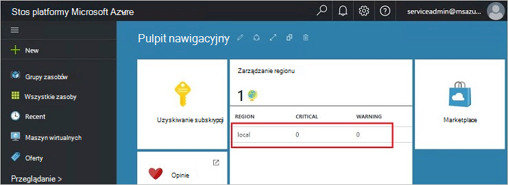
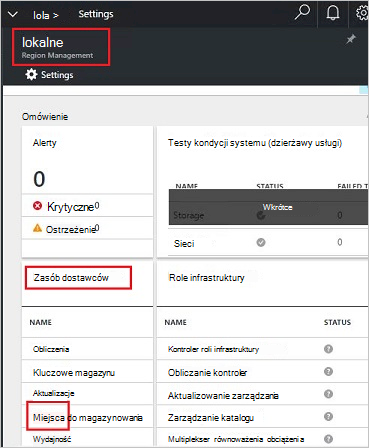
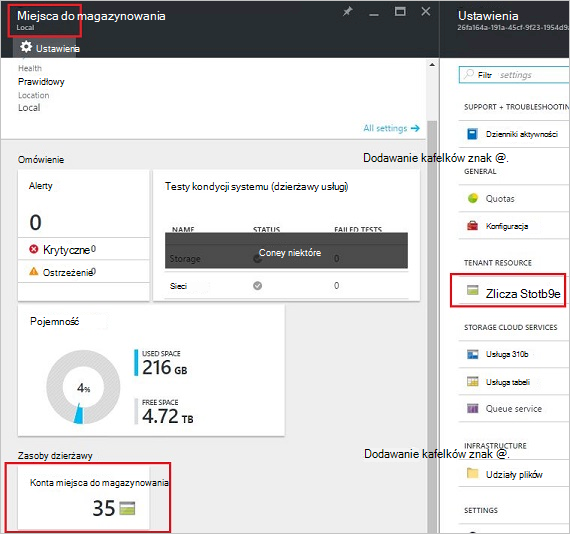
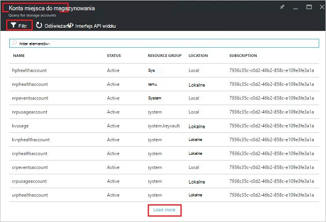
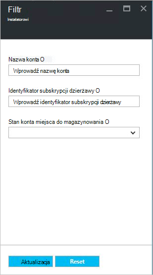
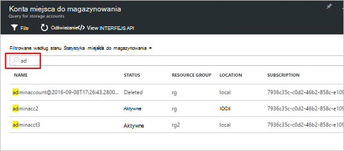
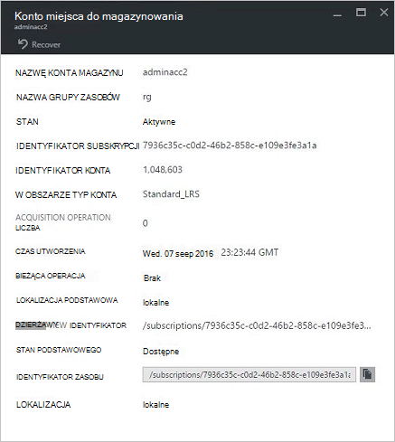
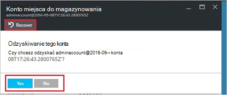
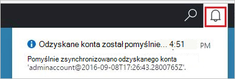
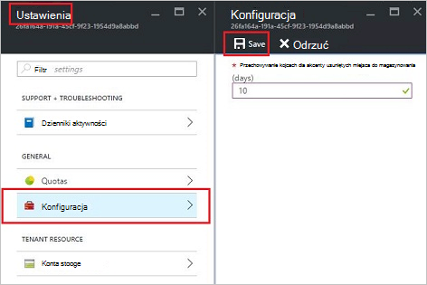

<properties
    pageTitle="Zarządzanie kontami miejsca do magazynowania stos Azure | Microsoft Azure"
    description="Dowiedz się, jak znaleźć, zarządzanie, odzyskiwanie i odzyskania konta miejsca do magazynowania stos Azure"
    services="azure-stack"
    documentationCenter=""
    authors="AniAnirudh"
    manager="darmour"
    editor=""/>

<tags
    ms.service="azure-stack"
    ms.workload="na"
    ms.tgt_pltfrm="na"
    ms.devlang="na"
    ms.topic="get-started-article"
    ms.date="09/26/2016"
    ms.author="anirudha"/>

# <a name="manage-storage-accounts-in-azure-stack"></a>Zarządzanie kontami miejsca do magazynowania w stos Azure

Dowiedz się, jak zarządzać kontami miejsca do magazynowania w stos Azure można znajdować, odzyskiwanie i odzyskać pojemności, w zależności od potrzeb biznesowych.

## <a name="find-a-storage-account"></a>Znajdowanie konta miejsca do magazynowania

Listy kont miejsca do magazynowania w regionie można wyświetlać w stos Azure przez:

1.  W przeglądarce internetowej przejdź do [https://portal.azurestack.local](https://portal.azurestack.local/).

2.  Zaloguj się do portalu stos Azure jako administrator (przy użyciu poświadczeń otrzymane podczas wdrażania)

3.  Na pulpicie nawigacyjnym domyślne — Znajdź listy **zarządzania region** i kliknij przycisk regionu chcesz Przegląd — na przykład **(lokalny**).

    

4.  Wybierz **miejsca do magazynowania** z listy **Dostawców zasobów** .

    

5.  Teraz na miejsca do magazynowania karta Admin dostawcy zasobów — przewiń w dół do karty "Magazynowania konta" i kliknij na nim.

    
    
    Wynikowa strona jest listy kont miejsca do magazynowania w danym regionie.

    

Domyślnie są wyświetlane 10 pierwszych konta. Można pobrać więcej, klikając łącze "ładowanie więcej" u dołu listy <br>
LUB <br>
Jeśli interesuje Cię na koncie określonego miejsca do magazynowania — można **filtrować i uzyskiwanie zdalnego dostępu do odpowiednich kont** tylko.<br>

Aby zastosować filtr dla kont:

1. Kliknij przycisk Filtr w górnej części karta.

2. Na karta filtr umożliwia określ **nazwę konta**,  **identyfikator subskrypcji** lub **stanu** Dostosowywanie listy kont miejsca do magazynowania mają być wyświetlane. Należy używać ich, zależnie od potrzeb.

3. Kliknij przycisk Aktualizuj. W związku z tym odświeżenia listy.

    

4. Aby zresetować filtr — kliknij przycisk Filtr, czyszczenie zaznaczenia i zaktualizować.

Polu tekstowym wyszukiwania w górnej części karta listy kont miejsca do magazynowania, umożliwia wyróżnianie zaznaczonego tekstu na liście kont. Jest to naprawdę przydatne w przypadku, gdy nie jest łatwo dostępne imię i nazwisko lub identyfikator.<br>
W tym miejscu niezależnej służy do znajdowania konta, który Cię interesuje.




## <a name="look-at-account-details"></a>Przyjrzyj się szczegółowe informacje o koncie

Gdy masz umieszczone kont, które jest wyświetlane, możesz kliknąć szczególną uwagę do wyświetlania określonych szczegółów. Karta nowego zostanie otwarty z szczegóły konta, takie jak typ konta, godzinę utworzenia, lokalizacji itp.




## <a name="recover-a-deleted-account"></a>Odzyskiwanie usuniętego konta

Może być w sytuacji, w której chcesz odzyskać usuniętego konta.<br>
W AzureStack jest bardzo prosty sposób, aby to zrobić.

1.  Przejdź, przejdź do listy kont miejsca do magazynowania. [Zobacz Znajdowanie konta miejsca do magazynowania](#find-a-storage-account)

2.  Na liście Znajdź pozycję tego określonego konta. Może być konieczne filtrowanie.

3.  Sprawdź "Państwo" konta. Powinna być widoczna informacja, "usunięte".

4.  Kliknij konto, z którego zostanie wyświetlona karta Szczegóły konta.

5.  U góry tej karta — Znajdź przycisk "Odzyskiwanie" i kliknij go.

6.  Upewnij się, naciskając klawisz "tak"

    

7.  Odzyskiwania jest teraz w procesie... Czekaj na wskazania, że jej zakończyło się pomyślnie.
    Możesz również kliknąć ikonę "mila" w górnej części portalu, aby wyświetlić informacje o postępie oznaczeń.

    

  Po odzyskanego konta pomyślnie jest synchronizowane, jedną wrócić do korzystania z niego.

### <a name="some-gotchas"></a>Niektóre niespodzianki

- Usunięte konta pokazuje stan jako "poza przechowywania".

  Oznacza to, że usunięte konto przekroczyło okres przechowywania i może być niemożliwe już.

- Usunięte konta nie są widoczne na liście kont.

  Może to oznaczać, że usuniętego konta został już czyszczenie pamięci. W takim przypadku nie można odzyskać już. Zobacz sekcję "możliwości odzyskania" poniżej.

## <a name="set-retention-period"></a>Ustawianie okres przechowywania

Ustawienie okresu zachowywania umożliwia administrator, aby określić przedział czasu w dniach (od 0 do 9999 dni), w których potencjalnie można odzyskać usunięte żadnego z kont. Okres przechowywania domyślny jest ustawiony na 15 dni. Ustawianie wartości na "0" oznacza, że wszelkie usuniętego konta będą od razu poza przechowywania i oznaczone do okresowych śmieci.

Aby zmienić okres przechowywania —

1.  W przeglądarce internetowej przejdź do [https://portal.azurestack.local](https://portal.azurestack.local/).

2.  Zaloguj się do portalu stos Azure jako administrator (przy użyciu poświadczeń otrzymane podczas wdrażania)

3.  Na pulpicie nawigacyjnym domyślny — Znajdź listy **zarządzania region** i kliknij przycisk regionu chcesz eksplorować — na przykład **(lokalny**).

4.  Wybierz **miejsca do magazynowania** z listy **Dostawców zasobów** .

5.  Kliknij ikonę ustawienia u góry, aby otworzyć karta Ustawienia.

6.  Wybierz polecenie Konfiguracja — okres przechowywania.

7.  Można edytować wartości i zapisz go.

 Ta wartość będzie natychmiast obowiązywać i odzwierciedlenia w danym regionie całego.



## <a name="reclaim-capacity"></a>Możliwości odzyskania

Jest jednym z efektów strony o okres przechowywania, że usuniętego konta będzie w dalszym ciągu wykorzystać możliwości do momentu zakończenia poza okres przechowywania. Teraz jako administrator, który może być konieczne sposobem odzyskania to usunięte miejsca konta mimo że nie upłynął jeszcze okres przechowywania. Obecnie mogą używać wiersz_polecenia jawnie zastępowanie okres przechowywania i od razu odzyskania wydajność. Aby to zrobić —

1.  Wykonując Azure programu PowerShell zainstalowaniu i skonfigurowaniu. W przeciwnym razie wykonaj instrukcje tutaj: Aby zainstalować najnowszą wersję programu PowerShell Azure i skojarzyć subskrypcji Azure, zobacz, [jak zainstalować i skonfigurować Azure programu PowerShell](http://azure.microsoft.com/documentation/articles/powershell-install-configure/).
    Aby uzyskać więcej informacji na temat polecenia cmdlet Menedżera zasobów Azure zobacz [Za pomocą programu Azure przy użyciu Menedżera zasobów Azure](http://go.microsoft.com/fwlink/?LinkId=394767)

2.  Uruchom to polecenie cmdlet:

    ```
    PS C:\\>; Clear-ACSStorageAccount -ResourceGroupName system
    -FarmName <your farmname>
    ```

> Aby uzyskać więcej informacji należy zapoznać się z [dokumentacją programu powershell AzureStack](https://msdn.microsoft.com/library/mt637964.aspx)

> [AZURE.NOTE] Uruchamianie tego polecenia cmdlet spowoduje trwałe usunięcie konta i jego zawartość. Nie będzie możliwe do odzyskania. Korzystanie z rozwagą.

