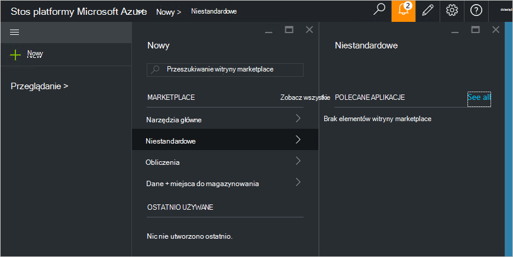

<properties
    pageTitle="Publikowanie elementu marketplace niestandardowe w stos Azure (administrator usługi) | Microsoft Azure"
    description="Jako administrator usługi Dowiedz się, jak opublikować element niestandardowej marketplace w stos Azure."
    services="azure-stack"
    documentationCenter=""
    authors="rupisure"
    manager="byronr"
    editor=""/>

<tags
    ms.service="azure-stack"
    ms.workload="na"
    ms.tgt_pltfrm="na"
    ms.devlang="na"
    ms.topic="article"
    ms.date="09/26/2016"
    ms.author="rupisure"/>

# Stos Azure Marketplace

Rynku to zbiór elementów dostosowane do stosu Azure, takich jak usługi, aplikacji i zasobów. Jest to miejsce, skąd pochodzą dzierżaw do tworzenia nowych zasobów i wdrażania nowej aplikacji. Administratorzy usługi można dodać własne elementy do witryny Marketplace i dzierżaw będą widoczne od razu.

Aby otworzyć na rynku, kliknij przycisk **Nowy**.

Rynku jest aktualizowana co pięć minut.

## Elementy witryny Marketplace

Każdy element Marketplace zawiera:

-   Szablon Azure Menedżera zasobów dla zasobu inicjowania obsługi administracyjnej.

-   Metadane, takie jak ciągi, ikony i inne materiały marketingowe

-   Informacje dotyczące formatowania, aby wyświetlić element w portalu

Każdy element opublikowany w witrynie Marketplace korzysta z formatu o nazwie pakietu galerii Azure (azpkg). Wdrożenie lub środowisko uruchomieniowe zasobów (na przykład kod pocztowy plików za pomocą oprogramowania lub obrazy maszyn wirtualnych) powinny dodane do stosu Azure oddzielnie, nie jako część elementu Marketplace. 

## Następne kroki

[Tworzenie i publikowanie elementu marketplace](azure-stack-create-and-publish-marketplace-item.md)
