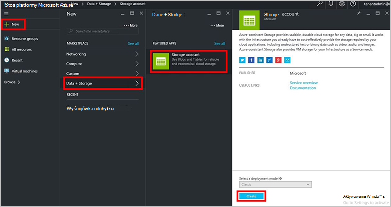
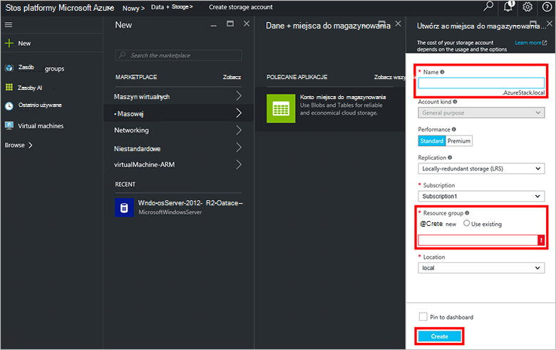
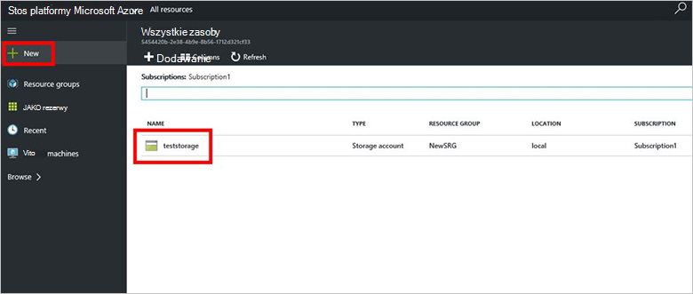

<properties
    pageTitle="Konta miejsca do magazynowania w stos Azure | Microsoft Azure"
    description="Dowiedz się, jak utworzyć konto Azure stos miejsca do magazynowania."
    services="azure-stack"
    documentationCenter=""
    authors="ErikjeMS"
    manager="byronr"
    editor=""/>

<tags
    ms.service="azure-stack"
    ms.workload="na"
    ms.tgt_pltfrm="na"
    ms.devlang="na"
    ms.topic="get-started-article"
    ms.date="09/26/2016"
    ms.author="erikje"/>

# Konta miejsca do magazynowania w stos Azure

Magazyn kont to usługi Blob i tabeli i w obszarze unikatowych nazw obiektów miejsca do magazynowania danych. Domyślnie jest dostępny tylko dla Ciebie, właściciel konta miejsca do magazynowania danych na Twoim koncie.

1.  Na komputerze, aby Zapewnić stosem Azure, zaloguj się do `https://portal.azurestack.local` jako [Administrator](azure-stack-connect-azure-stack.md#log-in-as-a-service-administrator), a następnie kliknij przycisk **Nowy** > **danych + miejsca do magazynowania** > **konta miejsca do magazynowania**.

    

2.  W karta **Tworzenie miejsca do magazynowania konta** wpisz nazwę konta magazynu. Tworzenie nowej **Grupy zasobów**, lub wybierz istniejący, a następnie kliknij przycisk **Utwórz** , aby utworzyć konto miejsca do magazynowania.

    

3. Aby wyświetlić nowe konto miejsca do magazynowania, kliknij opcję **wszystkie zasoby**, a następnie wyszukiwania konta miejsca do magazynowania i kliknij jej nazwę.

    
    
## Następne kroki

[Korzystanie z szablonów Azure Menedżera zasobów](azure-stack-arm-templates.md)

[Więcej informacji na temat konta magazynu platformy Azure](../storage/storage-create-storage-account.md)

[Pobierz Przewodnik sprawdzania poprawności miejsca do magazynowania spójne Azure stos Azure](http://aka.ms/azurestacktp1doc)
