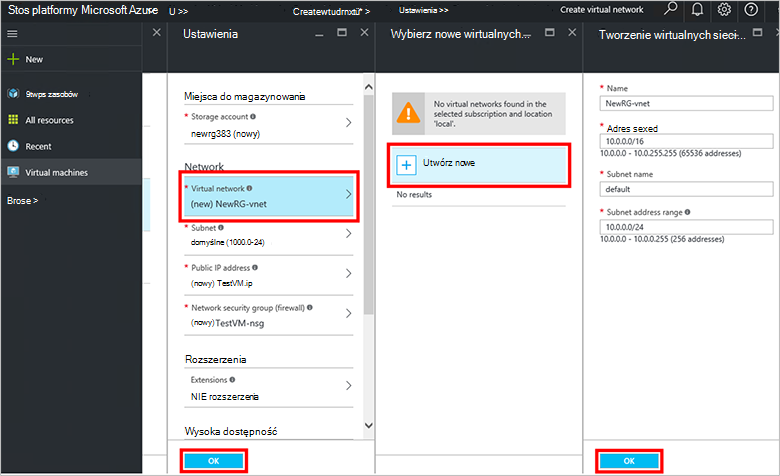
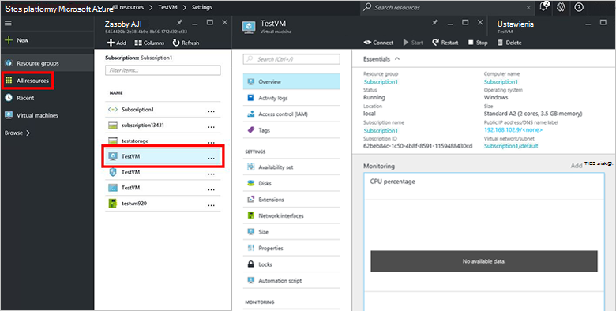

<properties
    pageTitle="Inicjowanie obsługi maszyn wirtualnych w stos Azure (dzierżawy) | Microsoft Azure"
    description="Jako dzierżawy Dowiedz się, jak inicjować obsługę maszyn wirtualnych w stos Azure."
    services="azure-stack"
    documentationCenter=""
    authors="ErikjeMS"
    manager="byronr"
    editor=""/>

<tags
    ms.service="azure-stack"
    ms.workload="na"
    ms.tgt_pltfrm="na"
    ms.devlang="na"
    ms.topic="get-started-article"
    ms.date="10/12/2016"
    ms.author="erikje"/>

# Obsługa administracyjna maszyny wirtualnej

Jako administrator możesz utworzyć maszyn wirtualnych do oceny przed oferowanie ich w planach zasobów.

## Obsługa administracyjna maszyny wirtualnej

1.  Na komputerze, aby Zapewnić stos Azure, zaloguj się do `https://portal.azurestack.local` jako [Administrator](azure-stack-connect-azure-stack.md#log-in-as-a-service-administrator), a następnie kliknij przycisk **Nowy** > **maszyn wirtualnych** > **WindowsServer-2012-R2 — centrum danych**.  

    

2.  W karta **— informacje podstawowe** wpisz **nazwę**, **nazwę użytkownika**i **hasło**. W obszarze **Typ dysku maszyn wirtualnych**wybierz **dysk twardy**. Wybierz **subskrypcję**. Tworzenie **grupy zasobów**, lub wybierz istniejący, a następnie kliknij przycisk **OK**.  

3.  W karta **Wybierz rozmiar** kliknij **Podstawowe A1**, a następnie kliknij przycisk **Wybierz**.  

4.  W karta **Ustawienia** kliknij **wirtualnej sieci**. W karta **Wybierz wirtualną sieć** kliknij przycisk **Utwórz nowy**. W karta **Utwórz sieć wirtualną** Zaakceptuj wszystkie wartości domyślne i kliknij **przycisk OK**. W karta **Ustawienia** kliknij **przycisk OK**.

    

5.  W karta **Podsumowanie** kliknij **przycisk OK** , aby utworzyć maszyny wirtualnej.  

6. Aby wyświetlić nowy komputer wirtualnych, kliknij opcję **wszystkie zasoby**, a następnie wyszukaj maszyny wirtualnej i kliknij jej nazwę.

    

## Następne kroki

[Konta miejsca do magazynowania](azure-stack-provision-storage-account.md)
