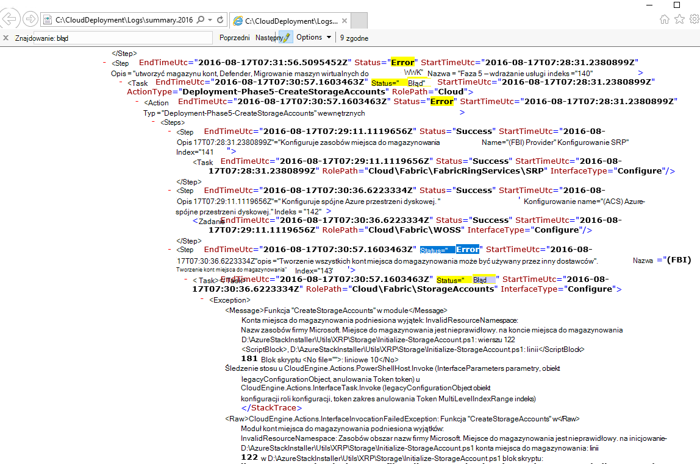
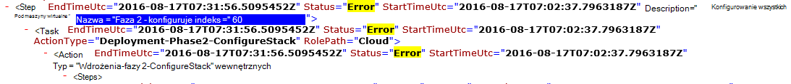

<properties
    pageTitle="Uruchom ponownie wdrażania z kroku nie powiodło się | Microsoft Azure"
    description="Jeśli wystąpi błąd podczas wdrażania, możesz spróbować następujące kroki, aby ponownie uruchomić rozmieszczania, z którym nie powiodło się."
    services="azure-stack"
    documentationCenter=""
    authors="ErikjeMS"
    manager="byronr"
    editor=""/>

<tags
    ms.service="azure-stack"
    ms.workload="na"
    ms.tgt_pltfrm="na"
    ms.devlang="na"
    ms.topic="get-started-article"
    ms.date="09/26/2016"
    ms.author="erikje"/>
    
# Uruchom ponownie wdrażania z kroku nie powiodło się
  
Jeśli wystąpi błąd podczas wdrażania, możesz spróbować następujące kroki, aby ponownie uruchomić rozmieszczania, z którym nie powiodło się.

## Znajdowanie błędu

Sporządzanie notatek awarii, specjalnie fragmentu połączeń na które kroku wywołanie nie powiodło się. Na przykład

**2016-08-17 00:30:57 błąd 1 > 1 > Akcja: wywołanie kroku 60.140.143 nie powiodło się. Zatrzymywanie wywołania plan działań.**

To jest kroku wdrażania, gdzie rozpocznie Uruchom ponownie wdrażania.

## Znajdź więcej szczegółów o niepowodzeniu

Jeśli potrzebujesz dodatkowych informacji o błędzie, aby uzyskać skojarzonego Podsumowanie **. YYYY-MM-DD.tt.N.log.xml** w **C:\CloudDeployment\Logs\* * folder.
Wyszukaj ciąg "Błąd", a po nim w dół za pomocą do momentu wyświetlenia dużej ilości tekstu XML inny niż sformatowane zawierające komunikat o błędzie (w tej sekcji często odpowiada ostatniego wystąpienia ciągu "Błąd"). Na przykład:

Za pomocą tych informacji do śledzenia kroku uruchom ponownie, monitującą "Indeks" liczb z tym ostatni błąd. Na powyższym obrazie widać (począwszy od dołu): 143, 140, a następnie gdy przewijanie w górę, zobacz 60:

Wprowadzenie wszystkich razem (teraz od góry do dołu), możesz uzyskać 60.140.143, tak jak w wyniku konsoli PS awarii (jak w sekcji "Znajdowanie błąd" powyżej).

## Uruchom ponownie wdrożenia na określonym etapie

Teraz, gdy masz krok, który wdrażanie nie powiodło się na, możesz spróbować Uruchom rozmieszczania z tego kroku.

> [AZURE.IMPORTANT] Następujące polecenia musi być uruchamiane przez poprawne użytkownika w kontekście błąd, który wystąpił. Jeśli wystąpił błąd przed HOST był dołączony do domeny, uruchom następujące kroki jako lokalnego konta administratora. Jeśli wystąpił błąd po HOST był dołączony do domeny, uruchom następujące kroki jako administrator domeny (azurestack\azurestackadmin).

### Wydaj polecenie Wywołaj EceAction

1. Korzystając z konsoli PS z podwyższonym poziomem uprawnień Importowanie następujących modułów:

        Import-Module C:\CloudDeployment\CloudDeployment.psd1 -Force
        Import-Module C:\CloudDeployment\ECEngine\EnterpriseCloudEngine.psd1 -Force 

2. Następnie wykonaj następujące polecenie (przykład miejsc położonych powyżej używanych tutaj):

        Invoke-EceAction -RolePath Cloud -ActionType Deployment -Start 60.140.143 -Verbose

3.  To rozpocznie wdrażania z kroku określoną przez parametr - Start, polecenia Wywołaj EceAction

### Wyniki Uruchom ponownie /-rozpoczęcia

Bez względu na opcję wybierzesz wdrażanie rozpocznie się ponownie z określonego - rozpoczęcie parametru.

1.  W przypadku odzyskania niepowodzenie wdrożenia będzie aż do jego zakończenia.

2.  Jeśli wdrażanie ponownie nie powiedzie się.
    
    - tym samym miejscu: błąd jest prawdopodobnie odzyskania i dalszego dochodzenia jest wymagane.

    - nowe miejsce, po której nie można teraz: można podjąć próbę te same czynności, aby ponownie przejść.

    - nowe miejsce przed miejsce, w którym nie można teraz: jeszcze wystąpił problem z połączenia idempotent wymaga dalszych dochodzenia.

## Następne kroki

[Nawiązywanie połączenia z stos Azure](azure-stack-connect-azure-stack.md)

