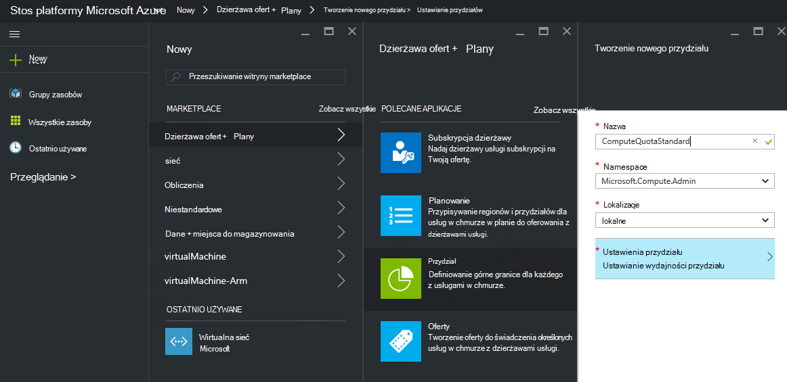
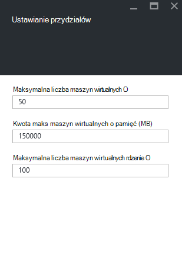

<properties
    pageTitle="Przydziały w stos Azure | Microsoft Azure"
    description="Administratorzy Ustawianie przydziałów ograniczenia maksymalnej ilości zasobów, które dzierżaw mają dostęp do."
    services="azure-stack"
    documentationCenter=""
    authors="mattmcg"
    manager="byronr"
    editor=""/>

<tags
    ms.service="azure-stack"
    ms.workload="na"
    ms.tgt_pltfrm="na"
    ms.devlang="na"
    ms.topic="get-started-article"
    ms.date="09/26/2016"
    ms.author="mattmcg"/>

# Ustawianie przydziałów w stos Azure

Przydziałów definiowania ograniczeń zasobów, które obsługi administracyjnej lub korzystać z subskrypcji dzierżawy. Na przykład normę może zezwolić dzierżawy utworzyć maksymalnie pięciu maszyny wirtualne. Aby dodać usługę do planu, administrator musi skonfigurować ustawienia przydziału dla tej usługi.

Przydziałów są konfigurowane w poszczególnych usług i według lokalizacji, umożliwiające administratorom zapewniają kontrolę nad zużycie zasobów. Administratorzy można utworzyć jeden lub więcej przydziału zasobów i kojarzenie ich z planów, co oznacza, że są bardziej zróżnicowane oferty dla swoich usług. Czy można utworzyć przydziałów dla danej usługi z karta Administracja **Dostawcy zasobów** dla tej usługi.

Dzierżawy, które subskrybuje ofertę, która zawiera wiele planów służy wszystkie zasoby, które są dostępne w każdym planie.

## Aby utworzyć przydział IaaS

1.  W przeglądarce przejdź do [https://portal.azurestack.local](https://portal.azurestack.local/).

    Zaloguj się do portalu stos Azure jako administrator (przy użyciu poświadczeń, które podany podczas wdrażania).

2.  Wybierz pozycję **Nowy**, a następnie wybierz pozycję **Przydział**.

3.  Wybierz usługę pierwszej, dla której chcesz utworzyć przydział. Dla przydziału IaaS wykonaj następujące czynności dla usług obliczeń, sieci i miejsca do magazynowania.
W tym przykładzie tworzymy są najpierw normę w usłudze obliczeń. Na liście **Namespace** wybierz nazw **Microsoft.Compute.Admin** .

    > 

4.  Wybierz lokalizację, w której przydziału jest definiowana (na przykład "lokalne").

5.  W elemencie **Ustawień przydziałów** z opisem **ustawiania zdolności przydziału**. Kliknięcie tego elementu, aby skonfigurować ustawienia przydziału.

6.  Na karta **Ustawianie przydziałów** są widoczne wszystkie zasoby obliczeń, dla których można skonfigurować ograniczenia. Każdy typ ma wartość domyślną, który jest skojarzony z nią. Możesz zmienić te wartości lub wybrać przycisk **Ok** u dołu karta zaakceptuj wartości domyślne.

    > 

7.  Po skonfigurowane wartości i kliknięciu **Ok**element **Ustawienia przydziału** jest wyświetlany jako **skonfigurowane**. Kliknij przycisk **Ok** Aby utworzyć zasób **przydziału** .

    Powinien zostać wyświetlony powiadomienie wskazująca jest tworzony przydziału zasobu.

8.   Po pomyślnym utworzeniu Ustawianie przydziałów otrzymasz powiadomienie z drugim. Przydział usługi obliczeń jest teraz gotowy do zostaną skojarzone z planem. Powtórz te czynności z usługami sieci i miejsca do magazynowania i zechcesz utworzyć IaaS plan!

    >   

## Obliczanie typów zasobów

|**Typ**                    |**Wartość domyślna**| **Opis**|
|--------------------------- | ------------------------------------|------------------------------------------------------------------|
|Maksymalna liczba maszyn wirtualnych   |50|Maksymalna liczba maszyn wirtualnych, które subskrypcji można tworzyć w tej lokalizacji. |
|Maksymalna liczba rdzeni maszyn wirtualnych              |100|Maksymalna liczba rdzeni tworzonych przez subskrypcji w tej lokalizacji (na przykład maszyn wirtualnych A3 zawiera cztery rdzenie).|
|Maksymalny rozmiar pamięci maszyn wirtualnych (GB)         |150|Maksymalnej ilości pamięci RAM konfigurowane w megabajtach (na przykład A1 maszyn wirtualnych wymaga 1,75 GB pamięci RAM).|

> [AZURE.NOTE] Wyliczenia przydziałów nie są wymuszane w tym technical preview.

## Typy przydział magazynowania

|**Element**                           |**Wartość domyślna**   |**Opis**|
|---------------------------------- |------------------- |-----------------------------------------------------------|
|Maksymalna pojemność (GB)              |500                 |Wydajność całkowitą ilość przestrzeni dyskowej, która może być używana przez subskrypcji w tej lokalizacji.|
|Całkowita liczba kont miejsca do magazynowania   |20                  |Maksymalna liczba kont miejsca do magazynowania, tworzonych przez subskrypcji w tej lokalizacji.|

## Typy zasobów sieciowych

|**Element**                                                   |**Wartość domyślna**   |**Opis**|
|----------------------------------------------------------| ------------------- |--------------------------------------------------------------------------------------------------------------------------------------------------------------------|
| Adresy IP publicznej Max                         |50                  |Maksymalna liczba publicznej adresy IP, który subskrypcji można tworzyć w tej lokalizacji. |
| Maksymalna liczba wirtualnych sieci                   |50                  |Maksymalna liczba wirtualnych sieci tworzonych przez subskrypcji w tej lokalizacji. |
| Maksymalna liczba bram wirtualnej sieci           |1                   |Maksymalna liczba bram wirtualną sieć (VPN bramy), które subskrypcji można tworzyć w tej lokalizacji. |
| Maksymalna liczba połączeń                |2                   |Maksymalna liczba połączeń sieciowych (typu punkt-punkt lub witryny do witryny) tworzonych przez subskrypcji przez wszystkich bram wirtualną sieć w tej lokalizacji. |
| Urządzenia do równoważenia obciążenia Max                     |50                  |Maksymalna liczba urządzenia do równoważenia obciążenia tworzonych przez subskrypcji w tej lokalizacji. |
| Nic Max                               |100                 |Maksymalna liczba interfejsów sieciowych, tworzonych przez subskrypcji w tej lokalizacji. |
| Grupy zabezpieczeń sieci Max            |50                  |Maksymalna liczba grup zabezpieczeń sieci tworzonych przez subskrypcji w tej lokalizacji. |
