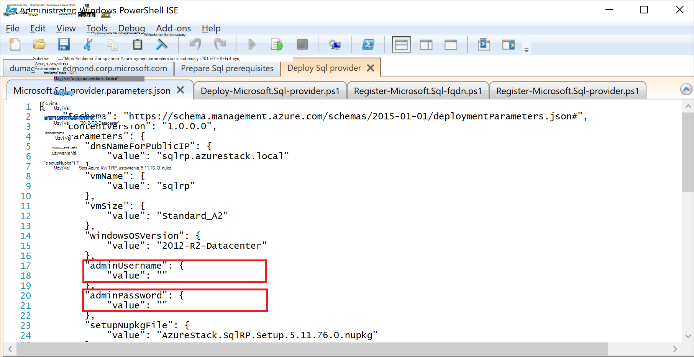

<properties
    pageTitle="Wdrażanie dostawcy zasobów programu SQL Server Azure stosu | Microsoft Azure"
    description="Szczegółowe kroki wdrażania karty SQL Server zasobu dostawcy Azure stosu."
    services="azure-stack"
    documentationCenter=""
    authors="Dumagar"
    manager="byronr"
    editor=""/>

<tags
    ms.service="multiple"
    ms.workload="na"
    ms.tgt_pltfrm="na"
    ms.devlang="na"
    ms.topic="article"
    ms.date="09/26/2016"
    ms.author="dumagar"/>

# Wdrażanie karta dostawcy zasobów serwera SQL Azure stosu

> [AZURE.NOTE] Poniższe informacje dotyczą tylko wdrożeniach TP1 stos Azure.

Wykonaj uzyskać szczegółowe instrukcje dotyczące konfigurowania karty SQL Server zasobu dostawcy dowód koncepcji stosu Azure za pomocą tego artykułu. Informacje na temat [baz danych programu SQL Azure stosu za pomocą](azure-stack-sql-rp-deploy-short.md) Aby zrozumieć możliwości dostawcy zasobów i architektury.

## Procedura konfiguracji przed wdrożeniem

Przed wdrożeniem dostawcy zasobów, należy:

- Miał domyślny obraz systemu Windows Server z .NET 3.5
- Wyłączanie zwiększonych zabezpieczeń programu Internet Explorer (IE)
- Zainstaluj najnowszą wersję programu PowerShell Azure

### Tworzenie obrazu systemu Windows Server, w tym program .NET 3.5

Możesz pominąć ten krok, jeśli pobrany bitów stos Azure po 2016-2-23, ponieważ domyślne Windows Server 2012 R2 obrazu zawiera framework .NET 3.5 w tym artykule pobieranie lub w nowszej wersji.

Jeśli został pobrany przed 2016-2-23, potrzebne do utworzenia systemu Windows Server 2012 R2 centrum danych wirtualnego dysku twardego z obrazem .NET 3.5 i zestaw jest jako domyślnego obrazu w repozytorium platformy obrazu.

### Wyłącz IE rozszerzony zabezpieczeń i Włącz pliki cookie

Aby wdrożyć dostawcy zasobów, należy uruchomić środowisko zintegrowane skryptów w PowerShell (ISE) jako administrator, więc należy zezwolić pliki cookie i JavaScript w profilu programu Internet Explorer, którego używasz, aby zalogować się do usługi Azure Active Directory dla zarówno administratorów i użytkowników dodatki logowania.

**Aby wyłączyć IE enhanced zabezpieczeń:**

1. Zaloguj się do komputera (aby zapewnić)-koncepcji stos Azure jako AzureStack-administrator, a następnie otwórz Menedżera serwera.

2. Wyłącz funkcję **Konfiguracja zwiększonych zabezpieczeń programu Internet Explorer** , zarówno dla administratorów i użytkowników.

3. Zaloguj się do maszyny wirtualnej **ClientVM.AzureStack.local** jako administrator, a następnie otwórz Menedżera serwera.

4. Wyłącz funkcję **Konfiguracja zwiększonych zabezpieczeń programu Internet Explorer** , zarówno dla administratorów i użytkowników.

**Aby włączyć pliki cookie:**

1. Na ekranie startowym systemu Windows kliknij polecenie **wszystkie aplikacje**, kliknij pozycję **Akcesoria systemu Windows**, kliknij prawym przyciskiem myszy **Program Internet Explorer**, wskaż pozycję **więcej**, a następnie kliknij **polecenie Uruchom jako administrator**.

2. Jeśli zostanie wyświetlony monit, sprawdź **zalecane zabezpieczeń**, a następnie kliknij **przycisk OK**.

3. W programie Internet Explorer kliknij pozycję **Narzędzia (ikona koła zębatego) ikona** &gt; **Opcje internetowe** &gt; kartę **Prywatność** .

4. Kliknij przycisk **Zaawansowane**, upewnij się, że wybierane są przyciski **Zaakceptuj** , kliknij **przycisk OK**i ponownie kliknij przycisk **OK** .

5. Zamknij program Internet Explorer i uruchom ponownie środowiska PowerShell ISE jako administrator.

### Zainstalować wersję zgodne stos Azure Azure programu PowerShell

1. Odinstaluj wszelkie istniejące Azure programu PowerShell z maszyn wirtualnych usługi klienta.

2. Zaloguj się do komputera Zapewnić stos Azure jako AzureStack-administrator.

3. Za pomocą pulpitu zdalnego, zaloguj się do maszyny wirtualnej **ClientVM.AzureStack.local** jako administrator.

4. Otwórz Panel sterowania, kliknij pozycję **Odinstaluj program** &gt; kliknij **Azure programu PowerShell** &gt; kliknij polecenie **Odinstaluj**.

5. [Pobierz najnowszą PowerShell Azure, który obsługuje stos Azure](http://aka.ms/azstackpsh) i zainstaluj go.

    Po zainstalowaniu programu PowerShell, może zostać uruchomiony weryfikacji skrypt programu PowerShell, aby upewnić się, że możesz połączyć wystąpienia stos Azure (strona sieci web logowania powinien być wyświetlany).

## Początkowego wdrażania dostawcy zasobów programu PowerShell

1. Nawiązywanie połączenia clientVm.AzureStack.Local pulpitu zdalnego Zapewnić stos Azure i zaloguj się jako azurestack\\azurestackuser.

2. [Pobieranie plików binarnych SQLRP](http://aka.ms/massqlrprfrsh) plik. Może być konieczne usuwanie bloku zabezpieczeń pobierania Internet, klikając prawym przyciskiem myszy plik, wybierz opcję **Właściwości** , a na karcie **Ogólne** , osi **Odblokuj** **OK**. To zapobieganie problemom "Nie można załadować pliku lub zestawu" Wyjątki związane z DeploymentTelemetry.dll i kolejnych wyjątki wdrożenia śledzenia.

3. Wyodrębnianie plików do D:\\SQLRP.

4. Uruchamianie D:\\SQLRP\\Bootstrap.cmd pliku jako administrator (azurestack\\administrator).

    Spowoduje to otwarcie pliku Bootstrap.ps1 środowiska PowerShell ISE.

5. Po zakończeniu ładowania okna środowiska PowerShell ISE kliknij przycisk Odtwórz lub naciśnij klawisz F5.

    

    Dwie główne karty pobierze, zawierające wszystkie skrypty i pliki należy wdrożyć dostawcy zasobów.

## Przygotowywanie wymagania wstępne

Kliknij kartę **Wymagania wstępne przygotowywanie** do:

- Tworzenie certyfikatów wymagane
- Przekazywanie artefaktów na koncie miejsca do magazynowania w stos Azure
- Publikowanie Galeria elementów

### Tworzenie certyfikatów wymagane
Dodaje ten skrypt **Nowy SslCert.ps1** \_. Certyfikat AzureStack.local.pfx SSL D:\\SQLRP\\wymagania wstępne dotyczące\\BlobStorage\\folder kontener. Certyfikat zabezpiecza komunikacji między dostawcy zasobów i lokalne wystąpienie programu Menedżer zasobów Azure.

1. Na karcie głównych **Przygotowywanie wymagania wstępne** kliknij kartę **SslCert.ps1 nowy** , a następnie uruchom go.

2. W wierszu, które zostanie wyświetlone wpisz hasło PFX chroniącego klucz prywatny i **zanotuj to hasło**. Musisz go później.

### Przekazywanie wszystkich artefaktów na koncie miejsca do magazynowania w stos Azure

1. Kliknij kartę **Przekazywania-Microsoft.Sql-RP.ps1** i uruchom go.

2. W oknie dialogowym żądanie poświadczeń programu Windows PowerShell wpisz poświadczenia administratora usługi Azure stosu.

3. Po wyświetleniu monitu dla Azure Active Directory ID dzierżawy, wpisz nazwę domeny w pełni kwalifikowana dzierżawy usługi Azure Active Directory: na przykład microsoftazurestack.onmicrosoft.com.

    Okno podręczne zapytanie dotyczące poświadczeń.

    

    > [AZURE.TIP] Jeśli nie są wyświetlane w oknie podręcznym, które albo nie zostały wyłączone IE udoskonalone zabezpieczenia, aby włączyć język JavaScript w tym komputera i użytkownika lub nie zostały odebrane pliki cookie w programie Internet Explorer. Zobacz [Konfigurowanie kroki przed wdrożeniem](#set-up-steps-before-you-deploy).

4. Wpisz swoje poświadczenia administratora usługi stos Azure, a następnie kliknij przycisk **Zaloguj**.

### Publikowanie elementów galerii później tworzenie zasobów

Wybierz kartę **GalleryPackages.ps1 Publikuj** , a następnie uruchom go. Ten skrypt dodawane są dwa elementy marketplace do witryny marketplace portal Azure stos Zapewnić, używanego do wdrożenia zasoby bazy danych jako elementów marketplace.

## Wdrażanie dostawcy zasobów maszyn wirtualnych programu SQL Server

Teraz, gdy już przygotowane zapewnić stos Azure z wymagane certyfikaty i elementami marketplace, należy wdrożyć dostawca zasobów programu SQL Server. Kliknij kartę **Dostawca wdrażanie SQL** , aby:

   - Podaj wartości w pliku JSON, który odwołuje się do procesu wdrażania
   - Wdrażanie dostawcy zasobów
   - Aktualizacja DNS lokalne
   - Zarejestruj się karty dostawcy zasobów serwera SQL

### Podaj wartości w pliku JSON

Kliknij pozycję **Microsoft.Sqlprovider.Parameters.JSON**. Ten plik ma parametry, które szablonu Menedżera zasobów Azure musi poprawnie wdrażanie stos Azure.

1. Wypełnij **puste** parametry w pliku JSON:

    - Upewnij się, że podasz **adminusername** i **adminpassword** maszyn wirtualnych dostawcy zasobów SQL:

        

    - Upewnij się, że hasło parametru **SetupPfxPassword** , które zostały wprowadzone w kroku [prequisites Przygotuj](#prepare-prerequisites) zwrócić uwagę:

    

2. Kliknij przycisk **Zapisz** do zapisania pliku parametrów.

### Wdrażanie dostawcy zasobów

1. Kliknij kartę **Rozmieszczanie-Microsoft.sql-provider.PS1** i uruchom skrypt.
2. Wpisz nazwę dzierżawy w usługi Azure Active Directory po wyświetleniu monitu.
3. W oknie podręcznym przesyłanie poświadczeń administratora usługi Azure stosu.

Pełne wdrożenie może potrwać między 25 a 55 minut na niektórych bardzo wykorzystywane POCs stos Azure. Kroki najdłuższej będzie rozszerzenie potrzeby stan konfiguracji (DSC) i wykonanie programu PowerShell, który jest ostatnim krokiem. Każdy może potrwać 10-25.

### Aktualizacja DNS lokalne

1. Kliknij kartę **Register-Microsoft.SQL-fqdn.ps1** i uruchom skrypt.
2. Po wyświetleniu monitu Azure Active Directory dzierżawy ID wprowadzania nazwy FQDN dzierżawy usługi Azure Active Directory: na przykład **microsoftazurestack.onmicrosoft.com**.

### Rejestr dostawcy zasobów SQL RP##

1. Kliknij kartę **Register-Microsoft.SQL-provider.ps1** i uruchom skrypt.

2. Gdy zostanie wyświetlony monit o poświadczenia, wykonaj następujące wartości dla nazwy użytkownika i hasła:

   - **sqlRpUsername**
   - **sqlRpPassw0rd**

   > [AZURE.IMPORTANT] Są to *literałów* wartości, które należy wpisać po wyświetleniu monitu o poświadczenia. Nie są symbole zastępcze. * *Wykonaj *nie* typu ** username\password zapisanych w pliku parametrów przed wdrożeniem maszyn wirtualnych.

## Sprawdź wdrażania za pomocą portalu stos Azure

1. Wylogowywanie się z ClientVM i zaloguj się ponownie jako **AzureStack\AzureStackUser**.

2. Na pulpicie kliknij **Portal Zapewnić stos Azure** i zaloguj się do portalu jako administrator usługi.

3. Upewnij się, że rozmieszczenia zakończyła się pomyślnie. Kliknij przycisk **Przeglądaj,** &gt; **Grup zasobów** &gt; kliknij grupę zasobu został użyty (wartość domyślna to **SQLRP**), a następnie upewnij się, że podstawowe części karta (górnej połowie) odczytuje **wdrożenia zakończyła się pomyślnie**.

      

4. Upewnij się, że rejestracji zakończyła się pomyślnie. Kliknij przycisk **Przeglądaj,** &gt; **dostawców zasobu**, a następnie odszukaj **Lokalne SQL**:

      

## Zapewnianie możliwości do dostawcy zasobów SQL przez nawiązywanie hostingu programu SQL server

1. Zaloguj się do portalu Zapewnić stos Azure jako administrator usługi

2. Kliknij pozycję **zasób dostawców** &gt; **lokalnego SQL** &gt; **Przejdź do zarządzania zasobami dostawcy** &gt; **Serwery** &gt; **Dodawanie**.

    Karta **SQL hostingu Servers** to miejsce, w którym można nawiązać dostawca zasobów programu SQL Server rzeczywisty wystąpienia programu SQL Server, które służą jako dostawcy zasobów wewnętrznej bazy danych.

    

3. Wypełnianie formularza Szczegóły połączenia wystąpienie programu SQL Server. Domyślnie wstępnie skonfigurowanego programu SQL Server o nazwie "SQLRP", "sa" nazwy użytkownika administratora i hasło, których wymienionym w parametrze "adminpassword" w parametrach, które JSON pracuje maszyn wirtualnych.

## Tworzenie pierwszej bazy danych SQL w celu przetestowania wdrożenia

1. Zaloguj się do portalu Zapewnić stos Azure jako administrator usługi.

2. Kliknij przycisk **Przeglądaj,** &gt; **bazy danych programu SQL** &gt; **Dodawanie**
  

3. Wypełnij formularz Szczegóły bazy danych, w tym **Nazwę serwera**, **Identyfikator logowania — administrator serwera**i **hasło** dla nowego *serwera wirtualnego* w karta **Nowego serwera** .

    

    Serwer wirtualny jest sztuczne konstrukcji. Nie zamapować na serwerze SQL, ale zamiast tego manifesty za pomocą nazwy użytkownika w parametrach połączenia generowany przez dostawcę zasobu na końcu tego procesu. **Uwaga hasło wprowadzane osobno dla serwera wirtualnego**. Portalu nigdy nie będą widoczne hasło.

4. Wyświetleniu pytania, aby wybrać cennik Warstwa bazy danych.

    

    Warstwy nie jest zaimplementowana w tej wersji, ale ich zużycie jest śledzone przez Menedżera zasobów Azure sposób zaprezentowania rozróżnienie, tworzonych w wymuszanie przydziałów itp.

5. Przesłać formularz i poczekaj, aż wdrożenia do wykonania.

6. W wyniku karta Zwróć uwagę, pole "Parametry połączenia". W stos Azure, można użyć tego ciągu w dowolnej aplikacji, która wymaga dostępu SQL Server (na przykład aplikacja sieci web).

    

## Następne kroki

Wypróbuj inne [PaaS usługi](azure-stack-tools-paas-services.md) , takie jak [serwer MySQL dostawcy zasobów](azure-stack-mysql-rp-deploy-short.md) i [aplikacje sieci Web dostawcy zasobów](azure-stack-webapps-deploy.md).
