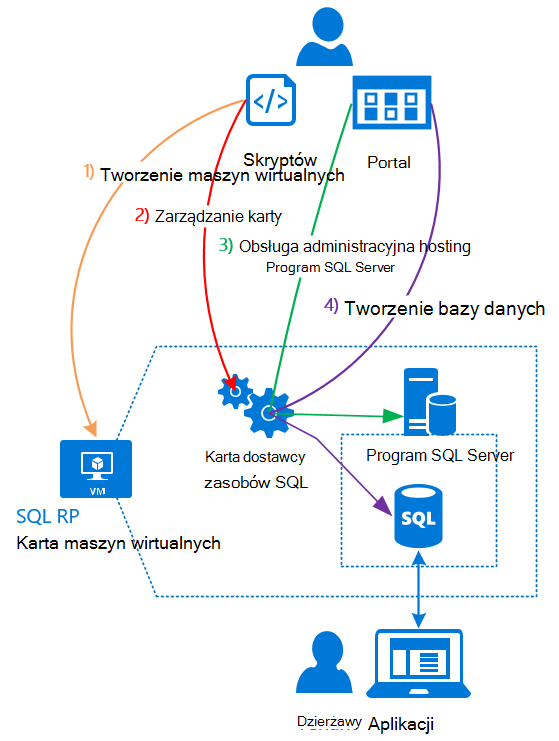

<properties
    pageTitle="Za pomocą bazy danych programu SQL Azure stosu | Microsoft Azure"
    description="Dowiedz się, jak można wdrażać bazy danych SQL jako usługa na stos Azure i Szybkie kroki, aby wdrożyć karty dostawcy zasobów programu SQL Server."
    services="azure-stack"
    documentationCenter=""
    authors="Dumagar"
    manager="byronr"
    editor=""/>

<tags
    ms.service="multiple"
    ms.workload="na"
    ms.tgt_pltfrm="na"
    ms.devlang="na"
    ms.topic="article"
    ms.date="09/26/2016"
    ms.author="dumagar"/>

# Używanie bazy danych programu SQL Azure stosu

> [AZURE.NOTE] Poniższe informacje dotyczą tylko wdrożeniach TP1 stos Azure.

Za pomocą karty dostawcy zasobów programu SQL Server udostępniania bazy danych SQL jako usługi Azure stosu. Po zainstalowaniu dostawcy zasobów Ciebie i Twoich użytkowników można utworzyć baz danych dla aplikacji chmury macierzystego, witryny sieci Web, które są oparte na SQL i obciążenia, które są oparte na SQL bez konieczności obsługi administracyjnej maszyny wirtualnej (maszyn wirtualnych) obsługującego programu SQL Server zawsze.

Ponieważ dostawcy zasobów nie ma możliwości bazy danych SQL Azure podczas dowodu koncepcji, w tym artykule zaczyna się od omówienie architektury dostawcy zasobów. Następnie możesz uzyskać krótkie omówienie czynności, aby skonfigurować dostawcę zasobów z łączami do bardziej szczegółowe kroki [rozmieszczanie karty dostawcy zasobów bazy danych SQL na Zapewnić stosem Azure](azure-stack-sql-rp-deploy-long.md).

## Architektura karty dostawcy zasobów programu SQL Server
Dostawcy zasobów nie oferuje możliwości zarządzania bazy danych SQL Azure wszystkich bazy danych. Na przykład pul elastyczne bazy danych oraz możliwość wybierania wydajności bazy danych w górę lub w dół w czasie rzeczywistym nie są dostępne. Dostawcy zasobów obsługuje jednak samego tworzenie, Odczyt, aktualizację i operacji usuwania dostępnej w bazie danych SQL Azure.

Dostawcy zasobów składa się z trzech elementów:

- **Karta dostawcy zasobów SQL maszyn wirtualnych**, obejmującym procesu dostawcy zasobów i serwery, które obsługują programu SQL Server.
- **Dostawcy zasobów, samego**, który przetwarza żądania obsługi administracyjnej i udostępnia zasoby bazy danych.
- **Serwery, które obsługi programu SQL Server**, które zapewniają możliwości baz danych.

Poniższy diagram koncepcyjny przedstawia składniki oraz kroki, które można przejść przez podczas wdrażania dostawcy zasobów, konfigurowanie serwera obsługującego programu SQL Server, a następnie utwórz bazy danych.

## Szybkie kroki, aby wdrożyć dostawcy zasobów
Wykonaj poniższe kroki, jeśli już znasz stos Azure. Aby uzyskać więcej informacji, skorzystaj z łączy w każdej sekcji lub przejść bezpośrednio do [rozmieszczanie karty dostawcy zasobów bazy danych SQL na Zapewnić stos Azure](azure-stack-sql-rp-deploy-long.md).

1.  Upewnij się, że wykonaniu wszystkich [Procedura przed wdrożeniem konfiguracji](azure-stack-sql-rp-deploy-long.md#set-up-steps-before-you-deploy) dostawcy zasobów:

  - Struktura .NET 3.5 jest już skonfigurowane w obrazie podstawowym Windows Server. (Jeśli pobrano bitów stos Azure po 23 lutego 2016, możesz pominąć ten krok).
  - [Zainstalowano wersję programu PowerShell Azure zgodny z stos Azure](http://aka.ms/azStackPsh).
  - W ustawieniach zabezpieczeń programu Internet Explorer na ClientVM, [program Internet Explorer ulepszone zabezpieczenia jest wyłączona, a pliki cookie są włączone](azure-stack-sql-rp-deploy-long.md#Turn-off-IE-enhanced-security-and-enable-cookies).

2. [Pobierz plik plików binarnych programu SQL Server RP](http://aka.ms/massqlrprfrsh) i wyodrębnić je do ClientVM w swojej Zapewnić stos Azure.

3. [Uruchamianie bootstrap.cmd i skryptów](azure-stack-sql-rp-deploy-long.md#Bootstrap-the-resource-provider-deployment-PowerShell-and-Prepare-for-deployment).

    Zestaw skryptów jest pogrupowane według dwie główne karty otwieranie w PowerShell zintegrowane skrypty środowiska (ISE). Wykonywanie wszystkich załadowanego skryptów w kolejności od lewej do prawej na każdej z kart.

    1. Uruchamianie skryptów na karcie **Przygotuj** od lewej do prawej, aby:

        - Tworzenie certyfikatu z symboli wieloznacznych do zabezpieczania komunikacji między dostawcy zasobów i Azure Menedżera zasobów.
        - Przekaż certyfikaty i wszystkie inne artefaktów na koncie miejsca do magazynowania Azure stosu.
        - Publikowanie pakietów galerii, tak aby wdrożyć SQL i zasoby za pośrednictwem galerii.

        > [AZURE.IMPORTANT] Jeśli dowolny z skrypty zawiesza się bez widocznego powodu po przesłaniu dzierżawy usługi Azure Active Directory, ustawienia zabezpieczeń może blokować DLL, wymaganego do wdrożenia do uruchomienia. Aby rozwiązać ten problem, poszukaj Microsoft.AzureStack.Deployment.Telemetry.Dll w folderze dostawcy zasobów, kliknij go prawym przyciskiem myszy, kliknij polecenie **Właściwości**, a następnie na karcie **Ogólne** zaznacz **Odblokuj** .

    1. Uruchamianie skryptów na karcie **Rozmieszczanie** od lewej do prawej, aby:

        - [Rozmieszczanie maszyny](azure-stack-sql-rp-deploy-long.md#Deploy-the-SQL-Server-Resource-Provider-VM) obsługującego zarówno dostawcy zasobów, jak i SQL Server. Ten skrypt odwołuje się do pliku parametrów JSON konieczna jest aktualizacja z niektórych wartości, przed uruchomieniem skryptu.
        - [Zarejestruj lokalne rekordu DNS](azure-stack-sql-rp-deploy-long.md#Update-the-local-DNS) mapy do dostawcy zasobów maszyn wirtualnych.
        - [Zarejestruj się z dostawcą zasobów](azure-stack-sql-rp-deploy-long.md#Register-the-SQL-RP-Resource-Provider) z lokalnego Menedżera zasobów Azure.

        > [AZURE.IMPORTANT] Wszystkie skrypty przyjęto założenie, że obraz podstawowy system operacyjny spełnia wymagania wstępne (.NET 3.5 zainstalowany, JavaScript i plików cookie włączone ClientVM i zgodnej wersji programu PowerShell Azure zainstalowany). Jeśli zostanie wyświetlony błędy podczas uruchamiania skryptów, upewnij się, że spełnione wymagania wstępne.

6. [Łączenie dostawcy zasobów na serwerze, który jest zainstalowany program SQL Server](#Provide-capacity-to-your-SQL-Resource-Provider-by-connecting-it-to-a-hosting-SQL-server) w portal Azure stosu. Kliknij przycisk **Przeglądaj,** &gt; **dostawców zasobów** &gt; **SQLRP** &gt; **Przejdź do zarządzania zasobami dostawcy** &gt; **Serwery** &gt; **dodać**.

    Nazwa użytkownika i hasło, którego użyto po wdrożeniu dostawcy zasobów maszyn wirtualnych za pomocą "Północny".

7. [Test dostawcy zasobów programu SQL Server](/azure-stack-sql-rp-deploy-long.md#create-your-first-sql-database-to-test-your-deployment)wdrożenie bazy danych SQL w portalu stosem Azure. Kliknij przycisk **Utwórz** &gt; **Niestandardowy** &gt; **bazy danych programu SQL Server**.

Należy to uzyskać dostawcy zasobów programu SQL Server w górę i uruchomione w około 45 minut (w zależności od sprzętu).
