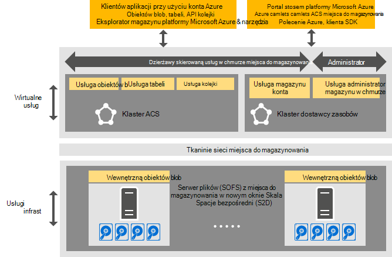

<properties
    pageTitle="Wprowadzenie do magazynu spójne Azure | Microsoft Azure"
    description="Dowiedz się więcej o spójne Azure miejsca do magazynowania"
    services="azure-stack"
    documentationCenter=""
    authors="AniAnirudh"
    manager="darmour"
    editor=""/>

<tags
    ms.service="azure-stack"
    ms.workload="na"
    ms.tgt_pltfrm="na"
    ms.devlang="na"
    ms.topic="get-started-article"
    ms.date="09/26/2016"
    ms.author="anirudha"/>

# Wprowadzenie do magazynu spójne Azure
Magazynowania spójne Azure to zbiór usług w chmurze miejsca do magazynowania w programie Microsoft Azure stosie. Magazyn spójne Azure oferuje blob, tabeli kolejki i funkcje zarządzania kontami z spójne Azure znaczeń właściwych. Umożliwia także funkcje ułatwiające administrator chmury Zarządzanie usługami miejsca do magazynowania. W tym artykule przedstawiono spójne Azure miejsca do magazynowania i w tym artykule omówiono, jak usług w chmurze miejsca do magazynowania w stos Azure właściwego uzupełnienia zaawansowanych [funkcji zdefiniowanych przez oprogramowanie magazynu w systemie Windows Server 2016](https://blogs.technet.microsoft.com/windowsserver/2016/04/14/ten-reasons-youll-love-windows-server-2016-5-software-defined-storage/).

Spójne Azure magazynowania oferuje następujące szerokie kategorie funkcji:

- **Blob**: strona obiektów blob, blokowanie obiektów blob i dołączanie obiektów blob z   [obiektów blob platformy Azure spójne](https://msdn.microsoft.com/library/azure/dd179355.aspx#Anchor_1) 
   zachowanie

- **Tabele**: jednostek, partycje i inne właściwości tabeli z   [tabelą spójne Azure](https://msdn.microsoft.com/library/azure/dd179355.aspx#Anchor_3) 
   zachowanie

- **Kolejki**: wiarygodnych i trwałych wiadomości i kolejki z   [kolejki spójne Azure](https://msdn.microsoft.com/library/azure/dd179355.aspx#Anchor_2) 
   zachowanie

- **Konta**: Zarządzanie zasobami konta miejsca do magazynowania z   [kontem spójne Azure](https://azure.microsoft.com/documentation/articles/storage-create-storage-account/) 
   zachowanie w przypadku kont ogólnego przeznaczenia magazynowania obsługi administracyjnej za pomocą [Menedżera zasobów Azure wdrożenia modelu](https://azure.microsoft.com/documentation/articles/resource-manager-deployment-model/)

- **Administracja**: Zarządzanie usługami pamięć wewnętrzna skierowaną dzierżawy i spójność Azure przestrzeni dyskowej (omówiony w inne artykuły)

## Architektura pamięci spójne Azure

Rysunek 1. Spójne Azure miejsca do magazynowania: widok rozwiązania

## Spójne Azure miejsca do magazynowania z obsługą usługi i klastrów

W architekturze spójne Azure miejsca do magazynowania obsługą są wszystkie dzierżawy lub usług dostępnych dla administratora magazynu. Oznacza to, że działają w usłudze zarządzane przez dostawcę, wysokiej dostępności maszyny wirtualne oparte na funkcji [Hyper-V](https://technet.microsoft.com/library/dn765471.aspx) w [systemie Windows Server 2016](http://www.microsoft.com/server-cloud/products/windows-server-2016/).
Mimo że maszyny wirtualne wysoce dostępne są oparte na [Systemie Windows Server awaryjnej](https://technet.microsoft.com/library/dn765474.aspx) technologii, spójne Azure uwierzytelnienia usługi miejsca do magazynowania z obsługą są grupowany gościa, wysokiej dostępności usług, oparty na [technologii tkaninie usługi Azure](http://azure.microsoft.com/campaigns/service-fabric/).

Spójne Azure magazynowania wykorzystuje dwa klastrów tkaninie usługi w stos Azure wdrożenia.
Usługa dostawcy zasobów magazynowania zostanie wdrożony w klastrze tkaninie usługi ("klaster RP"), który jest również udostępnione przez inne usługi dostawcy foundational zasobów. Pozostałą część przechowywania z obsługą usługi ścieżka danych — w tym obiektów Blob, tabel i kolejki usługi — są obsługiwane na drugi klaster tkaninie usługi ("spójne Azure miejsca do magazynowania klaster").

## Obiektów blob usługi i zdefiniowane przez oprogramowanie miejsca do magazynowania

Blob usługi ponownie zakończyć, z drugiej strony, jest uruchamiany bezpośrednio w węzłach [Serwera plików w nowym oknie Skala](https://technet.microsoft.com/library/hh831349.aspx) . W architekturze rozwiązanie stos Azure serwera plików w nowym oknie Skala jest oparty na [Miejsca do magazynowania spacje bezpośredni](https://technet.microsoft.com/library/mt126109.aspx)-klaster pracy awaryjnej zależności, udostępniane żaden element nie. Rysunek 1 przedstawia głównych spójne Azure usługi składowe miejsca do magazynowania i ich model rozłożone wdrożenia. Jak widać na diagramie, spójne Azure magazynowania pasują idealnie do języka istniejących funkcji zdefiniowanych przez oprogramowanie miejsca do magazynowania w systemie Windows Server 2016. Nie specjalnego sprzętu jest wymagana spójne Azure miejsca do magazynowania poza te wymagania platformy Windows Server.

## Farmy miejsca do magazynowania

Farmy miejsca do magazynowania jest kolekcja infrastruktury miejsca do magazynowania, zasobów i usług wewnętrznej, dostarczających skierowaną w dzierżawie administrator skierowaną spójne Azure miejsca do magazynowania usług i w wdrożenia usługi Azure stosu. W szczególności farmy miejsca do magazynowania jest następująca:

- Sprzętowe miejsca do magazynowania (na przykład serwer plików w nowym oknie Skala węzły, dysków)

- Zasoby tkaninie miejsca do magazynowania (na przykład udziałów SMB)

- Usługi tkaninie usługi związane z miejsca do magazynowania (na przykład Blob punktu końcowego usługi wyłączanie spójne Azure klaster miejsca do magazynowania)

- Usługi związane z miejsca do magazynowania, uruchamiane w węzłach serwera plików w nowym oknie skali (na przykład usługa Blob)

## Scenariusze zastosowania miejsca do magazynowania IaaS i PaaS

Blob strony spójne Azure miejsca do magazynowania, tak jak Azure, udostępniać dysków wirtualnych w infrastrukturze wszystkich użycie usługi (IaaS) scenariusze:

- Tworzenie maszyn wirtualnych za pomocą niestandardowych dysku z systemem operacyjnym w blob strony

- Tworzenie maszyn wirtualnych za pomocą niestandardowych obraz systemu operacyjnego w blob strony

- Tworzenie maszyn wirtualnych za pomocą obrazu Azure Marketplace w nowej blob strony

- Tworzenie maszyn wirtualnych za pomocą pusty dysk w nowej blob stron

Podobnie platformy jako scenariusze usług (PaaS) spójne Azure blob blok miejsca do magazynowania, dołączyć blob, kolejki, oraz tabele działają tak samo, jak w Azure.

## Role użytkowników

Spójne Azure miejsca do magazynowania jest przydatna w dwóch role użytkowników:

- Właściciele aplikacji, takich jak deweloperów i enterprise IT. Już nie mają do zachowania lub wdrażanie dwie wersje aplikacji i skryptów, które wykonać to samo zadanie w chmurze publicznej i chmurę hostowanej prywatne w centrum danych. Magazyn spójne Azure oferuje miejsca do magazynowania usług za pośrednictwem interfejsu API usługi REST, SDK, polecenia cmdlet i portal Azure stosu.

- Usługa dostawców, w tym enterprise IT, którzy wdrażanie i zarządzanie nią usług Microsoft Azure stos, multitenant magazynu w chmurze.

## Następne kroki

- [Spójne azure miejsca do magazynowania: różnice i zagadnienia] (azure stos acs — różnice tp2.md)
