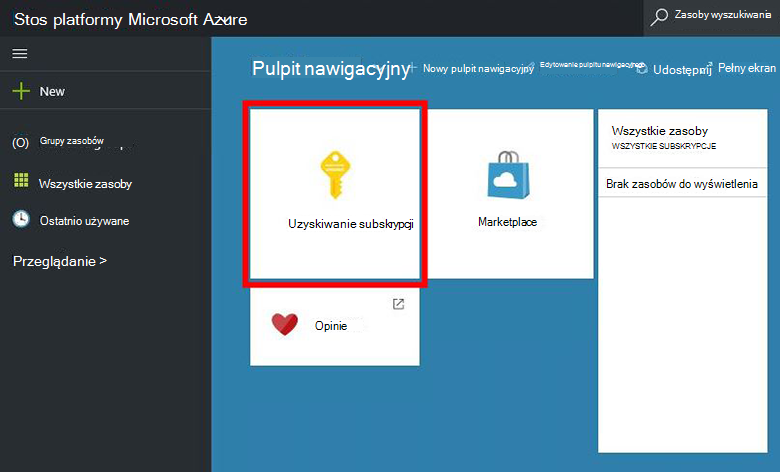
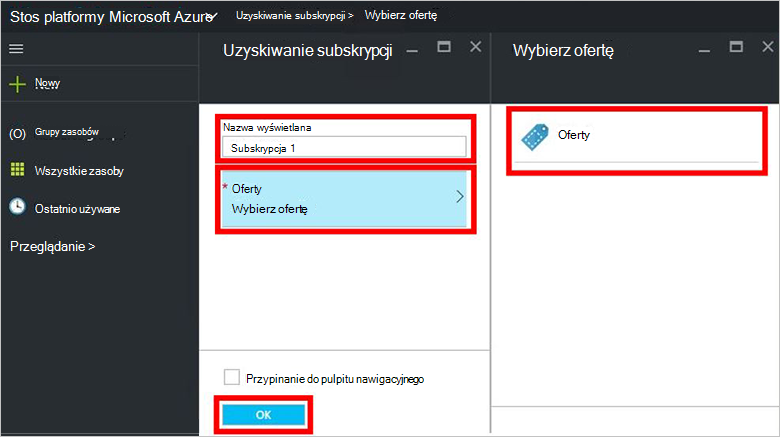
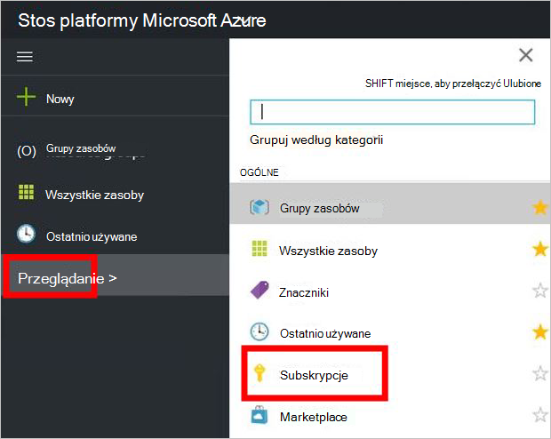

<properties
    pageTitle="Subskrybowanie oferty i obsługi administracyjnej maszyn wirtualnych w stos Azure (dzierżawy) | Microsoft Azure"
    description="Jako dzierżawy Dowiedz się, jak subskrybować oferty i obsługi administracyjnej maszyn wirtualnych w stos Azure."
    services="azure-stack"
    documentationCenter=""
    authors="ErikjeMS"
    manager="byronr"
    editor=""/>

<tags
    ms.service="azure-stack"
    ms.workload="na"
    ms.tgt_pltfrm="na"
    ms.devlang="na"
    ms.topic="get-started-article"
    ms.date="09/26/2016"
    ms.author="erikje"/>

# Subskrybowanie oferty

Teraz, gdy masz [utworzony oferty](azure-stack-create-offer.md), przetestuj z dzierżawami utworzyć subskrypcji.

1.  Na komputerze, aby Zapewnić stos Azure, zaloguj się do `https://portal.azurestack.local` jako [dzierżawy](azure-stack-connect-azure-stack.md#log-in-as-a-tenant) i kliknij przycisk **Pobierz subskrypcji**.

    

2.  W polu **Nazwa wyświetlana** wpisz nazwę subskrypcji, kliknij **oferują**, kliknij jedną z ofert w karta **Wybierz ofertę** i kliknij przycisk **Utwórz**.

    

4.  Aby wyświetlić subskrypcji, utworzony, kliknij przycisk **Przeglądaj**, kliknij pozycję **Subskrypcje**, a następnie kliknij pozycję nowej subskrypcji.  

    

Po zasubskrybowaniu ofertę odświeżanie portalu, aby zobaczyć, które usługi są częścią nowej subskrypcji.

## Następne kroki

[Obsługa administracyjna maszyny wirtualnej](azure-stack-provision-vm.md)
