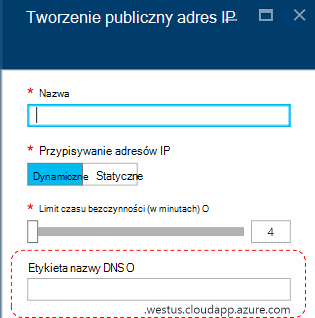
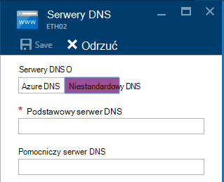
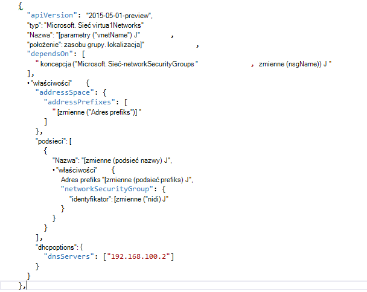

<properties
    pageTitle="Opis systemu DNS w stos Azure TP2 | Microsoft Azure"
    description="Opis nowych funkcji usługi DNS i możliwości TP2 stos Azure"
    services="azure-stack"
    documentationCenter=""
    authors="ScottNapolitan"
    manager="darmour"
    editor=""/>

<tags
    ms.service="azure-stack"
    ms.workload="na"
    ms.tgt_pltfrm="na"
    ms.devlang="na"
    ms.topic="get-started-article"
    ms.date="09/26/2016"
    ms.author="scottnap"/>

# Wprowadzenie IDN stosu Azure
================================

IDN jest nową funkcję w technologii 2 Podgląd stosu Azure, która umożliwia rozpoznawania zewnętrznych nazw DNS (na przykład http://www.bing.com).
W tym obszarze można również zarejestrować nazwy wirtualnej sieci wewnętrznej. W ten sposób można rozwiązać maszyny wirtualne w tej samej sieci wirtualnej nazwę zamiast adresu IP, bez konieczności podawania niestandardowe wpisy serwera DNS.

Dany obiekt zawsze było tam platformy Azure, ale teraz jest dostępny w systemie Windows Server 2016 i stos Azure za.

Do czego służy IDN?
------------------

W przypadku IDN w stos Azure otrzymasz następujące możliwości, bez konieczności określania niestandardowe wpisy serwera DNS.

-   Udostępniane usługi rozpoznawania nazw DNS dla obciążenia dzierżawy.

-   Usługa DNS autorytatywne rozpoznawanie nazw i rejestracji DNS w sieci wirtualnej dzierżawy.

-   Usługa DNS cykliczne do rozpoznawania nazw Internet z dzierżawy maszyny wirtualne. Dzierżaw nie trzeba określić niestandardowe wpisy DNS do rozpoznawania nazw Internet (na przykład www.bing.com).

Nadal można wyświetlić własne DNS i należy użyć niestandardowej serwerów DNS. Ale teraz, jeśli tylko chcesz spróbować rozwiązać DNS w sieci Internet imiona i nazwiska będą mogli nawiązywanie połączenia z innymi maszyn wirtualnych w tej samej sieci wirtualną, nie musisz niczego Określ i tylko będą działać.

Co IDN nie działa?
---------------------

Jakie IDN nie pozwala robić jest tworzenie rekordu DNS dla nazwy, które może przyjąć z zewnątrz wirtualnej sieci.

W Azure istnieje możliwość określenia etykieta nazwy DNS, które mogą być skojarzone z publiczny adres IP. Możesz wybrać etykietę (prefiks), ale Azure wybiera sufiks jest oparty na region, w którym została utworzona publiczny adres IP.

Na powyższym obrazie Azure utworzy rekord "A" w systemie DNS etykiety nazw DNS określone w strefie **westus.cloudapp.azure.com**. Prefiks i sufiks razem Redagowanie w pełni kwalifikowaną domeny nazwy (FQDN), który może być rozpoznany z dowolnego miejsca w Internecie publicznej.

W TP2 stos Azure obsługuje tylko IDN rejestracji nazwa wewnętrzna, więc nie można wykonać następujące czynności.

-   Tworzenie rekordu DNS w obszarze istniejącej hostowanej strefy DNS (na przykład azurestack.local).

-   Tworzenie strefy DNS (na przykład Contoso.com).

-   Utwórz rekord w obszarze własne niestandardowe strefy DNS.

-   Obsługuje zakupu nazw domen.

Zmiany w systemie DNS z TP1 stos Azure
-----------------------------------

W wersji 1 Podgląd technologii (TP1) stosu Azure trzeba było o podanie niestandardowej serwerów DNS, aby spróbować rozwiązać hosts według nazwy, a nie według adresów IP. Oznacza to, że zostały tworzenia wirtualnej sieci lub maszyny należało podać co najmniej jeden wpis serwera DNS. Dla środowiska Zapewnić TP1 oznacza to, wprowadzanie adresów IP serwera DNS tkaninie zatwierdzania Koncepcji, takich jak 192.168.200.2.

Jeśli utworzono maszyn wirtualnych za pośrednictwem portalu, trzeba było wybierz **Niestandardowy DNS** w wirtualnej sieci lub ustawienia karty ethernet.

W TP2 można wybrać Azure DNS i nie musisz określić niestandardowe wpisy serwera DNS.

Jeśli utworzono maszyn wirtualnych za pomocą szablonu z własnego obrazu, trzeba było dodać właściwość **DHCPOptions** i serwera DNS, aby można było uzyskiwać DNS nazwa rozdzielczości do pracy. Poniższa ilustracja przedstawia ten zawierała przedstawione.

W TP2 nie potrzebujesz już wprowadzić te zmiany do szablonów maszyn wirtualnych umożliwia pośrednictwem usługi SMS do rozpoznawania nazw internetowych. Po prostu powinna działać.