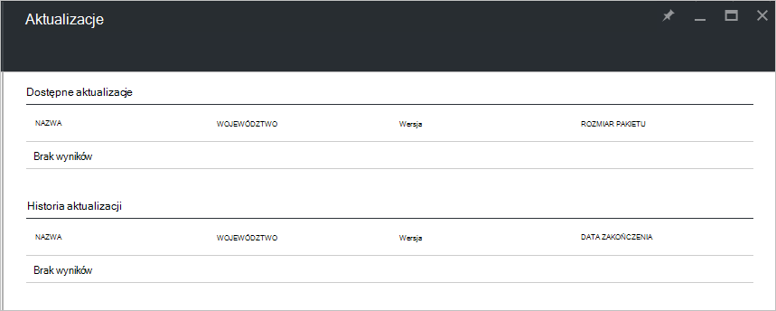

<properties
    pageTitle="Aktualizacji w stos Azure | Microsoft Azure"
    description="Więcej informacji na temat aktualizacji w stos Azure"
    services="azure-stack"
    documentationCenter=""
    authors="HeathL17"
    manager="byronr"
    editor=""/>

<tags
    ms.service="azure-stack"
    ms.workload="na"
    ms.tgt_pltfrm="na"
    ms.devlang="na"
    ms.topic="article"
    ms.date="09/26/2016"
    ms.author="Helaw"/>

# Zarządzanie aktualizacji w stos Azure
Technical Preview 2 wprowadza Podgląd środowisko do zarządzania stos Azure aktualizacji.  W tym temacie będzie przejdź do węzła aktualizacji.  

## Karta aktualizacje
1.  Aby uzyskać dostęp do karta aktualizacje, kliknij **Przeglądaj** , a następnie kliknij **aktualizacji**.

2.  Kliknij lokalizację **lokalnego** .

3.  Zostanie wyświetlony ekran, na liście dostępne aktualizacje i Historia aktualizacji.  W Technical Preview 2 aktualizacje nie będą dostępne dla instalacji.  

    

## Następne kroki
- [Opis architektury Zapewnić stos Azure](azure-stack-architecture.md)      
- [Opis warunki wstępne wdrażania](azure-stack-deploy.md)
- [Wdrażanie stos Azure](azure-stack-run-powershell-script.md)
 
    
  

  

