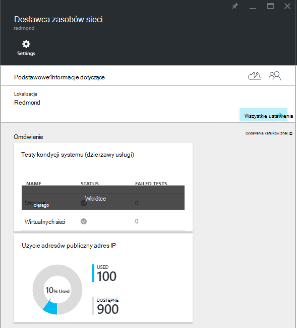
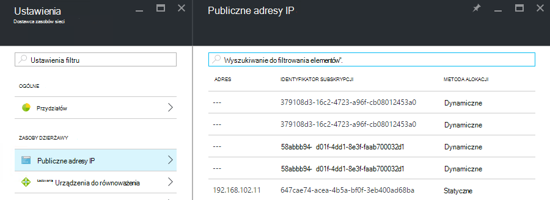

<properties
    pageTitle="Wyświetlanie publicznej zużycie adresów IP w TP2 | Microsoft Azure"
    description="Administratorzy mogą wyświetlać zużycie publicznych adresów IP w regionie"
    services="azure-stack"
    documentationCenter=""
    authors="ScottNapolitan"
    manager="darmour"
    editor=""/>

<tags
    ms.service="azure-stack"
    ms.workload="na"
    ms.tgt_pltfrm="na"
    ms.devlang="na"
    ms.topic="get-started-article"
    ms.date="09/26/2016"
    ms.author="scottnap"/>

# Wyświetlanie publicznej zużycie adresów IP w TP2 stos Azure

Jako administrator usługi możesz wyświetlić numer publicznych adresów IP, które zostały przydzielone z dzierżawami, numer publicznych adresów IP, które są nadal dostępne dla przydziału, a wartość procentową publicznych adresów IP, które zostały przydzielone w tym miejscu.

Kafelek **Użycie publicznego adresu IP** zawiera całkowitą liczbę publicznych adresów IP, które zostały wykorzystane przez wszystkich pul adresów IP publicznej na tym, czy były używane dla dzierżawa wystąpienia IaaS maszyn wirtualnych, usługi infrastruktury tkaninie lub publicznej zasoby adresów IP jawnie utworzonych przez dzierżaw.

Przeznaczenie tym kafelku jest pozwala administratorom stos Azure ujęciu ogólnej liczby publicznych adresów IP, które zostały wykorzystane w tej lokalizacji. Dzięki temu administratorzy określić, czy ich zaczyna brakować tego zasobu.

Na karta **Ustawienia** element menu **Publicznych adresów IP** w obszarze **dzierżawy zasobów** zawiera listę tylko publicznych adresów IP, które zostały *jawnie utworzone przez dzierżaw*. Jako takie, liczba **używanych** kafelka publicznych adresów IP na **Użycie publicznego adresu IP** jest zawsze inne niż (większe niż) numer na kafelku **Publicznych adresów IP** w obszarze **dzierżawy zasoby**.

## Wyświetlanie informacji publicznej zastosowania adres IP

Aby wyświetlić całkowitą liczbę publicznych adresów IP, które zostały wykorzystane w regionie:

1.  W portalu stos Azure kliknij przycisk **Przeglądaj**, a następnie wybierz **Zasób dostawców**.

2.  Z listy **Dostawców zasobu**wybierz pozycję **Administrator dostawcy zasobów sieci**.

3.  Alternatywnie możesz kliknąć pozycję **Przeglądaj | Lokalizacje** i wybierz lokalizację, w której mają być wyświetlane na liście. Na kafelku **Dostawców zasobu** , wybierz pozycję **Administratora dostawcy zasobów sieci**.

4.  Karta główna **Dostawcy zasobów sieci** Wyświetla kafelków **Użycia publicznego adresu IP** w sekcji **Omówienie** .

Należy pamiętać, **używane** liczba oznacza liczbę publiczny adres IP adresów z wszystkich publiczny adres IP rozwiązać pul w tym miejscu, które są przypisane. **Dostępne** liczba oznacza liczbę publiczny adres IP adresów z wszystkich publiczny adres IP adres pul, które nie zostały przypisane i są nadal dostępne. Liczba reprezentuje **% używane** w wszystkich publiczny adres IP adresy liczba używanych lub przydzielonych adresów jako wartość procentową całkowitej liczby publiczny adres IP adres pul w tym miejscu.

## Wyświetlanie publicznej adresów IP, które zostały utworzone przez subskrypcje dzierżawy

Aby wyświetlić listę publicznych adresów IP, jawnie utworzonych przez subskrypcji dzierżawy w określonego regionu, przejdź do karta **Ustawienia** **Administratora dostawcy zasobów sieci**i wybierz pozycję **Publicznych adresów IP**.

Można zauważyć, że niektóre publicznych adresów IP, które dynamicznie przydzielane są wyświetlane na liście, ale nie został jeszcze skojarzonych z nimi adres. Jest tak, ponieważ zasób Adres został utworzony przez dostawcę zasobu w sieci, ale nie w kontrolerze sieci jeszcze.

Kontroler sieci nie przypisują adresu do tego zasobu, aż faktycznie jest powiązany z interfejs, kartę sieciową (NIC), równoważenia obciążenia lub Brama wirtualnej sieci. Gdy publiczny adres IP jest związany z interfejsem, Kontroler sieci przydziela adres IP do niego i zostanie ono wyświetlone w polu **adres** .

## Wyświetlanie publicznej tabelę adresów IP informacji podsumowania

Istnieje szereg różnych przypadkach w których publiczne adresy IP są przypisywane określające, czy adres zostanie wyświetlony w jednej liście lub w innym.

| **Publiczne litery przydziału adres IP** | **Zostanie wyświetlony w Podsumowanie użycia** | **Zostanie wyświetlony w dzierżawie publiczne listy adresów IP** |
| ------------------------------------- | ----------------------------| ---------------------------------------------- |
| Dynamiczne publiczny adres IP nie zostały jeszcze przydzielone do równoważenia NIC lub załadowania (tymczasowe) | Brak | Tak |
| Dynamiczne publiczny adres IP przypisane do równoważenia NIC lub załaduj. | Tak | Tak |
| Statyczne publiczny adres IP przypisane do równoważenia obciążenia lub NIC dzierżawy. | Tak | Tak |
| Statyczne publiczny adres IP przypisany do punktu końcowego usługi infrastruktury tkaninie. | Tak | Brak |
| Publiczny adres IP niejawnie tworzony dla wystąpienia IaaS maszyn wirtualnych i na potrzeby ruchu wychodzącego translatora adresów Sieciowych na wirtualnej sieci. Te są tworzone w tle, gdy dzierżawy tworzy wystąpienie maszyn wirtualnych, tak aby maszyny wirtualne można wysyłać informacje do Internetu. | Tak | Brak |
