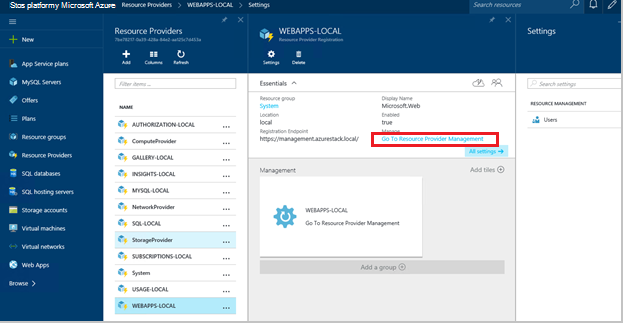
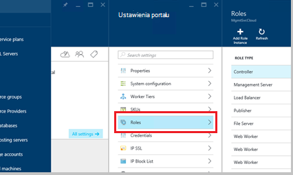
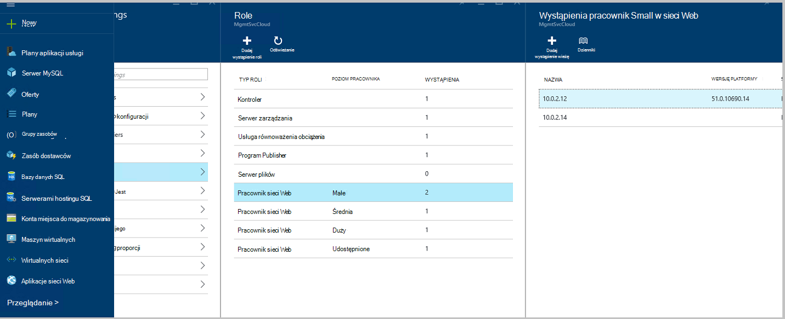
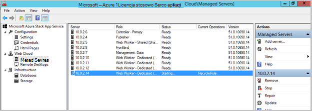
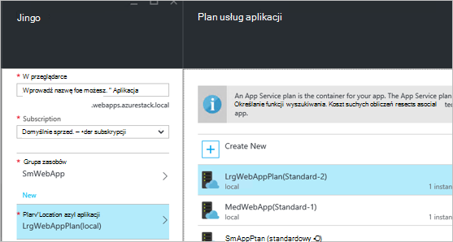
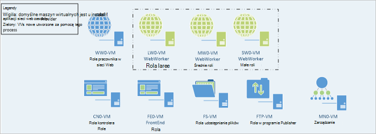

<properties
    pageTitle="Role pracownika sieci Web aplikacje sieci Web, dodając | Microsoft Azure"
    description="Szczegółowe wskazówki dotyczące skalowania Azure stos Web App"
    services="azure-stack"
    documentationCenter=""
    authors="kathm"
    manager="slinehan"
    editor=""/>

<tags
    ms.service="azure-stack"
    ms.workload="app-service"
    ms.tgt_pltfrm="na"
    ms.devlang="na"
    ms.topic="article"
    ms.date="09/26/2016"
    ms.author="kathm"/>

#   <a name="web-apps-adding-more-web-worker-roles"></a>Aplikacji sieci Web: Dodawanie więcej role pracownika w sieci web

> [AZURE.NOTE] Poniższe informacje dotyczą tylko wdrożeniach TP1 stos Azure.

Ten dokument zawiera instrukcje dotyczące sposobu skalowania role pracownika w sieci web aplikacji sieci Web. Zawiera instrukcje dotyczące tworzenia role pracownik dodatkowych sieci web do obsługi ofert aplikacji sieci web o rozmiarze.

Stos Azure obsługuje wdrożeniami aplikacji web bezpłatnych i udostępnione. Aby dodać inne typy, musisz dodać więcej role pracownika w sieci web.

Jeśli nie masz pewności, co zostało wdrożone przy użyciu domyślnej instalacji aplikacji sieci Web, możesz przejrzeć dodatkowe informacje [poniżej](azure-stack-webapps-overview.md).

Poniższe czynności są wymagane do skali web pracownik ról:

1.  [Tworzenie nowej maszyny wirtualnej](#step-1-create-a-new-vm-to-support-the-new-instance-size)

2.  [Konfigurowanie maszyny wirtualnej](#step-2-configure-the-virtual-machine)

3.  [Konfigurowanie ról pracownika w sieci web w portalu stos Azure](#step-3-configure-the-web-worker-role-in-the-azure-stack-portal)

4.  [Konfigurowanie aplikacji usługi planów](#step-4-configure-app-service-plans)

##<a name="step-1-create-a-new-vm-to-support-the-new-instance-size"></a>Krok 1: Tworzenie nowych maszyn wirtualnych do obsługi nowy rozmiar wystąpienia

Utwórz maszyny wirtualnej w sposób opisany w [tym artykule](azure-stack-provision-vm.md), zapewnienie, że będą następujące opcje:

 - Nazwa użytkownika i hasło: Podaj tę samą nazwę użytkownika i hasło, podany podczas instalowania aplikacji sieci Web.

 - Subskrypcja: Za pomocą subskrypcji dostawcy domyślnego.

 - Grupa zasobów: wybierz pozycję **Lokalny AppService**.

> [AZURE.NOTE]Przechowywanie maszyn wirtualnych dla ról pracownika w tej samej grupy zasobów, co aplikacje sieci Web wdrożenie aplikacji. (Jest to zalecane w tej wersji.)

##<a name="step-2-configure-the-virtual-machine"></a>Krok 2: Konfigurowanie maszyny wirtualnej

Po zakończeniu rozmieszczania następującej konfiguracji jest wymagana do obsługi ról pracownika w sieci web:

1.  Otwórz Menedżera serwera na komputerze hoście, a następnie kliknij pozycję **Narzędzia** &gt; **HyperV Menedżera**.

2.  Nawiązywanie połączenia przy użyciu protokołu RDP (Remote Desktop) maszyn wirtualnych nowego, utworzonego w kroku 1. Nazwa serwera znajduje się w okienku Podsumowanie po wybraniu poszczególnych maszyn wirtualnych.

3.  Otwieranie programu PowerShell, klikając przycisk **Start** i wpisując tekst programu PowerShell. Kliknij prawym przyciskiem myszy **PowerShell.exe**, a następnie wybierz polecenie **Uruchom jako administrator** , aby otworzyć programu PowerShell w trybie administratora.

4.  Kopiowanie i wklejanie każdego z następujących poleceń (pojedynczo) do okna programu PowerShell, a następnie naciśnij klawisz wprowadź:

    ```netsh advfirewall firewall set rule group="File and Printer Sharing" new enable=Yes```
    ```netsh advfirewall firewall set rule group="Windows Management Instrumentation (WMI)" new enable=yes```
    ```reg add HKLM\\SOFTWARE\\Microsoft\\Windows\\CurrentVersion\\Policies\\system /v LocalAccountTokenFilterPolicy /t REG\_DWORD /d 1 /f```

5.  Uruchom ponownie komputer wirtualną.

> [AZURE.NOTE]Uwaga: Są minimalne wymagania dotyczące aplikacji sieci Web. Są one ustawienia domyślne obrazu systemu Windows 2012 R2 dołączone do stosu Azure. Instrukcje zostały dołączone do użytku w przyszłości, a odpowiadające przy użyciu innego obrazu.

##<a name="step-3-configure-the-web-worker-role-in-the-azure-stack-portal"></a>Krok 3: Konfigurowanie roli Pracownik sieci web w portalu stos Azure

1.  Otwórz portal usługi jako administrator usługi **ClientVM**.

2.  Przejdź do **dostawców zasobów** &gt; **Używanie lokalnego**.

    
 
3.  Kliknij przycisk **Przejdź do zarządzania zasobami dostawcy**.

4.  Kliknij pozycję **role**.

    
 
5.  Kliknij przycisk **Dodaj wystąpienie roli**.

6.  Kliknij przycisk **warstwy** chcesz wdrożyć nowego wystąpienia (małe, średnie, duże lub udostępnionych).

    
 
7.  Skonfiguruj następujące ustawienia:
 - Nazwa_serwera: Podaj adres IP serwera, który został utworzony wcześniej (w sekcji 1).
 - Typ roli: Pracownik sieci Web.
 - Poziom pracownika: Dopasowania poziomu wybrany rozmiar.

8. Kliknij pozycję **przycisk OK.**

9. Zaloguj się do maszyn wirtualnych CN0 i Otwórz **MMC zarządzania chmury sieci Web**.

10. Przejdź do **chmury Web** &gt; **serwery zarządzane**.

11. Kliknij nazwę serwera, który właśnie wdrożony. Przejrzyj kolumnę Stan i zaczekaj, aby przejść do następnego kroku do momentu jej stan to "Gotowe".

    

##<a name="step-4-configure-app-service-plans"></a>Krok 4: Konfigurowanie planów usług aplikacji

> [AZURE.NOTE]W bieżącej wersji aplikacji sieci Web planów usług aplikacji muszą być przechowywane w oddzielnych grup zasobów. Tworzenie grupy zasobów dla każdego rozmiaru aplikacji sieci web, a następnie umieść plany aplikacji w swoich grupach odpowiedni zasób.

1.  Zaloguj się do portalu na ClientVM.

2.  Przejdź do **nowej** &gt; **sieci Web i telefon komórkowy**.

3.  Wybierz aplikację sieci web, którą chcesz wdrożyć.

4.  Informacje dotyczące aplikacji sieci web, a następnie wybierz pozycję **AppService Plan-lokalizacji**.

-   Kliknij pozycję **Utwórz nowe**.

-   Utwórz nowy plan, wybierając odpowiedni poziom cennik planu.

> [AZURE.NOTE]Możesz utworzyć wiele planów znajduje się w tym karta. Przed rozpoczęciem wdrażania, upewnij się, że został wybrany odpowiedni plan.

Poniżej przedstawiono przykład wiele planów dostępne:    

##<a name="final-web-app-service-vm-configuration"></a>Ostateczne konfiguracji maszyn wirtualnych usługi aplikacji sieci Web

Na poniższej ilustracji udostępnia widok środowiska, gdy masz skalowany role pracownika w sieci web. Zielony elementy reprezentują nowe dodatki roli.
    
