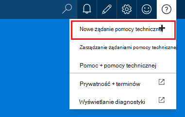
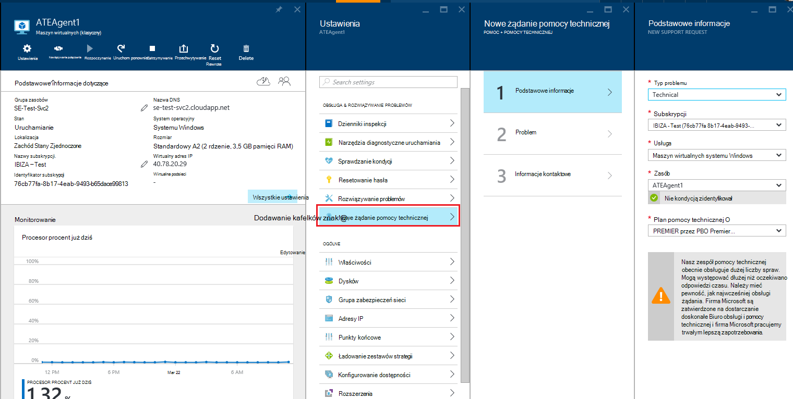
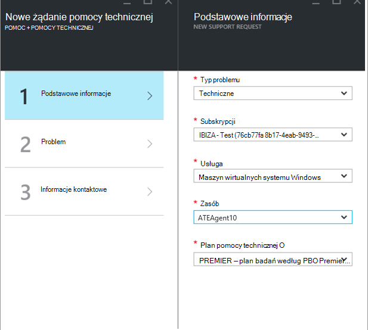
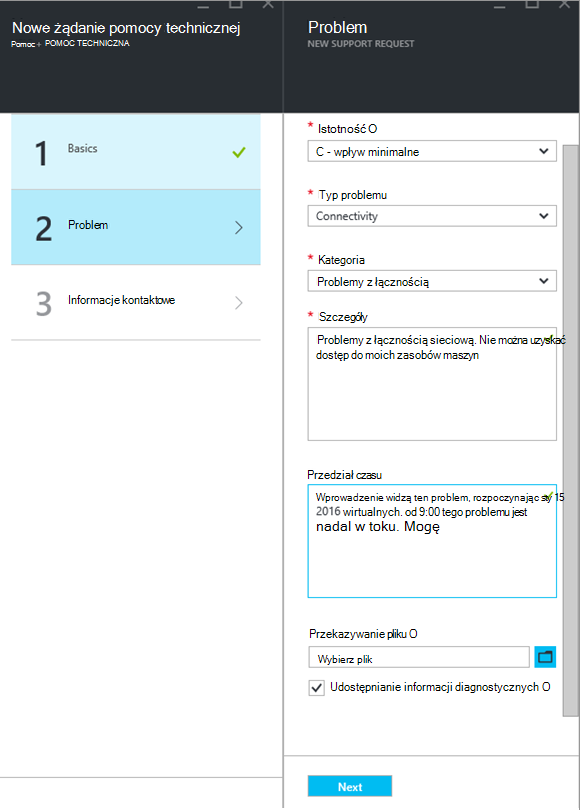
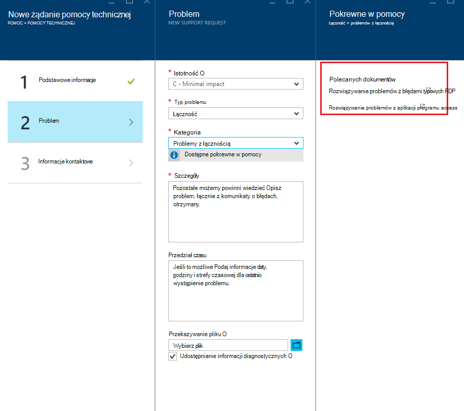
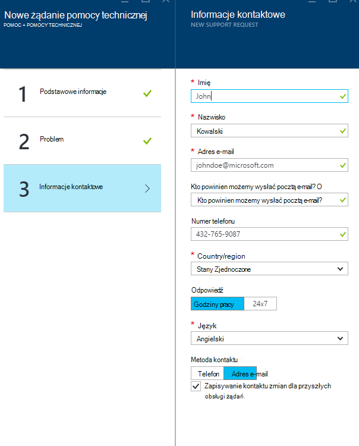
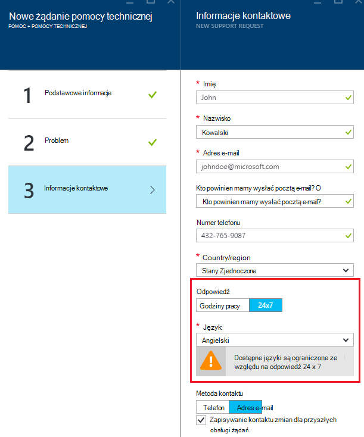
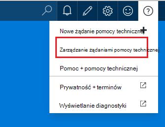
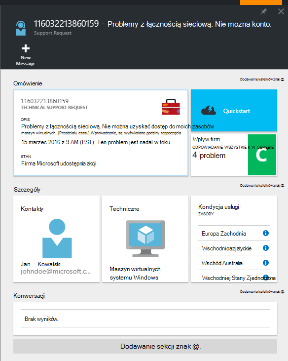
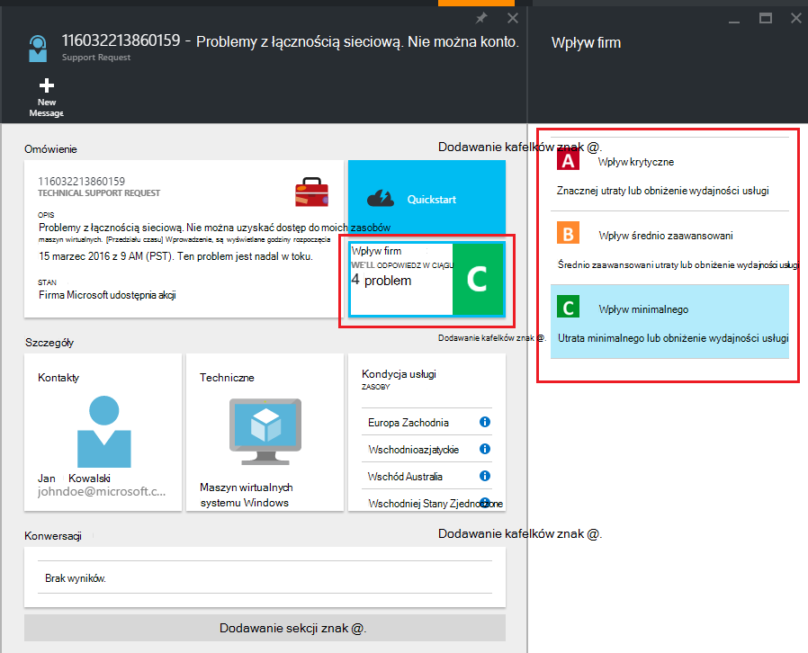

<properties
     pageTitle="Jak utworzyć żądanie obsługi Azure | Microsoft Azure"
     description="Jak utworzyć żądanie Azure pomocy technicznej."
     services="Azure Supportability"
     documentationCenter=""
     authors="ganganarayanan"
     manager="scotthit"
     editor=""/>

<tags
     ms.service="azure-supportability"
     ms.workload="na"
     ms.tgt_pltfrm="na"
     ms.devlang="na"
     ms.topic="article"
     ms.date="10/25/2016"
     ms.author="gangan"/>

# Jak utworzyć żądanie obsługi Azure

## Podsumowanie
Azure klientów można tworzyć i zarządzać żądania obsługi w portalu Azure [https://portal.azure.com](https://portal.azure.com).
>[AZURE.NOTE] Portal Azure Niemcy jest [https://portal.microsoftazure.de](https://portal.microsoftazure.de) i portal Azure dla instytucji rządowych jest [https://portal.azure.us](https://portal.azure.us).

Na podstawie opinii klientów, firma Microsoft zaktualizował obsługi żądania obsługi skoncentrować się na trzy główne cele:

- **Streamlined**: zmniejszanie kliknięcia i karty, aby wprowadzić prosty proces przesyłania prośbę o pomoc techniczną.
- **Układy**: przy rozwiązywaniu problemu z zasobem Azure, należy go łatwo otworzyć prośbę o pomoc techniczną dla tego zasobu bez przełączania kontekstu.
- **Skuteczność**: zbieranie informacji klucza, będzie konieczne efektywne rozwiązać problemu z pracownikiem pomocy technicznej.

## Wprowadzenie
Możesz utworzyć prośbę o pomoc techniczną od górnym menu nawigacji lub bezpośrednio od karta zasobu.

**Na górnym pasku nawigacyjnym**

**Z kart zasobów**

## Podstawowe informacje
Pierwszym krokiem procesu żądania obsługi zbiera podstawowe informacje dotyczące problemu i planu pomocy technicznej.

Spójrzmy na przykład: już przeciwległych trudności techniczne z komputera wirtualnych i podejrzewasz problemu z połączeniem sieciowym.
Wybieranie usługi ("wirtualnej komputer z systemem Windows") i zasobów (nazwa komputera wirtualnych) w pierwszym kroku kreatora uruchamia proces uzyskiwanie pomocy dla tego problemu.

>[AZURE.NOTE] Azure umożliwia nieograniczoną Zarządzanie subskrypcją (elementy, takie jak rozliczeń, zmiany przydziałów i kont bankowych). Aby uzyskać pomoc techniczną potrzebujesz planu pomocy technicznej. [Aby uzyskać więcej informacji o planach pomocy technicznej](https://azure.microsoft.com/support/plans).

## Problem
Drugi krok kreatora zbiera dodatkowych szczegółów dotyczących problemu. Dostarczanie dokładne szczegóły w tym kroku umożliwia nam aby skierować sprawę do najlepsze pracownika pomocy technicznej dla problemu i rozpocząć diagnozowania problemu tak szybko, jak to możliwe.

Kontynuowanie z powyższym przykładzie łączności maszyn wirtualnych, czy Wypełnij ten formularz, aby wskazać problemu z połączeniem sieciowym i zapewni szczegółowe informacje o problemie, uwzględniając czasu przybliżonego, gdy wystąpił problem.

## Pokrewne w pomocy
W przypadku niektórych problemów udostępniamy linki pokrewne w pomocy do rozwiązania tego problemu. Jeśli polecanych dokumentów nie pomoże, możesz nadal przez proces, aby utworzyć żądanie pomocy technicznej.

## Informacje kontaktowe
Ostatni krok kreatora potwierdza swoje informacje kontaktowe, abyśmy wiedzieli, jak robocze.

W zależności od ważności problemu może być wyświetlony monit o wskazują, czy chcesz nam się z Tobą skontaktować, podczas godzin pracy lub jeśli wolisz odpowiedź 24 x 7, co oznacza, że firma Microsoft może skontaktować się z Tobą w dowolnym momencie.

## Zarządzanie żądaniami pomocy technicznej
Po utworzeniu żądanie pomocy technicznej, możesz wyświetlić szczegółowe informacje na stronie **Zarządzanie żądania obsługi** .

**Na górnym pasku nawigacyjnym**

Na stronie **Zarządzanie żądania pomocy technicznej** możesz wyświetlić wszystkie żądania obsługi i ich stanu.

Wybierz żądanie pomocy technicznej, aby wyświetlić szczegóły, w tym ważności i oczekiwany czas potrzebny dla pracownika pomocy technicznej odpowiedzieć.

Jeśli chcesz zmienić ważności żądania, kliknij Kafelek **biznesowych** . W tym przykładzie poprzedzających wniosek jest ustawiony ważności C.

Klikając Kafelek zawiera listę severities, które można przypisać do żądania obsługi otwarte.

>[AZURE.NOTE] Poziom ważności maksymalna zależy od planu pomocy technicznej. [Aby uzyskać więcej informacji o planach pomocy technicznej](https://azure.microsoft.com/support/plans).

## Opinie
Zawsze jesteśmy otwarte opinii i sugestii! Prześlij nam [Sugestie](https://feedback.azure.com/forums/266794-support-feedback). Możesz także współpracować z nami za pośrednictwem [serwisu Twitter](https://twitter.com/azuresupport) lub na [forum w witrynie MSDN](https://social.msdn.microsoft.com/Forums/azure).

## Dowiedz się więcej
[Często zadawane pytania dotyczące obsługi Azure](https://azure.microsoft.com/support/faq)
