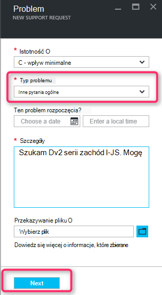

<properties
     pageTitle="Jednostka SKU serii niedostępne | Microsoft Azure"
     description="Niektóre serie SKU są niedostępne dla wybranych subskrypcji dla tego regionu."
     services="Azure Supportability"
     documentationCenter=""
     authors="ganganarayanan"
     manager="scotthit"
     editor=""/>

<tags
     ms.service="azure-supportability"
     ms.workload="na"
     ms.tgt_pltfrm="na"
     ms.devlang="na"
     ms.topic="article"
     ms.date="08/12/2016"
     ms.author="gangan"/>

# Jednostka SKU serii niedostępny

W niektórych regionach niektórych wersji produktu nie są automatycznie dostępne dla nowej subskrypcji.  Występuje po [bardziej zaawansowanych SKU są wprowadzane w regionie](https://azure.microsoft.com/updates/announcing-new-dv2-series-virtual-machine-size/) i popularności: przeglądarka starszych wersji SKU odmowie.
Komunikat "*niektóre SKU serii są niedostępne w przypadku wybraną subskrypcję dla tego regionu*" jest wyświetlany podczas tworzenia żądania obsługi w celu zwiększenia przydziału podstawowych obliczeń.

Możesz sprawdzić dostępność SKU na stronie [usługi Azure według regionów](https://azure.microsoft.com/regions/#services) . 

Aby zażądać dostępu do wersji, który został ograniczony z subskrypcji, Utwórz żądanie obsługi "Zarządzanie subskrypcją".

- Na stronie — informacje podstawowe wybierz typ problemu jako "Zarządzanie subskrypcją", a następnie kliknij przycisk Dalej.

- Na stronie Problem jako "Inne pytania ogólne" Wybierz odpowiedni typ problemu, a następnie wprowadź dokładną region i SKU nie widzą.
Dzięki temu usprawnić ten proces pomocy technicznej.

- Na stronie informacje o kontakcie wprowadzanie informacji o kontakcie, a następnie kliknij przycisk "Utwórz".

## Opinie
Zawsze jesteśmy otwarte opinii i sugestii! Wyślij do nas [Sugestie](https://feedback.azure.com/forums/266794-support-feedback). Możesz także współpracować z nami za pośrednictwem [serwisu Twitter](https://twitter.com/azuresupport) lub na [forum w witrynie MSDN](https://social.msdn.microsoft.com/Forums/azure).

## Dowiedz się więcej
[Często zadawane pytania dotyczące obsługi Azure](https://azure.microsoft.com/support/faq)
