<properties
    pageTitle="Odzyskiwanie danych z innego serwera DPM w kopii zapasowej magazynu | Microsoft Azure"
    description="Odzyskiwanie danych, które zostały zabezpieczone do magazynu kopii zapasowej Azure przez serwer DPM zarejestrowanych w stosunku do tego magazynu."
    services="backup"
    documentationCenter=""
    authors="nkolli1"
    manager="shreeshd"
    editor=""/>

<tags
    ms.service="backup"
    ms.workload="storage-backup-recovery"
    ms.tgt_pltfrm="na"
    ms.devlang="na"
    ms.topic="article"
    ms.date="08/08/2016"
    ms.author="giridham;jimpark;trinadhk;markgal"/>

# Odzyskiwanie danych z innego serwera DPM w kopii zapasowej magazynu
Teraz można odzyskać dane, które zostały zabezpieczone do magazynu kopii zapasowej Azure przez serwer DPM zarejestrowanych w stosunku do tego magazynu. Proces może tak całkowicie jest zintegrowany z konsoli zarządzania DPM i jest podobne do innych przepływów odzyskiwania.

Odzyskiwanie danych z innego serwera DPM w kopii zapasowej magazynu trzeba [System Center Data Protection Manager UR7](https://support.microsoft.com/en-us/kb/3065246) i [najnowszych agenta Azure w kopii zapasowej](http://aka.ms/azurebackup_agent).

## Odzyskiwanie danych z innego serwera DPM
Aby odzyskać dane z innego serwera DPM:

1. Na karcie **odzyskiwania** DPM management Console, kliknij przycisk **Dodaj DPM zewnętrznych** (w lewym górnym rogu ekranu).

    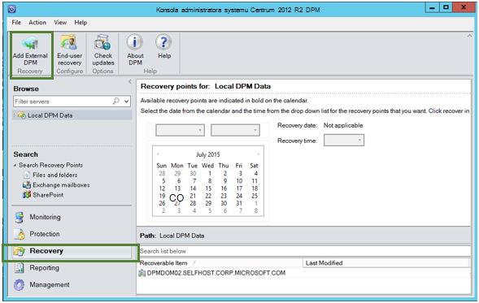

2. Pobierz nowe **magazynu poświadczeń** z magazynu skojarzonych z **serwera DPM** miejsce, w którym jest ich odzyskania danych, wybierz serwer DPM na liście serwerów DPM zarejestrowanych w kopii zapasowej magazynu i podaj **szyfrowania hasło** skojarzone z serwerem DPM, którego dane jest ich odzyskania.

    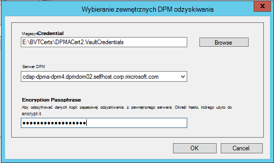

    >[AZURE.NOTE] Tylko serwery DPM skojarzone z tym samym magazynu rejestracji można odzyskać dane innych osób.

    Po pomyślnym dodaniu serwera DPM zewnętrznych mogą przeglądać dane zewnętrzne serwera DPM i lokalnego serwera DPM na karcie **odzyskiwania** .

3. Przejrzyj listę dostępnych serwerów produkcyjnych chroniony przez serwer DPM zewnętrznych i wybierz źródło danych.

    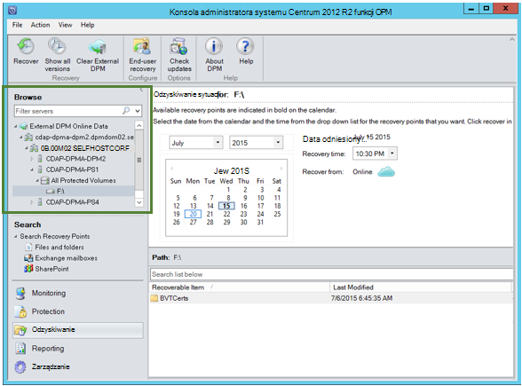

4. Wybierz **miesiąc i rok** z **punktów odzyskiwania** listy rozwijanej wybierz wymagany **odzyskiwania Data** utworzenia punkt odzyskiwania i wybierz **czasu**.

    Zostanie wyświetlona lista plików i folderów w dolnym okienku, który może być przeglądany i odzyskać w dowolnej lokalizacji.

    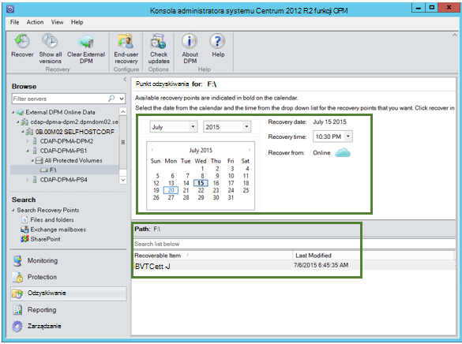

5. Kliknij prawym przyciskiem myszy odpowiedni element, a następnie kliknij polecenie **Odzyskaj**.

    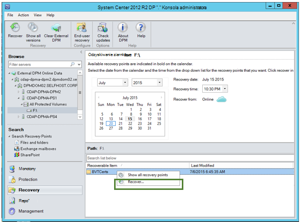

6. Przejrzyj **Odzyskiwanie zaznaczenia**. Upewnij się, dane i czas ich odzyskania kopii zapasowej, a także źródło, z którego utworzono kopii zapasowej. Jeśli zaznaczenie jest niepoprawny, kliknij przycisk **Anuluj** , aby przejść z powrotem do odzyskiwania tab, aby zaznaczyć punkt odpowiednie odzyskiwania. Jeśli zaznaczenie jest poprawny, kliknij przycisk **Dalej**.

    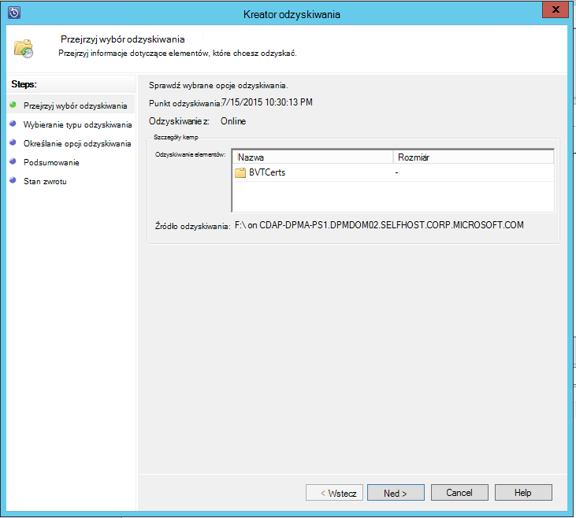

7. Wybierz pozycję **Odzyskaj do innej lokalizacji**. **Przejdź** do odpowiedniej lokalizacji dla odzyskiwania.

    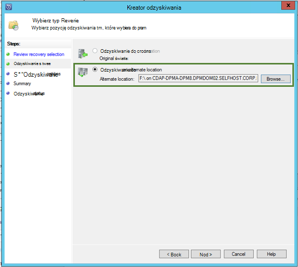

8. Wybierz opcję dotyczących **tworzenia kopii**, **Pomiń**lub **Zastąp**.
    - **Tworzenie kopii** utworzy kopię pliku w przypadku konfliktu nazwy nie istnieje.
    - **Pomiń** pominie odzyskiwania tego pliku w przypadku konfliktu nazwy nie istnieje.
    - **Zastąp** spowoduje zastąpienie istniejącego kopiowanie w lokalizacji określonej w przypadku konfliktu nazwy.

    Wybierz odpowiednią opcję, aby **przywrócić zabezpieczeń**. Możesz zastosować ustawienia zabezpieczeń komputera docelowego miejsce, w którym jest ich odzyskania danych lub ustawienia zabezpieczeń, które były stosowane do produktu w czasie utworzone punkt odzyskiwania.

    Określ, czy po ukończeniu odzyskiwania pomyślnie zostanie wysłane **powiadomienie** .

    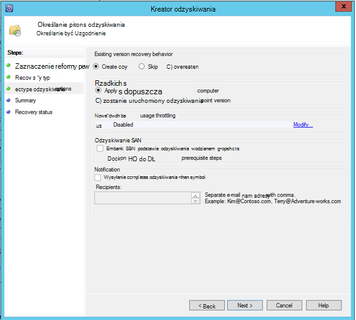

9. Ekran **podsumowania** zawiera listę opcji wybranych pory. Po kliknięciu przycisku **"Odzyskiwanie"**dane zostaną przywrócone do lokalizacji odpowiedniego lokalnego.

    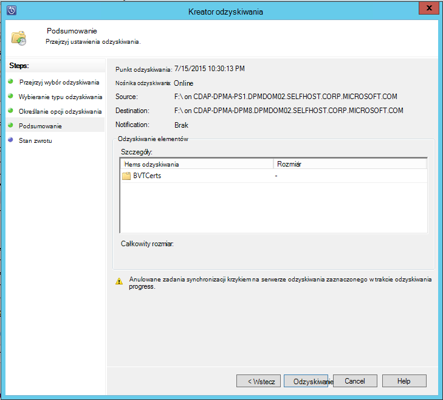

    >[AZURE.NOTE] Na karcie **monitorowania** serwera DPM można monitorować zadania odzyskiwania.

    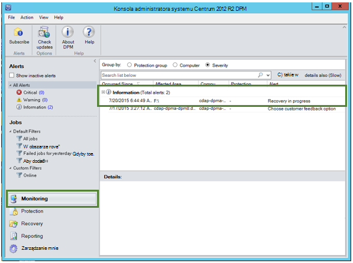

10. Na karcie **Odzyskiwanie** serwera DPM, aby usunąć widok serwera DPM zewnętrznego, możesz kliknąć **Wyczyść DPM zewnętrznych** .

    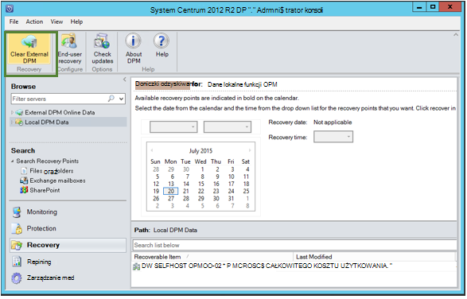

## Rozwiązywanie problemów z komunikaty o błędach
|Wartość nie. |  Komunikat o błędzie | Procedura rozwiązywania problemów |
| :-------------: |:-------------| :-----|
|1.|        Ten serwer nie jest zarejestrowany do magazynu określony przez magazynu poświadczeń.|  **Przyczyny:** Ten błąd pojawia się, gdy wybrany plik poświadczeń magazynu nie należy do magazynu kopii zapasowej, skojarzonych z serwerem DPM, na którym jest podejmowana próba nawiązania odzyskiwania.   **Rozdzielczość:** Pobierz plik magazynu poświadczeń z magazynu kopii zapasowej, do którego serwer DPM jest zarejestrowany.|
|2.|        Odzyskania danych nie jest dostępna albo wybrany serwer nie jest serwerem DPM.|   **Przyczyny:** Istnieją ma innych serwerów DPM z DPM 2012 R2 UR7 zarejestrowanych do magazynu kopii zapasowej, serwerów DPM z DPM 2012 R2 UR7 nie zostały jeszcze przekazane metadane lub wybrany serwer nie jest serwerem DPM (czyli systemu Windows Server lub klienta w systemie Windows).   **Rozdzielczość:** W przypadku innych serwerów DPM zarejestrowane w kopii zapasowej magazynu upewnij się, SCDPM 2012 R2 UR7 i najnowszej kopii zapasowej Azure agenta są zainstalowane.  W przypadku innych serwerów DPM zarejestrowane w kopii zapasowej magazynu z DPM 2012 R2 UR7 poczekaj na dzień po zakończeniu instalacji UR7, aby rozpocząć proces odzyskiwania. Zadania są będzie Przekazywanie metadanych dla wszystkich wcześniej chronionych kopie zapasowe do chmury. Dane będą dostępne dla odzyskiwania.|
|3.|        Inny DPM serwer nie jest zarejestrowany do tego magazynu.|   **Przyczyny:** Inne DPM serwery są DPM 2012 R2 UR7 lub powyżej zarejestrowane do magazynu, z którego podjęto odzyskiwania. **Rozdzielczość:** W przypadku innych serwerów DPM zarejestrowane w kopii zapasowej magazynu upewnij się, SCDPM 2012 R2 UR7 i najnowszej kopii zapasowej Azure agenta są zainstalowane. W przypadku innych serwerów DPM zarejestrowane w kopii zapasowej magazynu z DPM 2012 R2 UR7 poczekaj na dzień po zakończeniu instalacji UR7, aby rozpocząć proces odzyskiwania. Zadania są będzie Przekazywanie metadanych dla wszystkich wcześniej chronionych kopie zapasowe do chmury. Dane będą dostępne dla odzyskiwania.|
|4.|        Hasło szyfrowania opisane nie jest zgodna z hasło skojarzone z serwerem następujące czynności:**<server name>**|  **Przyczyny:** Hasło szyfrowania używana podczas szyfrowania danych jest ich odzyskania danych serwera DPM jest niezgodna hasło szyfrowania opisane. Agent jest nie można odszyfrować danych. W związku z tym odzyskiwania zakończy się niepowodzeniem. **Rozdzielczość:** Podaj dokładnie samej hasło szyfrowania skojarzonych z serwerem DPM, w których dane są ich odzyskania.|

## Często zadawane pytania:
1. **Dlaczego nie mogę dodać zewnętrznego serwera DPM z innego serwera DPM po zainstalowaniu UR7 i najnowszych agent Azure Backup?**

    A) dla istniejących serwerów DPM ze źródeł danych, które są chronione w chmurze (przy użyciu starszej niż 7 zestawienie aktualizowanie pakietu zbiorczego aktualizacji) trzeba czekać co najmniej jeden dzień po zainstalowaniu UR7 i najnowszych agent Azure Backup uruchomić *serwera Dodawanie DPM zewnętrznych*. Jest to niezbędne do przekazania metadane grupy ochrony DPM Azure. Ten problem występuje po raz pierwszy za pośrednictwem są zadania.

2. **Co to jest minimalna wersja programu agent Azure Backup potrzebne?**

    A) Azure kopii zapasowej agenta minimalna wersja Aby włączyć tę funkcję jest 2.0.8719.0.  Azure wersji agent kopii zapasowej można weryfikować, przechodząc do panelu sterowania **>** elementów wszystkich Panelu sterowania **>** programy i funkcje **>** agenta usługi Microsoft Azure odzyskiwania. Jeśli wersja jest mniejsza niż 2.0.8719.0, Pobierz [najnowszą wersję agent kopii zapasowej Azure](https://go.microsoft.com/fwLink/?LinkID=288905) i zainstaluj.

    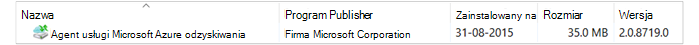

## Następny krok:
• [Azure kopii zapasowej — często zadawane pytania](backup-azure-backup-faq.md)
