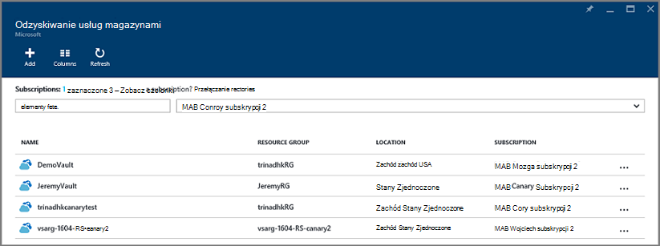

<properties
    pageTitle="Przywracanie z kopii zapasowej za pomocą portalu Azure maszyn wirtualnych | Microsoft Azure"
    description="Przywracanie Azure maszyn wirtualnych z punktu odzyskiwania za pomocą portalu Azure"
    services="backup"
    documentationCenter=""
    authors="markgalioto"
    manager="cfreeman"
    editor=""
    keywords="Przywracanie kopii zapasowych. jak przywrócić; punkt odzyskiwania;"/>

<tags
    ms.service="backup"
    ms.workload="storage-backup-recovery"
    ms.tgt_pltfrm="na"
    ms.devlang="na"
    ms.topic="article"
    ms.date="08/10/2016"
    ms.author="trinadhk; jimpark;"/>

# Przywracanie maszyn wirtualnych za pomocą Azure portal

> [AZURE.SELECTOR]
- [Przywracanie maszyny wirtualne w klasycznym portalu](backup-azure-restore-vms.md)
- [Przywracanie maszyny wirtualne w Azure portal](backup-azure-arm-restore-vms.md)

Ochrona danych, nie podejmując migawki danych w określonych odstępach czasu. Migawek są nazywane punktów odzyskiwania i są one przechowywane w magazynów usług odzyskiwania. Jeśli lub gdy jest to niezbędne do naprawy lub odbudowanie maszyny, można przywrócić maszyn wirtualnych z dowolnego punktów zapisanego odzyskiwania. Po przywróceniu punkt odzyskiwania zwracają lub przywrócić maszyn wirtualnych do stanu, gdy wykonano punkt odzyskiwania. W tym artykule wyjaśniono, jak przywrócić maszyny.

> [AZURE.NOTE] Azure występują dwa modele wdrożenia służące do tworzenia i pracy z zasobami: [Menedżer zasobów i klasyczny](../resource-manager-deployment-model.md). Ten artykuł zawiera informacje i procedury przywracania maszyny wirtualne wdrożony przy użyciu modelu Menedżera zasobów.

## Przywracanie punkt odzyskiwania

1. Zaloguj się do [portalu Azure](http://portal.azure.com/)

2. W Azure menu kliknij przycisk **Przeglądaj** , a następnie na liście usług, wpisz **Usługi odzyskiwania**. Na liście usług dostosowywany tak, aby wpisanych. Gdy zostanie wyświetlony **magazynów usługi odzyskiwania**, należy go zaznaczyć.

    

    Zostanie wyświetlona lista magazynów w subskrypcji.

    

3. Z listy wybierz magazynu skojarzonego z maszyn wirtualnych, chcesz przywrócić. Po kliknięciu magazyn, zostanie wyświetlona jego pulpitu nawigacyjnego.

    

4. Teraz, gdy jesteś na pulpicie nawigacyjnym magazynu. **Elementy kopii zapasowej** kafelka kliknij pozycję **maszyn wirtualnych Azure** do wyświetlenia maszyny wirtualne, skojarzony z magazynu.

    

    Karta **Elementy kopii zapasowej** zostanie otwarty i zostanie wyświetlone okno Lista Azure maszyn wirtualnych.

    

5. Z listy wybierz maszyn wirtualnych, aby otworzyć pulpitu nawigacyjnego. Pulpit nawigacyjny maszyn wirtualnych po otwarciu obszar monitorowania, który zawiera kafelków punktów przywracania.

    

6. Menu pulpit nawigacyjny maszyn wirtualnych kliknij przycisk **Przywróć**

    

    Zostanie wyświetlona karta przywracania.

    

7. Karta **Przywracanie** polecenie **punkt,** aby otworzyć karta **punktu przywracania wybierz** .

    

    Domyślnie w oknie dialogowym są wyświetlane wszystkie punkty przywracania z ostatnich 30 dni. Użyj wyświetlony **Filtr** , aby zmienić zakres czasu punktów przywracania. Domyślnie są wyświetlane punkty przywracania wszystkich spójności. Modyfikowanie filtru **przywrócić wszystkich punktów** zaznacz określone spójności punktów przywracania. Aby uzyskać więcej informacji na temat poszczególnych typów Przywracanie punktu, zobacz opis [spójności danych](./backup-azure-vms-introduction.md#data-consistency).  
    - Wybierz pozycję **Przywróć punktu spójności** z tej listy:
        - Punkty przywracania spójne awarii
        - Punkty przywracania spójne aplikacji
        - Plik punktów przywracania spójne
        - Wszystkie punkty przywracania.  

8. Wybierz punkt przywracania i kliknij **przycisk OK**.

    

    Karta **Przywracanie** zawiera zestawu punktu przywracania.

    

9. Na karta **Przywracanie** **Przywracanie konfiguracji** zostanie otwarty automatycznie po ustawieniu punkt przywracania.

    

## Wybieranie konfiguracji przywracanie maszyn wirtualnych

Teraz, gdy jest zaznaczony punkt przywracania, wybierz pozycję Konfiguracja przywracania maszyn wirtualnych. Umożliwia dostępne są następujące opcje dotyczące konfigurowania przywrócenie maszyn wirtualnych: Azure portal lub programu PowerShell.

> [AZURE.NOTE] Portal zapewnia opcję szybkiego tworzenia przywrócenie maszyn wirtualnych. Jeśli chcesz dostosować konfigurację maszyn wirtualnych to-be przywrócenie maszyn wirtualnych, za pomocą programu PowerShell przywracanie kopii zapasowej dysków i dołączyć je do wyboru konfiguracji maszyn wirtualnych. Zobacz [Przywracanie maszyn wirtualnych z konfiguracji sieci specjalnych](#restoring-vms-with-special-network-configurations).

1. Jeśli użytkownik nie są już istnieje, przejdź do karta **Przywracanie** . Upewnij się, **punkt przywracania** został wybrany i kliknij przycisk **Przywróć konfigurację** otworzyć karta **konfiguracji odzyskiwania** .

    

2. Karta **Przywracanie konfiguracji** wprowadź lub wybierz wartości dla każdego z następujących pól:
    - **Nazwa maszyn wirtualnych** - Podaj nazwę maszyn wirtualnych. Nazwa musi być unikatowa dla grupy zasobów (w przypadku maszyny wdrożony Menedżera zasobów) lub usługa w chmurze (na klasyczny maszyn wirtualnych). Nie można zastąpić maszyny wirtualnej, jeśli już istnieje w subskrypcji.
    - **Grupa zasobów** - Użyj istniejącej grupy zasobów lub Utwórz nowy. W przypadku przywracania klasyczny maszyn wirtualnych, określ nazwę nowej usługi w chmurze za pomocą tego pola. Jeśli tworzysz nową usługę grupy i chmurze zasobów, nazwa musi być globalnie unikatowe. Zazwyczaj nazwa usługi cloud jest skojarzony z adresem URL publicznej — na przykład: [cloudservice]. cloudapp.net. Jeśli próbujesz użyć nazwy dla chmurze zasobów grupy i usług w chmurze, który już został użyty, Azure przypisuje usługi zasobów w grupie/chmurze taką samą nazwę jak maszyn wirtualnych. Azure Wyświetla usługami grupy i chmurze zasobów i maszyny wirtualne nie zostanie skojarzone z dowolnymi grupami koligacji. Aby uzyskać więcej informacji zobacz [jak przeprowadzić migrację z grup koligacji regionalne wirtualną siecią (VNet)](../virtual-network/virtual-networks-migrate-to-regional-vnet.md).
    - **Wirtualna sieć** — wybierz wirtualną sieć (VNET), podczas tworzenia maszyn wirtualnych. Pole umożliwia VNETs wszystkie skojarzone z subskrypcją. Grupa zasobów maszyn wirtualnych jest wyświetlana w nawiasach.
    - **Podsieć** - Jeśli VNET ma podsieci, pierwszą podsieć jest zaznaczona domyślnie. Jeśli istnieją dodatkowe podsieci, zaznacz odpowiednie podsieci.
    - **Konto miejsca do magazynowania** — w tym menu zawiera listę kont miejsca do magazynowania w tym samym miejscu jako magazynu usługi odzyskiwania. Wybierając konto miejsca do magazynowania, wybierz konto, który udostępnia tej samej lokalizacji co magazynu usługi odzyskiwania. Konta miejsca do magazynowania, które są zbędne strefa nie są obsługiwane. Jeśli nie ma żadnych kont miejsca do magazynowania z tej samej lokalizacji co magazynu usługi odzyskiwania, należy utworzyć przed rozpoczęciem operacji przywracania. Typ replikacji konta miejsca do magazynowania jest wymieniony w nawiasach.

    > [AZURE.NOTE] W przypadku przywracania maszyn wirtualnych wdrożony Menedżera zasobów, musisz określić wirtualnej sieci (VNET). Wirtualna sieć (VNET) jest opcjonalne dla klasyczny maszyn wirtualnych.

3. Na karta **Przywracanie konfiguracji** kliknij **przycisk OK** , aby zakończyć konfigurację przywracania.

4. Karta **Przywracanie** polecenie **Przywracanie** wyzwalać operacji przywracania.

    

## Śledzenie operacji przywracania

Po wyzwolić przywracanie, usługa Kopia zapasowa tworzy zadanie do śledzenia operacji przywracania. Usługa Kopia zapasowa tworzy i tymczasowo wyświetla powiadomienie w obszarze powiadomień w portalu. Jeśli nie widzisz powiadomienie, możesz zawsze kliknij ikonę powiadomienia, aby wyświetlić powiadomienia.

Aby wyświetlić operacji podczas przetwarzania lub wyświetlanie po jego zakończeniu, Otwórz listę zadań kopii zapasowych.

1. W Azure menu kliknij przycisk **Przeglądaj** , a następnie na liście usług, wpisz **Usługi odzyskiwania**. Na liście usług dostosowywany tak, aby wpisanych. Gdy zostanie wyświetlony **magazynów usługi odzyskiwania**, należy go zaznaczyć.

    

    Zostanie wyświetlona lista magazynów w subskrypcji.

    

2. Z listy wybierz magazynu skojarzone z maszyn wirtualnych, możesz przywrócić. Po kliknięciu magazyn, zostanie wyświetlona jego pulpitu nawigacyjnego.

3. Na pulpicie nawigacyjnym magazynu **Zadaniami kopii zapasowej** kafelka kliknij pozycję **maszyn wirtualnych Azure** , aby wyświetlić zadania skojarzone z magazynu.

    

    Karta **Zadania kopii zapasowej** zostanie otwarty i zostanie wyświetlone okno Lista zadań.

    

## Przywracanie maszyny wirtualne za pomocą konfiguracji sieci specjalne
Istnieje możliwość kopia zapasowa i przywracanie maszyny wirtualne z następujących konfiguracji sieci specjalnych. Jednak tych konfiguracji wymagają niektóre szczególne uwarunkowania podczas przechodzenia przez proces przywracania.

- Maszyny wirtualne w obszarze równoważenia obciążenia (wewnętrznych i zewnętrznych)
- Maszyny wirtualne z wielu zastrzeżone adresy IP
- Maszyny wirtualne z kart

>[AZURE.IMPORTANT] Podczas tworzenia konfiguracji sieci specjalnych maszyny wirtualne, należy użyć programu PowerShell przekształcania maszyny wirtualne dyski przywrócone.

Aby w pełni odtworzyć maszyn wirtualnych po przywróceniu na dysku, wykonaj następujące czynności:

1. Przywracanie dysków z magazynu usługi odzyskiwania, przy użyciu [programu PowerShell](../backup-azure-vms-automation.md#restore-an-azure-vm)

2. Tworzenie konfiguracji maszyn wirtualnych wymagane dla usługi równoważenia obciążenia / wielu NIC-wielokrotności zastrzeżony adres IP przy użyciu poleceń cmdlet programu PowerShell i użyj go, aby utworzyć maszyn wirtualnych systemu potrzeby konfiguracji.
    - Tworzenie maszyn wirtualnych w usłudze w chmurze przy użyciu [usługi równoważenia obciążenia wewnętrznych](https://azure.microsoft.com/documentation/articles/load-balancer-internal-getstarted/)
    - Tworzenie maszyn wirtualnych, aby nawiązać połączenie [Internet przeciwległych równoważenia obciążenia] (https://azure.microsoft.com/en-us/documentation/articles/load-balancer-internet-getstarted/)
    - Tworzenie maszyn wirtualnych przy użyciu [kart](https://azure.microsoft.com/documentation/articles/virtual-networks-multiple-nics/)
    - Tworzenie maszyn wirtualnych przy użyciu [wielu zastrzeżone adresy IP](https://azure.microsoft.com/documentation/articles/virtual-networks-reserved-public-ip/)

## Następne kroki
Teraz, aby móc przywrócić pośrednictwem usługi SMS, zobacz artykuł dotyczący rozwiązywania problemów, aby uzyskać informacje na temat typowych błędów z maszyny wirtualne. Ponadto zapoznaj się z tego artykułu o zarządzaniu zadań za pomocą usługi maszyny wirtualne.

- [Rozwiązywanie problemów z błędami](backup-azure-vms-troubleshoot.md#restore)
- [Zarządzanie maszyn wirtualnych](backup-azure-manage-vms.md)
