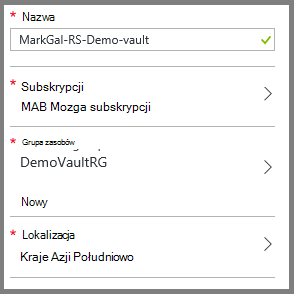
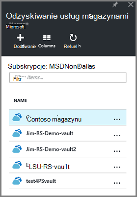
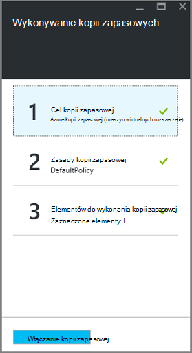

<properties
    pageTitle="Przygotowywanie środowiska do tworzenia kopii zapasowych wdrożony Menedżera zasobów maszyn wirtualnych | Microsoft Azure"
    description="Upewnij się, że środowisko jest gotowa do wykonywania kopii zapasowych maszyn wirtualnych platformy Azure"
    services="backup"
    documentationCenter=""
    authors="markgalioto"
    manager="cfreeman"
    editor=""
    keywords="wykonywanie kopii zapasowych; wykonywanie kopii zapasowej;"/>

<tags
    ms.service="backup"
    ms.workload="storage-backup-recovery"
    ms.tgt_pltfrm="na"
    ms.devlang="na"
    ms.topic="article"
    ms.date="08/21/2016"
    ms.author="trinadhk; jimpark; markgal;"/>


# <a name="prepare-your-environment-to-back-up-resource-manager-deployed-virtual-machines"></a>Przygotowania środowiska do tworzenia kopii zapasowych maszyn wirtualnych wdrożony Menedżera zasobów

> [AZURE.SELECTOR]
- [Model Menedżera zasobów](backup-azure-arm-vms-prepare.md)
- [Model klasyczny](backup-azure-vms-prepare.md)

Ten artykuł zawiera opis kroków do przygotowania środowiska do tworzenia kopii zapasowych maszyny wirtualnej wdrożony Menedżera zasobów (maszyn wirtualnych). Kroki przedstawione w procedury za pomocą portalu Azure.  

Usługa Azure kopii zapasowej ma dwóch typów magazynów (kopii zapasowej magazynów i odzyskiwania usług magazynów) do ochrony usługi maszyny wirtualne. Kopii zapasowej magazynu chroni maszyny wirtualne wdrożyć za pomocą modelu wdrożenia klasyczny. Magazynu usługi odzyskiwania chroni **maszyny wirtualne zarówno wdrożony klasyczny lub wdrożony Menedżera zasobów** . Ochrona maszyn wirtualnych wdrożony Menedżera zasobów, należy użyć magazynu usługi odzyskiwania.

>[AZURE.NOTE] Azure występują dwa modele wdrożenia służące do tworzenia i pracy z zasobami: [Menedżer zasobów i klasyczny](../resource-manager-deployment-model.md). Aby uzyskać szczegółowe informacje na temat pracy z modelu wdrożenia klasyczny maszyny wirtualne, zobacz [Przygotowanie środowiska do tworzenia kopii zapasowych Azure maszyn wirtualnych](backup-azure-vms-prepare.md) .

Zanim będzie można chronić i tworzenie kopii zapasowych maszyny wirtualnej wdrożony Menedżera zasobów (maszyn wirtualnych), upewnij się, że istnieje następujące wymagania wstępne:

- Tworzenie magazynu usługi odzyskiwania (lub identyfikowanie istniejącego magazynu usługi odzyskiwania) *w tym samym miejscu co do maszyn wirtualnych*.
- Wybierz scenariusz, opracowanie zasad kopii zapasowej i definiowanie elementów w celu ochrony.
- Sprawdź instalację maszyn wirtualnych agenta komputera wirtualnych.
- Łączność sieciowa wyboru

Jeśli wiadomo, że te warunki już istnieje w środowisku przejdź na [Wykonywanie kopii zapasowej artykułu maszyny wirtualne](backup-azure-vms.md). Jeśli chcesz skonfigurować, lub zaznacz dowolną z następujących wstępnych ten artykuł prowadzi Cię przez kroki umożliwiające przygotowanie tego wymagania wstępne.


## <a name="limitations-when-backing-up-and-restoring-a-vm"></a>Ograniczenia podczas wykonywania kopii zapasowych i przywracanie maszyn wirtualnych

Aby przygotować środowisko, należy zapoznać się z ograniczeniami.

- Wykonywanie kopii zapasowych maszyn wirtualnych z więcej niż 16 dyski danych nie jest obsługiwane.
- Wykonywanie kopii zapasowych maszyn wirtualnych z zastrzeżonego adresu IP, a nie określonych punktów końcowych nie jest obsługiwane.
- Wykonywanie kopii zapasowych maszyn wirtualnych Linux z rozszerzeniem Docker nie jest obsługiwane. 
- Dane kopii zapasowej nie zawiera dyski sieci zainstalowany dołączone do maszyn wirtualnych. 
- Zastępowanie istniejących maszyn wirtualnych podczas przywracania nie jest obsługiwana. Jeśli spróbujesz przywracanie maszyn wirtualnych, gdy istnieje maszyn wirtualnych, przywracanie zakończy się niepowodzeniem.
- Region krzyżowe kopia zapasowa i przywracanie nie jest obsługiwane.
- Użytkownik może wykonywać kopie zapasowe maszyn wirtualnych we wszystkich regionach publicznej Azure (zobacz [Lista kontrolna](https://azure.microsoft.com/regions/#services) obsługiwanych regionów). Jeśli dzisiaj jest nieobsługiwane region, którego szukasz, nie pojawiał się na liście rozwijanej podczas tworzenia magazynu.
- Można wykonywać kopie zapasowe maszyn wirtualnych tylko dla wersji wybierz systemu operacyjnego:
  - **Linux**: Azure kopia zapasowa obsługuje [listy dystrybucji, które są zatwierdzone przez Azure](../virtual-machines/virtual-machines-linux-endorsed-distros.md) z wyjątkiem Core systemu operacyjnego Linux.  Innych form podziału Przesuń i-właścicielem-Linux może również działają jak agenta maszyn wirtualnych jest dostępna na komputerze wirtualnych i obsługę Python istnieje.
  - **Windows Server**: w wersji wcześniejszej niż Windows Server 2008 R2 nie są obsługiwane.
- Przywracanie kontrolera domeny maszyn wirtualnych (kontrolera domeny), który jest częścią konfiguracji kontrolera domeny wiele jest obsługiwana tylko przy użyciu programu PowerShell. Dowiedz się więcej o [Przywracanie kontrolera domeny kontrolera domeny wielokrotne](backup-azure-restore-vms.md#restoring-domain-controller-vms).
- Przywracanie maszyn wirtualnych, które mają następujące konfiguracji sieci specjalnych jest obsługiwane tylko przy użyciu programu PowerShell. Maszyny wirtualne utworzony przy użyciu przepływu pracy Przywróć w interfejsie użytkownika nie będą mieć te konfiguracji sieci, po zakończeniu operacji przywracania. Aby dowiedzieć się więcej, zobacz [Przywracanie maszyny wirtualne z konfiguracji sieci specjalnych](backup-azure-restore-vms.md#restoring-vms-with-special-netwrok-configurations).
  - Maszyn wirtualnych w obszarze konfigurację usługi równoważenia obciążenia (wewnętrznych i zewnętrznych)
  - Maszyn wirtualnych z wielu zastrzeżone adresy IP
  - Maszyn wirtualnych z wielu kart sieciowych

## <a name="create-a-recovery-services-vault-for-a-vm"></a>Tworzenie magazynu usługi odzyskiwania dla maszyn wirtualnych

Magazynu usługi odzyskiwania jest jednostką, której są magazynowane kopii zapasowych i odzyskiwania punktów, które zostały utworzone w czasie. Magazyn usług odzyskiwania zawiera również zasad kopii zapasowej, skojarzonych z chronionego maszyn wirtualnych.

Aby utworzyć magazynu usługi odzyskiwania:

1. Zaloguj się do [portalu Azure](https://portal.azure.com/).

2. W menu Centrum kliknij przycisk **Przeglądaj** , a następnie na liście zasobów, wpisz **Usługi odzyskiwania**. Po rozpoczęciu wpisywania, będzie filtrować listę według dane wejściowe. Kliknij pozycję **magazynu usługi odzyskiwania**.

     <br/>

    Zostanie wyświetlona lista magazynów usługi odzyskiwania.

3. W menu **usługi odzyskiwania magazynów** kliknij przycisk **Dodaj**.

    

    Zostanie wyświetlona karta magazynu usługi odzyskiwania monituje o podanie **nazwy**, **subskrypcji**, **Grupa zasobów**i **lokalizacji**.

    

4. W polu **Nazwa**wpisz przyjazną nazwę identyfikującą magazyn. Nazwa musi być unikatowa dla Azure subskrypcji. Wpisz nazwę, która zawiera od 2 do 50 znaków. Musi rozpoczynać się od litery i mogą zawierać tylko litery, cyfry i łączniki.

5. Kliknij **subskrypcję** , aby wyświetlić listę dostępnych subskrypcji. Jeśli nie masz pewności, jakie subskrypcję, należy użyć wartości domyślnej (lub sugerowane) subskrypcji. Będzie wiele opcji do wyboru tylko wtedy, gdy konto organizacji jest skojarzony z wiele subskrypcji Azure.

6. Kliknij pozycję **Grupa zasobów** , aby wyświetlić listę dostępnych grup zasobów, lub kliknij przycisk **Nowy** , aby utworzyć nową grupę zasobów. Aby uzyskać pełne informacje dotyczące grup zasobów zobacz [Omówienie Menedżera zasobów Azure](../azure-resource-manager/resource-group-overview.md)

7. Kliknij **miejsce** , aby wybrać regionu geograficznego dla magazyn. Magazynu **musi** znajdować się w tym samym regionie jako maszyn wirtualnych, które mają być chronione.

    >[AZURE.IMPORTANT] Jeśli masz pewności co do lokalizacji, w którym istnieje usługi maszyn wirtualnych, zamknąć okno dialogowe Tworzenie magazynu i przejdź do listy maszyn wirtualnych w portalu. Jeśli masz maszyn wirtualnych w wielu regionów, będzie konieczne tworzenie magazynu usługi odzyskiwania w każdym regionie. Tworzenie magazynu w pierwszej lokalizacji przed przejściem do następnej lokalizacji. Istnieje potrzeba określania kont miejsca do magazynowania do przechowywania danych kopii zapasowej — magazynu usługi odzyskiwania i usługi Azure kopii zapasowej rozwiązać automatycznie.

8. Kliknij przycisk **Utwórz**. Może upłynąć trochę czasu, zanim magazynu usługi odzyskiwania ma zostać utworzony. Monitorowanie powiadomienia o stanie w górnym obszarze po prawej stronie w portalu. Po utworzeniu z magazynu jest wyświetlany na liście magazynów usługi odzyskiwania.

    

    Teraz, gdy został utworzony z magazynu, Dowiedz się, jak ustawić replikacji miejsca do magazynowania.

## <a name="set-storage-replication"></a>Ustawianie replikacji miejsca do magazynowania

Opcja replikacji magazynowania umożliwia wybranie zbędne geo miejsca do magazynowania i lokalnie zbędne miejsca do magazynowania. Domyślnie do magazynu ma zbędne geo miejsca do magazynowania. Pozostaw wybraną opcję do magazynu geo zbędne w przypadku kopii zapasowej podstawowego. Wybierz opcję lokalnie zbędne miejsca do magazynowania, jeśli chcesz tańsze opcja, która nie jest bardzo jako trwałe. Przeczytaj więcej o tym [zbędne geo](../storage/storage-redundancy.md#geo-redundant-storage) i [lokalnie zbędne](../storage/storage-redundancy.md#locally-redundant-storage) opcje przechowywania w [Omówienie replikacji magazyn Azure](../storage/storage-redundancy.md).

Aby zmienić ustawienie replikacji miejsca do magazynowania:

1. Wybierz pozycję usługi magazynu, aby otworzyć pulpitu nawigacyjnego magazynu i karta Ustawienia. Jeśli karta **Ustawienia** nie zostanie otwarty, kliknij pozycję **wszystkie ustawienia** na pulpicie nawigacyjnym magazynu.

2. Karta **Ustawienia** wybierz polecenie **Kopia zapasowa infrastruktury** > **Konfiguracji kopii zapasowej** , aby otworzyć karta **Konfiguracji kopii zapasowej** . Na karta **Konfiguracji kopii zapasowej** wybierz opcję replikacji miejsca do magazynowania z magazynu.

    

    Po wybraniu opcji miejsca do magazynowania dla swojego magazynu, możesz przystąpić do skojarzyć maszyn wirtualnych magazyn. Aby rozpocząć skojarzenia, należy wykrywanie i zarejestrować Azure maszyn wirtualnych.


## <a name="select-a-backup-goal-set-policy-and-define-items-to-protect"></a>Wybierz pozycję Cel kopii zapasowej, ustawianie zasad i definiowanie elementów w celu ochrony

Przed zarejestrowaniem maszyn wirtualnych z magazynu, należy uruchomić proces odnajdowanie, aby upewnić się, że wszelkie nowe maszyn wirtualnych, które zostały dodane do subskrypcji są oznaczane. Kwerendy proces Azure listy maszyn wirtualnych w subskrypcji, wraz z dodatkowymi informacjami, takich jak nazwa usługi cloud i regionu. W portalu usługi Azure scenariusz odwołuje się do mają wprowadzone do magazynu usługi odzyskiwania. Zasady są harmonogramu jak często i kiedy punktów odzyskiwania są pobierane. Zasady zawierają także zakres przechowywania dla punktów odzyskiwania.

1. Jeśli masz już Otwórz magazynu usługi odzyskiwania, przejdź do kroku 2. Jeśli nie masz usługi odzyskiwania magazynu otwarte, ale znajdują się w portalu Azure, w menu Centrum kliknij przycisk **Przeglądaj**.

  - Na liście zasobów wpisz **Usługi odzyskiwania**.
  - Po rozpoczęciu wpisywania, będzie filtrować listę według dane wejściowe. Gdy zostanie wyświetlony **magazynów usługi odzyskiwania**, kliknij go.

     <br/>

    Zostanie wyświetlona lista magazynów usługi odzyskiwania.
  - Na liście usługi odzyskiwania magazynów zaznacz magazynu.

    Zostanie otwarte na pulpicie nawigacyjnym wybranego magazynu.

    

2. Z menu pulpit nawigacyjny magazynu kliknij pozycję Otwórz karta kopii zapasowej **kopii zapasowej** .

    

    Gdy zostanie otwarta karta, usługa Kopia zapasowa wyszukuje wszelkie nowe maszyny wirtualne w subskrypcji.

    

3. Na karta kopii zapasowej kliknij przycisk **Cel kopia zapasowa** , otworzyć karta cel kopii zapasowej.

    

4. Na karta kopii zapasowej cel ustaw **miejsce, w którym działa z pracą** Azure i **co ma zawierać kopia zapasowa** maszyn wirtualnych, a następnie kliknij **przycisk OK**.

    Karta Kopia zapasowa cel zostaje zamknięte, a zostanie wyświetlona karta Zasady kopii zapasowej.

    

5. Na karta Zasady kopii zapasowej wybierz zasady kopii zapasowej, który chcesz zastosować do magazyn, a następnie kliknij **przycisk OK**.

    

    Szczegółowe informacje o domyślnych zasad znajdują się w sekcji szczegółów. Jeśli chcesz utworzyć nową zasadę, wybierz polecenie **Utwórz nowy** z menu rozwijanego. Menu rozwijane udostępnia opcję przełączenia czas podczas migawki jest, 7 PM. Aby uzyskać instrukcje dotyczące określania zasady tworzenia kopii zapasowych Zobacz [Definiowanie zasady tworzenia kopii zapasowych](backup-azure-vms-first-look-arm.md#defining-a-backup-policy). Po kliknięciu przycisku **OK**kopii zapasowej zasad jest skojarzony z magazynu.

    Następnie wybierz maszyny wirtualne skojarzyć z magazynu.

6. Wybierz pozycję maszyn wirtualnych, aby skojarzyć z określonej zasady, a następnie kliknij przycisk **Wybierz**.

    

    Jeśli nie widzisz odpowiedniej Głosowa, sprawdź, czy istnieje go w tym samym miejscu Azure jako magazynu usługi odzyskiwania.

7. Teraz, gdy zdefiniowano wszystkie ustawienia magazyn w karta kopii zapasowej kliknij przycisk **Włącz kopii zapasowych** w dolnej części strony. Magazyn i maszyny wirtualne wdrożona zasady.

    

Następnej fazy przygotowania instaluje agenta maszyn wirtualnych lub upewnić się, że Agent maszyn wirtualnych jest zainstalowany.


## <a name="install-the-vm-agent-on-the-virtual-machine"></a>Agent maszyn wirtualnych zostaną zainstalowane na komputerze wirtualnych

Agent maszyn wirtualnych Azure musi być zainstalowany na komputerze wirtualnych Azure rozszerzenia kopii zapasowej do pracy. Jeśli do maszyn wirtualnych została utworzona z galerii Azure, następnie agenta maszyn wirtualnych jest już na komputerze wirtualnych. Te informacje są pod warunkiem w sytuacjach, gdzie są *nie* przy użyciu maszyny utworzony z galerii Azure — na przykład, że maszyny po migracji z centrum danych lokalnych. W takim przypadku Agent maszyn wirtualnych należy zainstalować w celu ochrony maszyny wirtualnej.

Informacje na temat [sposobu instalowania agenta maszyn wirtualnych](../virtual-machines/virtual-machines-windows-classic-manage-extensions.md)i [Agent maszyn wirtualnych](https://go.microsoft.com/fwLink/?LinkID=390493&clcid=0x409) .

Jeśli masz problemy z kopii zapasowych maszyn wirtualnych Azure, sprawdź, czy Agent maszyn wirtualnych Azure jest poprawnie zainstalowany na komputerze wirtualnych (zobacz poniższą tabelę). Jeśli utworzono niestandardowych maszyn wirtualnych, [Upewnij się, że jest zaznaczone pole wyboru **Zainstaluj agenta maszyn wirtualnych** ](../virtual-machines/virtual-machines-windows-classic-agents-and-extensions.md) przed maszyny wirtualnej jest obsługi administracyjnej.

Poniższa tabela zawiera dodatkowe informacje o agenta maszyn wirtualnych dla systemu Windows i Linux oraz maszyny wirtualne.

| **Operacja** | **Systemu Windows** | **Linux** |
| --- | --- | --- |
| Instalowanie agenta maszyn wirtualnych | <li>Pobierz i zainstaluj [agenta MSI](http://go.microsoft.com/fwlink/?LinkID=394789&clcid=0x409). Konieczne będzie uprawnienia administratora, aby ukończyć instalację. <li>[Aktualizowanie właściwości maszyn wirtualnych](http://blogs.msdn.com/b/mast/archive/2014/04/08/install-the-vm-agent-on-an-existing-azure-vm.aspx) oznaczającą, że agent jest zainstalowany. | <li> Zainstaluj najnowszą wersję [agenta Linux](https://github.com/Azure/WALinuxAgent) z GitHub. Konieczne będzie uprawnienia administratora, aby ukończyć instalację. <li> [Aktualizowanie właściwości maszyn wirtualnych](http://blogs.msdn.com/b/mast/archive/2014/04/08/install-the-vm-agent-on-an-existing-azure-vm.aspx) oznaczającą, że agent jest zainstalowany. |
| Aktualizowanie agenta maszyn wirtualnych | Aktualizowanie agenta maszyn wirtualnych jest tak proste, jak ponownie zainstalować [plików binarnych agenta maszyn wirtualnych](http://go.microsoft.com/fwlink/?LinkID=394789&clcid=0x409). <br>Upewnij się, że nie wykonywanie kopii zapasowej jest uruchomiona podczas aktualizowania agenta maszyn wirtualnych. | Postępuj zgodnie z instrukcjami na temat [aktualizowania agenta maszyn wirtualnych Linux ](../virtual-machines-linux-update-agent.md). <br>Upewnij się, że nie wykonywanie kopii zapasowej jest uruchomiona podczas aktualizowania agenta maszyn wirtualnych. |
| Sprawdzanie poprawności instalacji agenta maszyn wirtualnych | <li>Przejdź do folderu *C:\WindowsAzure\Packages* w maszyn wirtualnych Azure. <li>Powinien znajdować się plik WaAppAgent.exe Prezentuj.<li> Kliknij prawym przyciskiem myszy plik, przejdź do **Właściwości**, a następnie wybierz kartę **Szczegóły** . Pole wersji produktu należy 2.6.1198.718 lub nowszym. | N/D! |


### <a name="backup-extension"></a>Rozszerzenie kopii zapasowej

Po zainstalowaniu na komputerze wirtualnych agenta maszyn wirtualnych usługi Azure kopii zapasowej instaluje kopii zapasowej rozszerzenia agenta maszyn wirtualnych. Usługa Azure kopii zapasowej bezproblemowo uaktualni i poprawki rozszerzenie kopii zapasowej.

Rozszerzenie kopii zapasowej jest zainstalowany przez usługę kopii zapasowej, czy jest uruchomiony maszyn wirtualnych. Bieżąca maszyn wirtualnych zawiera największe prawdopodobieństwo uzyskania punkt odzyskiwania spójną z aplikacją. Jednak usługa Azure kopia zapasowa będzie nadal do tworzenia kopii zapasowych maszyn wirtualnych, nawet jeśli jest wyłączona, a nie można zainstalować rozszerzenia. Jest to nazywane w trybie Offline maszyn wirtualnych. W tym przypadku punkt odzyskiwania będą *spójne ze stanem awarii*.


## <a name="network-connectivity"></a>Łączność sieciowa

Aby można było zarządzać migawki maszyn wirtualnych, rozszerzenie kopii zapasowej wymaga łączności z programem Azure publicznych adresów IP. Bez prawo łączność z Internetem limit czasu żądania HTTP maszyny wirtualnej i wykonywanie kopii zapasowej kończy się niepowodzeniem. Jeśli wdrożenia występują ograniczenia dostępu w miejscu (za pośrednictwem sieci grupy zabezpieczeń (NSG), na przykład), wybierz jedną z następujących opcji dostarczania wyczyść ścieżki ruchu kopii zapasowej:

- [Zakresy adresów IP centrum danych Azure listy sprawdzonej](http://www.microsoft.com/en-us/download/details.aspx?id=41653) — zobacz artykuł instrukcje w sposób do listy sprawdzonej adresów IP.
- Wdrażanie serwera proxy HTTP kierowania ruchu sieciowego.

Podczas wybierania opcji należy korzystnych rozwiązań są między zarządzania, kontrolę i koszt.

|Opcja|Zalety|Wady|
|------|----------|-------------|
|Zakresy adresów IP listy sprawdzonej| Nie dodatkowych kosztów.<br><br>Do otwierania programu access w NSG, należy użyć polecenia cmdlet <i>Set-AzureNetworkSecurityRule</i> . | Złożony, aby zarządzać nimi w dotkniętej problemem zakresów adresów IP zmiany w czasie.<br><br>Zapewnia dostęp do całego Azure i nie tylko miejsca do magazynowania.|
|Serwer proxy HTTP| Szczegółowe sterowanie na serwerze proxy przechowywania dozwolone adresy URL.<br>Pojedynczy punkt Internet dostęp do maszyny wirtualne.<br>Nie temat do zmiany adresu Azure IP.| Dodatkowe koszty systemie maszyny oprogramowanie serwera proxy.|

### <a name="whitelist-the-azure-datacenter-ip-ranges"></a>Zakresy adresów IP listy sprawdzonej Azure centrum danych

Do listy sprawdzonej zakresów adresów IP centrum danych Azure, zobacz [Azure witryny sieci Web](http://www.microsoft.com/en-us/download/details.aspx?id=41653) , aby uzyskać szczegółowe informacje na zakresów adresów IP i instrukcje.

### <a name="using-an-http-proxy-for-vm-backups"></a>Za pomocą serwer proxy HTTP kopii zapasowych maszyn wirtualnych
Podczas wykonywania kopii zapasowej maszyny, kopii zapasowej rozszerzenie na maszyn wirtualnych polecenia są wysyłane migawkę Zarządzanie magazynem usługi Azure za pomocą interfejsu API HTTPS. Skierować ruch rozszerzenia kopii zapasowej za pośrednictwem serwera proxy HTTP, ponieważ jest to jedynie składnika skonfigurowany w celu uzyskiwania dostępu do publicznego Internetu.

>[AZURE.NOTE] Istnieje Brak rekomendacji dla oprogramowania serwera proxy, który ma być używany. Upewnij się, wybierz pozycję serwer proxy, który jest zgodny z poniższych kroków konfiguracji.

Na przykład poniższej ilustracji przedstawiono kroki konfiguracji trzy konieczne użycie serwer proxy HTTP:

- Aplikacja maszyn wirtualnych kieruje cały ruch HTTP do publicznego Internetu przez maszyn wirtualnych serwera Proxy.
- Serwer proxy maszyn wirtualnych zezwala na ruch przychodzący z maszyny wirtualne w wirtualnej sieci.
- Grupa zabezpieczeń sieci (NSG) o nazwie NF blokowania musi zabezpieczeń reguły zezwalanie ruchu wychodzącego ruchu internetowego z maszyn wirtualnych serwera Proxy.


Aby użyć serwer proxy HTTP do komunikowania się z Internetem, wykonaj następujące czynności:

#### <a name="step-1-configure-outgoing-network-connections"></a>Krok 1. Konfigurowanie połączeń wychodzących

###### <a name="for-windows-machines"></a>W przypadku komputerów z systemem Windows
Spowoduje to skonfigurować konfiguracji serwera proxy dla lokalnego konta System.

1. Pobierz [PsExec](https://technet.microsoft.com/sysinternals/bb897553)
2. Uruchom następujące polecenie z podwyższonym poziomem uprawnień wiersza

     ```
     psexec -i -s "c:\Program Files\Internet Explorer\iexplore.exe"
     ```
     Zostanie otwarta okno programu internet explorer.
3. Przejdź do Narzędzia -> Opcje internetowe -> połączenia -> Ustawienia sieci LAN.
4. Sprawdź ustawienia serwera proxy dla konto systemowe. Ustawianie adresu IP serwera Proxy i portu.
5. Zamknij program Internet Explorer.

Skonfiguruje konfiguracji serwera proxy dla komputera i będzie używany do dowolnego ruchu wychodzącego protokołu HTTP/HTTPS.

Jeśli masz ustawienia serwera proxy dla bieżącego konta użytkownika (nie lokalnego konta System), należy użyć następującego skryptu nadawać je SYSTEMACCOUNT:

```
   $obj = Get-ItemProperty -Path Registry::”HKEY_CURRENT_USER\Software\Microsoft\Windows\CurrentVersion\Internet Settings\Connections"
   Set-ItemProperty -Path Registry::”HKEY_USERS\S-1-5-18\Software\Microsoft\Windows\CurrentVersion\Internet Settings\Connections" -Name DefaultConnectionSettings -Value $obj.DefaultConnectionSettings
   Set-ItemProperty -Path Registry::”HKEY_USERS\S-1-5-18\Software\Microsoft\Windows\CurrentVersion\Internet Settings\Connections" -Name SavedLegacySettings -Value $obj.SavedLegacySettings
   $obj = Get-ItemProperty -Path Registry::”HKEY_CURRENT_USER\Software\Microsoft\Windows\CurrentVersion\Internet Settings"
   Set-ItemProperty -Path Registry::”HKEY_USERS\S-1-5-18\Software\Microsoft\Windows\CurrentVersion\Internet Settings" -Name ProxyEnable -Value $obj.ProxyEnable
   Set-ItemProperty -Path Registry::”HKEY_USERS\S-1-5-18\Software\Microsoft\Windows\CurrentVersion\Internet Settings" -Name Proxyserver -Value $obj.Proxyserver
```

>[AZURE.NOTE] Jeśli możesz zaobserwować "(407) uwierzytelnianie serwera Proxy wymagane" w dzienniku serwera proxy, zaznacz pole wyboru uwierzytelnienie jest poprawnie skonfigurowany.

######<a name="for-linux-machines"></a>W przypadku komputerów Linux

Dodaj następujący wiersz do ```/etc/environment``` pliku:

```
http_proxy=http://<proxy IP>:<proxy port>
```

Dodaj następujące wiersze do ```/etc/waagent.conf``` pliku:

```
HttpProxy.Host=<proxy IP>
HttpProxy.Port=<proxy port>
```

#### <a name="step-2-allow-incoming-connections-on-the-proxy-server"></a>Krok 2. Zezwól na połączenia przychodzące na serwerze proxy:

1. Na serwerze proxy otwórz Zaporę systemu Windows. Najprostszym sposobem na dostęp do zapory jest wyszukiwanie Zapora systemu Windows z zabezpieczeniami zaawansowanymi.

    

2. W oknie dialogowym Zapora systemu Windows kliknij prawym przyciskiem myszy **Reguły przychodzące** i kliknij przycisk **Nowa reguła...**.

    

3. W oknie dialogowym **Kreator nowej reguły przychodzącej**wybierz opcję **Niestandardowy** **Typ reguły** , a następnie kliknij przycisk **Dalej**.
4. Na stronie, aby wybrać **Program**wybierz pozycję **Wszystkie programy** , a następnie kliknij przycisk **Dalej**.

5. Na stronie **Protokoły i porty** wprowadź następujące informacje, a następnie kliknij przycisk **Dalej**:

    

    - *Protocol (protokół)* w obszarze Typ wybierz pozycję *TCP*
    - *port lokalny* wybierz *Określone porty*, w polu poniżej określić ```<Proxy Port>``` który został skonfigurowany.
    - *port zdalny* wybierz *Wszystkie porty*

    Do końca kreatora kliknij Dosunięty do końca i nadaj nazwę tej reguły.

#### <a name="step-3-add-an-exception-rule-to-the-nsg"></a>Krok 3. Dodawanie reguły wyjątków do NSG:

W wierszu polecenia programu PowerShell Azure wprowadź następujące polecenie:

Następujące polecenie dodaje wyjątek do NSG. Ten wyjątek umożliwia ruchu TCP z dowolnego portu na 10.0.0.5 dowolny adres internetowy na porcie 443 (HTTPS) lub 80 (HTTP). Jeśli potrzebujesz określonego portu w publicznego Internetu, pamiętaj dodać port do ```-DestinationPortRange``` także.

```
Get-AzureNetworkSecurityGroup -Name "NSG-lockdown" |
Set-AzureNetworkSecurityRule -Name "allow-proxy " -Action Allow -Protocol TCP -Type Outbound -Priority 200 -SourceAddressPrefix "10.0.0.5/32" -SourcePortRange "*" -DestinationAddressPrefix Internet -DestinationPortRange "80-443"
```


*Kroki przy użyciu określonej nazwy i wartości w tym przykładzie. Użyj nazwy i wartości dla swojego wdrożenia wprowadzając, lub wycinanie i wklejanie informacji do kodu.*


Teraz, gdy wiadomo, że masz połączenie sieciowe, możesz przystąpić do tworzenia kopii zapasowych do maszyn wirtualnych. Zobacz [Tworzenie kopii zapasowej maszyny wirtualne wdrożony Menedżera zasobów](backup-azure-arm-vms.md).

## <a name="questions"></a>Masz pytania?
Jeśli masz pytania lub w przypadku dowolnej funkcji, którą chcesz wyświetlić dołączone, [Prześlij opinię](http://aka.ms/azurebackup_feedback).

## <a name="next-steps"></a>Następne kroki
Teraz, gdy już przygotowane środowiska tworzenia kopii zapasowych z maszyn wirtualnych, logiczne następnym krokiem jest utworzenie kopii zapasowej. Artykuł w planowaniu zawiera bardziej szczegółowe informacje na temat wykonywania kopii zapasowych maszyny wirtualne.

- [Tworzenie kopii zapasowych maszyn wirtualnych](backup-azure-vms.md)
- [Planowanie infrastruktury kopii zapasowych maszyn wirtualnych](backup-azure-vms-introduction.md)
- [Zarządzanie kopie zapasowe maszyn wirtualnych](backup-azure-manage-vms.md)
