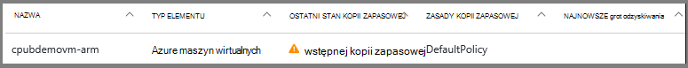
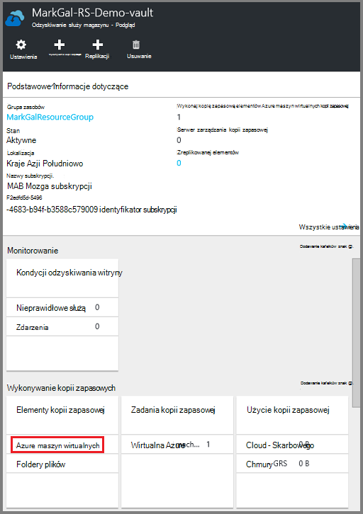
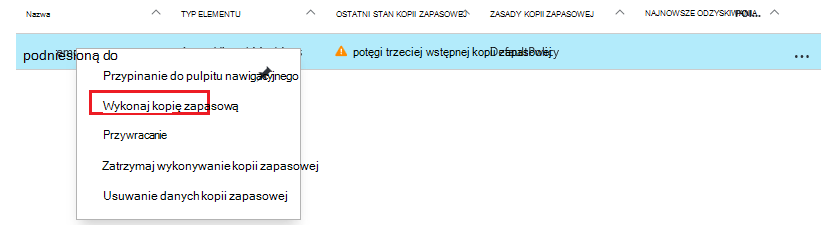
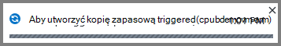
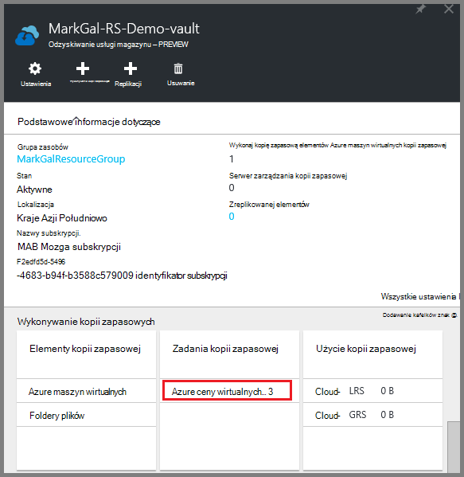
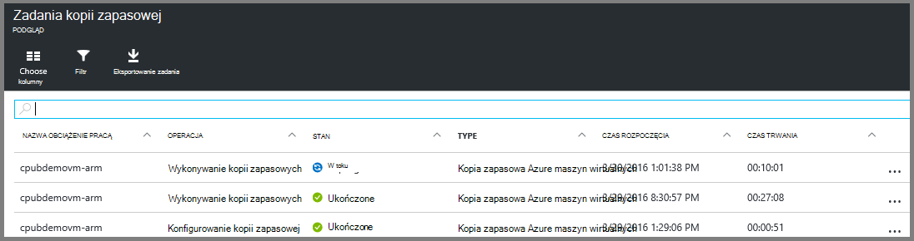

<properties
    pageTitle="Wykonywanie kopii zapasowej Azure maszyny wirtualne do magazynu usługi odzyskiwania | Microsoft Azure"
    description="Odnajdowanie, rejestrowanie i Utwórz kopię zapasową Azure maszyn wirtualnych magazynu usługi odzyskiwania z poniższe procedury dla kopii zapasowej Azure maszyn wirtualnych."
    services="backup"
    documentationCenter=""
    authors="markgalioto"
    manager="cfreeman"
    editor=""
    keywords="kopii zapasowych maszyn wirtualnych. Tworzenie kopii zapasowych maszyn wirtualnych; odzyskiwanie kopii zapasowej i danych; wykonywanie kopii zapasowych ARM maszyn wirtualnych"/>

<tags
    ms.service="backup"
    ms.workload="storage-backup-recovery"
    ms.tgt_pltfrm="na"
    ms.devlang="na"
    ms.topic="article"
    ms.date="07/29/2016"
    ms.author="trinadhk; jimpark; markgal;"/>

# Utwórz kopię zapasową maszyny wirtualne Azure magazynu usługi odzyskiwania

> [AZURE.SELECTOR]
- [Wykonywanie kopii zapasowej maszyny wirtualne do magazynu usługi odzyskiwania](backup-azure-arm-vms.md)
- [Utwórz kopię zapasową maszyny wirtualne magazynu kopii zapasowej](backup-azure-vms.md)

Ten artykuł zawiera procedury tworzenia kopii zapasowych maszyny Azure wirtualne (wdrożone Menedżera zasobów i wdrożony w klasycznym) do magazynu usługi odzyskiwania. Większość pracy do tworzenia kopii zapasowych maszyny wirtualne przechodzi do przygotowania. Zanim będzie można wykonać kopię zapasową i ochrona maszyny, musisz wykonać [wymagania wstępne](backup-azure-arm-vms-prepare.md) do przygotowania środowiska dla ochrony pośrednictwem usługi SMS. Po zakończeniu wymagania wstępne można zainicjować kopii zapasowej operacji migawek usługi maszyn wirtualnych.

>[AZURE.NOTE] Azure występują dwa modele wdrożenia służące do tworzenia i pracy z zasobami: [Menedżer zasobów i klasyczny](../resource-manager-deployment-model.md). Maszyny wirtualne wdrożony Menedżera zasobów i klasyczny maszyny wirtualne można chronić przy użyciu usługi odzyskiwania magazynów. Aby uzyskać szczegółowe informacje na temat pracy z modelu wdrożenia klasyczny maszyny wirtualne, zobacz [Kopia zapasowa Azure maszyn wirtualnych](backup-azure-vms.md) .

Aby uzyskać dodatkowe informacje zobacz artykuły o [planowaniu infrastruktury kopii zapasowej maszyn wirtualnych w Azure](backup-azure-vms-introduction.md) i [Azure maszyn wirtualnych](https://azure.microsoft.com/documentation/services/virtual-machines/).

## Powodujące kopii zapasowej zadania

Kopii zapasowej zasady skojarzone z magazynu usługi odzyskiwania Określa, jak często i kiedy uruchamia wykonywanie kopii zapasowej. Domyślnie pierwszy zaplanowanej kopii zapasowej jest wstępnej kopii zapasowej. Do momentu wystąpienia wstępnej kopii zapasowej, ostatni stan kopii zapasowej na karta **Zadania kopii zapasowej** zawiera jako **Ostrzeżenie (początkowa kopia zapasowa do czasu)**.

O ile kopii zapasowej początkowej przypada może rozpocząć wkrótce, zaleca się uruchamianie **Wykonaj kopię zapasową teraz**. Poniższa procedura zaczyna się od pulpitu nawigacyjnego magazynu. Ta procedura służy do uruchamiania zadaniu kopii zapasowej, po zakończeniu wszystkie wymagania wstępne. Jeśli zostało już uruchomione zadaniu kopii zapasowej, ta procedura nie jest dostępna. Skojarzonych zasad kopii zapasowej określa następnego zadania wykonywania kopii zapasowej.  

Aby uruchomić zadaniu kopii zapasowej:

1. Na pulpicie nawigacyjnym magazynu na kafelku **kopii zapasowej** kliknij pozycję **maszyn wirtualnych Azure**.  
    

    Zostanie wyświetlona karta **Elementy kopii zapasowej** .

2. Na karta **Elementy kopii zapasowej** kliknij prawym przyciskiem myszy magazyn, który chcesz utworzyć kopię zapasową i kliknij polecenie **Wykonaj kopię zapasową**.

    

    Zadanie kopii zapasowej zostanie wywołana.  

    

3. Aby wyświetlić, że kopia zapasowa początkowej zakończeniu na pulpicie nawigacyjnym magazynu na kafelku **Zadania kopii zapasowej** , kliknij pozycję **Azure maszyn wirtualnych**.

    

    Zostanie wyświetlona karta zadaniami kopii zapasowej.

4. W karta **zadaniami kopii zapasowej** można wyświetlić stan wszystkich zadań.

    

    >[AZURE.NOTE] Jako części wykonywanie kopii zapasowej kopii zapasowej Azure problemy z usługą polecenia kopii zapasowej rozszerzenia w każdej maszyny wirtualnej, aby opróżnić wszystkich zapisów i zrób migawkę spójne.

    Po zakończeniu zadania kopii zapasowej jej stan to *wykonane*.

## Rozwiązywanie problemów z błędami
Jeśli wystąpią problemy w czasie wykonywania kopii zapasowej konta komputera wirtualnych zobacz [artykuł dotyczący rozwiązywania problemów maszyn wirtualnych](backup-azure-vms-troubleshoot.md) , aby uzyskać pomoc.

## Następne kroki

Teraz, gdy masz chroniony usługi maszyn wirtualnych, zapoznaj się z następujących artykułów do zarządzania dodatkowe zadania można z pośrednictwem usługi SMS i jak przywrócić maszyny wirtualne.

- [Monitorowanie maszyn wirtualnych i zarządzanie nimi](backup-azure-manage-vms.md)
- [Przywracanie maszyn wirtualnych](backup-azure-arm-restore-vms.md)
