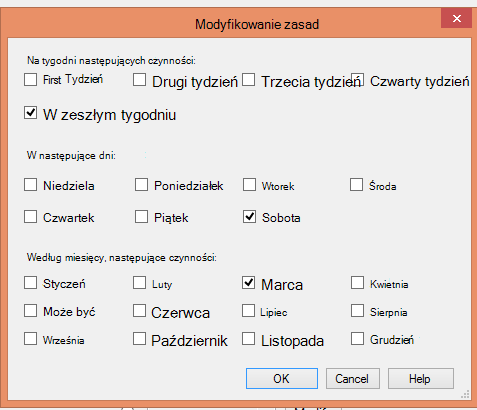

<properties
   pageTitle="Używanie narzędzia Kopia zapasowa Azure Aby zamienić infrastruktury taśmą | Microsoft Azure"
   description="Dowiedz się, jak kopii zapasowej Azure udostępnia znaczeń właściwych przypominających taśmą, który umożliwia wykonywanie kopii zapasowych i przywracanie danych platformy Azure"
   services="backup"
   documentationCenter=""
   authors="trinadhk"
   manager="vijayts"
   editor=""/>
<tags
   ms.service="backup"
   ms.devlang="na"
   ms.topic="article"
   ms.tgt_pltfrm="na"
   ms.workload="storage-backup-recovery"
   ms.date="09/27/2016"
   ms.author="jimpark;trinadhk;markgal"/>

# Używanie narzędzia Kopia zapasowa Azure Aby zamienić infrastruktury taśmą

Azure klientów wykonywanie kopii zapasowych i System Center Data Protection Manager wykonywać następujące czynności:

- Wykonaj kopię zapasową danych w arkuszach, które najlepiej potrzeb organizacji.
- Zachowanie danych kopii zapasowej przez dłuższy czas
- Wprowadź Azure części ich przechowywania długoterminowe musi (zamiast taśmą).

W tym artykule wyjaśniono, jak klienci umożliwiają wykonywanie kopii zapasowych i zasadami przechowywania. Klienci, którzy korzystają taśm adresem ich długo-długoterminową-przechowywania wymaga już zaawansowanych i rentowny alternatywny z dostępnością tej funkcji. Funkcja jest włączona w jego najnowszej wersji kopii zapasowej Azure (który jest dostępny [tutaj](http://aka.ms/azurebackup_agent)). System Center DPM klientów należy zaktualizować, co najmniej DPM 2012 R2 UR5 przed użyciem DPM z usługą Azure kopii zapasowej.

## Co to jest harmonogram wykonywania kopii zapasowych?
Harmonogram kopii zapasowej wskazuje częstotliwość wykonywanie kopii zapasowej. Na przykład ustawienia na poniższym obrazie wskazują podjęcie kopie zapasowe codziennie godzinie 6 i północy.

Klientów można również zaplanować tygodniowy kopii zapasowej. Na przykład ustawienia na poniższym obrazie wskazują kopie zapasowe podjęcie każdej alternatywny niedziela i środa na 9:30 a 1:00:00.

## Co to są zasady przechowywania?
Zasady przechowywania określa czas, którego kopię zapasową muszą być przechowywane. Zamiast po prostu określenie "prostym zasad" dla wszystkich punktów kopii zapasowej, klientów można określić zasady przechowywania różnych na podstawie przy podejmowaniu kopii zapasowej. Na przykład punktu kopii zapasowej wykonywane codziennie, który służy jako punkt odzyskiwania operacyjne, jest zachowywana przez 90 dni. Punkt kopii zapasowej wykonywane na końcu każdego kwartału na potrzeby inspekcji jest zachowywany przez dłuższy czas.

Całkowita liczba "przechowywania punktów" w tych zasad jest 90 (punkty dzienny) + 40 (jeden każdego kwartału do 10 lat) = 130.

## Przykład — zarówno zestawienie

1. **Dzienny zasady przechowywania**: kopie zapasowe pobierane codziennie są przechowywane przez siedem dni.
2. **Tygodniowy zasady przechowywania**: kopie zapasowe pobierane codziennie o północy i 6 PM sobota są zachowywane przez cztery tygodnie.
3. **Miesięczny zasady przechowywania**: kopie zapasowe wykonane na północy i 6 pm w sobotę ostatniego dnia każdego miesiąca są zachowywane w ciągu 12 miesięcy
4. **Roczny zasady przechowywania**: kopie zapasowe wykonane o północy w ostatnią sobotę każdej marca są zachowywane do 10 lat

Całkowita liczba punktów"przechowywania" (punkty, z których klienta można przywrócić danych) na powyższym diagramie jest obliczana w następujący sposób:

- dwie kropki dziennie siedem dni = 14 punktów odzyskiwania
- dwie kropki tygodniowo dla czterech tygodni = 8 punktów odzyskiwania
- dwie kropki za miesiąc 12 miesięcy = 24 punktów odzyskiwania
- jeden punkt na rok na odzyskiwania 10 lat = 10 punktów

Łączna liczba punktów odzyskiwania jest 56.

> [AZURE.NOTE] Kopia zapasowa Azure nie jest ograniczenie na liczbę punktów odzyskiwania.

## Konfiguracja zaawansowana
Klikając przycisk **Modyfikuj** w poprzednim ekranu, konieczne jest bardziej elastyczną określania harmonogramów przechowywania.

## Następne kroki
Aby uzyskać więcej informacji o kopii zapasowej Azure zobacz:

- [Wprowadzenie do Azure kopii zapasowej](backup-introduction-to-azure-backup.md)
- [Spróbuj Azure kopii zapasowej](backup-try-azure-backup-in-10-mins.md)
