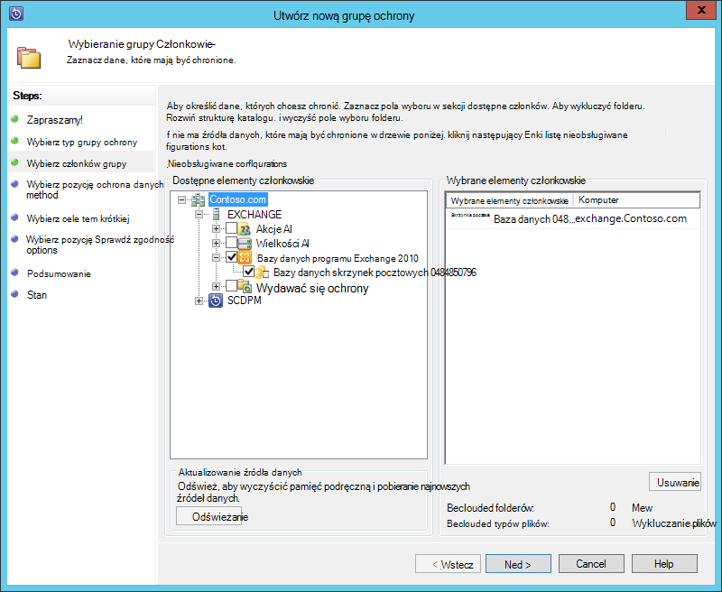
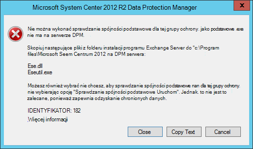
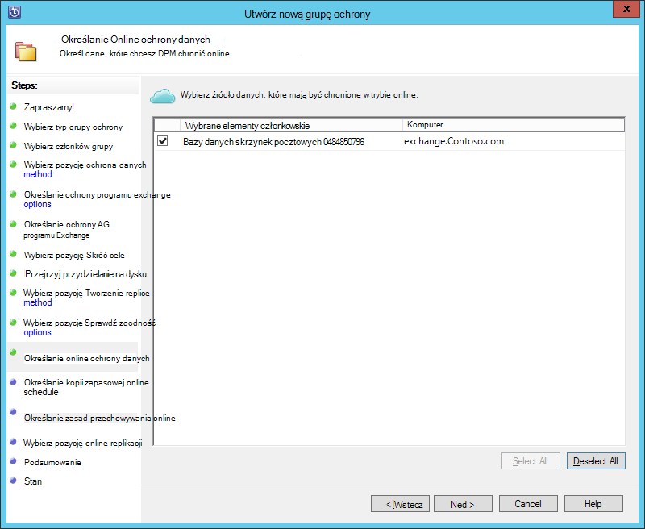
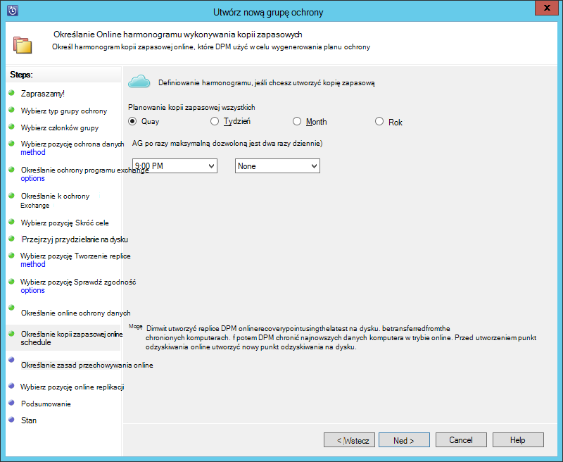
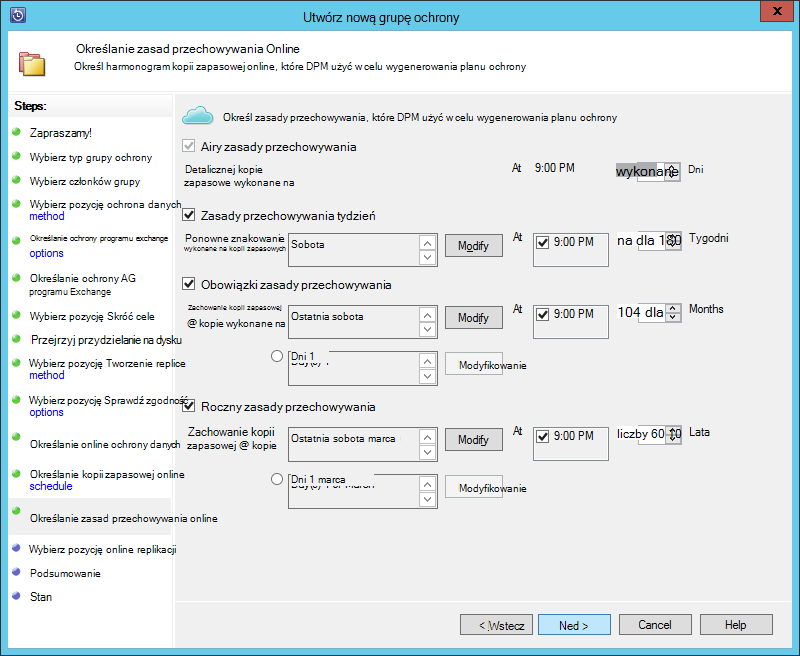
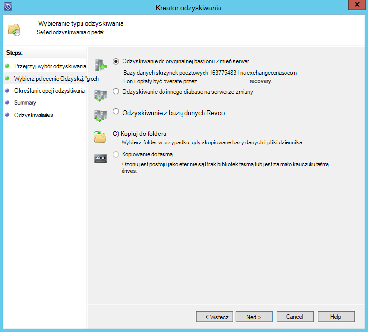

<properties
    pageTitle="Wykonywanie kopii zapasowej programu Exchange server do tworzenia kopii zapasowych Azure System Centrum 2012 R2 DPM | Microsoft Azure"
    description="Dowiedz się, jak utworzyć kopię zapasową programu Exchange server do wykonania kopii zapasowej Azure za pomocą systemu Centrum 2012 R2 DPM"
    services="backup"
    documentationCenter=""
    authors="MaanasSaran"
    manager="NKolli1"
    editor=""/>

<tags
    ms.service="backup"
    ms.workload="storage-backup-recovery"
    ms.tgt_pltfrm="na"
    ms.devlang="na"
    ms.topic="article"
    ms.date="08/15/2016"
    ms.author="anuragm;jimpark;delhan;trinadhk;markgal"/>

# Utwórz kopię zapasową programu Exchange server Azure tworzenia kopii zapasowych systemu Centrum 2012 R2 DPM
W tym artykule opisano sposób konfigurowania serwera danych Protection Manager (DPM) R2 2012 Centrum System do tworzenia kopii zapasowych serwera Microsoft Exchange do wykonania kopii zapasowej Azure.  

## Aktualizacje
Aby pomyślnie zarejestrować na serwerze DPM z kopią zapasową Azure, należy zainstalować pakietu najnowszych aktualizacji systemu Centrum 2012 R2 DPM i najnowszą wersję programu Azure Backup Agent. Pobieranie pakietu najnowszych aktualizacji z [Katalogu firmy Microsoft](http://catalog.update.microsoft.com/v7/site/Search.aspx?q=System%20Center%202012%20R2%20Data%20protection%20manager).

>[AZURE.NOTE] Aby zapoznać się z przykładami w tym artykule jest zainstalowana wersja 2.0.8719.0 Azure agenta kopii zapasowej, a pakietu zbiorczego aktualizacji 6 jest zainstalowany w systemie Centrum 2012 R2 DPM.

## Wymagania wstępne
Przed kontynuowaniem, upewnij się, że zostały spełnione wszystkie [wymagania wstępne](backup-azure-dpm-introduction.md#prerequisites) dotyczące korzystania z programu Kopia zapasowa Microsoft Azure ochrony obciążenia. Te wymagania wstępne są następujące:

- Utworzono kopii zapasowej magazynu w witrynie Azure.
- Agent i magazynu poświadczeń zostały pobrane z serwerem DPM.
- Agent jest zainstalowany na serwerze DPM.
- Aby zarejestrować serwer DPM były używane poświadczenia magazynu.
- Jeśli są ochrona 2016 programu Exchange, Uaktualnij DPM 2012 R2 UR9 lub nowszy

## Agent ochrony DPM  
Aby zainstalować agenta ochrony DPM na serwerze programu Exchange, wykonaj następujące kroki:

1. Upewnij się, że zapory są poprawnie skonfigurowane. Zobacz [Konfigurowanie wyjątki zapory dla agenta](https://technet.microsoft.com/library/Hh758204.aspx).

2. Instalowanie agenta na serwerze programu Exchange, klikając pozycję **zarządzania > agentów > Instalowanie** w konsoli DPM administratora. Aby uzyskać szczegółowe instrukcje, zobacz [Instalowanie agenta ochrony DPM](https://technet.microsoft.com/library/hh758186.aspx?f=255&MSPPError=-2147217396) .

## Tworzenie grupy ochrony dla programu Exchange server

1. W konsoli administratora DPM kliknij polecenie **Ochrona**, a następnie kliknij **Nowy** na Wstążce narzędzia, aby otworzyć kreatora **Utwórz nową grupę ochrony** .

2. Na ekranie **powitalnym** kreatora kliknij przycisk **Dalej**.

3. Na ekranie **Wybierz typ grupy ochrony** zaznacz **serwerów** , a następnie kliknij przycisk **Dalej**.

4. Wybierz bazę danych serwera Exchange, który chcesz chronić, a następnie kliknij przycisk **Dalej**.

    >[AZURE.NOTE] Jeśli są ochrona programu Exchange 2013, sprawdź [wymagania wstępne dotyczące programu Exchange 2013](https://technet.microsoft.com/library/dn751029.aspx).

    W poniższym przykładzie bazy danych programu Exchange 2010 jest zaznaczone.

    

5. Wybierz metodę ochrony danych.

    Nadaj nazwę grupie ochrona, a następnie wybierz jedną z następujących opcji:

    - Chcę krótkoterminowy ochrony za pomocą dysku.
    - Chcę ochronę online.

6. Kliknij przycisk **Dalej**.

7. Wybierz opcję **Uruchom Eseutil sprawdzania integralności danych** , jeśli chcesz sprawdzić integralność bazy danych programu Exchange Server.

    Po wybraniu tej opcji, kopii zapasowej spójności sprawdzanie zostanie uruchomione na serwerze DPM w celu uniknięcia Wy, generowany przez uruchomienie polecenia **eseutil** na serwerze programu Exchange.

    >[AZURE.NOTE]Aby użyć tej opcji, możesz skopiować pliki Ese.dll i Eseutil.exe do katalogu C:\Program Files\Microsoft System Centrum 2012 R2\DPM\DPM\bin na serwerze DPM. W przeciwnym razie zostanie wywołana następujący komunikat o błędzie:  
    

8. Kliknij przycisk **Dalej**.

9. Wybierz bazę danych dla **Kopii zapasowej**, a następnie kliknij przycisk **Dalej**.

    >[AZURE.NOTE] Jeśli nie zostanie zaznaczone "Pełną kopię zapasową" dla co najmniej jednej kopii AG bazy danych, dzienniki nie zostanie obcięta.

10. Konfigurowanie celów **krótkoterminowy**kopii zapasowej, a następnie kliknij przycisk **Dalej**.

11. Przejrzyj dostępne miejsce na dysku, a następnie kliknij przycisk **Dalej**.

12. Wybierz czas, po którym serwera DPM będzie tworzenie replikacji początkowej i kliknij przycisk **Dalej**.

13. Wybieranie opcji sprawdzania zgodności, a następnie kliknij przycisk **Dalej**.

14. Wybierz bazę danych, którą chcesz utworzyć kopię zapasową Azure, a następnie kliknij przycisk **Dalej**. Na przykład:

    

15. Definiowanie harmonogramu **Azure kopii zapasowej**, a następnie kliknij przycisk **Dalej**. Na przykład:

    

    >[AZURE.NOTE] Uwaga punktów odzyskiwania Online są oparte na express pełne punkty odzyskiwania. W związku z tym musi zostać zaplanowane punkt odzyskiwania online po wskazywały odzyskiwania określonego czasu dla pełnej express.

16. Konfigurowanie zasad przechowywania do **Tworzenia kopii zapasowych Azure**, a następnie kliknij przycisk **Dalej**.

17. Wybierz jedną z opcji replikacji online, a następnie kliknij przycisk **Dalej**.

    Jeśli masz duże bazy danych, może upłynąć długo wstępnej kopii zapasowej ma zostać utworzony przez sieć. Aby uniknąć tego problemu, możesz utworzyć kopii zapasowej offline.  

    

18. Potwierdź ustawienia, a następnie kliknij polecenie **Utwórz grupę**.

19. Kliknij przycisk **Zamknij**.

## Odzyskiwanie bazy danych programu Exchange

1. Aby odzyskać bazy danych programu Exchange, kliknij pozycję **odzyskiwania** w konsoli DPM administratora.

2. Zlokalizuj bazę danych programu Exchange, którą chcesz odzyskać.

3. Wybierz punkt odzyskiwania online z listy rozwijanej *czasu* .

4. Kliknij polecenie **Odzyskaj** , aby uruchomić **Kreatora odzyskiwania**.

Dla punktów online odzyskiwania istnieje pięć typów odzyskiwania:

- **Odzyskaj do oryginalnej lokalizacji programu Exchange Server:** Dane zostaną przywrócone do oryginalnego serwera Exchange.
- **Odzyskaj do innej bazy danych na serwerze programu Exchange:** Dane zostaną przywrócone do innej bazy danych na innym serwerze Exchange.
- **Odzyskiwanie z bazą danych odzyskiwania:** Dane zostaną przywrócone do bazy danych odzyskiwania programu Exchange (RDB).
- **Kopiuj do folderu sieciowego:** Dane zostaną przywrócone do folderu sieciowego.
- **Kopiuj do taśmą:** Jeśli masz biblioteki taśmą lub dysk autonomiczny taśmą podłączony i skonfigurowany na serwerze DPM punkt odzyskiwania zostaną skopiowane do bezpłatnej taśmą.

    

## Następne kroki

- [Azure kopii zapasowych — często zadawane pytania](backup-azure-backup-faq.md)
