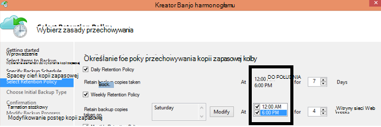

<properties
   pageTitle="Azure często zadawane pytania dotyczące kopii zapasowej | Microsoft Azure"
   description="Odpowiedzi na często zadawane pytania dotyczące usługi kopii zapasowej, agenta kopii zapasowej, wykonywanie kopii zapasowych i przechowywania, odzyskiwania, zabezpieczenia i inne często zadawane pytania dotyczące kopii zapasowych i odtwarzania po awarii."
   services="backup"
   documentationCenter=""
   authors="markgalioto"
   manager="jwhit"
   editor=""
   keywords="odzyskiwanie kopii zapasowej i danych; Usługa Kopia zapasowa"/>

<tags
   ms.service="backup"
   ms.workload="storage-backup-recovery"
     ms.tgt_pltfrm="na"
     ms.devlang="na"
     ms.topic="get-started-article"
     ms.date="10/21/2016"
     ms.author="trinadhk; giridham; arunak; markgal; jimpark;"/>

# <a name="azure-backup-service--faq"></a>Azure kopii zapasowej usługi — często zadawane pytania


W tym artykule przedstawiono listę często zadawane pytania (i odpowiednich odpowiedzi) o usłudze Azure kopii zapasowej. Nasza społeczność odpowiedzi szybko, a jeśli często zadawane pytania na tym, możemy dodać do tego artykułu. Odpowiedzi na pytania zwykle zapewniają odwołanie lub informacje pomocy technicznej. Można zadawać pytania o kopii zapasowej Azure w sekcji Disqus powiązanych artykule lub w tym artykule. Można również publikować pytania dotyczące usługi Azure kopii zapasowej na [forum dyskusyjne](https://social.msdn.microsoft.com/forums/azure/home?forum=windowsazureonlinebackup).


## <a name="what-is-the-list-of-supported-operating-systems-from-which-i-can-back-up-to-azure-using-azure-backup-br"></a>Co to jest lista obsługiwanych systemów operacyjnych, z których można tworzyć kopie zapasowe Azure przy użyciu kopii zapasowej Azure? <br/>
Kopia zapasowa Azure obsługuje poniżej systemów operacyjnych dla folderu plików kopii zapasowej, wykonywanie kopii zapasowych aplikacji przy użyciu serwera kopii zapasowej Azure i SCDPM.

| System operacyjny        | Platformy           | JEDNOSTKA SKU  |
| :------------- |-------------| :-----|
| Windows 8 i najnowszych SPs      | 64-bitowej | Przedsiębiorstwa, Pro |
| Systemy Windows 7 i najnowszych SPs      | 64-bitowej | Ultimate, Enterprise, Professional i Premium dla użytkowników domowych, Home Basic i Starter |
| System Windows 8.1 i najnowszych SPs | 64-bitowej      |    Przedsiębiorstwa, Pro |
| Windows 10      | 64-bitowej | Przedsiębiorstwo, Pro, strona główna |
|Windows Server 2012 R2 i najnowszych SPs| 64-bitowej| Standardowe i centrum danych, Foundation|
|Windows Server 2012 i najnowszych SPs|    64-bitowej| Standardowe centrum danych, Foundation,|
|Windows miejsca do magazynowania Server 2012 R2 i najnowszych SPs  |64-bitowej|    Standardowe, grupa robocza|
|Windows miejsca do magazynowania Server 2012 i najnowszych SPs |64-bitowej |Standardowe, grupa robocza
|Windows Server 2012 R2 i najnowszych SPs  |64-bitowej|    Podstawowe|
|Windows Server 2008 R2 z dodatkiem SP1 |64-bitowej|    Standard, Enterprise, centrum danych, Foundation|
|Windows Server 2008 z dodatkiem SP2    |64-bitowej|    Standard, Enterprise, centrum danych, Foundation|

Do tworzenia kopii zapasowych maszyn wirtualnych Azure,

- **Linux**: Azure kopia zapasowa obsługuje [listy dystrybucji, które są zatwierdzone przez Azure](../virtual-machines/virtual-machines-linux-endorsed-distros.md) z wyjątkiem Core systemu operacyjnego Linux.  Innych form podziału Przesuń i-właścicielem-Linux może również działają jak agenta maszyn wirtualnych jest dostępna na komputerze wirtualnych i obsługę Python istnieje.
- **Windows Server**: w wersji wcześniejszej niż Windows Server 2008 R2 nie są obsługiwane.

## <a name="where-can-i-download-the-latest-azure-backup-agent-br"></a>Gdzie można pobrać najnowszą wersję agent kopii zapasowej Azure? <br/>
Możesz pobrać najnowszą wersję agent do tworzenia kopii zapasowych Windows Server, DPM Centrum systemu lub klienta systemu Windows, [tutaj](http://aka.ms/azurebackup_agent). Jeśli chcesz utworzyć kopię zapasową maszyny wirtualnej, za pomocą agenta maszyn wirtualnych (który automatycznie instaluje właściwe rozszerzenie). Agent maszyn wirtualnych już występuje w przypadku maszyn wirtualnych utworzone z galerii Azure.

## <a name="which-version-of-scdpm-server-is-supported-br"></a>Która wersja serwera SCDPM jest obsługiwana? <br/>
Zaleca się zainstalowanie [najnowszej](http://aka.ms/azurebackup_agent) agent kopii zapasowej Azure na pakietu SCDPM z najnowszych aktualizacji (UR11 od 2016 sierpień)

## <a name="when-configuring-the-azure-backup-agent-i-am-prompted-to-enter-the-vault-credentials-do-vault-credentials-expire"></a>Podczas konfigurowania agenta kopii zapasowej Azure, wyświetlany monit o podanie poświadczeń magazynu. Magazynu poświadczeń wygaśnie?
Tak, magazynu poświadczeń wygasały po 48 godzin. Jeśli plik wygaśnie, zaloguj się do portalu Azure i pobieranie plików magazynu poświadczeń z magazynu usługi.

## <a name="is-there-any-limit-on-the-number-of-vaults-that-can-be-created-in-each-azure-subscription-br"></a>Czy istnieje limit dowolnej liczby magazynów utworzonych w każdej subskrypcji Azure? <br/>
Wartość Tak. Od września 2016 możesz utworzyć 25 magazynami kopii zapasowej na subskrypcję. Możesz utworzyć maksymalnie przez 25 magazynów usługi odzyskiwania dla każdego regionu obsługiwane Azure kopii zapasowej na subskrypcję. Jeśli potrzebujesz więcej magazynów utworzy nową subskrypcję.

## <a name="are-there-any-limits-on-the-number-of-serversmachines-that-can-be-registered-against-each-vault-br"></a>Czy istnieją jakichkolwiek ograniczeń liczby serwerów i komputerów zarejestrowane przed każdym magazynu? <br/>
Tak, można zarejestrować do 50 maszyn na magazynu. Dla maszyn wirtualnych Azure IaaS limit wynosi 200 maszyny wirtualne na magazynu. Jeśli chcesz zarejestrować więcej komputerów, Utwórz nowy magazynu.

## <a name="how-do-i-register-my-server-to-another-datacenterbr"></a>Jak zarejestrować serwer innym centrum danych<br/>
Dane kopii zapasowej są wysyłane z centrum danych magazynu, do którego jest zarejestrowany. Najprostszym sposobem na zmienianie z centrum danych jest odinstalować agent i ponownie zainstalować agenta i zarejestruj, aby nowe magazynu, należący do odpowiedniej centrum danych.

## <a name="what-happens-if-i-rename-a-windows-server-that-is-backing-up-data-to-azurebr"></a>Co się stanie, jeśli zmienię nazwę Windows server, który jest tworzyć kopie zapasowe danych Azure?<br/>
Gdy zmienisz nazwę serwera, wszystkie obecnie skonfigurowanych kopie zapasowe zostały zatrzymane.
Musisz zarejestrować nową nazwę serwera z magazynu kopii zapasowej. Po utworzeniu nowej rejestracji pierwszego wykonywanie kopii zapasowej jest pełnej kopii zapasowej, a nie przyrostowa kopia zapasowa. Jeśli potrzebujesz odzyskiwanie danych, który został wcześniej kopie zapasowe magazynu ze starej nazwy serwera, można odzyskać danych za pomocą opcji [**inny serwer**](backup-azure-restore-windows-server.md#recover-to-an-alternate-machine) w kreatorze **Odzyskiwanie danych** .

## <a name="what-types-of-drives-can-i-backup-files-and-folders-from-br"></a>Jakiego rodzaju dyski można utworzyć kopie zapasowe plików i folderów z? <br/>
Nie można uzyskać kopii zapasowej następujący zestaw dyski-wielkości:

- Nośniku wymiennym: Dysk musi raportowanie jako stała się używane źródła elementu kopii zapasowej.
- Tylko do odczytu wielkości: objętość musi być zapisywalny dysk głośność usługi kopii cień (VSS) do funkcji.
- Wielkości trybu offline: Wielkość musi być online dla VSS funkcji.
- Udziału sieciowego: wielkość musi być lokalny serwer do wykonania kopii zapasowej przy użyciu kopii zapasowej online.
- Funkcji BitLocker chroniony wielkości: wielkość musisz ją odblokować może wystąpić w kopii zapasowej.
- Identyfikacja systemu plików: NTFS jest to jedyny system plików, które są obsługiwane w tej wersji usługi kopii zapasowej online.

## <a name="what-file-and-folder-types-can-i-back-up-from-my-serverbr"></a>Jakie typy plików i folderów można wykonywać kopie zapasowe z serwerem?<br/>
Obsługiwane są następujące:

- Szyfrowane
- Skompresowany
- Rzadkie
- Skompresowany + rzadkie
- Łącza stałe: Obsługiwane, pominięte
- Punkt ponownej analizy: Obsługiwane, pominięte
- Szyfrowane + skompresowany: Obsługiwane, pominięte
- Zaszyfrowane + rzadkie: Obsługiwane, pominięte
- Skompresowany strumień: Obsługiwane, pominięte
- Rzadkie strumienia: Obsługiwane, pominięte

## <a name="whats-the-minimum-size-requirement-for-the-cache-folder-br"></a>Co to jest minimalny wymagany rozmiar folderu pamięci podręcznej? <br/>
Rozmiar folderu pamięci podręcznej określa ilość danych, który jest kopia zapasowa. Folder pamięci podręcznej powinny być 5% miejsce do przechowywania danych.

## <a name="if-my-organization-has-one-vault-how-can-i-isolate-one-servers-data-from-another-server-when-restoring-databr"></a>Jeśli Moja organizacja korzysta z jednego magazynu, jak I odizolować jednego serwera danych z innego serwera podczas przywracania danych?<br/>
Wszystkie serwery mają zarejestrowanych w tym samym magazynu można odzyskać danych kopii zapasowej przez inne serwery *używający samego hasła*. Jeśli masz serwerów których danych kopii zapasowej chcesz wyodrębnić z innych serwerów w Twojej organizacji, należy użyć wyznaczonych hasło dla tych serwerów. Na przykład serwery zasobów ludzkich można użyć jednej hasło szyfrowania, księgowy serwery innej i serwery miejsca do magazynowania innego.

## <a name="can-i-migrate-my-backup-data-or-vault-between-subscriptions-br"></a>Czy mogę "przenieść" Moje dane kopii zapasowej lub magazynu między subskrypcji? <br/>
Wartość nie. Magazyn jest tworzony na poziomie subskrypcji i nie można przydzielić ponownie do innej subskrypcji po jego utworzeniu.

## <a name="does-the-azure-backup-agent-work-on-a-server-that-uses-windows-server-2012-deduplication-br"></a>Agent kopii zapasowej Azure działa na serwerze, która korzysta z systemu Windows Server 2012 deduplication? <br/>
Wartość Tak. Usługa agenta konwertuje deduplicated dane normalnym danych podczas jego przygotowanie wykonywanie kopii zapasowej. Go następnie optymalizuje danych na potrzeby kopii zapasowej, dane są szyfrowane, a następnie wysyła zaszyfrowane dane do usługi kopii zapasowej online.

## <a name="if-i-cancel-a-backup-job-once-it-has-started-is-the-transferred-backup-data-deleted-br"></a>Jeśli po uruchomieniu jej anulować zadania wykonywania kopii zapasowej, zostanie usunięty przetransferowanych danych kopii zapasowej? <br/>
Wartość nie. Magazyn kopii zapasowej są przechowywane dane kopii zapasowej, które zostały przeniesione do punktu o anulowaniu. Kopia zapasowa Azure używa mechanizmu punkt kontrolny od czasu do czasu Dodawanie punktów kontrolnych do danych kopii zapasowej podczas wykonywania kopii zapasowej. Ponieważ w danych kopii zapasowej znajdują się punktów kontrolnych, następny wykonywania kopii zapasowej można sprawdzić integralność plików. Następny kopii zapasowej wyzwalane będzie przyrostowe nad danymi, które miały zostały wcześniej kopie zapasowe. Przyrostowa kopia zapasowa zapewnia lepsze wykorzystanie przepustowości, nie musisz przenieść te same dane wielokrotnie.

W przypadku maszyn wirtualnych Azure kopii zapasowej gdy zadanie zostało anulowane, przeniesione dane są ignorowane i świeży kopii zapasowej przenosi danych pierwotnych z wcześniej pomyślnego zadania wykonywania kopii zapasowej.

## <a name="why-am-i-seeing-the-warning-azure-backups-have-not-been-configured-for-this-server-even-though-i-had-scheduled-regular-backups-previously-br"></a>Dlaczego jest wyświetlany ostrzeżenie "Azure kopie zapasowe nie zostały skonfigurowane dla tego serwera", mimo że było była wcześniej zaplanowane regularnego wykonywania kopii zapasowych? <br/>
To ostrzeżenie występuje, gdy ustawienia harmonogramu wykonywania kopii zapasowych przechowywany na serwerze lokalnym nie są takie same ustawienia przechowywane w kopii zapasowej magazynu. Jeśli serwer lub ustawienia zostały odzyskane do znany dobry stan, harmonogramów kopii zapasowej może spowodować utratę synchronizacji. Jeśli zostanie wyświetlony ten ostrzeżenie, [skonfigurowanie zasad kopii zapasowej](backup-azure-manage-windows-server.md) , a następnie **Uruchom Wykonaj teraz kopię zapasową** do ponownie zsynchronizować lokalnego serwera z Azure.

## <a name="what-firewall-rules-should-be-configured-for-azure-backup-br"></a>Jakie zasady powinny być skonfigurowane do tworzenia kopii zapasowych Azure zapory? <br/>
Ochronie danych na lokalnej do Azure i obciążenie pracą do Azure zalecane jest dozwolone zapory można komunikować się z następujących adresów URL:

- www.msftncsi.com
- \*. Witryny Microsoft.com
- \*. WindowsAzure.com
- \*. microsoftonline.com
- \*. windows.net

##<a name="can-i-install-the-azure-backup-agent-on-an-azure-vm-already-backed-by-the-azure-backup-service-using-the-vm-extension-br"></a>Czy mogę zainstalować agenta kopii zapasowej Azure maszyn wirtualnych Azure już objęty z usługą Azure kopii zapasowej, korzystając z rozszerzeniem maszyn wirtualnych? <br/>
Zgadza się. Kopia zapasowa Azure przewiduje kopii zapasowych maszyn wirtualnych poziom maszyny wirtualne Azure przy użyciu rozszerzenia maszyn wirtualnych. Agent Azure Backup można zainstalować na system operacyjny Windows gościa do ochrony plików i folderów w tym gości z systemem operacyjnym.

## <a name="can-i-install-the-azure-backup-agent-on-an-azure-vm-to-back-up-files-and-folders-present-on-temporary-storage-provided-by-the-azure-vm-br"></a>Czy mogę zainstalować agenta kopii zapasowej Azure maszyn wirtualnych Azure do tworzenia kopii zapasowych plików i folderów Prezentuj tymczasowe ilość miejsca do magazynowania dostarczony przez maszyn wirtualnych Azure? <br/>
Można zainstalować agenta kopii zapasowej Azure na gościa, za pomocą systemu operacyjnego Windows i kopie zapasowe plików i folderów do magazynu tymczasowego. Jednak pamiętaj, że kopie zapasowe się nie powieść, gdy tymczasowego przechowywania danych jest czyszczenia. Ponadto usunięcie tymczasowych miejsca do magazynowania danych można przywracać tylko do pamięć.

## <a name="i-have-installed-azure-backup-agent-to-protect-my-files-and-folders-can-i-now-install-scdpm-to-work-with-azure-backup-agent-to-protect-on-premises-applicationvm-workloads-to-azure-br"></a>Mam zainstalowaną agent Azure Backup ochrony Moje pliki i foldery. Teraz mogę zainstalować SCDPM do pracy z kopii zapasowej Azure agenta ochrony obciążenia aplikacji/m lokalnego Azure? <br/>
Aby użyć kopii zapasowej Azure z SCDPM, zaleca się zainstalować SCDPM najpierw, a następnie zainstalować agenta kopii zapasowej Azure. To zapewnia integrację agent Azure Backup z SCDPM i umożliwia ochrony plików i folderów, obciążenia aplikacji i maszyny wirtualne Azure, bezpośrednio z konsoli zarządzania SCDPM. Instalowania SCDPM po zainstalowaniu kopii zapasowej Azure agenta na potrzeby wymienionych powyżej nie jest zalecane lub obsługiwane.

## <a name="what-is-the-length-of-file-path-that-can-be-specified-as-part-of-azure-backup-policy-using-azure-backup-agent-br"></a>Co to jest czas trwania ścieżki pliku, który może być określony jako część zasad kopii zapasowej Azure za pomocą agenta kopii zapasowej Azure? <br/>  
Agent kopii zapasowej Azure zależy od NTFS. [Specyfikacja długość ścieżka pliku jest ograniczony za pomocą interfejsu API systemu Windows](https://msdn.microsoft.com/library/aa365247.aspx#fully_qualified_vs._relative_paths). W przypadku tworzenia kopii zapasowej o długości ścieżki pliku większej niż określony przez interfejs API systemu Windows, klientów można utworzyć kopię zapasową folderu nadrzędnego lub na dysku twardym plików kopii zapasowej.  

## <a name="what-characters-are-allowed-in-file-path-of-azure-backup-policy-using-azure-backup-agent-br"></a>Jakie znaki są dopuszczalne w polu Ścieżka pliku zasad kopii zapasowej Azure za pomocą agenta kopii zapasowej Azure? <br>  
 Agent kopii zapasowej Azure zależy od NTFS. Umożliwia jako część specyfikacji pliku [NTFS obsługiwane znaki](https://msdn.microsoft.com/library/aa365247.aspx#naming_conventions) .  

## <a name="can-i-use-azure-backup-server-to-create-a-bare-metal-recovery-bmr-backup-for-a-physical-server-br"></a>Aby utworzyć kopię zapasową od zera odzyskiwania metalu (BMR) dla serwera fizycznego można używać kopii zapasowej serwer Azure? <br/>
Wartość Tak.

## <a name="can-i-configure-the-backup-service-to-send-mail-if-a-backup-job-fails-br"></a>Czy można skonfigurować usługę kopii zapasowej wysyłania poczty e-mail, jeśli zadanie kopii zapasowej kończy się niepowodzeniem? <br/>
Tak, usługa Kopia zapasowa ma kilka alerty oparte na zdarzeniach, których można używać za pomocą skryptu programu PowerShell. Aby uzyskać pełny opis zobacz [alertów](backup-azure-manage-vms.md#alert-notifications)

## <a name="is-there-a-limit-on-the-size-of-each-data-source-being-backed-up-br"></a>Czy istnieje limit rozmiaru każdego źródła danych trwa wykonywanie kopii zapasowej? <br/>
Wprawdzie na poziomie magazynu jest nie limitu ilości danych, można utworzyć kopię zapasową, Azure kopii zapasowej wyznaczenia ograniczeń (ze względów wszystkich praktycznych limity te są bardzo wysoki) na maksymalny rozmiar źródła danych. Od sierpnia 2015 r. jest maksymalny rozmiar źródła danych obsługiwane systemy operacyjne:

|S.No | System operacyjny |  Maksymalny rozmiar źródła danych |
| :-------------: |:-------------| :-----|
|1| System Windows Server 2012 lub nowszy| 54400 GB|
|2| Windows 8 lub nowszy| 54400 GB|
|3| Windows Server 2008, Windows Server 2008 R2 | 1700 GB|
|4| Windows 7 | 1700 GB|

W poniższej tabeli opisano, jak określona każdego rozmiaru źródła danych.

|   Źródła danych  |   Szczegóły |
| :-------------: |:-------------|
|Głośność |Ilość danych kopii zapasowej z jednego woluminu komputera serwera lub klienta|
|Maszyny wirtualnej funkcji Hyper-V | Sumowanie danych wszystkich wirtualnych dysków twardych maszyny wirtualnej Trwa wykonywanie kopii zapasowej|
|Bazy danych programu Microsoft SQL Server | Rozmiar pojedynczego rozmiar bazy danych SQL Trwa wykonywanie kopii zapasowej |
|Microsoft SharePoint |Suma w farmie programu SharePoint, trwa wykonywanie kopii zapasowej bazy danych zawartości i konfiguracji|
|Microsoft Exchange |Suma wszystkie bazy danych programu Exchange w programie Exchange server Trwa wykonywanie kopii zapasowej|
|Stan BMR-systemu |Skoroszyty poszczególne Państwa BMR lub systemu komputera trwa wykonywanie kopii zapasowej|

## <a name="are-there-limits-on-the-number-of-times-a-backup-job-can-be-scheduled-per-daybr"></a>Czy istnieją ograniczenia liczby godzin, które mogą być planowane zadania wykonywania kopii zapasowej na dzień?<br/>
Tak, można uruchomić zadań wykonywania kopii zapasowych w systemie Windows Server lub klienta w systemie Windows maksymalnie trzy razy na dzień. Zadania kopii zapasowej można uruchamiać na DPM Centrum System górę dwa razy dziennie. Zadanie kopii zapasowej można uruchamiać dla maszyny wirtualne IaaS raz dziennie.

## <a name="is-there-a-difference-between-the-scheduling-policy-for-dpm-and-windows-server-ie-on-windows-server-without-dpm-br"></a>Czy istnieje różnica między planowania zasad DPM i Windows Server (to znaczy w systemie Windows Server bez DPM)? <br/>
Wartość Tak. DPM można określić harmonogramów dzienny, tygodniowy, miesięczny i roczny. Windows Server (bez DPM) umożliwia określenie tylko Harmonogramy dzienne i tygodniowe.

## <a name="is-there-a-difference-between-the-retention-policy-for-dpm-and-windows-serverclient-ie-on-windows-server-without-dpmbr"></a>Czy istnieje różnica między zasad przechowywania DPM i systemu Windows Server klienta (to znaczy w systemie Windows Server bez DPM)?<br/>
Nie DPM, jak i klienta serwera Windows mają codziennie, zasady przechowywania tygodniowy, miesięczny i roczny.

## <a name="can-i-configure-my-retention-policies-selectively--ie-configure-weekly-and-daily-but-not-yearly-and-monthlybr"></a>Można skonfigurować Moje przechowywania zasad selektywne — to znaczy skonfigurować tygodniowych i codziennie, ale nie roku i miesięczną?<br/>
Struktura zasad przechowywania kopii zapasowej Azure pozwala tak, masz pełną elastyczność podczas definiowania zasady przechowywania, zgodnie z wymaganiami.

## <a name="can-i-schedule-a-backup-at-6pm-and-specify-retention-policies-at-a-different-timebr"></a>Czy można "Planowanie kopii zapasowej" godzinie 6 i określ "zasady przechowywania" w innym czasie<br/>
Wartość nie. Zasady przechowywania mogą być stosowane tylko w punktach kopii zapasowej. Na poniższej ilustracji określono zasady przechowywania kopii zapasowych pod kątem 12 am i 6 pm. <br/>


<br/>

## <a name="is-an-incremental-copy-transferred-for-the-retention-policies-scheduled-br"></a>Przyrostowe Kopiuj jest przenoszona zasady przechowywania zaplanowane? <br/>
Nie, przyrostowe jest wysyłana kopia oparte na czas wymienione na stronie harmonogram wykonywania kopii zapasowych. Punktów, które mogą być zachowywane, jest określany na podstawie zasad przechowywania.

## <a name="if-a-backup-is-retained-for-a-long-duration-does-it-take-more-time-to-recover-an-older-data-point-br"></a>Jeśli kopii zapasowej jest zachowywana przez długi czas, trwa dłużej odzyskiwanie starszych punkt danych? <br/>
 Nie — czas odzyskać najstarszego lub punkt najnowszych jest taka sama. Każdy punkt odzyskiwania zachowuje się jak punkt pełny.

## <a name="if-each-recovery-point-is-like-a-full-point-does-it-impact-the-total-billable-backup-storagebr"></a>W przypadku każdego punktu odzyskiwania jak punktu pełny, go wpłynie całkowita ilość miejsca kopii zapasowej rozliczaniu?<br/>
Długotrwałe produktami punktu przechowywania zawierają danych kopii zapasowej jako pełny punktów. Pełna punkty są miejsca do magazynowania *nieefektywne* , ale są łatwiejsze i szybsze przywrócenie. Przyrostowe kopie są miejsca do magazynowania *Wydajność* , ale trzeba przywrócić łańcuch danych, co wpływa na czas odzyskiwania. Architektura miejsca do magazynowania w usłudze Azure kopii zapasowej umożliwia najlepszych stron obu rozwiązań optymalnie przechowywania danych w celu szybkiego przywraca i naliczania kosztów niskim miejsca do magazynowania. Tej metody miejsca do magazynowania danych zapewnia, że przepustowość ingress i wyjściowego zostanie użyty wydajność. Zarówno ilość miejsca do magazynowania danych, jak i czas potrzebny do odzyskiwanie danych, jest ograniczone do minimum. Dowiedz się, że więcej informacji na temat sposobu zapisywania [przyrostowe kopie zapasowe](https://azure.microsoft.com/blog/microsoft-azure-backup-save-on-long-term-storage/) są skuteczne.

## <a name="is-there-a-limit-on-the-number-of-recovery-points-that-can-be-createdbr"></a>Czy istnieje limit liczby odzyskiwania punktów, które można utworzyć?<br/>
Wartość nie. Firma Microsoft ma wyeliminować ograniczenia dotyczące punktów odzyskiwania. Możesz utworzyć się jak najwięcej punktów odzyskiwania.

## <a name="why-is-the-amount-of-data-transferred-in-backup-not-equal-to-the-amount-of-data-i-backed-upbr"></a>Dlaczego ilości danych są przenoszone w kopii zapasowej nie równa się ilości danych I kopii zapasowej<br/>
 Wszystkie dane, które kopii zapasowej z agenta kopii zapasowej Azure lub SCDPM Azure kopii zapasowych serwera, są kompresowane i szyfrowane przed przesyłane. Po zastosowaniu kompresji i szyfrowania danych w kopii zapasowej magazynu jest mniejszy 30-40%.

## <a name="is-there-a-way-to-adjust-the-amount-of-bandwidth-used-by-the-backup-servicebr"></a>Czy istnieje dostosowanie przepustowość używane przez usługę kopii zapasowej?<br/>
 Tak, użyj opcji **Zmień właściwości** w agenta kopii zapasowej, aby dostosować przepustowości. Dostosuj wielkość przepustowości i godziny przy użyciu tej przepustowości. Aby uzyskać więcej informacji, zobacz [Ograniczanie przepustowości sieci](../backup-configure-vault.md#enable-network-throttling).

## <a name="my-internet-bandwidth-is-limited-for-the-amount-of-data-i-need-to-back-up-is-there-a-way-i-can-move-data-to-a-certain-location-with-a-large-network-pipe-and-push-that-data-into-azure-br"></a>Moje przepustowości internetowej jest ograniczone przez dane potrzebne do tworzenia kopii zapasowych. Czy istnieje sposób można przenieść dane do określonych lokalizacji o dużej sieci potoku i push te dane do Azure? <br/>
Użytkownik może wykonywać kopie zapasowe danych do Azure za pośrednictwem standardowej online wykonywania kopii zapasowej lub za pomocą usługi Azure Importuj/Eksportuj do przesyłania danych do blob miejsca do magazynowania w Azure. Nie istnieją żadne dodatkowe sposoby pobierania daty kopii zapasowej do magazynu Azure. Aby uzyskać informacje na temat korzystania z usługi Azure Import/Eksport z kopią zapasową Azure zobacz artykuł [przepływu pracy w trybie Offline kopii zapasowej](backup-azure-backup-import-export.md) .

## <a name="how-many-recoveries-can-i-perform-on-the-data-that-is-backed-up-to-azurebr"></a>Ile odzyskiwania można wykonywać na dane, które kopii zapasowej Azure?<br/>
Nie istnieje limit liczby odzyskiwania z kopii zapasowej Azure.

## <a name="do-i-have-to-pay-for-the-egress-traffic-from-azure-data-center-during-recoveriesbr"></a>Czy muszę zapłacić za dane wyjściowe z centrum danych Azure podczas odzyskiwania?<br/>
 Wartość nie. Do odzyskiwania są bezpłatne i nie jest naliczany ruchu wyjściowe.

## <a name="is-the-data-sent-to-azure-encrypted-br"></a>Dane są wysyłane do Azure szyfrowane? <br/>
Wartość Tak. Dane są szyfrowane na komputerze serwera/klienta i SCDPM lokalnego przy użyciu AES256 i dane są przesyłane przy użyciu bezpiecznego łącza HTTPS.

## <a name="is-the-backup-data-on-azure-encrypted-as-wellbr"></a>Dane kopii zapasowej jest szyfrowane również Azure?<br/>
 Wartość Tak. Dane wysyłane do Azure pozostaje szyfrowanego (spoczynku). Microsoft nie odszyfrowuje danych kopii zapasowej w dowolnym momencie. Do tworzenia kopii zapasowych maszyn wirtualnych Azure Azure kopii zapasowej korzysta z szyfrowania maszyny wirtualnej to znaczy jeśli usługi maszyn wirtualnych jest zaszyfrowany przy użyciu szyfrowania dysku Azure lub innych technologię szyfrowania, Azure kopii zapasowej korzysta z tego szyfrowania do zabezpieczania danych.

## <a name="what-is-the-minimum-length-of-encryption-key-used-to-encrypt-backup-data-br"></a>Co to jest minimalną długość klucza szyfrowania używanego do szyfrowania danych kopii zapasowej? <br/>
 Kluczem szyfrowania powinien mieć co najmniej 16 znaków.

## <a name="what-happens-if-i-misplace-the-encryption-key-can-i-recover-the-data-or-can-microsoft-recover-the-data-br"></a>Co się stanie, jeśli mam misplace klucza szyfrowania? Czy można odzyskać danych (lub) Microsoft odzyskać danych? <br/>
Klucz służącego do szyfrowania danych kopii zapasowej znajduje się tylko w swojej siedzibie klienta. Firma Microsoft nie zachowuje kopię w Azure i nie ma dostępu do klucza. Jeśli odbiorca misplaces klucz, Microsoft nie można odzyskać danych kopii zapasowej.

## <a name="how-do-i-change-the-cache-location-specified-for-the-azure-backup-agentbr"></a>Jak zmienić lokalizację pamięci podręcznej określone dla agenta kopii zapasowej Azure?<br/>
 Kolejno za pośrednictwem Lista punktowana poniżej, aby zmienić lokalizację pamięci podręcznej.
- Zatrzymywanie kopia zapasowa aparatu, wykonując poniższe polecenie w wierszu polecenia z pełnymi uprawnieniami:

  ```PS C:\> Net stop obengine```

- Nie należy przenosić pliki. Zamiast tego skopiuj folder miejsca pamięci podręcznej na inny dysk z wystarczającą ilością miejsca. Po potwierdzeniu, że kopie zapasowe pracuje nad nowy obszar pamięci podręcznej można usunąć oryginalny miejscem w pamięci podręcznej.

- Zaktualizuj następujące wpisy rejestru ścieżką do nowego folderu miejsca pamięci podręcznej.<br/>

|Ścieżka rejestru | Klucz rejestru | Wartość |
| ------ | ------- | ------|
| `HKEY_LOCAL_MACHINE\SOFTWARE\Microsoft\Windows Azure Backup\Config` | ScratchLocation | *Nowa lokalizacja folderu pamięci podręcznej* |
| `HKEY_LOCAL_MACHINE\SOFTWARE\Microsoft\Windows Azure Backup\Config\CloudBackupProvider` | ScratchLocation | *Nowa lokalizacja folderu pamięci podręcznej* |

- Uruchom ponownie Aparat kopii zapasowej, wykonując poniższe polecenie w wierszu polecenia z pełnymi uprawnieniami:

  ```PS C:\> Net start obengine```

  Po pomyślnym zakończeniu tworzenia kopii zapasowej w nowej lokalizacji pamięci podręcznej, możesz usunąć oryginalny folder pamięci podręcznej.

## <a name="where-can-i-put-the-cache-folder-for-the-azure-backup-agent-to-work-as-expectedbr"></a>Miejsce, w którym można umieścić folderu pamięci podręcznej agenta kopii zapasowej Azure, aby działały zgodnie z oczekiwaniami?<br/>
Nie zaleca się następujących lokalizacji folderu pamięci podręcznej:

- Sieci Udostępnij lub nośniku wymiennym: folder pamięci podręcznej musi być lokalny serwer wymaga kopii zapasowych za pomocą kopii zapasowej online. Lokalizacje sieciowe lub nośniku wymiennym, takich jak dyski USB nie są obsługiwane.
- Wielkości trybu offline: Folder pamięci podręcznej musi być online dla oczekiwanych kopię zapasową za pomocą agenta kopii zapasowej Azure.

## <a name="are-there-any-attributes-of-the-cache-folder-that-are-not-supportedbr"></a>Czy istnieją atrybuty folderu pamięci podręcznej, które nie są obsługiwane?<br/>
 Dla folderu pamięci podręcznej nie są obsługiwane następujące atrybuty lub ich kombinacje:

- Szyfrowane
- Usuwanie zduplikowanych
- Skompresowany
- Rzadkie
- Punkt ponownej analizy

Zaleca się, że folder pamięci podręcznej ani metadane wirtualny dysk twardy ma atrybuty powyżej oczekiwanego działania agenta kopii zapasowej Azure.
