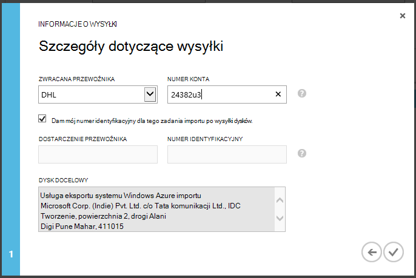

<properties
   pageTitle="Azure kopia zapasowa - kopii zapasowej Offline lub początkowej obsługiwanie przy użyciu usługi Azure Importuj/Eksportuj | Microsoft Azure"
   description="Dowiedz się, jak Kopia zapasowa Azure umożliwia wysyłanie danych poza siecią za pomocą usługi Azure Importuj/Eksportuj. W tym artykule wyjaśniono, offline obsługiwanie początkowej danych kopii zapasowej za pomocą usługi Azure Importuj Eksportuj."
   services="backup"
   documentationCenter=""
   authors="saurabhsensharma"
   manager="shivamg"
   editor=""/>
<tags
   ms.service="backup"
   ms.devlang="na"
   ms.topic="article"
   ms.tgt_pltfrm="na"
   ms.workload="storage-backup-recovery"
   ms.date="08/16/2016"
   ms.author="jimpark;saurabhsensharma;nkolli;trinadhk"/>

# Przepływ pracy kopii zapasowej offline w kopii zapasowej Azure
Azure kopii zapasowej zawiera kilka wbudowanych korzyści, które m.in kosztów podczas początkowej pełne kopie zapasowe danych Azure. Początkowa pełne kopie zapasowe zwykle przenieść duże ilości danych i wymagają większej przepustowości sieci w porównaniu z kolejne kopie zapasowe, które przeniesione tylko różnice incrementals. Kopia zapasowa Azure kompresuje początkowe kopie zapasowe. Przez proces obsługiwanie offline Azure kopii zapasowej umożliwia dysków przekazywanie skompresowany początkowej danych kopii zapasowej w trybie offline Azure.  

Proces offline obsługiwanie Azure kopii zapasowej jest ściśle zintegrowany z [usługi Azure Importuj/Eksportuj](../storage/storage-import-export-service.md) , która umożliwia przesyłanie danych Azure za pomocą dysków. Jeśli masz terabajtów (TBs) początkowej danych kopii zapasowej, który musi być przekazane opóźnienie wysokiej i niskiej przepustowości sieci, służy offline obsługiwanie przepływu pracy do wysłania początkowej kopii zapasowej na jeden lub więcej dyskach twardych Azure centrum danych. W tym artykule omówiono czynności, które ukończenie tego przepływu pracy.

## Omówienie

Z możliwością offline obsługiwanie Azure wykonywanie kopii zapasowych i Azure Importuj/Eksportuj jest proste do przekazania danych w trybie offline Azure za pomocą dysków. Zamiast przenoszenia początkowej pełna kopia sieci, dane kopii zapasowej są zapisywane z *tymczasowej lokalizacji*. Po zakończeniu kopię tymczasową lokalizację za pomocą narzędzia Azure Import/Eksport danych jest zapisywany jeden lub więcej dysków SATA, w zależności od ilości danych. Te dyski ostatecznie są dostarczane z najbliższym centrum danych Azure.

[2016 sierpnia aktualizowanie kopii zapasowej Azure (lub nowszym)](http://go.microsoft.com/fwlink/?LinkID=229525) zawiera *Narzędzia przygotowanie dysku Azure*, o nazwie AzureOfflineBackupDiskPrep, która:

   - Pomaga przygotować dysków importowania Azure za pomocą narzędzia Azure Importuj/Eksportuj.
   - Automatycznie tworzy zadanie importu Azure w usłudze Azure Importuj/Eksportuj w [portal Azure klasyczny](https://manage.windowsazure.com) zamiast ręcznego tworzenia zgodne ze starszymi wersjami Azure kopii zapasowej.

Po zakończeniu przekazywania danych kopii zapasowej Azure Azure kopii zapasowej skopiuje danych kopii zapasowej magazynu kopii zapasowej, a zaplanowano przyrostowe kopie zapasowe.

  > [AZURE.NOTE] Aby użyć narzędzia przygotowanie dysku Azure, upewnij się, zainstalowanie aktualizacji 2016 sierpnia Azure kopii zapasowej (lub nowszy) i wykonaj wszystkie kroki przepływu pracy z nim. Jeśli używasz starszej wersji programu Kopia zapasowa Azure można przygotować dysk SATA za pomocą narzędzia Azure Importuj/Eksportuj wyszczególnione w późniejszym sekcjach tego artykułu.

## Wymagania wstępne

- [Zapoznaj się z przepływem pracy Azure Importuj/Eksportuj](../storage/storage-import-export-service.md).
- Przed rozpoczęciem przepływu pracy, należy sprawdzić, czy:
    - Utworzono magazynu kopii zapasowej Azure.
    - Pobrano magazynu poświadczeń.
    - Agent Azure Backup został zainstalowany na klienta systemu Windows Server i Windows lub serwera System Center Data Protection Manager, a komputer jest zarejestrowana z magazynu kopii zapasowej Azure.
- [Pobierz ustawienia publikowania Azure pliku](https://manage.windowsazure.com/publishsettings) na komputerze, z której zamierzasz utworzyć kopię zapasową danych.
- Przygotowywanie tymczasową lokalizację, może to być udziału sieciowego lub dodatkowego dysku na tym komputerze. Tymczasową lokalizację jest przejściowych miejsca do magazynowania i jest używana tymczasowo podczas ten przepływ pracy. Upewnij się, że tymczasową lokalizację ma miejsca na dysku do przechowywania kopii początkowej. Na przykład jeśli próbujesz kopii zapasowych serwera plików 500 GB, upewnij się, że obszaru tymczasowego jest co najmniej 500 GB. (Mniejszą ilość jest używany z powodu kompresji).
- Upewnij się, że korzystasz z obsługiwanej dysk. Tylko 3,5 cala SATA II III twardych są obsługiwane przez usługę Importuj/Eksportuj. Twardych większych niż 8 TB nie są obsługiwane. Można dołączyć dysku SATA II III zewnętrznie do większości komputerów przy użyciu karty SATA II i III USB. Zapoznaj się z dokumentacją Azure Importuj/Eksportuj najnowszą zestawu dysków obsługiwanych przez usługę.
- Włączanie funkcji BitLocker na komputerze, z którym jest połączony zapis dysk SATA.
- [Pobierz narzędzie Azure Importuj/Eksportuj](http://go.microsoft.com/fwlink/?LinkID=301900&clcid=0x409) do komputera, do którego SATA sterują writer jest połączony. Ten krok nie jest wymagane, jeśli zostały pobrane i zainstalowanie aktualizacji 2016 sierpień Azure kopii zapasowej (lub nowszy).

## Przepływ pracy
Informacje w tej sekcji ułatwia wykonywanie kopii zapasowej offline przepływu pracy tak, aby dane można dostarczać Azure centrum danych, a przekazane do magazynowania Azure. Jeśli masz pytania dotyczące usługi importowania lub wszystkimi aspektami procesu, zapoznaj się z dokumentacją [Omówienie usługi importu](../storage/storage-import-export-service.md) , wymienianych wcześniej.

### Rozpoczęcie tworzenia kopii zapasowej offline

1. Podczas planowania kopii zapasowej, zobacz następujące ekranu (w systemie Windows Server, klient systemu Windows lub System Center Data Protection Manager).

    

    Oto odpowiednich ekranu w System Center Data Protection Manager:  
    

    Opis danych wejściowych jest w następujący sposób:

    - **Lokalizację tymczasowego**: lokalizacji przechowywania tymczasowych, na którym jest zapisany początkowa kopia zapasowa. Może to być na komputerze lokalnym lub w udziale sieciowym. Kopiowanie komputerem a komputerem źródła są różne, zaleca się określone pełną ścieżkę sieciową tymczasowej lokalizacji.
    - **Nazwa zadania importu Azure**: unikatową nazwę, która importowanie Azure usługi i kopia zapasowa Azure śledzenie transfer danych wysyłane na dyskach Azure.
    - **Ustawienia publikowania Azure**: plik XML, który zawiera informacje o profilu subskrypcji. Zawiera on również bezpiecznych poświadczeń, które są skojarzone z subskrypcją. Możesz [pobrać plik](https://manage.windowsazure.com/publishsettings). Podaj lokalną ścieżkę do pliku ustawień publikowania.
    - **Identyfikator subskrypcji Azure**: identyfikator subskrypcji Azure dla subskrypcji, na której zamierzasz zainicjować zadania importu Azure. Jeśli masz wiele subskrypcji Azure za pomocą Identyfikatora subskrypcji, którą chcesz skojarzyć z zadania importu.
    - **Konta na platformie Azure**: konto miejsca do magazynowania typ klasyczny przedstawionych Azure subskrypcji, które będą skojarzone z tym zadaniem importu Azure.
    - **Azure kontenera magazynu**: Nazwa docelowego blob miejsca do magazynowania na koncie Azure miejsca do magazynowania, gdzie są importowane dane tego zadania.

    > [AZURE.NOTE] Jeśli serwer do magazynu usługi Azure odzyskiwania z [Azure portal](https://portal.azure.com) dla zarejestrowano kopii zapasowych i nie znajdują się na subskrypcję chmury rozwiązanie dostawcy (dostawcy), można nadal utworzyć konto klasyczny typ miejsca do magazynowania z portalu usługi Azure i używać go do trybu offline kopii zapasowych przepływu pracy.

    Zapisz wszystkie te informacje, ponieważ musisz wprowadź je ponownie w wykonując kroki. Tylko *tymczasowej lokalizacji* jest wymagane użycie narzędzia przygotowanie dysku Azure do przygotowania dyski.    

2. Kończenie przepływu pracy, a następnie wybierz **Wykonaj teraz kopię zapasową** w konsoli zarządzania Azure kopii zapasowej, aby zainicjować kopii zapasowej trybu offline. Wstępnej kopii zapasowej są zapisywane w obszarze tymczasowym w ramach tego kroku.

    

    Aby wykonać odpowiednie przepływu pracy w System Center Data Protection Manager, kliknij prawym przyciskiem myszy, **Grupa ochrona**, a następnie wybierz opcję **odzyskiwania Tworzenie punktu** . Następnie możesz wybrać opcję **Ochrony Online** .

    

    Po zakończeniu operacji tymczasową lokalizację jest gotowa do użycia dla przygotowanie dysku.

    

### Przygotowywanie dysk SATA i tworzenie zadania importu Azure za pomocą narzędzia przygotowanie dysku Azure
Narzędzie do przygotowywania dysku Azure jest dostępny w katalogu instalacji agenta usługi odzyskiwania (Aktualizowanie 2016 sierpnia lub w nowszej wersji) w następującej ścieżce.

   *\Microsoft* *Azure* *Odzyskiwanie* *Usług* * Agent\Utils\*

1. Przejdź do katalogu, a następnie skopiuj katalogu **AzureOfflineBackupDiskPrep** na komputerze kopii, na którym są instalowane dysków, które mają być przygotowane. Zapewnia następujące w odniesieniu do komputera kopii:

      - Na komputerze kopii dostępu tymczasową lokalizację offline obsługiwanie przepływu pracy przy użyciu samej ścieżki sieciowej, uzyskane w przepływie pracy **Rozpoczęcie tworzenia kopii zapasowej offline** .

      - Na tym komputerze włączeniu funkcji BitLocker.

      - Komputer ma dostęp do portalu Azure.

      W razie potrzeby komputer kopii może być taka sama na komputerze źródłowym.

2. Otwórz wiersz polecenia z podwyższonym poziomem uprawnień na tym komputerze kopii z katalogu narzędzie przygotowanie dysku Azure jako bieżącego katalogu, a następnie uruchom następujące polecenie:

      *.\AzureOfflineBackupDiskPrep.exe* s: <*Ścieżki lokalizacji tymczasowego*> [p: <*ścieżka do PublishSettingsFile*>]

| Parametr | Opis
|-------------|-------------|
|s: <*Tymczasowego ścieżki lokalizacji*> | Obowiązkowe wprowadzenia służą do zapewnienia ścieżkę do lokalizacji tymczasowej, wprowadzone w przepływie pracy **Rozpoczęcie tworzenia kopii zapasowej offline** . |
|p: <*ścieżka do PublishSettingsFile*> | Opcjonalnie wprowadzenia służą do zapewnienia ścieżkę do pliku **Ustawienia publikowania Azure** , wprowadzone w przepływie pracy **Rozpoczęcie tworzenia kopii zapasowej offline** . |

> [AZURE.NOTE] &lt;Ścieżkę do PublishSettingFile&gt; wartość jest obowiązkowe, jeśli różni się od kopii komputerem a komputerem źródła.

Po uruchomieniu polecenia narzędzia żąda zaznaczenia zadania importu Azure, który odpowiada dyski, które trzeba przygotować. Jeśli tylko zadania pojedynczego importu jest skojarzony z podanej lokalizacji tymczasowej, pojawi się ekran, taki jak przedstawiony poniżej.

     
3. Wpisz literę bez końcowych dwukropek zainstalowanego dysku, który chcesz, aby przygotować się do przeniesienia Azure. Potwierdź formatowania dysk po wyświetleniu monitu.

Narzędzie następnie rozpoczyna się przygotować dysk z danych kopii zapasowej. Może być konieczne dołączyć dodatkowe dyski po wyświetleniu monitu przez narzędzie na wypadek, gdyby dostarczonych dysku nie ma wystarczająco dużo miejsca danych kopii zapasowej.  

Na końcu pomyślne wykonanie narzędzia jeden lub więcej dysków ręcznego przygotować się do wysyłki Azure. Ponadto zadania importu o nazwie otrzymane podczas **inicjowania kopii zapasowej offline** przepływ pracy jest tworzona w portalu klasyczny Azure. Na koniec narzędzie wyświetla adres wysyłkowy Azure centrum danych, miejsce, w którym dyski muszą zostać wysłane i łącze, aby zlokalizować zadania importu w portalu klasyczny Azure.

    
4. Wysłać dysków w polu adres udostępniane narzędzia i Zachowaj numerem identyfikacyjnym do użytku w przyszłości. 
5. Po przejściu do łącza, które wyświetlone narzędzie, zobacz konto Azure miejsca do magazynowania, określone w przepływie pracy **Rozpoczęcie tworzenia kopii zapasowej offline** . Tutaj widać zadania importu nowo utworzonego na karcie **IMPORTUJ/EKSPORTUJ** konta miejsca do magazynowania.

    
6. Kliknij pozycję **Informacje wysyłki** u dołu strony aktualizowania informacji o kontakcie, jak pokazano na poniższym obrazie. Firma Microsoft korzysta z tych informacji do wysłania dysków powrotem po zakończeniu zadania importu.

    
7. Wprowadź szczegóły dotyczące wysyłki na następnym ekranie. Podanie szczegółowych informacji **Przewoźnika odbiorcy** i **Numer identyfikacyjny** , które odpowiadają dyski, które zostały wydane Azure centrum danych.

    

### Kończenie przepływu pracy
Po zakończeniu pracy zadania importu początkowej danych kopii zapasowej jest dostępna na Twoim koncie miejsca do magazynowania. Agent usługi odzyskiwania, a następnie kopiuje zawartość dane z tego konta magazynu kopii zapasowej lub usługi odzyskiwania vault, się. W następnym zaplanowanym terminie kopii zapasowej agenta kopii zapasowej Azure wykonuje przyrostowa kopia zapasowa na początkowej kopii zapasowej.

> [AZURE.NOTE] Poniższe sekcje dotyczą użytkownicy starszych wersji kopii zapasowej Azure, którzy nie mają dostępu do narzędzia przygotowanie dysku Azure.

### Przygotowywanie dysk SATA

1. Pobierz [Narzędzie Importuj/Eksportuj do programu Microsoft Azure](http://go.microsoft.com/fwlink/?linkid=301900&clcid=0x409) komputerowi Kopiuj. Upewnij się, że tymczasową lokalizację jest dostępne z komputera, w której planujesz przeprowadzenie następnego zestawu poleceń. W razie potrzeby komputer kopii może być taka sama na komputerze źródłowym.

2. Rozpakuj plik WAImportExport.zip. Uruchom narzędzie WAImportExport formatuje dysk SATA, zapisuje danych kopii zapasowej na dysku SATA i są szyfrowane go. Przed uruchom następujące polecenie, należy się upewnić, włączeniu funkcji BitLocker na tym komputerze.  

    *.\WAImportExport.exe PrepImport /j: <* JournalFile*> .jrn /id: <*identyfikatora sesji*> /sk: <*StorageAccountKey*> /BlobType:**PageBlob* * /t: <*TargetDriveLetter*>/Formatowanie / szyfrowanie /srcdir: <*tymczasowej lokalizacji*> /dstdir: <*DestinationBlobVirtualDirectory*>/*

    > [AZURE.NOTE] Po zainstalowaniu aktualizacji 2016 sierpnia Azure kopii zapasowej (lub nowszy) zapewnia wprowadzonej lokalizacji tymczasowej jest taki sam, jak na ekranie **Wykonaj teraz kopię zapasową** i plikami AIB i obiektów Blob Base.

| Parametr | Opis
|-------------|-------------|
| /j: <*JournalFile*>| Ścieżka do pliku dziennika. Każdego dysku musi być dokładnie jednego pliku dziennika. Plik dziennika nie może być na dysku docelowego. Rozszerzenie pliku dziennika jest .jrn i zostanie utworzona w ramach tego polecenia.|
|/ID: <*identyfikator sesji*> | Identyfikator sesji służy do identyfikowania sesji Kopiuj. Jest używana do dokładności odzyskiwanie sesję przerwane Kopiuj. Pliki, które są kopiowane w sesji kopii są przechowywane w katalogu o nazwie po identyfikator sesji na dysku docelowego.|
| /SK: <*StorageAccountKey*> | Klucz konta dla konta miejsca do magazynowania, do którego będą importowane dane. Klucz musi być taka sama wprowadzoną podczas tworzenia grupy kopii zapasowej zasady ochrony.|
| -BlobType | Typ obiektów blob. Ten przepływ pracy zakończyło się powodzeniem, tylko wtedy, gdy określono **PageBlob** . To jest domyślna opcja i należy wspomnieć, w tym poleceniu. |
|/ t: <*TargetDriveLetter*> | Litera dysku, bez końcowych dwukropek dysku twardego docelowej dla bieżącej sesji Kopiuj.|
|/ Format | Opcja sformatowanie. Określ ten parametr w przypadku dysk musi zostać sformatowany; w przeciwnym razie należy pominąć go. Zanim narzędzie formatuje dysk, zostanie wyświetlony monit o potwierdzenie z konsoli. Aby wyłączyć potwierdzenia, ustaw wartość parametru /silentmode.|
|/ szyfrowanie | Opcja szyfrowania dysku. Określ ten parametr w przypadku dysku nie jest jeszcze zaszyfrowany przy użyciu funkcji BitLocker i musi być zaszyfrowane przez narzędzie. Jeśli dysk już został zaszyfrowany przy użyciu funkcji BitLocker, ten parametr, ustaw wartość parametru /bk i Podaj istniejący klucz funkcji BitLocker. Jeśli zostanie użyty parametr/format, należy również określić / szyfrowanie parametru. |
|/srcdir: <*SourceDirectory*> | Katalog źródłowy zawierającego pliki do skopiowania na dysk docelowy. Należy się upewnić, że nazwa określony katalog ma pełny zamiast względne ścieżki.|
|/dstdir: <*DestinationBlobVirtualDirectory*> | Ścieżka do katalogu wirtualnego docelowego na koncie Azure miejsca do magazynowania. Należy użyć nazwy prawidłowego kontenera po określeniu katalogów wirtualnych pola Lokalizacja docelowa lub obiektów blob. Należy pamiętać, że nazwy kontenera musi być mała.  Ta nazwa kontenera powinny być, w którym wprowadzone w trakcie tworzenie kopii zapasowej ochrony zasad grupy.|

  > [AZURE.NOTE] Plik dziennika jest tworzony w folderze WAImportExport znajdują się informacje dotyczące całego przepływu pracy. Po utworzeniu zadania importu w portalu Azure muszą się ten plik.

  

### Tworzenie zadania importu w portalu Azure
1. Przejdź do swojego konta miejsca do magazynowania w [portal Azure klasyczny](https://manage.windowsazure.com/), kliknij przycisk **Importuj/Eksportuj**, a następnie **Utworzyć zadanie importu** , w okienku zadań.

    

2. W kroku 1 Kreatora wskazują przygotowano dysku i że masz dostępne pliku dziennika dysk.
3. W kroku 2 w kreatorze podaj informacje kontaktowe dla osoby, która odpowiada dla tego zadania importu.
4. W kroku 3 przekazywanie plików dziennika dysk, które uzyskane w poprzedniej sekcji.
5. W kroku 4 wprowadź opisową nazwę zadania importu wprowadzona podczas tworzenia grupy kopii zapasowej zasady ochrony. Wprowadzona nazwa może zawierać tylko małe litery, cyfry, łączniki i podkreślenia, musi rozpoczynać się od litery i nie może zawierać spacji. Nazwa, którą należy wybrać jest używana do śledzenia zadań, gdy są one w toku i po ich wykonaniu.
6. Następnie wybierz obszar centrum danych z listy. Region centrum danych wskazuje centrum danych i adres, do którego możesz wysłać pakietu.

    

7. W kroku 5 wybierz operatora zwrotu z listy, a następnie wprowadź numer swojego konta przewoźnika. Firma Microsoft korzysta z tego konta do wysłania dysków powrotem po zakończeniu zadania importu.

8. Wysłać dysku, a następnie wprowadź numer umożliwia śledzenie stanu wydania. Po dysku są dostarczane do centrum danych, jest kopiowana do rachunku miejsca do magazynowania i zaktualizowaniu stanu.

    

### Kończenie przepływu pracy
Po początkowej danych kopii zapasowej jest dostępna na Twoim koncie miejsca do magazynowania, agenta firmy Microsoft Azure odzyskiwania usług wpisuje dane z tego konta do magazynu kopii zapasowej lub magazynu usługi odzyskiwania, się. W następnym harmonogram wykonywania kopii zapasowej agenta kopii zapasowej Azure wykonuje przyrostowa kopia zapasowa na początkowej kopii zapasowej.

## Następne kroki
- Wszelkie pytania w przepływie pracy Azure Importuj/Eksportuj odwołują się do [użycia transferować dane z magazynem obiektów Blob usługi Microsoft Azure Importuj/Eksportuj](../storage/storage-import-export-service.md).
- Zapoznaj się z sekcją kopii zapasowej offline: [często zadawane pytania dotyczące](backup-azure-backup-faq.md) Azure kopii zapasowej wszelkie pytania dotyczące przepływu pracy.
