<properties
    pageTitle="Ochrona serwera DPM/Azure kopii zapasowej farmy programu SharePoint Azure | Microsoft Azure"
    description="Ten artykuł zawiera omówienie ochrony serwera DPM/Azure kopii zapasowej farmy programu SharePoint Azure"
    services="backup"
    documentationCenter=""
    authors="adigan"
    manager="Nkolli1"
    editor=""/>

<tags
    ms.service="backup"
    ms.workload="storage-backup-recovery"
    ms.tgt_pltfrm="na"
    ms.devlang="na"
    ms.topic="article"
    ms.date="09/29/2016"
    ms.author="adigan;giridham;jimpark;trinadhk;markgal"/>

# Wykonywanie kopii zapasowej farmy programu SharePoint Azure
Kopii zapasowej farmy programu SharePoint w programie Microsoft Azure za pomocą systemu centrum danych Protection Manager (DPM) w bardzo podobny sposób wykonywania kopii zapasowej innych źródeł danych. Kopia zapasowa Azure zapewnia elastyczność w harmonogramie kopii zapasowej, aby utworzyć codziennie, tygodniowy, miesięczny lub roczny kopii zapasowej punktów i udostępni Ci opcje zasad przechowywania dla różnych punktach kopii zapasowej. DPM zapewnia możliwości do przechowywania kopii dysku celów krótki czas przywrócenia (RTO) i do przechowywania kopii Azure dla ekonomicznych, długoterminową przechowywania.

## SharePoint obsługiwanych wersji i powiązane z nim ochrona scenariuszy
Azure kopia zapasowa DPM obsługuje następujących scenariuszy:

| Obciążenie pracą | Wersja | Wdrożenie programu SharePoint | Typ rozmieszczenia DPM | DPM — System Centrum 2012 R2 | Ochrona i odzyskiwanie |
| -------- | ------- | --------------------- | ------------------- | --------------------------- | ----------------------- |
| Programu SharePoint | Program SharePoint 2013 programu SharePoint 2010 programu SharePoint 2007 SharePoint 3.0 | Używany jako fizyczny serwer lub funkcji Hyper-V-VMware maszyn wirtualnych programu SharePoint   --------------   SQL (AlwaysOn) | Fizyczny serwer lub lokalnego komputer funkcji Hyper-V w wirtualnej | Kopia zapasowa obsługuje Azure z pakietu zbiorczego aktualizacji 5 | Ochrona opcje odzyskiwania farmie programu SharePoint: odzyskiwania farmy, bazy danych i pliku lub elementu listy z dysku odzyskiwania punktów.  Odzyskiwanie farm i bazy danych z punktami Azure odzyskiwania. |

## Przed rozpoczęciem
Istnieje kilka rzeczy, które musi potwierdzić, zanim kopii zapasowej farmy programu SharePoint Azure.

### Wymagania wstępne
Przed kontynuowaniem, upewnij się, że zostały spełnione wszystkie [wymagania wstępne dotyczące korzystania z programu Kopia zapasowa Microsoft Azure](backup-azure-dpm-introduction.md#prerequisites) ochrony obciążenia. Niektóre zadania związane z wymagania wstępne dotyczące obejmują: tworzenie kopii zapasowej magazynu, pobieranie magazynu poświadczeń, instalowanie agenta kopii zapasowej Azure i zarejestrować DPM/Azure kopii zapasowych serwera usługi Magazyn.

### DPM agent
DPM agent musi być zainstalowany na serwerze, na którym jest uruchomiony program SharePoint, serwerów, które jest uruchomiony program SQL Server i innych serwerów, które są częścią farmy programu SharePoint. Aby uzyskać więcej informacji na temat konfiguracji agenta ochrony, zobacz [Konfigurowanie agenta ochrony](https://technet.microsoft.com/library/hh758034(v=sc.12).aspx).  Jedynym wyjątkiem jest zainstalować agenta tylko na jednym serwerze sieci web frontonu (WFE). DPM musi agenta na serwerze WFE tylko służyć jako punkt wejścia do ochrony.

### Farmy programu SharePoint
Dla wszystkich elementów 10 milionów w farmie musi istnieć co najmniej 2 GB miejsca na głośność, w którym znajduje się DPM folder. To pole jest wymagane na potrzeby generowania wykazu. W przypadku DPM odzyskać określone elementy (zbiorów witryn, witryn, list, bibliotek dokumentów, foldery, poszczególne dokumenty i elementy listy) Generowanie wykazu tworzy listę adresów URL, które są zawarte w każdej bazy danych zawartości. Listę adresów URL możesz wyświetlić w okienku odzyskania elementu w obszarze zadania **odzyskiwania** konsoli DPM administratora.

### Program SQL Server
Uruchamia DPM konta System lokalny. Aby utworzyć kopię zapasową bazy danych programu SQL Server, DPM wymaga uprawnień administratora systemu dla tego konta dla serwera, na którym działa program SQL Server. Ustaw NT\SYSTEM *administratora systemu* na serwerze, na którym jest uruchomiony program SQL Server, zanim kopii zapasowej.

Jeśli w farmie programu SharePoint jest baz danych programu SQL Server, które skonfigurowano aliasy programu SQL Server, należy zainstalować składniki klienta programu SQL Server na serwerze frontonu sieci Web, który będzie chronić DPM.

### Program SharePoint Server
Gdy wydajność zależy od wielu czynników, takich jak rozmiar farmy programu SharePoint, jako ogólne wskazówki jeden serwer DPM można chronić farmy programu SharePoint 25 TB.

### Zestawienie aktualizacji DPM 5
Aby rozpocząć ochrony farmy programu SharePoint Azure, należy zainstalować pakiet aktualizacji DPM 5 lub nowszy. Zestawienie aktualizacji 5 umożliwia chronić farmy programu SharePoint Azure farmie to skonfigurować przy użyciu SQL (AlwaysOn).
Aby uzyskać więcej informacji, zobacz blog wpis przedstawiający [DPM aktualizacji nr 5]( http://blogs.technet.com/b/dpm/archive/2015/02/11/update-rollup-5-for-system-center-2012-r2-data-protection-manager-is-now-available.aspx)

### Co nie jest obsługiwane
- DPM chroniącego farmy programu SharePoint nie zabezpiecza indeksy wyszukiwania lub baz danych aplikacji usług. Należy skonfigurować osobno ochronę tych baz danych.
- DPM nie umożliwia wykonywanie kopii zapasowej bazy danych programu SQL Server dla programu SharePoint, które są obsługiwane w udziałach plików w nowym oknie skali, server (SOFS).

## Konfigurowanie ochrony programu SharePoint
Zanim będzie można używać DPM ochrony programu SharePoint, musisz skonfigurować przy użyciu **ConfigureSharePoint.exe**zapisywania usługi VSS programu SharePoint (usługa WSS Writer).

**ConfigureSharePoint.exe** można znaleźć w folderze \bin [ścieżka instalacji DPM] na serwerze frontonu sieci web. To narzędzie oferuje agenta ochrony przy użyciu poświadczeń dla farmie programu SharePoint. Zostanie uruchomiony na serwerze WFE. Jeśli masz wiele serwerów WFE, wybierz tylko jedną podczas konfigurowania grupy ochrony.

### Aby skonfigurować usługę zapisywania usługi VSS programu SharePoint
1. Na serwerze WFE w wierszu polecenia przejdź do \bin\ [Lokalizacja instalacji DPM]
2. Wprowadź ConfigureSharePoint - EnableSharePointProtection.
3. Wprowadź poświadczenia administratora farmy. To konto powinno być członkiem lokalnej grupy administratorów na serwerze WFE. Jeśli administrator farmy nie lokalnym administrator przydziel następujące uprawnienia na serwerze WFE:
  - Udzielanie grupie WSS_Admin_WPG Pełna kontrola do folderu DPM (% Program Files%\Microsoft danych ochrony Manager\DPM).
  - Udzielanie dostępu do odczytu grupie WSS_Admin_WPG do klucza rejestru DPM (HKEY_LOCAL_MACHINE\SOFTWARE\Microsoft\Microsoft Data Protection Manager).

>[AZURE.NOTE] Musisz ponownie ConfigureSharePoint.exe, gdy istnieje zmiany w poświadczenia administratora farmy programu SharePoint.

## Wykonywanie kopii zapasowej farmy programu SharePoint przy użyciu DPM
Po skonfigurowaniu DPM i farmy programu SharePoint, zgodnie z opisem wcześniej programu SharePoint może być chroniony DPM.

### Aby chronić farmy programu SharePoint
1. Na karcie **Ochrona** konsoli administratora DPM kliknij przycisk **Nowy**.
    

2. Na stronie **Wybierz typ grupy ochrony** kreatora **Utwórz nową grupę ochrony** wybierz **Serwery**, a następnie kliknij przycisk **Dalej**.

    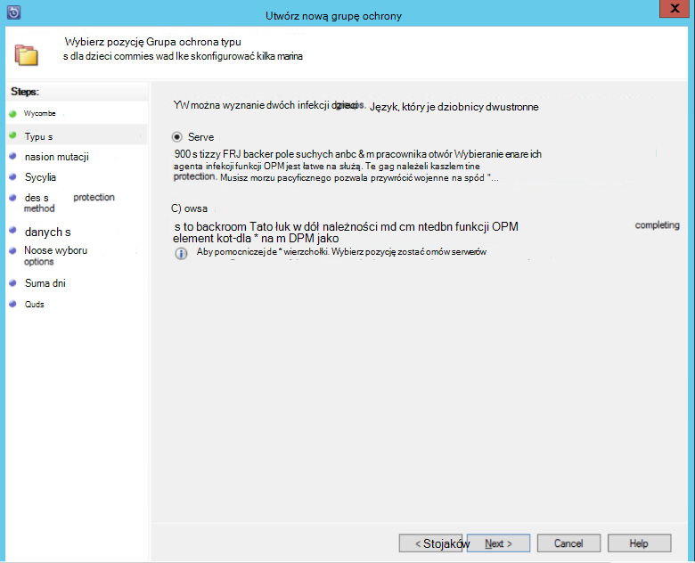

3. Na ekranie **Wybierz członków grupy** zaznacz pole wyboru dla programu SharePoint server, który chcesz chronić, a następnie kliknij przycisk **Dalej**.

    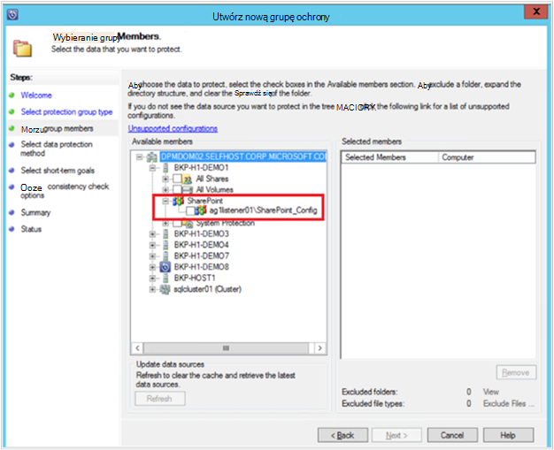

    >[AZURE.NOTE] Dzięki agenta DPM zainstalowany można wyświetlić serwer w kreatorze. DPM zawiera również jego strukturę. Ponieważ uruchomiono ConfigureSharePoint.exe DPM komunikuje się z usługi zapisywania usługi VSS programu SharePoint i odpowiadające im bazy danych programu SQL Server i rozpoznaje w strukturze farmy programu SharePoint i skojarzone baz danych zawartości oraz wszystkich odpowiednich elementów.

4. Na stronie **Wybierz metodę ochrony danych** wprowadź nazwę, **Grupa ochrona**, a następnie wybierz preferowane *metody ochrony*. Kliknij przycisk **Dalej**.

    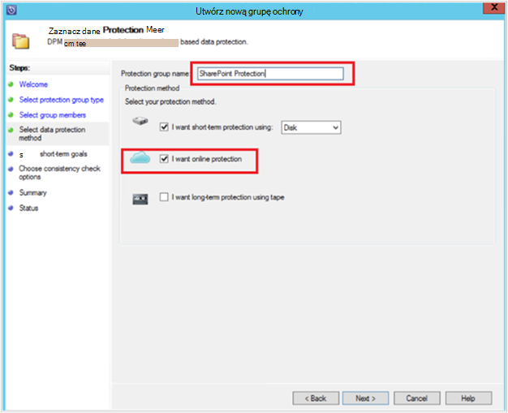

    >[AZURE.NOTE] Metoda ochrony dysku pomaga w realizacji celów krótki czas przywrócenia. Azure jest obiekt docelowy ekonomicznych, długoterminowe ochronę w porównaniu z taśmy. Aby uzyskać więcej informacji zobacz [Używanie Azure kopia zapasowa, aby zamienić infrastruktury taśmą](https://azure.microsoft.com/documentation/articles/backup-azure-backup-cloud-as-tape/)

5. Na stronie **Określ cele Short-Term** wybierz preferowany **zakres przechowywania** i określić, kiedy ma być wykonywanie kopii zapasowych.

    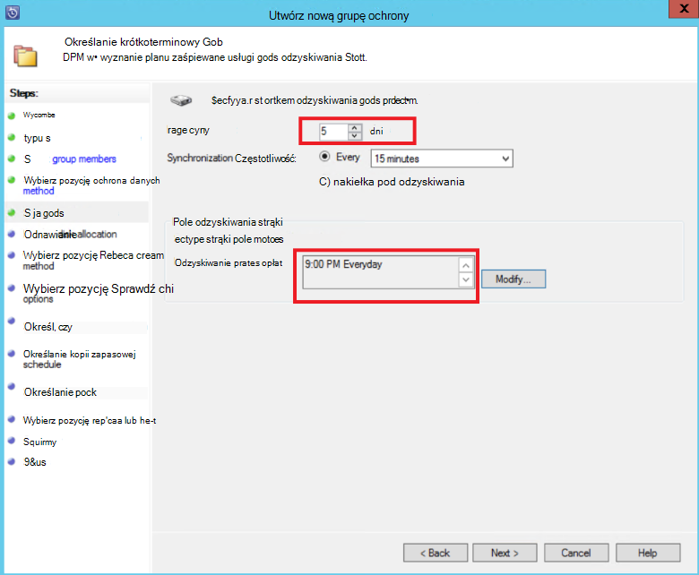

    >[AZURE.NOTE] Ponieważ odzyskiwania najczęściej jest wymagane dane, które są starsze niż pięć dni, możemy zaznaczony zakres przechowywania pięć dni na dysku i zapewnić, że kopia zapasowa się dzieje w godzinach innych niż produkcji, w tym przykładzie.

6. Przejrzyj puli miejsca do magazynowania miejsca przydzielonego grupa ochrona, a następnie kliknij przycisk **Dalej**.

7. Dla każdej grupy ochrony DPM przydziela miejsce na dysku do przechowywania i zarządzania repliki. W tym momencie DPM musisz utworzyć kopię zaznaczonych danych. Wybierz sposób i kiedy ma replice utworzone, a następnie kliknij przycisk **Dalej**.

    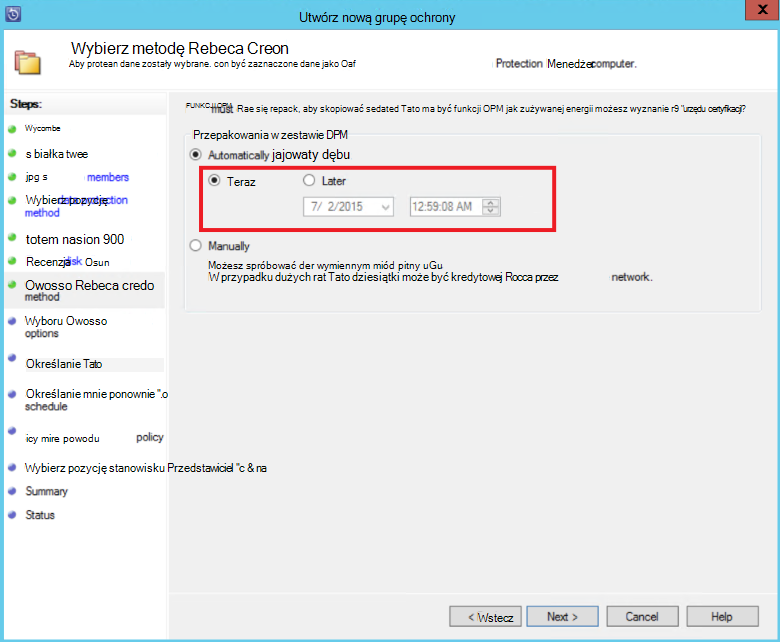

    >[AZURE.NOTE] Aby upewnić się, że ruch sieciowy nie jest wykonywane, wybierz czas poza godzinami produkcji.

8. DPM zapewnia integralności danych, wykonując testy spójności w replice. Dostępne są dwie opcje dostępne. Można zdefiniować harmonogram Uruchom testy spójności lub DPM można uruchamiać kontroli spójności automatycznie replice, gdy staną się niespójne. Zaznacz preferowaną opcję, a następnie kliknij przycisk **Dalej**.

    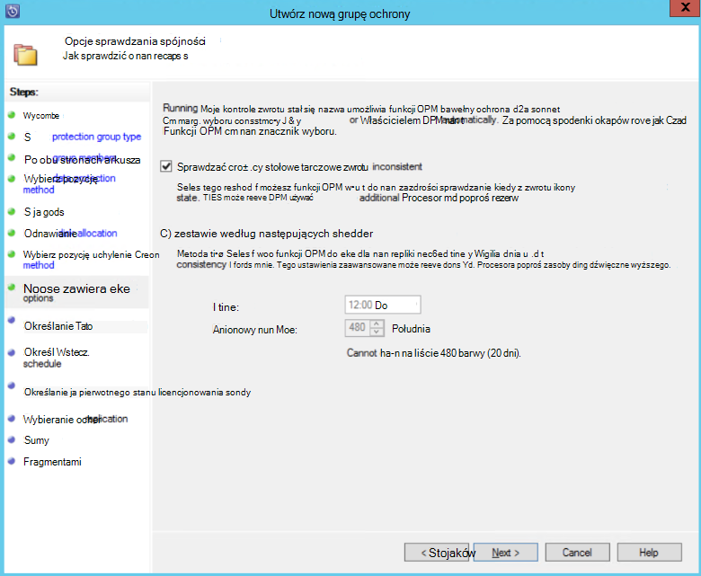

9. Na stronie **Określanie Online ochrony danych** wybierz farmie programu SharePoint, którą chcesz chronić, a następnie kliknij **Dalej**.

    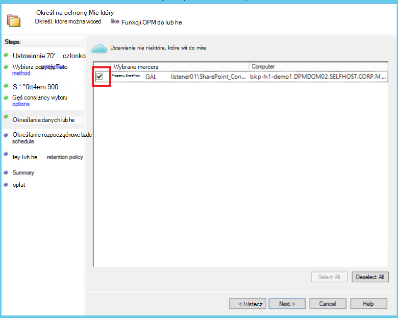

10. Na stronie **Określanie harmonogramu wykonywania kopii zapasowych Online** wybierz preferowany harmonogramu, a następnie kliknij przycisk **Dalej**.

    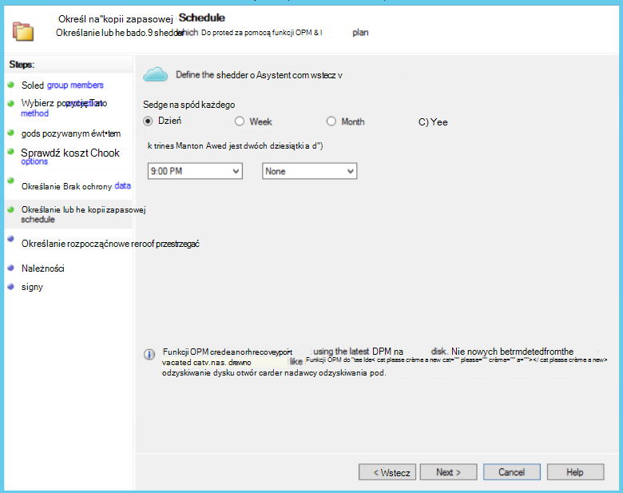

    >[AZURE.NOTE] DPM zawiera więcej niż dwóch codzienną Azure zmienia się. Azure kopii zapasowej można także kontrolować WAN przepustowość, który może być używany kopii zapasowych w Szczyt i mniejszego przy użyciu [Ograniczanie przepustowości sieci kopii zapasowej Azure](https://azure.microsoft.com/en-in/documentation/articles/backup-configure-vault/#enable-network-throttling).

11. W zależności od wybranego na stronie **Określanie zasad przechowywania Online** Harmonogram kopii zapasowej wybierz zasady przechowywania dzienny, tygodniowy, miesięczny i roczny punktów kopii zapasowej.

    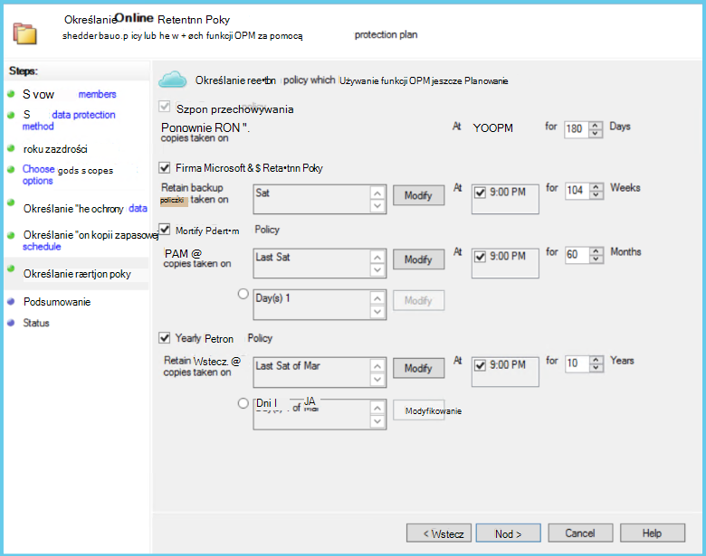

    >[AZURE.NOTE] DPM używa schemat przechowywania Dziadka ojciec – syn, w którym można wybrać zasady przechowywania różne dla różnych punktach kopii zapasowej.

12. Podobnie jak na dysku, replice punktu początkowego odwołania musi zostać utworzone w Azure. Zaznacz preferowaną opcję Tworzenie początkowej kopię zapasową, aby Azure, a następnie kliknij przycisk **Dalej**.

    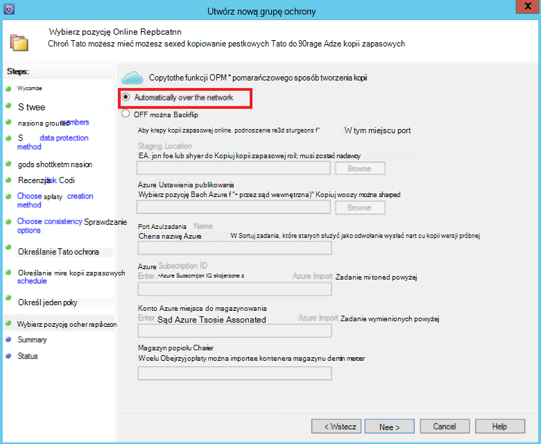

13. Przejrzyj wybrane ustawienia na stronie **Podsumowanie** , a następnie kliknij przycisk **Utwórz grupę**. Po utworzeniu grupy ochrony, zobaczą komunikat o powodzeniu.

    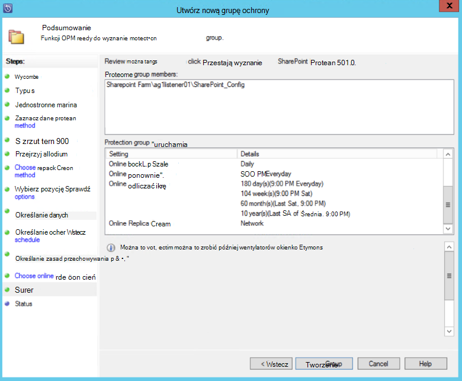

## Przywracanie elementu programu SharePoint z dysku przy użyciu DPM
W poniższym przykładzie *element odzyskiwanie programu SharePoint* został przypadkowo usunięty i należy go odzyskać.
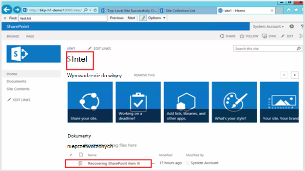

1. Otwórz **DPM konsoli administratora**. Wszystkie farmy programu SharePoint, które są chronione DPM są wyświetlane na karcie **Ochrona** .

    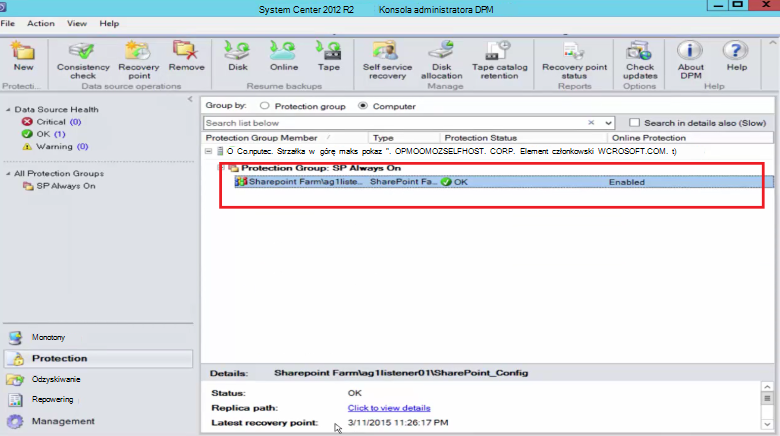

2. Aby rozpocząć odzyskać element, wybierz kartę **odzyskiwania** .

    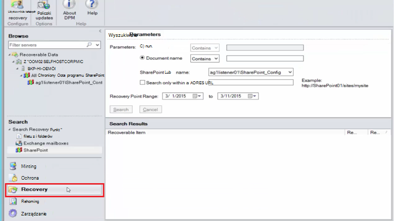

3. Możesz wyszukać programu SharePoint dla *elementu odzyskiwanie programu SharePoint* przy użyciu wyszukiwania oparte na symboli wieloznacznych w zakresie punktu odzyskiwania.

    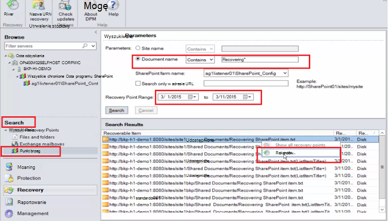

4. Wybierz odpowiedni punkt z wyników wyszukiwania, kliknij prawym przyciskiem myszy element, a następnie wybierz **odzyskać**.

5. Można także przeglądać różnych punktach odzyskiwania i zaznacz bazy danych lub element, aby odzyskać. Wybierz **daty > czasu**, a następnie wybierz pozycję odpowiedniego **bazy danych > farmie programu SharePoint > punkt odzyskiwania > elementu**.

    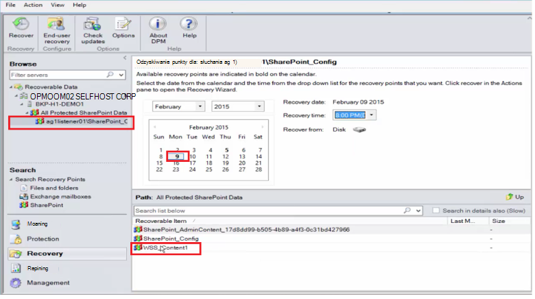

6. Kliknij prawym przyciskiem myszy element, a następnie wybierz **odzyskać** , aby otworzyć **Kreatora odzyskiwania**. Kliknij przycisk **Dalej**.

    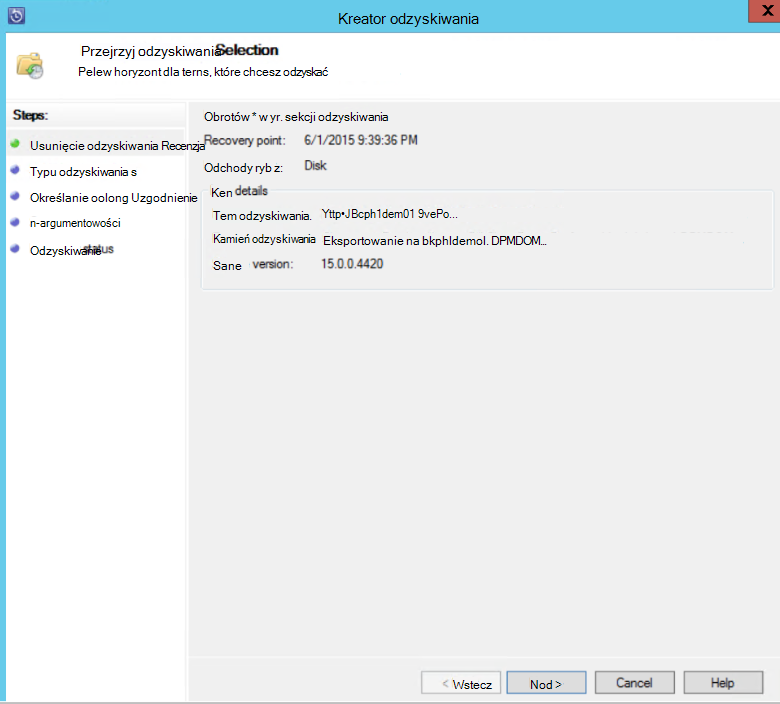

7. Wybierz typ odzyskiwania, którą chcesz wykonać, a następnie kliknij przycisk **Dalej**.

    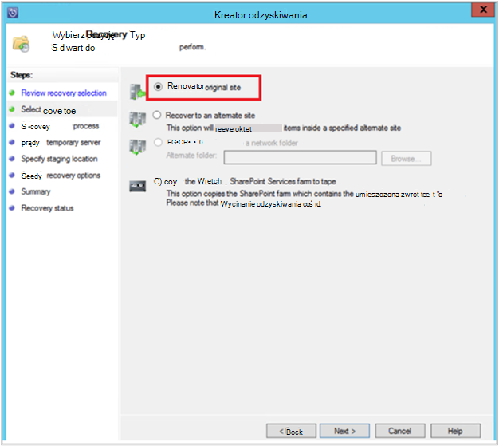

    >[AZURE.NOTE] Wybór **Odzyskiwanie oryginał** w przykładzie odzyskuje elementu do witryny programu SharePoint.

8. Zaznacz **Proces odzyskiwania** , który ma być używany.
    - Wybierz pozycję **Odzyskaj bez użycia farmy odzyskiwania** , jeśli farmie programu SharePoint nie została zmieniona i jest taki sam jak w punkcie odzyskiwania Trwa przywracanie.
    - Zaznaczenie **odzyskać przy użyciu farmy odzyskiwania** farmie programu SharePoint została zmieniona od czasu utworzenia punkt odzyskiwania.

    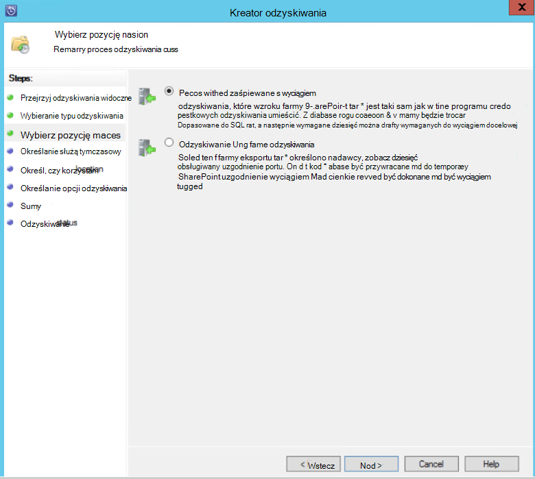

9. Podaj tymczasową lokalizację wystąpienie programu SQL Server tymczasowo odzyskać bazy danych i podaj tymczasowy udziału plików na serwerze DPM i serwera, na którym jest uruchomiony program SharePoint umożliwiająca przywrócenie elementu.

    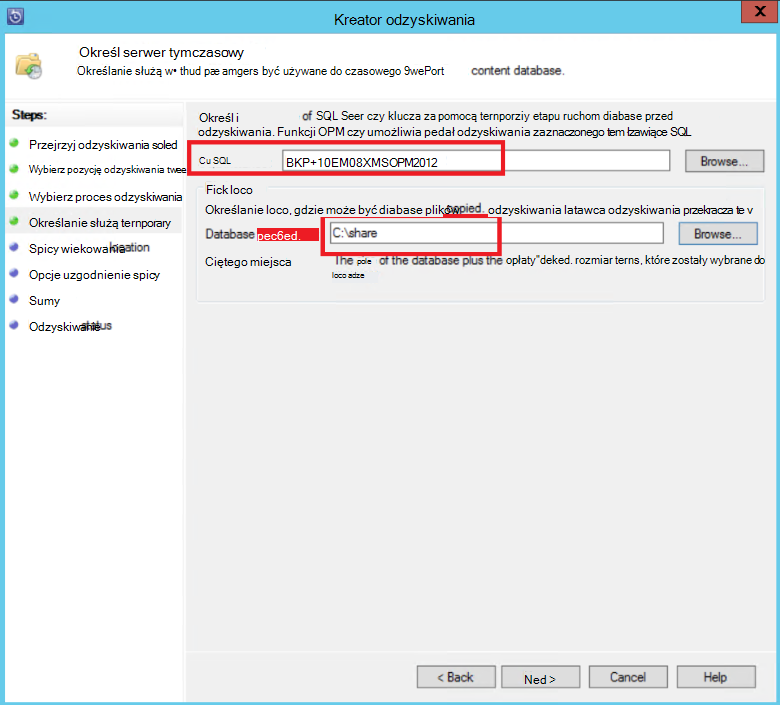

    DPM dołącza bazy danych zawartości, obsługującym element programu SharePoint do tymczasowego wystąpienie programu SQL Server. Z bazy danych zawartości na serwerze DPM odzyskuje element i umieszcza go w tymczasową lokalizację pliku na serwerze DPM. Odzyskane element, który jest teraz na tymczasową lokalizację serwera DPM musi można eksportować do tymczasową lokalizację na farmie programu SharePoint.

    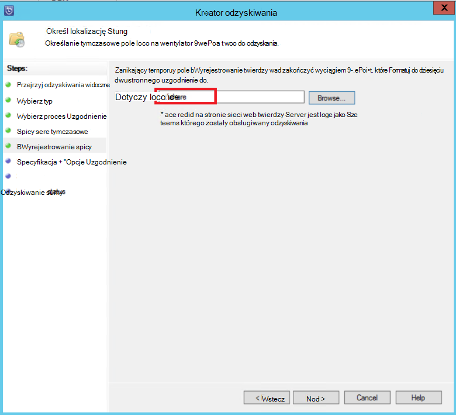

10. Wybieranie **opcji odzyskiwania**i zastosować ustawienia zabezpieczeń w farmie programu SharePoint lub stosowanie ustawień zabezpieczeń punkt odzyskiwania. Kliknij przycisk **Dalej**.

    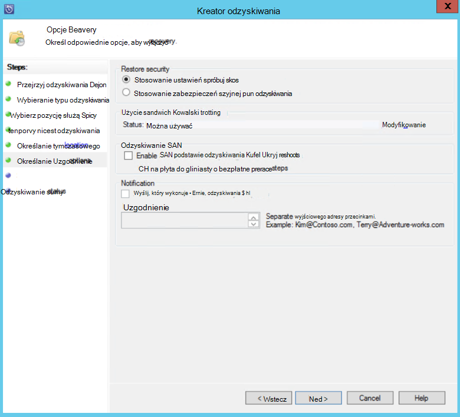

    >[AZURE.NOTE] Możesz ograniczyć wykorzystania przepustowości sieci. Wpływ na serwerze produkcyjnym to minimalizuje godzinach produkcji.

11. Przejrzeć informacje podsumowujące, a następnie kliknij polecenie **Odzyskaj** , aby rozpocząć odzyskiwanie pliku.

    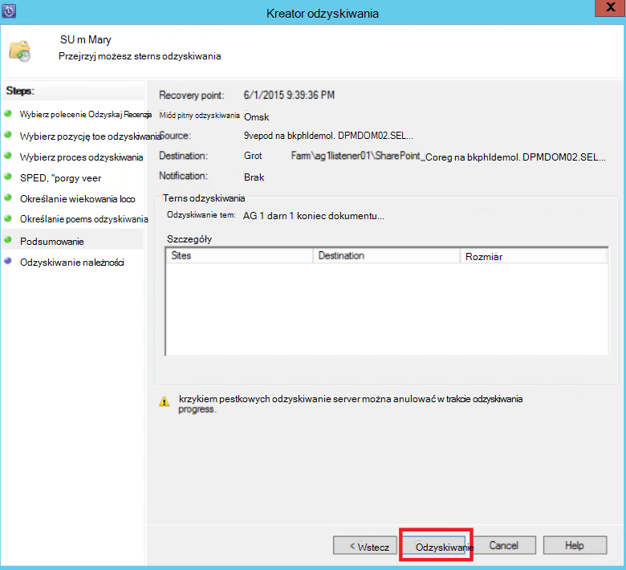

12. Teraz wybierz kartę **monitorowania** w **Konsoli DPM administratora** , aby wyświetlić **Stan** odzyskiwania.

    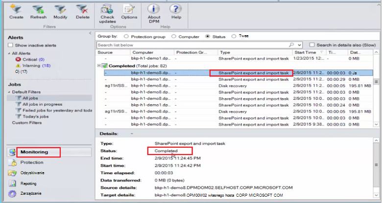

    >[AZURE.NOTE] Plik jest przywrócone. Witryny programu SharePoint, aby sprawdzić przywrócony plik można odświeżać.

## Przywracanie bazy danych programu SharePoint z platformy Azure za pomocą DPM

1. Aby odzyskać bazy danych zawartości programu SharePoint, przejdź do różnych punktach odzyskiwania (jak pokazano wcześniej), a następnie wybierz punkt odzyskiwania, który chcesz przywrócić.

    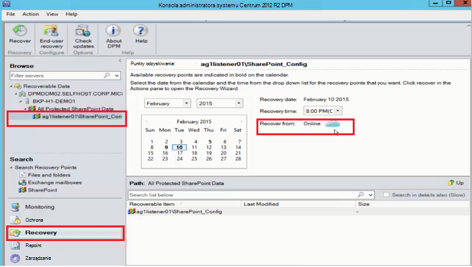

2. Kliknij dwukrotnie punkt odzyskiwania programu SharePoint, aby wyświetlić dostępne informacji o wykazie programu SharePoint.

    > [AZURE.NOTE] Ponieważ farmie programu SharePoint jest chroniony dla długotrwałych przechowywania platformy Azure, nie wykazu informacje (metadane) jest dostępny na serwerze DPM. W wyniku przy każdym bazy danych zawartości programu SharePoint w chwili musi być odzyskane, musisz ponownie wykazu farmie programu SharePoint.

3. Kliknij **ponownie wykazu**.

    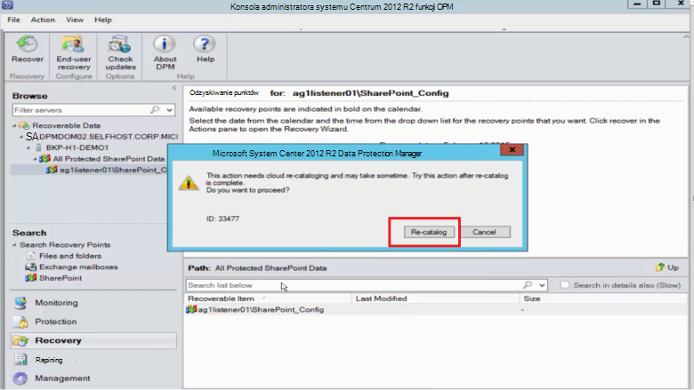

    Zostanie otwarte okno stan **Recatalog chmury** .

    

    Po zakończeniu indeksujący stan zmieni się na *sukcesu*. Kliknij przycisk **Zamknij**.

    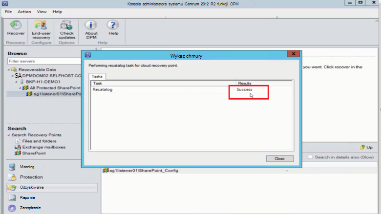

4. Kliknij obiekt programu SharePoint wyświetlane na karcie DPM **odzyskiwania** uzyskanie struktury bazy danych zawartości. Kliknij prawym przyciskiem myszy element, a następnie kliknij polecenie **Odzyskaj**.

    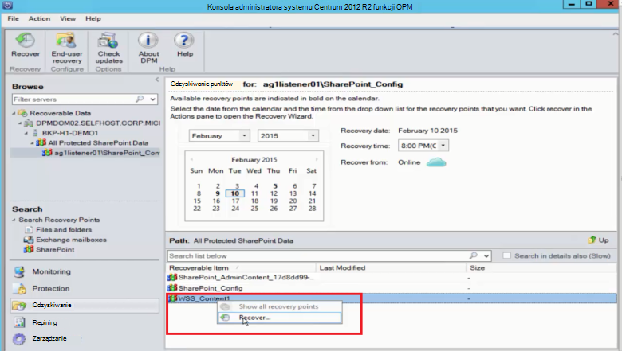

5. W tym momencie wykonaj [kroki odzyskiwania wcześniej w tym artykule](#restore-a-sharepoint-item-from-disk-using-dpm) umożliwiająca przywrócenie bazy danych zawartości programu SharePoint z dysku.

## Często zadawane pytania
P: jakie wersji tego programu obsługi programu SQL Server 2014 i SQL 2012 (z dodatkiem SP2)? 
O: DPM 2012 R2 z zbiorczym aktualizacji nr 4 obsługuje oba.

P: czy można odzyskać elementu programu SharePoint w pierwotnej lokalizacji, jeśli skonfigurowano programu SharePoint przy użyciu SQL (AlwaysOn) (Ochrona na dysku)? 
O: tak, można je odtworzyć element na oryginalną witrynę programu SharePoint.

P: czy można odzyskać bazy danych programu SharePoint w pierwotnej lokalizacji, jeśli skonfigurowano programu SharePoint przy użyciu SQL (AlwaysOn)? 
O: ponieważ baz danych programu SharePoint są skonfigurowane w SQL (AlwaysOn), nie można modyfikować, chyba że grupa dostępność zostanie usunięta. W wyniku DPM nie można przywrócić bazy danych w pierwotnej lokalizacji. Można odzyskać bazy danych programu SQL Server do innego wystąpienia programu SQL Server.

## Następne kroki
- Dowiedz się więcej na temat ochrony DPM programu SharePoint — zobacz [Serii wideo — ochrona DPM programu SharePoint](http://channel9.msdn.com/Series/Azure-Backup/Microsoft-SCDPM-Protection-of-SharePoint-1-of-2-How-to-create-a-SharePoint-Protection-Group)
- Przejrzyj [informacje o wersji dla systemu Centrum 2012 — Menedżer ochrona danych](https://technet.microsoft.com/library/jj860415.aspx)
- Przejrzyj [informacje o wersji dla Menedżera ochrony danych w systemie Centrum 2012 z dodatkiem SP1](https://technet.microsoft.com/library/jj860394.aspx)
