<properties
    pageTitle="Azure kopia zapasowa obciążenia programu SQL Server przy użyciu DPM | Microsoft Azure"
    description="Wprowadzenie do wykonywanie kopii zapasowej bazy danych programu SQL Server przy użyciu usługi Azure kopii zapasowej"
    services="backup"
    documentationCenter=""
    authors="adigan"
    manager="Nkolli1"
    editor=""/>

<tags
    ms.service="backup"
    ms.workload="storage-backup-recovery"
    ms.tgt_pltfrm="na"
    ms.devlang="na"
    ms.topic="article"
    ms.date="09/27/2016"
    ms.author="adigan;giridham; jimpark;markgal;trinadhk"/>

# Kopia zapasowa Azure za pomocą DPM obciążenia programu SQL Server

Ten artykuł prowadzi Cię przez czynności konfiguracyjne do utworzenia kopii zapasowej bazy danych programu SQL Server przy użyciu Azure kopii zapasowej.

Aby utworzyć kopię zapasową bazy danych programu SQL Server Azure, potrzebne jest konto Azure. Jeśli nie masz konta, możesz utworzyć bezpłatne konto wersji próbnej tylko kilka minut. Aby uzyskać szczegółowe informacje zobacz [Azure bezpłatnej wersji próbnej](https://azure.microsoft.com/pricing/free-trial/).

Zarządzanie kopii zapasowej bazy danych programu SQL Server Azure i odzyskiwania z platformy Azure obejmuje trzy kroki:

1. Tworzenie kopii zapasowej zasad ochrony bazy danych programu SQL Server Azure.
2. Tworzenie kopii zapasowych na żądanie Azure.
3. Przywrócenie bazy danych z Azure.

## Przed rozpoczęciem
Zanim zaczniesz, upewnij się, że zostały spełnione wszystkie [wymagania wstępne](../backup-azure-dpm-introduction.md#prerequisites) dotyczące korzystania z programu Kopia zapasowa Microsoft Azure ochrony obciążenia. Wymagania wstępne obejmują zadania, takie jak: tworzenie kopii zapasowej magazynu, pobieranie magazynu poświadczeń, instalowania agenta kopii zapasowej Azure i rejestrowanie serwera z magazynu.

## Tworzenie kopii zapasowej zasad ochrony bazy danych programu SQL Server Azure

1. Na serwerze DPM kliknij obszar roboczy **ochrony** .

2. Na Wstążce Narzędzia kliknij przycisk **Nowy** , aby utworzyć nową grupę ochrony.

    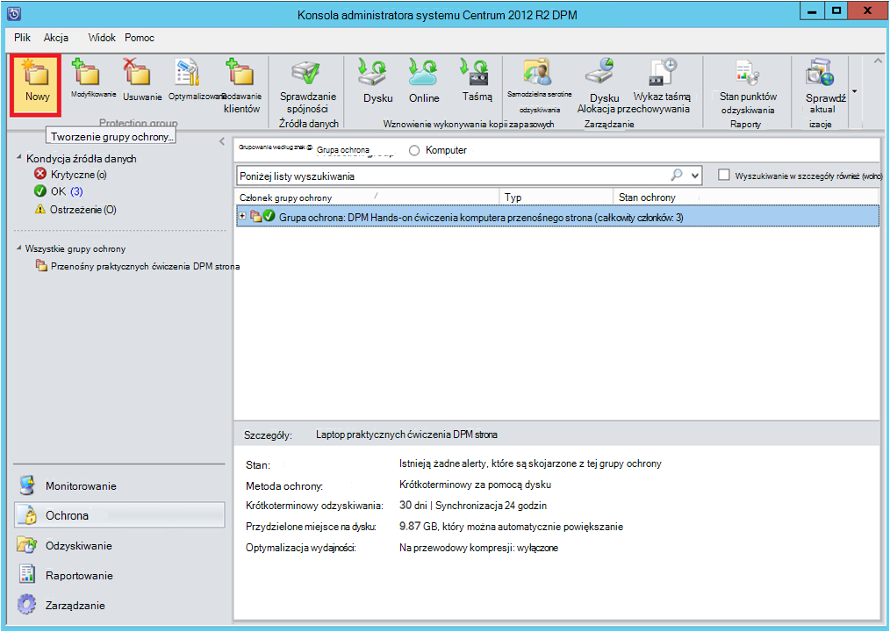

3. DPM pokazano ekran startowy z porad dotyczących tworzenia **Grupa ochrona**. Kliknij przycisk **Dalej**.

4. Zaznacz opcję **Serwery**.

    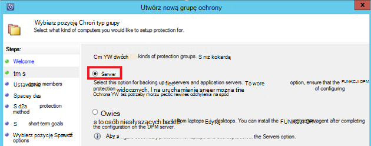

5. Rozwiń węzeł komputera programu SQL Server, gdzie znajdują się do wykonania kopii zapasowej bazy danych. DPM wyświetlane różne źródła danych, których kopię zapasową można z tego serwera. Rozwiń **Wszystkie akcje SQL** i wybierz bazę danych (w tym przypadku Wybraliśmy serwera raportowania$ MSDPM2012 i serwera raportowania$ MSDPM2012TempDB) do wykonania kopii zapasowej. Kliknij przycisk **Dalej**.

    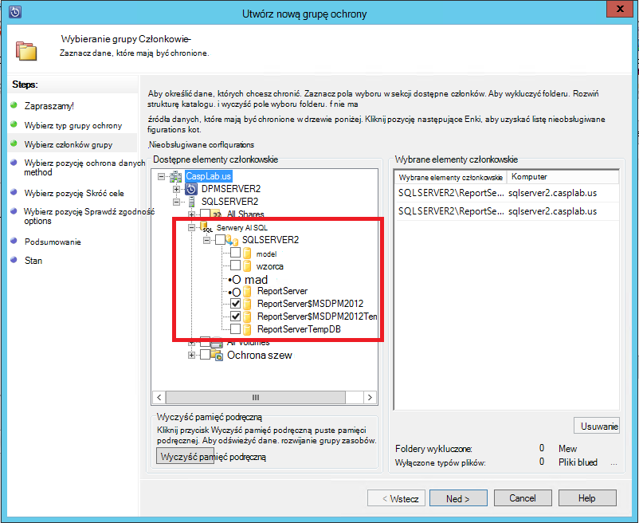

6. Podaj nazwę dla grupy ochrony i zaznacz pole wyboru **mają ochronę online** .

    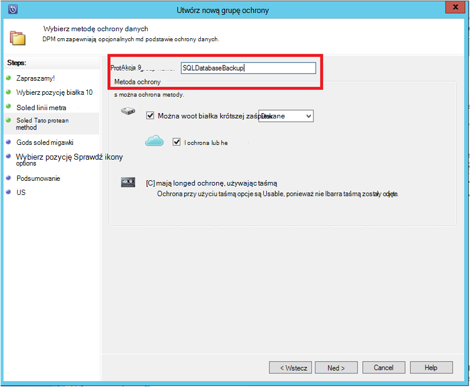

7. Na ekranie **Określ cele Short-Term** zawierać niezbędnych składników do utworzenia kopii zapasowej punktów na dysku.

    W tym miejscu zobaczymy, że **zakres przechowywania** jest ustawiona na *5 dni*, **częstotliwość synchronizacji** jest ustawiona na co *15 minut* czyli częstotliwość, w którym jest przyjmowana kopii zapasowej. **Express pełnej kopii zapasowej** ustawiono *Godzinach od 8:00*.

    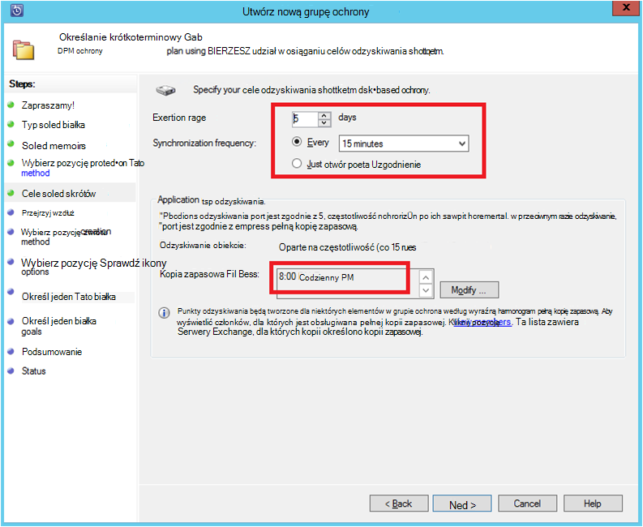

    >[AZURE.NOTE] Na 8:00 PM (zgodnie z wprowadzania ekranu) punktu kopii zapasowej jest tworzone codziennie przez przeniesienie danych, które zostały zmodyfikowane od punktu kopii zapasowej poprzedniego dnia 8:00 PM. Ten proces jest nazywany **Express pełnej kopii zapasowej**. Podczas transakcji, które są synchronizowane dzienniki co 15 minut, jeśli zachodzi potrzeba odzyskać bazy danych na 9:00 PM —, a następnie punktu jest tworzona przez odtwarzanie dzienników z ostatniej express pełną kopię zapasową punktu (8 pm w tym przypadku).

8. Kliknij przycisk **Dalej**

    DPM przedstawiono ogólne miejsca dostępnego i potencjalnych wykorzystanie miejsca na dysku.

    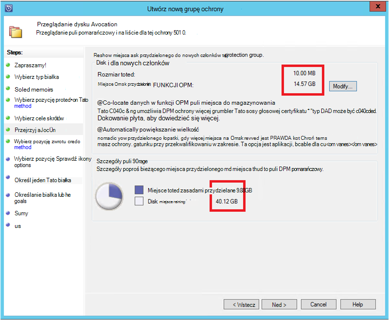

    Domyślnie DPM tworzy jedną objętość na źródło danych (baza danych programu SQL Server), w którym jest używany do początkowej kopii zapasowej. W ten sposób dysku Menedżer Logicznych ogranicza ochrony DPM ze źródłami danych 300 (baza danych programu SQL Server). Aby obejść to ograniczenie, wybierz pozycję **Współtworzenie znajdowanie danych w puli miejsca do magazynowania DPM**, opcja. Użycie tej opcji DPM używa pojedynczy głośność wielu źródeł danych, co pozwala DPM ochrony maksymalnie 2000 baz danych programu SQL.

    Jeśli jest zaznaczona opcja **automatycznej zmiany rozmiaru wielkość** , DPM może uwzględnić wielkość kopii zapasowej zwiększona w miarę danych produkcyjnych. Jeśli nie wybrano opcji **automatycznej zmiany rozmiaru wielkość** , DPM limitach magazynu kopii zapasowej używane do źródeł danych w grupie ochrona.

9. Administratorzy podano wybór przesyłania tej początkowej kopii zapasowej ręcznie (wyłączanie sieci) w celu uniknięcia przeciążeń przepustowości lub za pośrednictwem sieci. Można także skonfigurować czas, co może się zdarzyć, pierwszego przekazania. Kliknij przycisk **Dalej**.

    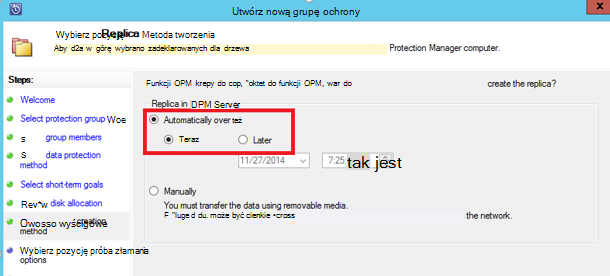

    Początkowa kopia zapasowa wymaga przeniesienia całego źródła danych (baza danych programu SQL Server) z serwera produkcji (program SQL Server komputer) na serwerze DPM. Te dane może być duży i przesyłania danych przez sieć może przekroczyć przepustowości. Z tego powodu administratorzy mogą wybrać przenieść wstępnej kopii zapasowej: **ręcznie** (za pomocą nośniku wymiennym) w celu uniknięcia przeciążeń przepustowości lub **automatycznie przez sieć** (w określonym czasie).

    Po ukończeniu wstępnej kopii zapasowej pozostałe kopie zapasowe są przyrostowe kopie zapasowe na początkowej kopii zapasowej. Przyrostowe kopie zapasowe są małe i łatwo są przesyłane przez sieć.

10. Należy wybrać sprawdzanie zgodności, aby uruchomić i kliknij przycisk **Dalej**.

    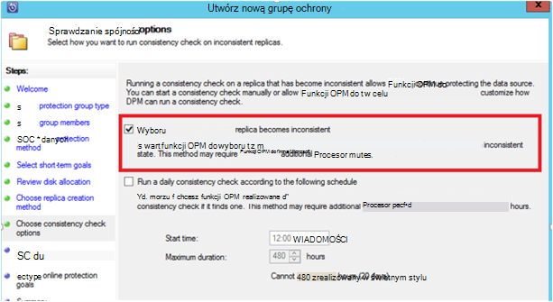

    DPM mogą wykonywać spójności wyboru do wyboru integralności punktu kopii zapasowej. Obliczanie sum kontrolnych pliku kopii zapasowej na serwerze produkcji (program SQL Server komputer w tym scenariuszu) i kopię zapasową danych dla tego pliku na DPM. W przypadku konfliktu przyjmuje się, że plik kopii zapasowej w DPM jest uszkodzony. DPM rectifies kopię zapasową danych przy użyciu bloków odpowiadające kontrolnej. Sprawdzanie zgodności jest operacji intensywną wydajności, Administratorzy mają opcję planowania sprawdzanie zgodności i automatycznemu uruchamianiu.

11. Aby określić online ochrony źródeł danych, zaznacz baz danych być chronione Azure, a następnie kliknij przycisk **Dalej**.

    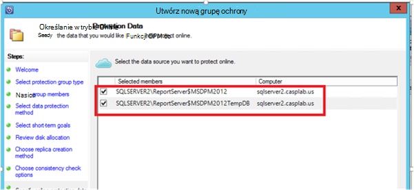

12. Administratorzy mogą wybrać kopii zapasowej harmonogramów i zasady przechowywania, pasujące do ich zasady organizacji.

    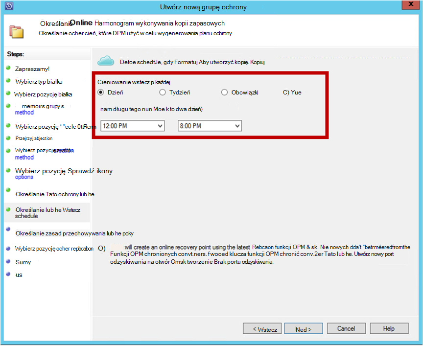

    W tym przykładzie kopie zapasowe pobierane są raz dziennie 12:00 PM i PM 8 (u dołu ekranu)

    >[AZURE.NOTE] Jest dobrym rozwiązaniem jest zawierają kilka krótkoterminowy punkty odzyskiwania na dysku, szybkiego odzyskiwania. Punkty odzyskiwania są używane do "operacyjne odzyskiwania". Azure służy jako lokalizacji dobre lokalizacjami o wyższym zwiększany i zagwarantować dostępność.

    **Za najbardziej skuteczne rozwiązanie**: Upewnij się, że kopie zapasowe Azure zostały zaplanowane po zakończeniu dysku kopii zapasowych przy użyciu DPM. Dzięki temu najnowszej kopii zapasowej do skopiowania Azure.

13. Wybierz pozycję Harmonogram zasad przechowywania. Szczegółowe informacje o tym, jak działa zasady przechowywania znajdują się na [Używanie Azure wykonywanie kopii zapasowych aby zamienić artykułu infrastruktury taśmą](backup-azure-backup-cloud-as-tape.md).

    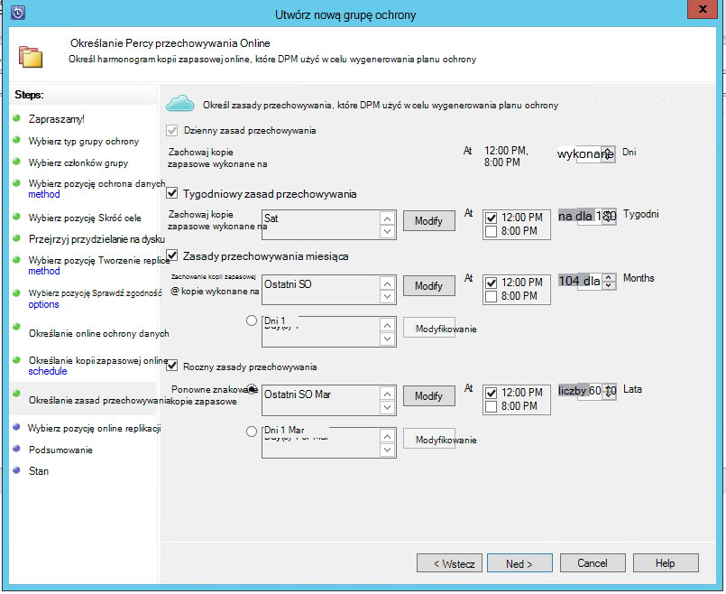

    W tym przykładzie:

    - Kopie zapasowe pobierane są raz dziennie 12:00 PM i PM 8 (u dołu ekranu) i są zachowywane przez 180 dni.
    - Wykonywanie kopii zapasowych na sobotę o godzinie 12:00 PM. jest zachowywana 104 tygodni
    - Wykonywanie kopii zapasowych na ostatnią sobotę o godzinie 12:00 PM. jest zachowywana 60 miesięcy
    - Kopia zapasowa Ostatnia sobota marca, 12:00 PM. jest zachowywana przez 10 lat

14. Kliknij przycisk **Dalej** , a następnie wybierz odpowiednią opcję przesyłania początkowej kopii zapasowej Azure. Możesz **automatycznie przez sieć** lub **w trybie Offline kopii zapasowych**.

    - **Automatycznie przez sieć** przenosi danych kopii zapasowej Azure zgodnie z harmonogramem wybrane do tworzenia kopii zapasowych.
    - Jak działa **w trybie Offline kopii zapasowej** jest wyjaśniono w [przepływu pracy w trybie Offline kopii zapasowych w kopii zapasowej Azure](backup-azure-backup-import-export.md).

    Wybierz pozycję mechanizmu odpowiednich transferu wysyłanie kopii zapasowej początkowej Azure, a następnie kliknij przycisk **Dalej**.

15. Po przejrzeniu szczegóły zasady na ekranie **Podsumowanie** , kliknij przycisk **Utwórz grupę** , aby ukończyć przepływu pracy. Można kliknąć przycisk **Zamknij** i monitorować postęp zadania w obszarze roboczym monitorowania.

    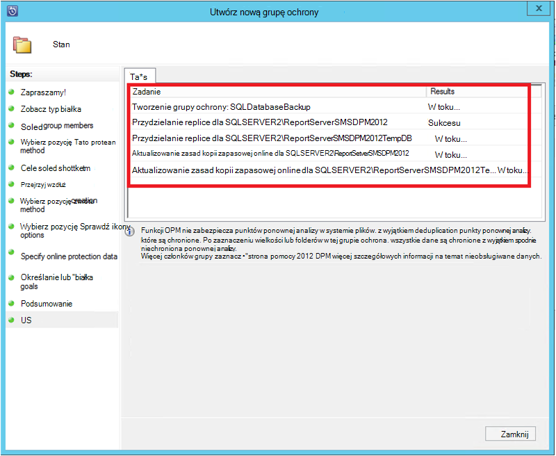

## Na żądanie kopii zapasowej bazy danych programu SQL Server
Powyższe kroki tworzenia kopii zapasowej zasady, "punkt odzyskiwania" jest tworzona tylko wtedy, gdy wystąpi pierwszej kopii zapasowej. Nie czekając na harmonogram ma grzybków, kroki wymienione poniżej wyzwalacza tworzenie odzyskiwania wskaż ręcznie.

1. Poczekaj na ochronę grupy stan jest wyświetlany **przycisk OK** bazy danych przed utworzeniem punkt odzyskiwania.

    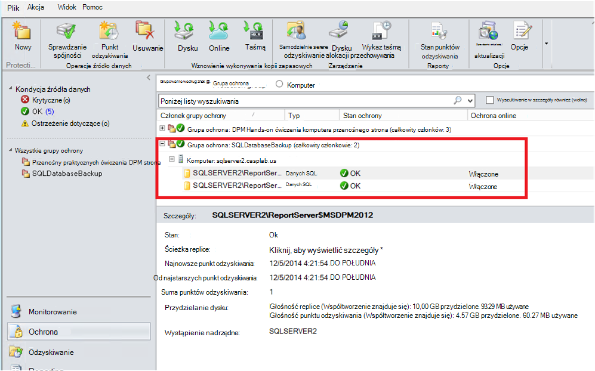

2. Kliknij prawym przyciskiem myszy bazę danych, a następnie wybierz pozycję **Utwórz punkt odzyskiwania**.

    

3. W menu rozwijanym wybierz pozycję **Online Protection** i kliknij **przycisk OK**. Tworzenie punktu odzyskiwania zostanie uruchomiony w Azure.

    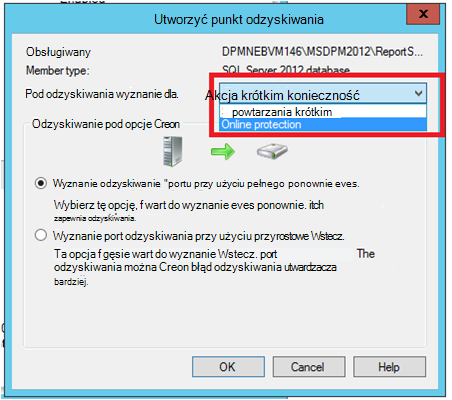

4. Postęp zadania można wyświetlać w obszarze roboczym **monitorowania** , w której można znaleźć w toku zadania, taki jak przedstawiony przedstawione na następnej ilustracji.

    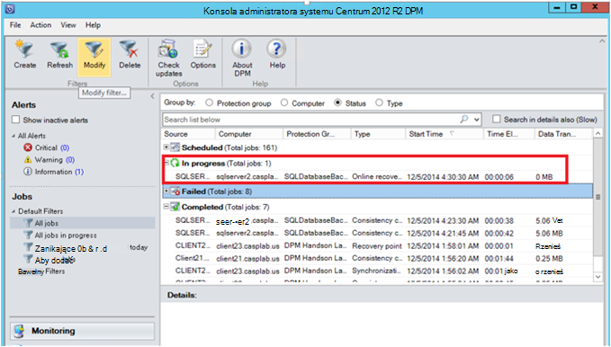

## Odzyskiwanie bazy danych programu SQL Server z platformy Azure
Poniższe czynności są wymagane odzyskać podmiot chronionej (baza danych programu SQL Server) z platformy Azure.

1. Otwórz DPM server Management Console. Przejdź do obszaru roboczego **odzyskiwania** napisem serwery DPM kopię zapasową. Przeglądanie wymagane bazy danych (w tym przypadku serwera raportowania$ MSDPM2012). Wybierz godzinę **odzyskiwania** , który kończy się w **trybie Online**.

    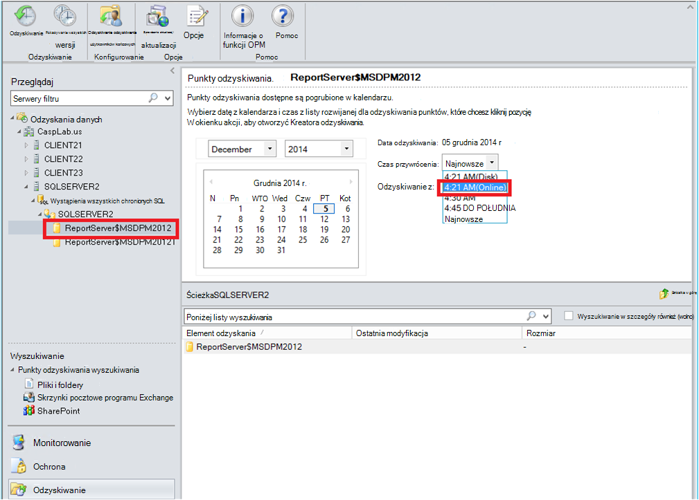

2. Kliknij prawym przyciskiem myszy nazwę bazy danych, a następnie kliknij polecenie **Odzyskaj**.

    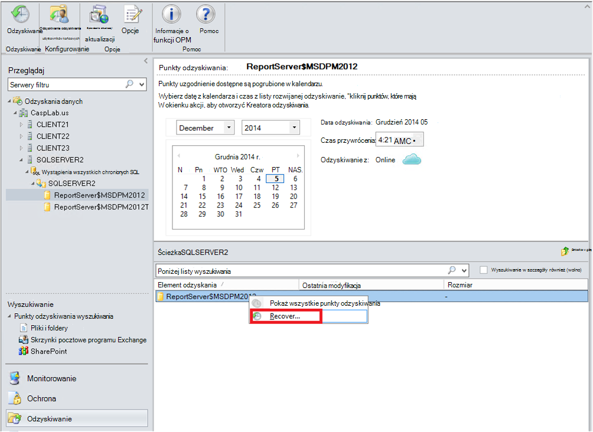

3. DPM zawiera szczegóły punktu odzyskiwania. Kliknij przycisk **Dalej**. Aby zastąpić bazę danych, wybierz typ odzyskiwania **odzyskać do oryginalnego wystąpienia programu SQL Server**. Kliknij przycisk **Dalej**.

    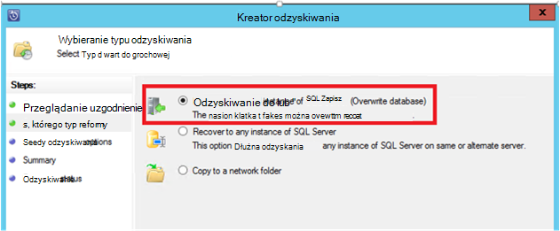

    W tym przykładzie DPM umożliwia odtwarzania bazy danych do innego wystąpienia programu SQL Server lub w folderze sieciowym autonomicznego.

4. Na ekranie **Opcje odzyskiwania określić** można wybierać opcje odzyskiwania jak ograniczania użycia przepustowości sieci przepustowości używane przez odzyskiwania. Kliknij przycisk **Dalej**.

5. Na ekranie **Podsumowanie** zobaczysz konfiguracji zwrotu opisane pory. Kliknij polecenie **Odzyskaj**.

    Stan odzyskiwania pokazuje ich odzyskania bazy danych. Można kliknąć przycisk **Zamknij** , aby zamknąć kreatora i wyświetlanie postępu w obszarze roboczym **monitorowania** .

    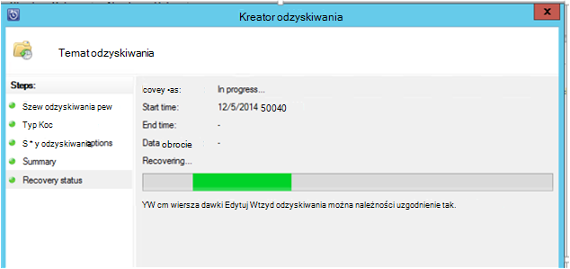

    Po ukończeniu odzyskiwania, przywrócenie bazy danych jest zgodny.

### Następny krok:

• [Azure kopii zapasowej — często zadawane pytania](backup-azure-backup-faq.md)
