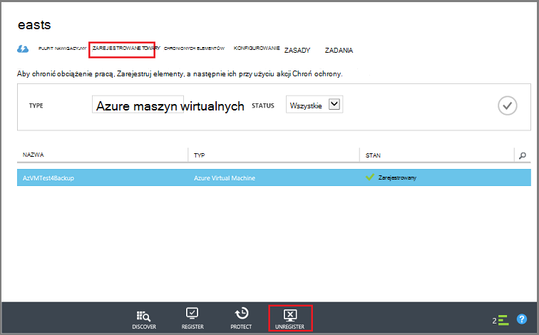
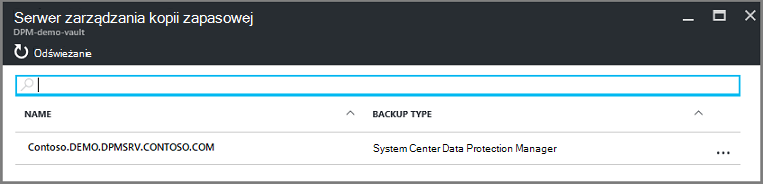

<properties
   pageTitle="Usuwanie magazynu Azure kopia zapasowa | Microsoft Azure"
   description="Jak usunąć magazynu kopii zapasowej Azure. Rozwiązywanie problemów, dlaczego nie można usunąć magazynu kopii zapasowej. "
   services="service-name"
   documentationCenter="dev-center-name"
   authors="markgalioto"
   manager="cfreeman"
   editor=""/>

<tags
   ms.service="backup"
   ms.devlang="na"
   ms.topic="article"
   ms.tgt_pltfrm="na"
   ms.workload="storage-backup-recovery"
   ms.date="08/29/2016"
   ms.author="markgal;trinadhk"/>

# Usuwanie magazynu kopii zapasowej Azure

Usługa Azure kopii zapasowej ma dwóch typów magazynów - magazynu kopii zapasowej i magazynu usługi odzyskiwania. Magazyn kopii zapasowej był pierwszy. Następnie magazynu usługi odzyskiwania był do obsługi rozwiniętej wdrożeniach Menedżera zasobów. Ze względu na rozwiniętej możliwości i zależności informacje, które muszą być przechowywane w magazyn usuwając magazynu usługi odzyskiwania może wydawać trudniejsze niż należy.

|**Typ wdrażania**|**Portal**|**Nazwa magazynu**|
|--------------|----------|---------|
|Klasyczny|Klasyczny|Magazyn kopii zapasowej|
|Menedżer zasobów|Azure|Usługi odzyskiwania magazynu|

> [AZURE.NOTE] Kopii zapasowej magazynów nie chroni rozwiązań wdrożony Menedżera zasobów. Jednak magazynu usługi odzyskiwania umożliwia ochronę w klasycznym wdrożeniu serwerów oraz maszyny wirtualne.  

W tym artykule, firma Microsoft korzysta z terminów, magazynu, aby odwołać się do postaci ogólnego magazynu kopii zapasowej lub magazynu usługi odzyskiwania. Używamy formalne nazwę, magazynu kopii zapasowej lub magazynu usługi odzyskiwania, gdy jest to niezbędne odróżniać z magazynów.

## Usuwanie magazynu usługi odzyskiwania

Usuwanie magazynu usługi odzyskiwania jest jednego prostego procesu - *pod warunkiem, że magazyn nie zawiera żadnych zasobów*. Przed usunięciem magazynu usługi odzyskiwania, musisz usunąć lub usunąć wszystkie zasoby w magazyn. Jeśli próbujesz usunąć magazyn, który zawiera zasoby, pojawia się błąd, podobnie jak na poniższej ilustracji.

  

Do momentu zostały wyczyszczone zasoby z magazyn, klikając przycisk **Ponów próbę** daje ten sam błąd. Jeśli możesz już zablokowany na ten komunikat o błędzie, kliknij przycisk **Anuluj** , a następnie postępuj zgodnie z instrukcjami poniżej, aby usunąć zasobów w magazynu usługi odzyskiwania.

### Usuwanie elementów z magazynu ochrona maszyny

Jeśli masz już magazynu usługi odzyskiwania, otwieranie, przejdź do kroku drugim.

1.  Otwórz Azure portal, a na pulpicie nawigacyjnym Otwórz magazyn, który chcesz usunąć.

    Jeśli nie masz magazynu usługi odzyskiwania przypięta do pulpitu nawigacyjnego, w menu Centrum kliknij pozycję **Więcej usług** i na liście zasobów, wpisz **Usługi odzyskiwania**. Rozpoczęciu wpisywania lista filtrów na podstawie wprowadzanych danych. Kliknij pozycję **magazynów usługi odzyskiwania**.

      

    Zostanie wyświetlona lista magazynów usługi odzyskiwania. Z listy wybierz magazyn, który chcesz usunąć.

    

2. W widoku magazynu Sprawdź w okienku **Essentials** . Aby usunąć magazynu, nie może być wszystkich chronionych elementów. Jeśli zobaczysz od liczby innej niż zero, w obszarze **Elementy kopii zapasowej** lub **serwerów zarządzania kopii zapasowej**, należy usunąć te elementy przed usunięciem magazyn.

    

    Maszyny wirtualne pliki i foldery są traktowane jako elementy kopii zapasowej i są widoczne w obszarze **Elementy kopii zapasowej** okienka Essentials. Serwer DPM znajduje się w obszarze **Serwer zarządzania kopii zapasowej** okienka Essentials. **Elementy replikowane** odnoszą się do usługi Azure Odzyskiwanie witryny.

3. Aby rozpocząć, usuwania chronionych elementów z magazynu, Znajdź elementy w magazyn. Na pulpicie nawigacyjnym magazynu kliknij pozycję **Ustawienia**, a następnie kliknij **elementy kopii zapasowej** w celu otwarcia tego karta.

    

    Karta **Elementy kopii zapasowej** ma oddzielnych listach, w zależności od typu elementu: maszyn wirtualnych Azure lub folderów plików (zobacz obraz). Na liście Typ elementu Domyślny wyświetlana jest maszyn wirtualnych Azure. Aby wyświetlić listę elementów folderów plików w magazyn, wybierz **Foldery plików** z menu rozwijanego.

4. Przed usunięciem elementu z magazynu ochrona maszyny, musisz zatrzymać elementu zadania wykonywania kopii zapasowej i usuwanie danych punktu odzyskiwania. Dla każdego elementu Magazyn wykonaj następujące czynności:

    . Na karta **Elementy kopii zapasowej** kliknij prawym przyciskiem myszy element, a następnie z menu kontekstowego wybierz pozycję **Zatrzymaj wykonywanie kopii zapasowej**.

    

    Zostanie wyświetlona karta Zatrzymaj kopii zapasowej.

    b. Na karta **Zatrzymaj kopii zapasowej** , z menu **Wybierz opcję** wybierz **Usuwanie danych kopii zapasowej** > wpisz nazwę elementu > i kliknij przycisk **Zatrzymaj wykonywanie kopii zapasowej**.

      Wpisz nazwę elementu, aby sprawdzić, czy chcesz go usunąć. Przycisk **Zatrzymaj kopii zapasowej** nie zostanie aktywowany zweryfikowana elementu, aby zatrzymać. Jeśli nie widzisz okna dialogowego wpisz nazwę elementu kopii zapasowej, wybrano opcję **Zachowaj dane kopii zapasowej** .

    

      Opcjonalnie można podać powód, dlaczego jest usunięcie danych i dodawanie komentarzy. Po kliknięciu przycisku **Zatrzymaj kopii zapasowej**Zezwalaj Usuń zadanie do wykonania przed próbą usunięcia magazyn. Aby sprawdzić, czy zadanie zostało ukończone, sprawdź wiadomości Azure .  
   Po ukończeniu zadania otrzymasz komunikat z informacją, proces tworzenia kopii zapasowej został zatrzymany i danych kopii zapasowej został usunięty dla tego elementu.

    c. Po usunięciu elementu z listy w menu **Elementy kopii zapasowej** , kliknij przycisk **Odśwież** , aby wyświetlić pozostałe elementy w magazyn.

      

      Jeśli nie ma żadnych elementów na liście, przewiń do okienka **Essentials** w karta magazynu kopii zapasowej. Nie powinny istnieć wszystkie **elementy kopii zapasowej**, **serwerów zarządzania kopii zapasowej**lub **zreplikowany elementów** na liście. Jeśli elementów jest nadal wyświetlany magazyn, powróć do kroku 3 powyżej i wybierz inny typ listy.  

5. Gdy na pasku narzędzi magazynu nie więcej elementów, kliknij przycisk **Usuń**.

    

6. Gdy zostanie wyświetlone pytanie, aby zweryfikować, że chcesz usunąć magazyn, kliknij przycisk **Tak**.

    Magazyn zostanie usunięty i portalu powraca do menu usługi **Nowe** .

## Co zrobić, jeśli zatrzymać proces tworzenia kopii zapasowej, ale zachowane dane?

Jeśli została zatrzymana wykonywania kopii zapasowej, ale przypadkowo *przechowywane* dane, należy usunąć dane kopii zapasowej przed usunięciem magazyn. Aby usunąć dane kopii zapasowej:

1. Na karta **Elementy kopii zapasowej** kliknij prawym przyciskiem myszy element, a następnie w menu kontekstowym kliknij polecenie **Usuń danych kopii zapasowej**.

    

    Zostanie wyświetlona karta **Usunąć dane z kopii zapasowej** .

2. Na karta **Usunąć dane z kopii zapasowej** wpisz nazwę elementu i kliknij przycisk **Usuń**.

    

    Usunięcie danych przejdź do kroku 4c powyżej i kontynuować proces.

## Usuwanie magazynu używane do ochrony serwera DPM

Przed usunięciem magazynu używane do ochrony serwera DPM musi Wyczyść punkty odzyskiwania, które zostały utworzone, a następnie unregister serwera z magazynu.

Aby usunąć dane skojarzone z grupą ochrony:

1. W konsoli administratora DPM kliknij polecenie **Ochrona**, wybierz grupę ochrony, wybierz członka grupy ochrony i na Wstążce Narzędzia kliknij przycisk **Usuń**. Po zaznaczeniu elementu członkowskiego przycisk **Usuń** się pojawić na Wstążce narzędzia. W tym przykładzie element członkowski jest **dummyvm9**. W przypadku wielu członków w grupie ochrona, przytrzymaj naciśnięty klawisz Ctrl, aby zaznaczyć wiele elementów członkowskich.

    

    Zostanie otwarte okno dialogowe **Zatrzymaj ochronę** .

2. W oknie dialogowym **Zatrzymaj ochronę** wybierz pozycję **Usuń chronionych danych**, a następnie kliknij przycisk **Zatrzymaj ochronę**.

    

    Nie chcesz zachować dane chronione, ponieważ należy wyczyścić magazyn, aby ją usunąć. W zależności od odzyskiwania ile punktów i ilości danych znajduje się w grupie ochrona, może upłynąć dowolne miejsce na kilka sekund kilka minut usunąć dane. Okno dialogowe **Zatrzymaj ochronę** jest wyświetlany stan po ukończeniu zadania.

    

3. Kontynuuj ten proces dla wszystkich członków we wszystkich grupach ochrony.

    Należy usunąć wszystkich chronionych danych i grup ochrony.

4. Po usunięciu wszystkich członków z grupy ochrony, przełącz się do portalu Azure. Otwórz na pulpicie nawigacyjnym magazynu i upewnij się, że nie ma żadnych **Elementów kopii zapasowej**, **serwerów zarządzania kopii zapasowej**ani **zreplikowany elementów**. Na pasku narzędzi magazynu kliknij przycisk **Usuń**.

    

    W przypadku serwerów zarządzania kopii zapasowej zarejestrowane magazyn nie można usunąć magazyn, nawet jeśli nie ma żadnych danych w magazyn. Jeśli uważasz, usunięty serwerów zarządzania kopii zapasowej skojarzonych z magazynu, ale nadal są wyświetlone w okienku **podstawowe informacje dotyczące** serwerów, zobacz [Znajdowanie serwerów zarządzania kopii zapasowej zarejestrowane magazyn](backup-azure-delete-vault.md#find-the-backup-management-servers-registered-to-the-vault).

5. Gdy zostanie wyświetlone pytanie, aby zweryfikować, że chcesz usunąć magazyn, kliknij przycisk **Tak**.

    Magazyn zostanie usunięty i portalu powraca do menu usługi **Nowe** .

## Usuwanie magazynu używane do ochrony serwerze produkcyjnym

Przed usunięciem magazynu używane do ochrony serwerze produkcyjnym, musisz usunąć lub unregister serwera z magazynu.

Aby usunąć serwer produkcji skojarzony z magazynu:

1. W portalu usługi Azure otwarcia pulpitu nawigacyjnego magazynu, a następnie kliknij pozycję **Ustawienia** > **Infrastruktury kopii zapasowej** > **Serwerów produkcyjnych**.

    

    Karta **Serwerów produkcyjnych** zostanie otwarty i wyświetla listę wszystkich serwerów produkcji w magazyn.

    

2. Na karta **Serwerów produkcyjnych** kliknij prawym przyciskiem myszy na serwerze i kliknij przycisk **Usuń**.

    

    Zostanie wyświetlona karta **Usuwanie** .

    

3. Na karta **Usuwanie** Potwierdź nazwę serwera, który należy usunąć, a następnie kliknij przycisk **Usuń**. Poprawnie wprowadź nazwę serwera, aby aktywować przycisk **Usuń** .

    Po usunięciu magazyn otrzymasz komunikat z informacją, że magazyn został usunięty. Po usunięciu wszystkich serwerach magazyn, przewiń do okienka Essentials na pulpicie nawigacyjnym magazynu.

4. Na pulpicie nawigacyjnym magazynu upewnij się, że nie ma żadnych **Elementów kopii zapasowej**, **serwerów zarządzania kopii zapasowej**ani **zreplikowany elementów**. Na pasku narzędzi magazynu kliknij przycisk **Usuń**.

5. Gdy zostanie wyświetlone pytanie, aby zweryfikować, że chcesz usunąć magazyn, kliknij przycisk **Tak**.

    Magazyn zostanie usunięty i portalu powraca do menu usługi **Nowe** .

## Usuwanie magazynu kopii zapasowej

W poniższych instrukcjach przedstawiono usuwania magazynu kopii zapasowych w portalu klasyczny. Wykonywanie kopii zapasowych magazynu i magazynu usługi odzyskiwania są takie same: przed usunięciem magazyn usunąć elementy i podzielonego dane.

1. Otwórz portal klasyczny.

2. Na liście magazynami kopii zapasowej zaznacz magazyn, który chcesz usunąć.

    

    Zostanie otwarte na pulpicie nawigacyjnym magazynu. Przyjrzyj się liczba serwerów systemu Windows i/lub Azure maszyn wirtualnych skojarzone z magazynu. Ponadto Spójrz na całkowitą ilość przestrzeni dyskowej zużyte platformy Azure. Musisz zatrzymać wszystkie zadania kopii zapasowej i usuwania istniejących danych przed usunięciem magazyn.

3. Kliknij kartę **Elementy chronione** , a następnie kliknij pozycję **Zatrzymaj ochronę**

    

    Zostanie wyświetlone okno dialogowe **Wyłączanie ochrony z magazynu** .

4. W oknie dialogowym **Wyłączanie ochrony z magazynu** , sprawdzanie, **Usuń skojarzone danych kopii zapasowej** , a następnie kliknij pozycję .  
   Opcjonalnie można wybrać powód zablokowania ochrona, a wprowadzić komentarz.

    

    Po usunięciu elementów w magazyn, Magazyn będzie pusta.

    

5. Na liście kart kliknij pozycję **Registered elementy**. Dla każdego elementu w Magazyn zaznacz element, a następnie kliknij przycisk **Unregister**.

    

6. Na liście kart kliknij pozycję **pulpit nawigacyjny** , aby otworzyć tę kartę. Sprawdź, czy nie ma żadnych serwery zarejestrowane lub Azure maszyn wirtualnych chronione w chmurze. Sprawdź także, że nie ma żadnych danych w magazynie. Kliknij przycisk **Usuń** , aby usunąć magazyn.

    

    Zostanie wyświetlona ekranie potwierdzenia usuwanie kopii zapasowej magazynu. Wybierz opcję Dlaczego usuwane magazyn i kliknij pozycję .  

    

    Magazyn zostanie usunięty, a następnie wróć do portalu klasyczny pulpitu nawigacyjnego.

### Znajdź serwery zarządzania kopią zapasową zarejestrowane Magazyn

Jeśli masz wiele serwerów zarejestrowane do magazynu, może być trudne do zapamiętania je. Aby wyświetlić serwery zarejestrowane magazyn i usuń je:

1. Otwórz na pulpicie nawigacyjnym magazynu.

2. W okienku **Essentials** kliknij przycisk **Ustawienia** , aby otworzyć tego karta.

    

3. Na **Karta Ustawienia**kliknij przycisk **Infrastruktury kopii zapasowej**.

4. Wybierz polecenie karta **Infrastruktury kopii zapasowej** **Serwerów zarządzania kopii zapasowej**. Zostanie wyświetlona karta serwerów zarządzania kopii zapasowej.

    

5. Aby usunąć serwer z listy, kliknij prawym przyciskiem myszy nazwę serwera, a następnie kliknij polecenie **Usuń**.
    Zostanie wyświetlona karta **Usuwanie** .

6. Na karta **Usuwanie** Podaj nazwę serwera. Jeśli jest to nazwa długa, możesz skopiuj i wklej go na liście serwerów zarządzania kopii zapasowej. Następnie kliknij przycisk **Usuń**.  
