<properties
    pageTitle="Wprowadzenie do Azure DPM kopia zapasowa | Microsoft Azure"
    description="Wprowadzenie do wykonywania kopii zapasowych serwerów DPM przy użyciu usługi Azure kopii zapasowej"
    services="backup"
    documentationCenter=""
    authors="Nkolli1"
    manager="shreeshd"
    editor=""
    keywords="System Center Data Protection Manager, Menedżer ochrony danych, wykonywanie kopii zapasowych dpm"/>

<tags
    ms.service="backup"
    ms.workload="storage-backup-recovery"
    ms.tgt_pltfrm="na"
    ms.devlang="na"
    ms.topic="article"
    ms.date="08/08/2016"
    ms.author="trinadhk;giridham;jimpark;markgal;adigan"/>

# Przygotowanie do tworzenia kopii zapasowych obciążenia Azure z DPM

> [AZURE.SELECTOR]
- [Serwer Azure kopii zapasowej](backup-azure-microsoft-azure-backup.md)
- [SCDPM](backup-azure-dpm-introduction.md)
- [Azure kopii zapasowych serwera (klasyczny)](backup-azure-microsoft-azure-backup-classic.md)
- [SCDPM (klasyczny)](backup-azure-dpm-introduction-classic.md)

Ten artykuł zawiera wprowadzenie do korzystania z programu Kopia zapasowa Microsoft Azure ochrony serwerów systemu centrum danych Protection Manager (DPM) i obciążenia. Czytając go będzie opis:

- Jak działa kopii zapasowych serwera Azure DPM
- Wymagania wstępne dotyczące osiągnięcia wygładzonymi obsługi kopii zapasowej
- Typowe błędy napotkał i jak postępować z nimi
- Obsługiwane scenariusze

> [AZURE.NOTE] Azure występują dwa modele wdrożenia służące do tworzenia i pracy z zasobami: [Menedżer zasobów i klasyczny](../resource-manager-deployment-model.md). Ten artykuł zawiera informacje i procedury przywracania maszyny wirtualne wdrożony przy użyciu modelu Menedżera zasobów.

System Center DPM kopię zapasową danych plików i aplikacji. Danych kopii zapasowej do DPM można przechowywane na taśmą na dysku lub kopii zapasowej Azure z kopią zapasową Azure firmy Microsoft. DPM interakcji z kopii zapasowej Azure w następujący sposób:

- **DPM rozmieszczony jako fizycznie serwera lokalnego wirtualnych komputerze lub** — Jeśli DPM jest używany jako fizyczny serwer lub maszyn wirtualnych Hyper-V dla lokalnego może wykonywać kopie zapasowe danych do magazynu usługi odzyskiwania, oprócz dysku i taśmą kopii zapasowej.
- **DPM rozmieszczony jako Azure maszyn wirtualnych** — z systemu Centrum 2012 R2 z aktualizacji 3, DPM mogą być rozmieszczone jako Azure maszyn wirtualnych. Jeśli DPM jest używany jako Azure maszyn wirtualnych, które może wykonywać kopie zapasowe danych na dyskach Azure dołączone maszyn wirtualnych DPM Azure lub magazynowanie danych można offload przez jego kopię do magazynu usługi odzyskiwania.

## Dlaczego warto utworzyć kopię zapasową z DPM Azure?

Firm przy użyciu kopii zapasowej Azure do tworzenia kopii zapasowych serwerów DPM zalety:

- Dla lokalnego wdrożenia programu DPM umożliwia Azure zamiast długoterminowe rozmieszczania taśmą.
- W przypadku wdrożeń DPM platformy Azure kopii zapasowej Azure umożliwia offload miejsca do magazynowania z dysku Azure umożliwia rozbudowy starsze dane są przechowywane w magazynu usługi odzyskiwania i nowe dane na dysku.

## Wymagania wstępne
Przygotowywanie kopii zapasowej Azure kopie zapasowe danych DPM w następujący sposób:

1. **Tworzenie magazynu usługi odzyskiwania** — Tworzenie magazynu w Azure portal.
2. **Plik do pobrania magazynu poświadczeń** — pobierania poświadczeń, które służy do rejestrowania na serwerze DPM do magazynu usługi odzyskiwania.
3. **Instalowanie agenta kopii zapasowej Azure** — z kopii zapasowej Azure, należy zainstalować agenta na wszystkich serwerach DPM.
4. **Rejestrowanie serwera** — zarejestrować serwer DPM do magazynu usługi odzyskiwania.

### 1. Tworzenie magazynu usługi odzyskiwania
Aby utworzyć magazynu usługi odzyskiwania:

1. Zaloguj się do [portalu Azure](https://portal.azure.com/).

2. W menu Centrum kliknij przycisk **Przeglądaj** , a następnie na liście zasobów, wpisz **Usługi odzyskiwania**. Po rozpoczęciu wpisywania, będzie filtrować listę według dane wejściowe. Kliknij pozycję **magazynu usługi odzyskiwania**.

    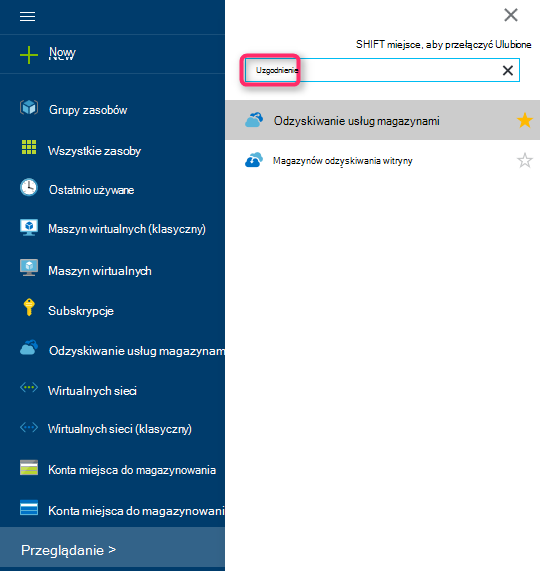

    Zostanie wyświetlona lista magazynów usługi odzyskiwania.

3. W menu **usługi odzyskiwania magazynów** kliknij przycisk **Dodaj**.

    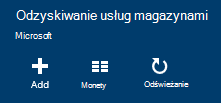

    Zostanie wyświetlona karta magazynu usługi odzyskiwania monituje o podanie **nazwy**, **subskrypcji**, **Grupa zasobów**i **lokalizacji**.

    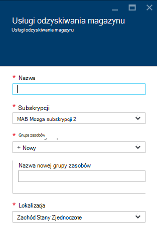

4. W polu **Nazwa**wpisz przyjazną nazwę identyfikującą magazyn. Nazwa musi być unikatowa dla Azure subskrypcji. Wpisz nazwę, która zawiera od 2 do 50 znaków. Musi rozpoczynać się od litery i mogą zawierać tylko litery, cyfry i łączniki.

5. Kliknij **subskrypcję** , aby wyświetlić listę dostępnych subskrypcji. Jeśli nie masz pewności, jakie subskrypcję, należy użyć wartości domyślnej (lub sugerowane) subskrypcji. Będzie wiele opcji do wyboru tylko wtedy, gdy konto organizacji jest skojarzony z wiele subskrypcji Azure.

6. Kliknij pozycję **Grupa zasobów** , aby wyświetlić listę dostępnych grup zasobów, lub kliknij przycisk **Nowy** , aby utworzyć nową grupę zasobów. Aby uzyskać pełne informacje dotyczące grup zasobów zobacz [Omówienie Menedżera zasobów Azure](../azure-resource-manager/resource-group-overview.md)

7. Kliknij **miejsce** , aby wybrać regionu geograficznego dla magazyn.

8. Kliknij przycisk **Utwórz**. Może upłynąć trochę czasu, zanim magazynu usługi odzyskiwania ma zostać utworzony. Monitorowanie powiadomienia o stanie w górnym obszarze po prawej stronie w portalu.
Po utworzeniu z magazynu zostanie otwarty w portalu.

### Ustawianie replikacji miejsca do magazynowania

Opcja replikacji magazynowania umożliwia wybranie zbędne geo miejsca do magazynowania i lokalnie zbędne miejsca do magazynowania. Domyślnie do magazynu ma zbędne geo miejsca do magazynowania. Pozostaw wybraną opcję do magazynu geo zbędne w przypadku kopii zapasowej podstawowego. Wybierz opcję lokalnie zbędne miejsca do magazynowania, jeśli chcesz tańsze opcja, która nie jest bardzo jako trwałe. Przeczytaj więcej o tym [zbędne geo](../storage/storage-redundancy.md#geo-redundant-storage) i [lokalnie zbędne](../storage/storage-redundancy.md#locally-redundant-storage) opcje przechowywania w [Omówienie replikacji magazyn Azure](../storage/storage-redundancy.md).

Aby zmienić ustawienie replikacji miejsca do magazynowania:

1. Wybierz pozycję usługi magazynu, aby otworzyć pulpitu nawigacyjnego magazynu i karta Ustawienia. Jeśli karta **Ustawienia** nie zostanie otwarty, kliknij pozycję **wszystkie ustawienia** na pulpicie nawigacyjnym magazynu.

2. Karta **Ustawienia** wybierz polecenie **Kopia zapasowa infrastruktury** > **Konfiguracji kopii zapasowej** , aby otworzyć karta **Konfiguracji kopii zapasowej** . Na karta **Konfiguracji kopii zapasowej** wybierz opcję replikacji miejsca do magazynowania z magazynu.

    

    Po wybraniu opcji miejsca do magazynowania dla swojego magazynu, możesz przystąpić do skojarzyć maszyn wirtualnych magazyn. Aby rozpocząć skojarzenia, należy wykrywanie i zarejestrować Azure maszyn wirtualnych.

### 2. pobierania magazynu poświadczeń

Plik magazynu poświadczeń jest certyfikat wygenerowany przez portal dla każdej kopii zapasowej magazynu. Portalu wysyła następnie klucz publiczny do usługi kontroli dostępu (ACS). Klucz prywatny certyfikatu staje się dostępny dla użytkowników w ramach przepływu pracy, której wartość jest podawana jako dane wejściowe w przepływie pracy rejestracji komputera. To uwierzytelnianie komputera wysyłanie kopii zapasowych danych do określonych magazynu w usłudze Azure kopii zapasowej.

Poświadczenia magazynu jest używana tylko podczas rejestracji przepływu pracy. Jest odpowiedzialność użytkownika, aby upewnić się, że nie odczyta plików magazynu poświadczeń. Jeśli wypada w ręce każdy użytkownik rozpoczęcie pliku magazynu poświadczeń może służyć do rejestrowania innych komputerów przed tym samym magazynu. Jednak podczas danych kopii zapasowej jest zaszyfrowany przy użyciu hasła, który należy do klienta, nie złamane istniejące dane kopii zapasowej. Aby zmniejszyć ten problem, magazynu poświadczenia są ustawione tak, aby wygasało w 48hrs. Możesz pobrać magazynu poświadczeń usługi odzyskiwania dowolną liczbę razy — ale podczas rejestracji przepływu pracy dotyczy tylko najnowsze magazynu poświadczeń pliku.

Plik magazynu poświadczeń są pobierane za pośrednictwem bezpiecznego kanału w portalu Azure. Usługa Azure kopii zapasowej nie rozpoznaje klucz prywatny certyfikatu i klucz prywatny nie jest zachowywane w portalu lub usługi. Wykonaj następujące czynności, aby pobrać plik magazynu poświadczeń na komputer lokalny.

1. Zaloguj się do [portalu Azure](https://portal.azure.com/).

2. Otwieranie magazynu usługi odzyskiwania, do którego do której chcesz zarejestrować DPM komputera.

3. Karta Ustawienia jest otwierany domyślnie. Jeśli jest zamknięta, kliknij przycisk **Ustawienia** na pulpicie nawigacyjnym magazynu, aby otworzyć karta Ustawienia. W karta Ustawienia wybierz polecenie **Właściwości**.

    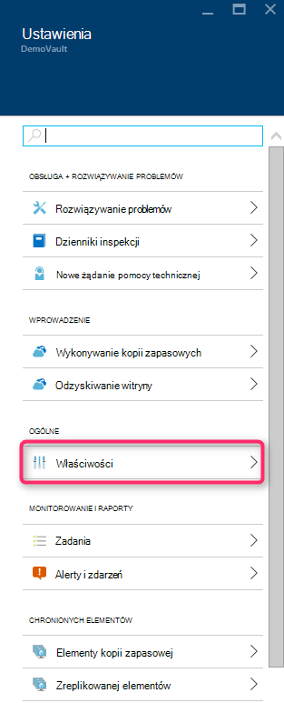

4. Na stronie właściwości kliknij przycisk **Pobierz** poświadczeniami **Kopii zapasowej**. Portalu generuje do magazynu poświadczeń pliku, który jest udostępnienie do pobrania.

    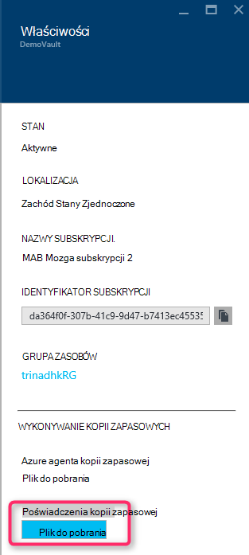

Portalu wygeneruje poświadczenie magazynu przy użyciu kombinacji nazwy magazynu i bieżącą datę. Kliknij przycisk **Zapisz** , aby pobierania poświadczeń magazynu do folderu pobierania lokalnego konta lub wybierz polecenie Zapisz jako w menu Zapisz, aby określić lokalizację magazynu poświadczeń. Zajmie minuty pliku do wygenerowania.

### Uwaga
- Upewnij się, że plik magazynu poświadczeń jest zapisywany w lokalizacji, w których można uzyskać dostęp z komputera. Jeśli jest on przechowywany w pliku Udostępnij/SMB, sprawdź uprawnienia dostępu.
- Plik magazynu poświadczeń jest używany tylko podczas przepływ pracy rejestracji.
- Plik magazynu poświadczeń Dezaktualizuje się po 48hrs, którą można pobrać z portalu.

### 3. Instalowanie agenta kopii zapasowej

Po utworzeniu magazynu kopii zapasowej Azure, należy zainstalować agenta na każdym komputery systemu Windows (Windows Server, klienta w systemie Windows, System Center Data Protection Manager serwera lub serwerze kopii zapasowej Azure) umożliwiającą wykonywanie kopii zapasowej danych i aplikacjom Azure.

1. Otwieranie magazynu usługi odzyskiwania, do którego do której chcesz zarejestrować DPM komputera.

2. Karta Ustawienia jest otwierany domyślnie. Jeśli jest zamknięta, wybierz polecenie **Ustawienia** , aby otworzyć karta Ustawienia. W karta Ustawienia wybierz polecenie **Właściwości**.

    

3. Na stronie Ustawienia kliknij przycisk **Pobierz** w obszarze **Azure agenta kopii zapasowej**.

    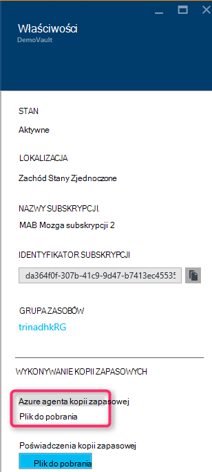

   Pobrany agenta kliknij dwukrotnie MARSAgentInstaller.exe na uruchamianie instalacji agenta kopii zapasowej Azure. Wybierz folder instalacji i folder tymczasowy wymagane dla agenta. Lokalizacja pamięci podręcznej określony musi mieć wolnego miejsca, czyli co najmniej 5% danych kopii zapasowej.

4.  Jeśli korzystasz z serwera proxy do łączenia się z Internetem, na ekranie **konfiguracji serwera Proxy** , wprowadź szczegóły serwera proxy. Jeśli korzystasz z serwerem proxy z uwierzytelnianiem, wprowadź szczegóły nazwę i hasło użytkownika na tym ekranie.

5.  Agent Azure Backup instaluje program .NET Framework 4,5 i środowiska Windows PowerShell (Jeśli nie jest dostępna) w celu ukończenia instalacji.

6.  Po zainstalowaniu agenta, **Zamknij** okno.

    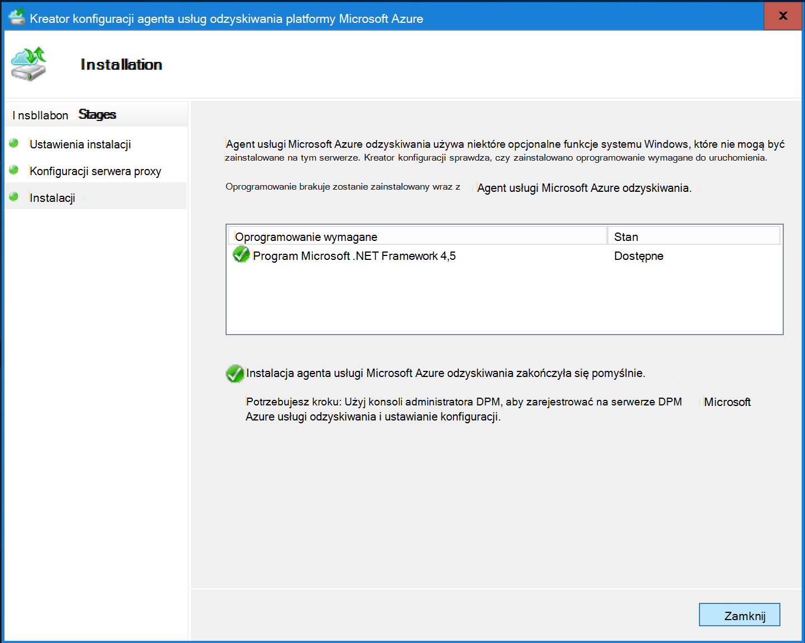

7. Aby **zarejestrować serwer DPM** do magazynu, na karcie **Zarządzanie** kliknij pozycję w **trybie Online**. Następnie wybierz pozycję **Zarejestruj**. Zostanie otwarty Kreator konfiguracji rejestru.

8. Jeśli korzystasz z serwera proxy do łączenia się z Internetem, na ekranie **konfiguracji serwera Proxy** , wprowadź szczegóły serwera proxy. Jeśli korzystasz z serwerem proxy z uwierzytelnianiem, wprowadź szczegóły nazwę i hasło użytkownika na tym ekranie.

    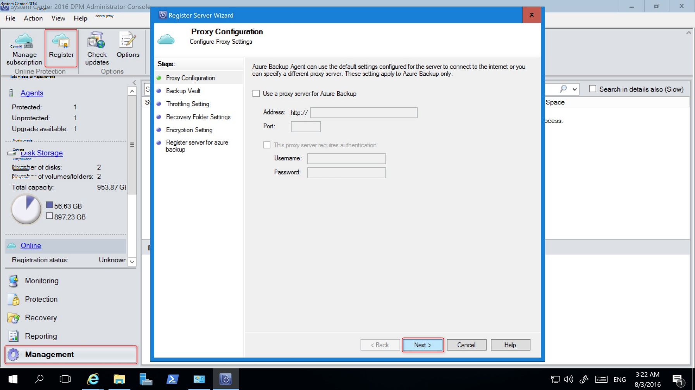

9. Na ekranie magazynu poświadczeń przejdź do i wybierz plik poświadczeń magazynu, który został wcześniej zostały pobrane.

    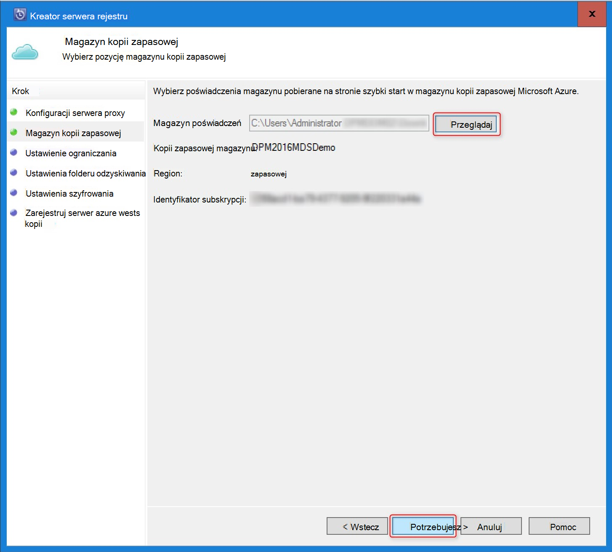

    Plik magazynu poświadczeń jest prawidłowy tylko w przypadku 48 godzin (po pobraniu z portalu). W przypadku wystąpienia błędu tego ekranu (na przykład "magazynu poświadczeń które wygasła podany plik"), zaloguj się do portalu Azure i pobierania poświadczeń magazynu pliku ponownie.

    Upewnij się, że plik magazynu poświadczeń jest dostępna w miejscu, w którym mogą uzyskiwać dostęp do aplikacji do konfigurowania. Jeśli wystąpią dostęp do powiązanych błędów, skopiuj plik magazynu poświadczeń do lokalizacji tymczasowej na tym komputerze i ponowić próbę.

    W przypadku wystąpienia błędu nieprawidłowe magazynu poświadczeń (na przykład "nieprawidłowe magazynu poświadczeń pod warunkiem") plik jest uszkodzony lub czy nie masz najnowsze poświadczeń skojarzonych z Usługa odzyskiwania. Powtórz operację po pobraniu nowego pliku magazynu poświadczeń w portalu. Ten błąd występuje zazwyczaj, jeśli użytkownik kliknie opcję **pobierania magazynu poświadczeń** w portalu Azure kolejno szybkie. W tym przypadku tylko drugi plik poświadczeń magazynu jest prawidłowy.

10. Aby kontrolować wykorzystanie przepustowości sieci podczas pracy, a wartością pracy godziny, na ekranie **Ustawienia ograniczania** można ustawić limity użycia przepustowości i definiowanie pracy i wartością pracy godziny.

    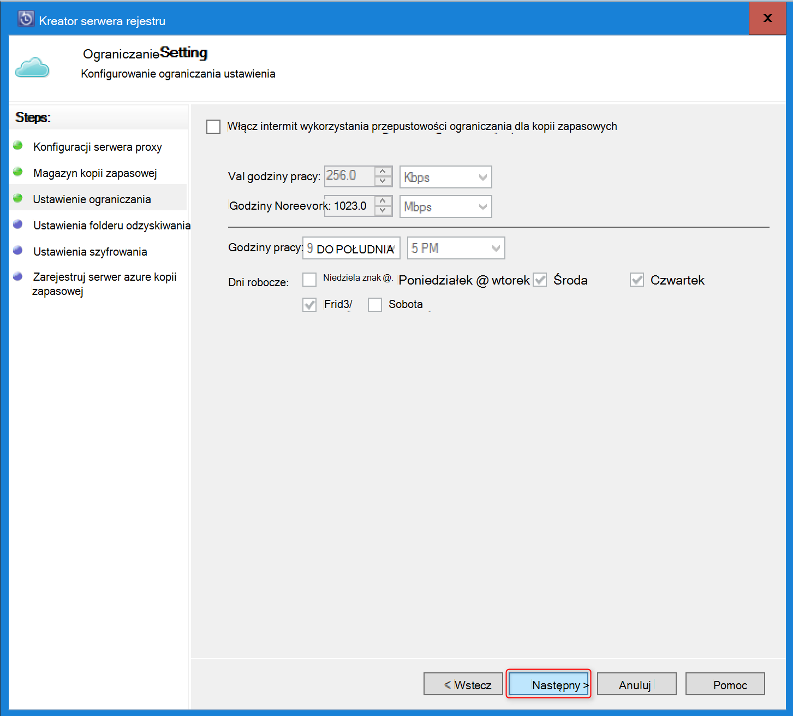

11. Na ekranie **Ustawienia folderu odzyskiwania** przeglądanie w poszukiwaniu folderu, w którym pliki pobrane z Azure będzie tymczasowo umieszczane.

    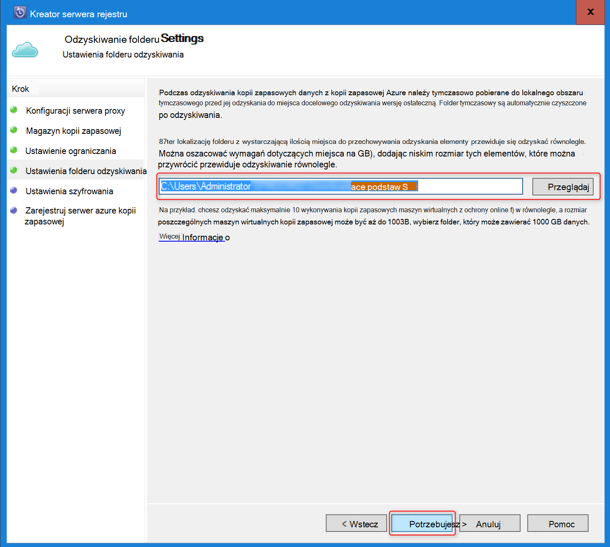

12. Na ekranie **Ustawienia szyfrowania** możesz wygenerować hasło lub podanie hasła (minimum 16 znaków). Pamiętaj zapisać hasło w bezpiecznym miejscu.

    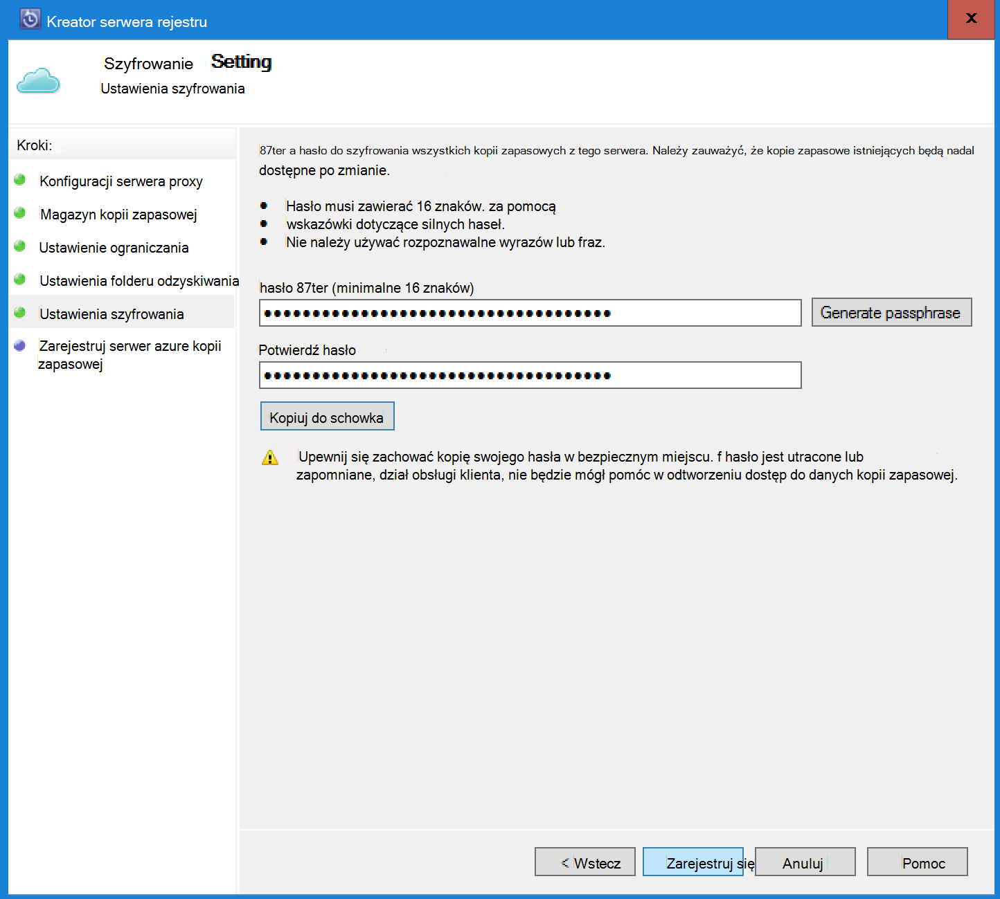

    > [AZURE.WARNING] Jeśli hasło jest utracone lub zapomniane; Microsoft nie pomoże w odzyskiwanie danych kopii zapasowej. Użytkownik końcowy właścicielem hasło szyfrowania, a nie ma wgląd hasło używane przez użytkownika końcowego. Zapisz plik w bezpiecznym miejscu, ponieważ jest wymagane podczas operacji odzyskiwania.

13. Gdy klikniesz przycisk **Zarejestruj** , komputer został pomyślnie zarejestrowany do magazyn i jest już rozpocząć wykonywanie kopii zapasowej Microsoft Azure.

14. Korzystając z Menedżera ochrony danych, można modyfikować ustawienia określony podczas przepływ pracy rejestracji, klikając opcję **Konfiguruj** , wybierając **Online** na karcie **Zarządzanie** .

## Wymagania dotyczące (i ograniczenia)

- DPM może działać jako fizyczny serwer lub zainstalowany w systemie Centrum 2012 z dodatkiem SP1 lub systemu Centrum 2012 R2 maszyny wirtualnej funkcji Hyper-V. Można również działać jako Azure maszyn wirtualnych uruchomionych System Centrum 2012 R2 z co najmniej DPM 2012 R2 aktualizacji nr 3 lub Windows maszyny wirtualnej VMWare uruchomionych System Centrum 2012 R2 z co najmniej pakietu zbiorczego aktualizacji 5.
- Jeśli używasz DPM System Centrum 2012 z dodatkiem SP1 należy zainstalować aktualizację użycia 2 w górę System Center Data Protection Manager z dodatkiem SP1. Jest to wymagane, aby można było zainstalować agenta kopii zapasowej Azure.
- Serwer DPM powinien mieć programu Windows PowerShell i .net Framework 4,5 zainstalowany.
- DPM można wykonać kopię zapasową większość obciążenia Azure kopii zapasowej. Co to jest obsługiwane Zobacz pełną listę kopii zapasowej Azure obsługuje poniższych elementów.
- Nie można odzyskać danych przechowywanych w kopii zapasowej Azure z opcją "Kopiuj do taśmą".
- Musisz mieć konto Azure za pomocą funkcji Kopia zapasowa Azure włączone. Jeśli nie masz konta, możesz utworzyć bezpłatne konto wersji próbnej na kilka minut. Przeczytaj o [ceny Azure kopii zapasowej](https://azure.microsoft.com/pricing/details/backup/).
- Korzystanie z kopii zapasowych Azure wymaga agenta kopii zapasowej Azure musi być zainstalowany na serwerach, który chcesz utworzyć kopię zapasową. Każdy serwer musi mieć co najmniej 5% rozmiaru danych, który jest teraz kopię zapasową, dostępne jako lokalnej wolnego miejsca. Na przykład wykonywanie kopii zapasowej 100 GB danych wymaga co najmniej 5 GB wolnego miejsca w lokalizacji wymazywanie.
- Dane są przechowywane w magazynie Azure magazynu. Nie jest ograniczona do ilości danych, które możesz można wykonać kopię zapasową kopii zapasowej Azure vault, ale rozmiar źródła danych (na przykład maszyn wirtualnych lub bazy danych) nie przekracza 54400 GB.

Typy plików są obsługiwane wykonaj kopię zapasową Azure:

- Zaszyfrowane (pełne kopie zapasowe tylko)
- Skompresowany (przyrostowe kopie zapasowe obsługiwane)
- Rzadkie (przyrostowe kopie zapasowe obsługiwane)
- Skompresowany i rzadkie (traktowane jako Sparse)

I te nie są obsługiwane:

- Serwery w systemie plików uwzględniania wielkości liter nie są obsługiwane.
- Łącza stałe (pominięty)
- Punkty (pominięty) ponownej analizy
- Zaszyfrowanych i skompresowany (pominięty)
- Zaszyfrowane i rzadkie (pominięte)
- Skompresowany strumień
- Rzadkie strumienia

>[AZURE.NOTE] Z w systemie Centrum 2012 DPM z dodatkiem SP1 lub nowszym można utworzyć kopię zapasową w górę obciążenia chroniony przez DPM Azure za pomocą programu Microsoft Azure kopii zapasowej.
