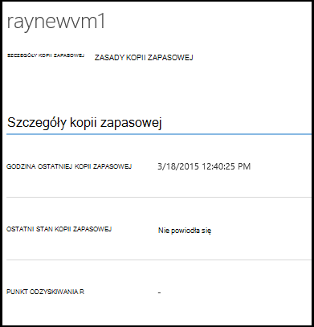

<properties
    pageTitle="Zarządzanie i monitorowanie kopie zapasowe Azure maszyn wirtualnych | Microsoft Azure"
    description="Dowiedz się, jak można monitorować kopie zapasowe Azure maszyn wirtualnych i zarządzanie nimi"
    services="backup"
    documentationCenter=""
    authors="trinadhk"
    manager="shreeshd"
    editor=""/>

<tags
    ms.service="backup"
    ms.workload="storage-backup-recovery"
    ms.tgt_pltfrm="na"
    ms.devlang="na"
    ms.topic="article"
    ms.date="08/31/2016"
    ms.author="trinadhk; jimpark; markgal;"/>

# <a name="manage-and-monitor-azure-virtual-machine-backups"></a>Monitorowanie kopie zapasowe Azure maszyn wirtualnych i zarządzanie nimi

> [AZURE.SELECTOR]
- [Zarządzanie kopie zapasowe maszyn wirtualnych Azure](backup-azure-manage-vms.md)
- [Zarządzanie klasyczny maszyn wirtualnych wykonywania kopii zapasowych](backup-azure-manage-vms-classic.md)

Ten artykuł zawiera informacje o typowych zarządzania i monitorowania zadania dla maszyn wirtualnych modelu Klasyczny chronione Azure.  

>[AZURE.NOTE] Azure występują dwa modele wdrożenia służące do tworzenia i pracy z zasobami: [Menedżer zasobów i klasyczny](../resource-manager-deployment-model.md). Aby uzyskać szczegółowe informacje na temat pracy z modelu wdrożenia klasyczny maszyny wirtualne, zobacz [Przygotowanie środowiska do tworzenia kopii zapasowych Azure maszyn wirtualnych](backup-azure-vms-prepare.md) .

## <a name="manage-protected-virtual-machines"></a>Zarządzanie chronionego maszyn wirtualnych

Aby zarządzać chronionego maszyn wirtualnych:

1. Do wyświetlania i zarządzania ustawienia kopii zapasowych dla maszyny wirtualnej kliknij kartę **Elementy chroniony** .

2. Kliknij nazwę elementu chronionego, aby wyświetlić kartę **Szczegóły kopii zapasowej** , która pokazuje informacje dotyczące ostatniej kopii zapasowej.

    

3. Do wyświetlania i zarządzania zasadami kopii zapasowej ustawień maszyny wirtualnej kliknij kartę **zasady** .

    

    Na karcie **Zasady kopii zapasowej** zawiera istniejących zasad. Możesz zmienić w razie potrzeby. Jeśli chcesz utworzyć nową zasadę kliknij przycisk **Utwórz** na stronie **zasad** . Należy zauważyć, że jeśli chcesz usunąć regułę go nie powinny dowolnego maszyn wirtualnych skojarzone z nim.

    

4. Więcej informacji na temat akcji lub stan można uzyskać maszyny wirtualnej na stronie **zadania** . Kliknij zadanie na liście, aby uzyskać więcej szczegółów, lub filtrowanie zadań dla określonej maszyny wirtualnej.

    

## <a name="on-demand-backup-of-a-virtual-machine"></a>Wykonywanie kopii zapasowych na żądanie maszyny wirtualnej
Po skonfigurowaniu ochrony na żądanie może potrwać kopii zapasowej maszyny wirtualnej. Jeśli oczekuje wstępnej kopii zapasowej na komputerze wirtualnych kopii zapasowej na żądanie utworzy kopię pełnego maszyny wirtualnej w Azure magazynu kopii zapasowej. Jeśli pierwsza kopia zapasowa zostanie zakończone, będzie kopii zapasowej na żądanie tylko Wyślij zmiany z poprzedniej kopii zapasowej kopii zapasowej Azure to znaczy vault go ma zawsze charakter przyrostowy.

>[AZURE.NOTE] Zakres przechowywania kopii zapasowej na żądanie jest ustawiona wartość przechowywania określone dla dzienny przechowywania w kopii zapasowej zasad odpowiadających maszyn wirtualnych.  

Aby sporządzić kopii zapasowej maszyny wirtualnej na żądanie:

1. Przejdź na stronę **Chronionych elementów** i **maszyn wirtualnych Azure** jako **Typ** wybierz pozycję (Jeśli nie jest jeszcze zaznaczona) i kliknij przycisk **Wybierz** .

    

2. Wybierz pozycję maszyny wirtualnej, na którym chcesz wykonać na żądanie kopii zapasowej i kliknij przycisk **Teraz kopii zapasowej** w dolnej części strony.

    

    Spowoduje to utworzenie zadania wykonywania kopii zapasowej na wybranym komputerze wirtualnych. Zakres przechowywania punktu odzyskiwania utworzonych za pomocą tego zadania będzie taki sam jak określona w zasady skojarzone z maszyny wirtualnej.

    

    >[AZURE.NOTE] Aby wyświetlić zasady skojarzone z maszyny wirtualnej, przechodzenie do szczegółów w maszyn wirtualnych na stronie **Chronionych elementów** i przejdź do karty zasady kopii zapasowej.

3. Po utworzeniu zadania, klikając przycisk **zadania** na pasku wyskakującego, aby wyświetlić odpowiedniego zadania na stronie zadania.

    

4. Po pomyślnym zakończeniu zadania punkt odzyskiwania zostanie utworzony służącego do przywracania maszyny wirtualnej. To będzie również zwiększać wartość kolumny punktu odzyskiwania przez 1 na stronie **Chronionych elementów** .

## <a name="stop-protecting-virtual-machines"></a>Zatrzymaj ochronę maszyn wirtualnych
Możesz wybrać zatrzymać kolejnych kopii zapasowych maszyny wirtualnej z następujących opcji:

- Zachowanie danych kopii zapasowej skojarzone z maszyn wirtualnych w kopii zapasowej Azure magazynu
- Usuwanie danych kopii zapasowej skojarzone z maszyn wirtualnych

Po zaznaczeniu przechowywania danych kopii zapasowej skojarzone z maszyn wirtualnych służy danych kopii zapasowej do przywrócenia maszyny wirtualnej. W przypadku cen szczegóły dotyczące tych maszyn wirtualnych, kliknij [tutaj](https://azure.microsoft.com/pricing/details/backup/).

Aby wyłączyć ochronę maszyny wirtualnej:

1. Przejdź do **Chronionych elementów** strony i wybierz pozycję **Azure maszyn wirtualnych** jako typ filtru (Jeśli nie jest jeszcze zaznaczona) i kliknij przycisk **Wybierz** .

    

2. Wybierz pozycję maszyny wirtualnej i kliknij pozycję **Zatrzymaj ochronę** w dolnej części strony.

    

3. Domyślnie Azure kopii zapasowej nie powoduje usunięcia danych kopii zapasowej skojarzony z maszyny wirtualnej.

    

    Jeśli chcesz usunąć dane kopii zapasowej, zaznacz pole wyboru.

    

    Wybierz przyczynę zatrzymywanie tworzenia kopii zapasowej. Chociaż jest opcjonalne, podania przyczyny pomoże kopia zapasowa Azure, aby pracować nad opinii i ustalać ich priorytety scenariusze klienta.

4. Kliknij przycisk **Prześlij** , aby przesłać zadanie **Wyłączanie ochrony** . Kliknij na **Zadania** , aby wyświetlić odpowiednie zadania na stronie **zadania** .

    

    Jeśli nie wybrano opcji **Usuń skojarzone danych kopii zapasowej** podczas Kreator **Zatrzymaj ochronę** , a następnie ukończenia zadania wpis, stan ochrony zmieni się na **Ochronę zatrzymane**. Dane pozostaną z kopią zapasową Azure, dopóki nie jest jawnie usunięte. Zawsze możesz usunąć dane, zaznaczając maszyny wirtualnej na stronie **Chronionych elementów** i klikając polecenie **Usuń**.

    

    Jeśli wybrano opcję **Usuń skojarzone danych kopii zapasowej** maszyny wirtualnej będzie część strony **Chronionych elementów** .

## <a name="re-protect-virtual-machine"></a>Ponownie ochrony maszyn wirtualnych
Jeśli nie wybrano opcji **Usuń kojarzenie danych kopii zapasowej** w **Zatrzymaj ochronę**, możesz ponownie je chronić maszyny wirtualnej, wykonując kroki podobne do wykonywania kopii zapasowych zarejestrowanych maszyn wirtualnych. Po chroniony, ten komputer wirtualnych będzie miał zachowane przed Zatrzymaj ochronę danych kopii zapasowej i odzyskiwania punkty utworzone po ponownie ochronę.

Po ponownie chronić stan ochrony maszyny wirtualnej zostanie zmieniony do **chronione** , jeśli istnieją punkty odzyskiwania przed **Zatrzymaj ochronę**.

  

>[AZURE.NOTE] Ponownie zabezpieczania maszyny wirtualnej, możesz wybrać inne zasady niż zasady, z którym maszyn wirtualnych był chroniony początkowym.

## <a name="unregister-virtual-machines"></a>Unregister maszyn wirtualnych

Jeśli chcesz usunąć maszyny wirtualnej z kopii zapasowej magazynu:

1. Kliknij przycisk **UNREGISTER** u dołu strony.

    

    Wyskakującego powiadomienia pojawi się w dolnej części ekranu żąda potwierdzenia. Kliknij przycisk **Tak,** aby kontynuować.

    

## <a name="delete-backup-data"></a>Usuń dane z kopii zapasowej
Możesz usunąć dane kopii zapasowej skojarzony z maszyny wirtualnej, albo:

- Podczas wykonywania Zatrzymaj ochronę zadania
- Po ochrony Zatrzymaj ukończenia zadania na komputerze wirtualnych

Aby usunąć danych kopii zapasowej na komputerze wirtualnych jest w stanie *Zatrzymania ochrony* opublikować pomyślnego ukończenia zadania **Zatrzymać kopii zapasowej** :

1. Przejdź na stronę **Chronionych elementów** i jako *Typ* wybierz pozycję **maszyn wirtualnych Azure** i kliknij przycisk **Wybierz** .

    

2. Wybierz pozycję maszyny wirtualnej. Maszyny wirtualnej będzie w stanie **Zatrzymania ochrony** .

    

3. Kliknij przycisk **Usuń** w dolnej części strony.

    

4. W oknie dialogowym **Usuwanie danych kopii zapasowej** Kreator wybierz przyczynę usunięcia danych kopii zapasowej (zdecydowanie zalecane), a następnie kliknij przycisk **Prześlij**.

    

5. Spowoduje to utworzenie zadania do usunięcia danych kopii zapasowej zaznaczonego maszyny wirtualnej. Kliknij przycisk **zadania** , aby wyświetlić odpowiedniego zadania na stronie zadania.

    

    Po zakończeniu zadania pozycję odpowiadającą maszyny wirtualnej zostaną usunięte z **chronionego elementów** strony.

## <a name="dashboard"></a>Pulpit nawigacyjny
Na stronie **pulpitu nawigacyjnego** można przeglądać informacji o Azure maszyn wirtualnych, miejsca do magazynowania i zadań skojarzonych z nimi w ciągu ostatnich 24 godzin. Stan kopii zapasowej i wszystkie skojarzone błędy kopii zapasowej można przeglądać.


>[AZURE.NOTE] Wartości na pulpicie nawigacyjnym są odświeżane raz na 24 godziny.

## <a name="auditing-operations"></a>Inspekcja operacji
Azure kopii zapasowej zawiera przegląd "Operacja dzienniki" operacji tworzenia kopii zapasowych wyzwalane przez klienta, co ułatwia Zobacz dokładnie jakie operacji zarządzania były wykonywane na kopii zapasowej magazynu. Dzienniki operacji Włącz profesjonalnych podsumowaniem końcowym i inspekcji obsługę kopii zapasowych.

W dzienniki operacji są rejestrowane następujące operacje:

- Zarejestruj się
- Unregister
- Konfigurowanie ochrony
- Kopia zapasowa (według harmonogramu oraz kopii zapasowych na żądanie przy użyciu BackupNow)
- Przywracanie
- Wyłączanie ochrony
- Usuwanie danych kopii zapasowej
- Dodawanie zasad
- Usuwanie zasad
- Zasady aktualizacji
- Anulowanie zadania

Aby wyświetlić dzienniki operacji odpowiadające kopii zapasowej magazynu:

1. Przejdź do **usługi zarządzania** w Azure portal, a następnie kliknij kartę **Dzienniki operacji** .

    

2. W oknie dialogowym filtry jako *Typ* wybierz pozycję **kopii zapasowej** i określ nazwę kopii zapasowej magazynu w polu *Nazwa usługi* i kliknij pozycję **Prześlij**.

    

3. W dziennikach operacji wybierz dowolną operację, a następnie kliknij przycisk **Szczegóły** , aby wyświetlić szczegóły odpowiadającą działaniu.

    

    W **Kreatorze szczegółów** zawiera informacje o operacji wyzwalane, zadanie identyfikator zasobu, w którym zostanie wywołana tej operacji i godzina rozpoczęcia operacji.

    

## <a name="alert-notifications"></a>Alertów
Niestandardowe alertów dla zadań można uzyskać w portalu. W tym celu należy definiujące alert reguły oparte na programie PowerShell operacyjne dzienniki zdarzeń. Zaleca się używanie *programu PowerShell wersji 1.3.0 lub nowszej*.

Aby zdefiniować powiadomieniem niestandardowym alert dla kopii zapasowej błędy, polecenie przykładowe będzie wyglądać:

```
PS C:\> $actionEmail = New-AzureRmAlertRuleEmail -CustomEmail contoso@microsoft.com
PS C:\> Add-AzureRmLogAlertRule -Name backupFailedAlert -Location "East US" -ResourceGroup RecoveryServices-DP2RCXUGWS3MLJF4LKPI3A3OMJ2DI4SRJK6HIJH22HFIHZVVELRQ-East-US -OperationName Microsoft.Backup/backupVault/Backup -Status Failed -TargetResourceId /subscriptions/86eeac34-eth9a-4de3-84db-7a27d121967e/resourceGroups/RecoveryServices-DP2RCXUGWS3MLJF4LKPI3A3OMJ2DI4SRJK6HIJH22HFIHZVVELRQ-East-US/providers/microsoft.backupbvtd2/BackupVault/trinadhVault -Actions $actionEmail
```

**ResourceId**: możesz uzyskać dostęp do tej z dzienników operacji podręcznego zgodnie z opisem w powyżej sekcji. ResourceUri w oknie podręcznym szczegółów operacji jest ResourceId dostarczanych dla tego polecenia cmdlet.

**OperationName**: będzie to format "Microsoft.Backup/backupvault/<EventName>" w przypadku, gdy EventName jest jednym z rejestru, Unregister, ConfigureProtection, aby utworzyć kopię zapasową, przywracanie StopProtection, DeleteBackupData, CreateProtectionPolicy, DeleteProtectionPolicy, UpdateProtectionPolicy

**Stan**: obsługiwane wartości są wprowadzenie zakończyła się pomyślnie ale nie powiodło się.

**Grupa zasobów**: Grupa zasobów zasobów, do którego zostanie wywołana operacji. Można to uzyskać od wartości ResourceId. Wartość między polami */resourceGroups/* i */providers/* ResourceId wartość jest wartością grupa zasobów.

**Nazwa**: Nazwa reguły alertu.

**CustomEmail**: określić adres e-mail niestandardowy, do którego chcesz wysłać alertów

**SendToServiceOwners**: Ta opcja wysyła alertów dla wszystkich administratorów i administratorów współpracujących subskrypcji. Mogą zostać użyte w polecenia cmdlet **New-AzureRmAlertRuleEmail**

### <a name="limitations-on-alerts"></a>Ograniczenia dotyczące alertów
Alerty na podstawie zdarzenia podlegają następującym ograniczeniom:

1. Alerty są wyzwalane w przypadku wszystkich maszyn wirtualnych w kopii zapasowej magazynu. Nie można dostosować go, aby otrzymywać alerty dotyczące określonego zestawu maszyn wirtualnych w kopii zapasowej magazynu.
2. Ta funkcja jest w podglądzie. [Dowiedz się więcej](../monitoring-and-diagnostics/insights-powershell-samples.md#create-alert-rules)
3. Będą otrzymywać alerty z "alerts-noreply@mail.windowsazure.com". Obecnie nie można zmodyfikować nadawcy wiadomości e-mail.

## <a name="next-steps"></a>Następne kroki

- [Przywracanie Azure maszyny wirtualne](backup-azure-restore-vms.md)
