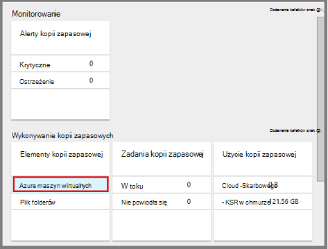

<properties
    pageTitle="Zarządzanie kopie zapasowe wdrożony Menedżera zasobów maszyn wirtualnych | Microsoft Azure"
    description="Dowiedz się, jak monitorowanie kopie zapasowe wdrożony Menedżera zasobów maszyn wirtualnych i zarządzanie nimi"
    services="backup"
    documentationCenter=""
    authors="trinadhk"
    manager="shreeshd"
    editor=""/>

<tags
    ms.service="backup"
    ms.workload="storage-backup-recovery"
    ms.tgt_pltfrm="na"
    ms.devlang="na"
    ms.topic="article"
    ms.date="08/11/2016"
    ms.author="jimpark; markgal; trinadhk"/>

# Zarządzanie Azure maszyn wirtualnych wykonywania kopii zapasowych

> [AZURE.SELECTOR]
- [Zarządzanie kopie zapasowe maszyn wirtualnych Azure](backup-azure-manage-vms.md)
- [Zarządzanie klasyczny maszyn wirtualnych wykonywania kopii zapasowych](backup-azure-manage-vms-classic.md)

Ten artykuł zawiera wskazówki dotyczące zarządzania kopie zapasowe maszyn wirtualnych i wyjaśniono alerty kopii zapasowej informacji na temat dostępnych na pulpicie nawigacyjnym portalu. Wytyczne w tym artykule dotyczą maszyny wirtualne za pomocą usługi odzyskiwania magazynów. W tym artykule opisano tworzenie maszyn wirtualnych ani oznacza ją wyjaśniono, jak chronić maszyn wirtualnych. Aby Elementarz dotycząca ochrony wdrożony Menedżera zasobów Azure maszyny wirtualne platformy Azure z magazynu usługi odzyskiwania, zobacz [najpierw sprawdzić: wykonywanie kopii zapasowej pośrednictwem SMS do magazynu usługi odzyskiwania](backup-azure-vms-first-look-arm.md).

## Zarządzanie magazynami i chronionych maszyn wirtualnych

W portalu usługi Azure pulpitu nawigacyjnego magazynu usługi odzyskiwania zapewnia dostęp do informacji o tym magazynu:

- ostatnio migawkę kopii zapasowej jest również najnowszą punkt przywracania < br\>
- zasady kopii zapasowej < br\>
- Całkowity rozmiar wszystkich kopii zapasowej migawek < br\>
- Liczba maszyn wirtualnych, które są chronione magazyn < br\>

Wiele zadań zarządzania z kopii zapasowej maszyn wirtualnych rozpoczynają się od otwarcia magazyn na pulpicie nawigacyjnym. Jednak ponieważ magazynami może służyć do ochrony wielu elementów (lub wiele maszyny wirtualne), aby wyświetlić szczegóły dotyczące określonego maszyn wirtualnych, otwieranie elementów pulpitu nawigacyjnego magazynu. Poniższa procedura pokazano, jak otworzyć *magazynu pulpitu nawigacyjnego* i przejdź do *pulpitu nawigacyjnego element magazynu*. W obu tych procedur, które wskazują się, jak dodać magazyn i magazynu elementu do pulpitu nawigacyjnego Azure za pomocą numeru Pin do pulpitu nawigacyjnego polecenia są "porady". Numer PIN do pulpitu nawigacyjnego jest sposób tworzenia skrótu do magazynu lub elementu. Można także wykonywać typowe polecenia ze skrótu.

>[AZURE.TIP] Jeśli masz wiele pulpitów nawigacyjnych i otwieranie karty, za pomocą suwaka ciemny niebieski u dołu okna slajdu Azure pulpitu nawigacyjnego i z powrotem.

### Otwórz magazynu usługi odzyskiwania na pulpicie nawigacyjnym:

1. Zaloguj się do [portalu Azure](https://portal.azure.com/).

2. W menu Centrum kliknij przycisk **Przeglądaj** , a następnie na liście zasobów, wpisz **Usługi odzyskiwania**. Rozpoczęciu wpisywania lista filtrów na podstawie wprowadzanych danych. Kliknij pozycję **magazynu usługi odzyskiwania**.

      

    Na liście usług odzyskiwania magazynów są wyświetlane.

      

    >[AZURE.TIP] Przypinanie magazynu do pulpitu nawigacyjnego Azure, tego magazynu jest natychmiast dostępna po otwarciu Azure portal. Aby przypiąć magazynu do pulpitu nawigacyjnego, na liście magazynu, kliknij prawym przyciskiem myszy magazyn, a następnie wybierz pozycję **Przypnij do pulpitu nawigacyjnego**.

3. Na liście magazynów zaznacz magazynu, aby otworzyć jego pulpitu nawigacyjnego. Gdy wybierzesz magazyn, Otwórz pulpit nawigacyjny magazynu i karta **Ustawienia** . Na poniższej ilustracji na pulpicie nawigacyjnym **Contoso magazynu** jest wyróżniona.

    

### Otwieranie elementów pulpitu nawigacyjnego magazynu

W poprzedniej procedurze otwarty na pulpicie nawigacyjnym magazynu. Aby otworzyć element pulpitu nawigacyjnego magazynu:

1. Pulpit nawigacyjny magazynu na kafelku **Elementy kopii zapasowej** kliknij pozycję **maszyn wirtualnych Azure**.

    

    Karta **Elementy kopii zapasowej** Wyświetla ostatnim zadania wykonywania kopii zapasowej dla każdego elementu. W tym przykładzie jest maszyn wirtualnych, demovm markgal, chroniony przez tego magazynu.  

    

    >[AZURE.TIP] W celu ułatwienia dostępu można przypiąć do magazynu elementu do pulpitu nawigacyjnego Azure. Aby przypiąć element magazynu na liście element magazynu, kliknij prawym przyciskiem myszy element, a następnie wybierz pozycję **Przypnij do pulpitu nawigacyjnego**.

2. W karta **Elementy kopii zapasowej** kliknij element, aby otworzyć element pulpitu nawigacyjnego magazynu.

    

    Pulpit nawigacyjny elementu magazynu i jego karta **Ustawienia** Otwórz.

    

    Na pulpicie nawigacyjnym elementu magazynu można wykonać wiele zadań zarządzania kluczami, takich jak:

    - Zmienianie zasad lub tworzenia nowych zasad kopii zapasowej < br\>
    - wyświetlanie punktów i wyświetlić ich stanu spójności < br\>
    - wykonywanie kopii zapasowych na żądanie maszyny wirtualnej < br\>
    - Zatrzymaj ochronę maszyn wirtualnych < br\>
    - wznawianie ochrony maszyny wirtualnej < br\>
    - Usuwanie danych kopii zapasowej (lub punkt odzyskiwania) < br\>
    - [Przywracanie z kopii zapasowej (lub punkt odzyskiwania)](./backup-azure-arm-restore-vms.md#restore-a-recovery-point) < br\>

Dla poniższych procedur punkt początkowy jest pulpit nawigacyjny elementu magazynu.

## Zarządzanie zasadami kopii zapasowej

1. Wybierz polecenie **Wszystkie ustawienia** , aby otworzyć karta **Ustawienia** z [magazynu elementu z pulpitu nawigacyjnego](backup-azure-manage-vms.md#open-a-vault-item-dashboard).

    

2. Wybierz polecenie karta **Ustawienia** **zasad kopii zapasowej** , aby otworzyć tego karta.

    Szczegóły kopii zapasowej zakres częstotliwości i przechowywania są wyświetlane na karta.

    

3. Z menu **Wybierz kopii zapasowej zasad** :
    - Aby zmienić zasady, wybierz inne zasady, a następnie kliknij przycisk **Zapisz**. Magazyn natychmiast dotyczy nowych zasad. < br\>
    - Aby utworzyć zasady, wybierz polecenie **Utwórz nowy**.

    

    Aby uzyskać instrukcje dotyczące tworzenia kopii zapasowej zasad zobacz [Definiowanie zasady tworzenia kopii zapasowych](backup-azure-manage-vms.md#defining-a-backup-policy).

[AZURE.INCLUDE [backup-create-backup-policy-for-vm](../../includes/backup-create-backup-policy-for-vm.md)]

## Wykonywanie kopii zapasowych na żądanie maszyny wirtualnej
Po skonfigurowaniu ochrony na żądanie może potrwać kopii zapasowej maszyny wirtualnej. Jeśli oczekuje wstępnej kopii zapasowej kopii zapasowej na żądanie tworzy kopię pełnego maszyny wirtualnej w magazynu usługi odzyskiwania. Jeśli wykonaniu początkowej kopii zapasowej kopii zapasowej na żądanie będzie wysyłać tylko zmiany z poprzedniej migawki do magazynu usługi odzyskiwania. Oznacza to, że kolejne kopie zapasowe zawsze mają charakter przyrostowy.

>[AZURE.NOTE] Zakres przechowywania kopii zapasowej na żądanie jest wartość przechowywania kopii zapasowej punktu dzienny zasady. Jeśli żaden dzienny punkt kopii zapasowej jest zaznaczone, tygodniowy punktu kopii zapasowej jest używana.

Aby wyzwolić kopii zapasowej na żądanie maszyny wirtualnej:

- Wybierz polecenie **Wykonaj kopię zapasową**z [magazynu elementu z pulpitu nawigacyjnego](backup-azure-manage-vms.md#open-a-vault-item-dashboard).

    

    Portal służy do sprawdzenia, czy chcesz uruchomić zadania wykonywania kopii zapasowej na żądanie. Kliknij przycisk **Tak,** aby rozpocząć zadania wykonywania kopii zapasowej.

    

    Zadania wykonywania kopii zapasowej tworzy punkt odzyskiwania. Zakres przechowywania punkt odzyskiwania jest taka sama, jak przechowywania zakresu określonego w zasady skojarzone z maszyny wirtualnej. Aby śledzić postęp zadania na pulpicie nawigacyjnym magazynu, kliknij Kafelek **Zadaniami kopii zapasowej** .  

## Zatrzymaj ochronę maszyn wirtualnych
Jeśli wybierzesz opcję Zatrzymaj ochronę maszyny wirtualnej, zostanie wyświetlony monit, jeśli chcesz zachować punktów odzyskiwania. Istnieją dwa sposoby Zatrzymaj ochronę maszyn wirtualnych:
- zatrzymywanie wszystkich przyszłych zadań kopii zapasowej i Usuń wszystkie punkty odzyskiwania, lub
- zatrzymywanie wszystkich przyszłych zadań kopii zapasowej, ale pozostawić punktów odzyskiwania  

Się koszty skojarzone z opuszczania punktów odzyskiwania w magazynie. Jednak korzyści, jakie opuszczania punktów odzyskiwania jest później, można przywrócić maszyny wirtualnej w razie potrzeby. Aby uzyskać informacje dotyczące kosztów opuszczania punktów odzyskiwania Zobacz [ceny szczegóły](https://azure.microsoft.com/pricing/details/backup/). Jeśli wybierzesz opcję usunięcia wszystkich punktów odzyskiwania, nie można przywrócić maszyny wirtualnej.

Aby wyłączyć ochronę maszyny wirtualnej:

1. [Pulpit nawigacyjny elementu magazynu](backup-azure-manage-vms.md#open-a-vault-item-dashboard)wybierz polecenie **Zatrzymaj wykonywanie kopii zapasowej**.

    

    Zostanie wyświetlona karta zatrzymać kopii zapasowej.

    

2. Na karta **Zatrzymać kopii zapasowej** Określ, czy chcesz zachować lub usuwanie danych kopii zapasowej. Pole informacje szczegółowe informacje na temat wyboru.

    

3. Jeśli zdecydujesz się zachować dane kopii zapasowej, przejdź do kroku 4. Jeśli chcesz usunąć dane kopii zapasowej, upewnij się, że chcesz zatrzymać zadań kopii zapasowej i usuwanie punktów odzyskiwania — wpisz nazwę elementu.

    

    Jeśli nie masz pewności co do nazwa elementu, umieść wskaźnik myszy na wykrzyknik, aby wyświetlić nazwę. Nazwa elementu jest także, w obszarze **Zatrzymywanie kopii zapasowych** w górnej części karta.

4. Opcjonalnie podaj **powód** lub **komentarz**.

5. Aby zatrzymać zadania wykonywania kopii zapasowej bieżącego elementu, kliknij przycisk  

    Wiadomości z powiadomieniem pozwala ustalić, czy zadanie kopii zapasowej zostało zatrzymane.

    

## Wznów ochronę maszyny wirtualnej
Jeżeli została wybrana opcja **Zachowaj dane z kopii zapasowej** , gdy zatrzymano ochrony dla maszyny wirtualnej, następnie jest możliwe Życiorys ochrony. Jeśli została wybrana opcja **Usuń dane z kopii zapasowej** , nie można wznowić ochrony dla maszyny wirtualnej.

Aby wznowić ochrony dla maszyny wirtualnej

1. [Pulpit nawigacyjny elementu magazynu](backup-azure-manage-vms.md#open-a-vault-item-dashboard)polecenie **Życiorys kopii zapasowej**.

    

    Zostanie wyświetlona karta Zasady kopii zapasowej.

    >[AZURE.NOTE] Ponownie zabezpieczania maszyny wirtualnej, możesz wybrać inne zasady niż zasady, z którym maszyn wirtualnych był chroniony początkowym.

2. Wykonaj kroki [zmiany zasad lub Utwórz nową zasadę kopii zapasowej](backup-azure-manage-vms.md#change-policies-or-create-a-new-backup-policy), aby przypisać zasady dla maszyny wirtualnej.

    Po zastosowaniu zasad kopii zapasowej maszyn wirtualnych, zobaczysz następujący komunikat.

    

## Usuń dane z kopii zapasowej
Możesz usunąć dane kopii zapasowej skojarzone z maszyny wirtualnej podczas wykonywania zadania **Zatrzymaj wykonywanie kopii zapasowej** lub w dowolnym momencie po zakończeniu tworzenia kopii zapasowej zadanie zostało ukończone. Nawet mogą być przydatne czekać dni lub tygodni przed usunięciem punktów odzyskiwania. W odróżnieniu od podczas usuwania danych kopii zapasowej, przywracanie punktów odzyskiwania, nie można wybrać punktów określonych odzyskiwania do usunięcia. Jeśli wybierzesz opcję usunięcia danych, możesz usunąć wszystkie punkty odzyskiwania skojarzoną z elementem.

W poniższej procedurze przyjęto zadanie kopii zapasowej maszyny wirtualnej został zatrzymany lub wyłączony. Po wyłączeniu zadanie kopii zapasowej opcje **wznowić wykonywanie kopii zapasowych** i **Usuwanie kopii zapasowej** są dostępne na pulpicie nawigacyjnym elementu magazynu.

Aby usunąć dane kopii zapasowej na komputerze wirtualnych z *kopii zapasowej wyłączone*:

1. Na [pulpit nawigacyjny element magazynu](backup-azure-manage-vms.md#open-a-vault-item-dashboard)kliknij przycisk **Usuń kopii zapasowej**.

    

    Zostanie wyświetlona karta **Usunąć dane z kopii zapasowej** .

    

2. Wpisz nazwę elementu, aby potwierdzić, że chcesz usunąć punkty odzyskiwania.

    

    Jeśli nie masz pewności co do nazwa elementu, umieść wskaźnik myszy na wykrzyknik, aby wyświetlić nazwę. Ponadto nazwa elementu znajduje się w obszarze **Usunąć dane z kopii zapasowej** w górnej części karta.

3. Opcjonalnie podaj **powód** lub **komentarz**.

4. Aby usunąć dane kopii zapasowej bieżącego elementu, kliknij przycisk  

    Wiadomości z powiadomieniem pozwala ustalić, czy dane kopii zapasowej zostały usunięte.

## Następne kroki

Aby uzyskać informacje dotyczące ponownego tworzenia maszyny wirtualnej z punktu odzyskiwania zapoznaj się z [Przywracanie maszyny wirtualne Azure](backup-azure-restore-vms.md). Jeśli potrzebujesz informacji o ochronie maszyn wirtualnych, zobacz [najpierw sprawdzić: wykonywanie kopii zapasowej pośrednictwem SMS do magazynu usługi odzyskiwania](backup-azure-vms-first-look-arm.md). Aby uzyskać informacje dotyczące monitorowania zdarzeń zobacz [alerty Monitor kopii zapasowych Azure maszyn wirtualnych](backup-azure-monitor-vms.md).
