<properties
    pageTitle="Zarządzanie magazynami Azure wykonywanie kopii zapasowych i serwery Azure przy użyciu modelu Klasyczny wdrożenia | Microsoft Azure"
    description="Użyj tego samouczka, aby dowiedzieć się, jak do zarządzania magazynami Azure wykonywanie kopii zapasowych i serwerów."
    services="backup"
    documentationCenter=""
    authors="markgalioto"
    manager="jwhit"
    editor="tysonn"/>

<tags
    ms.service="backup"
    ms.workload="storage-backup-recovery"
    ms.tgt_pltfrm="na"
    ms.devlang="na"
    ms.topic="article"
    ms.date="09/27/2016"
    ms.author="jimpark;markgal"/>

# Zarządzanie magazynami Azure wykonywanie kopii zapasowych i serwery przy użyciu modelu Klasyczny wdrażania

> [AZURE.SELECTOR]
- [Menedżer zasobów](backup-azure-manage-windows-server.md)
- [Klasyczny](backup-azure-manage-windows-server-classic.md)

W tym artykule znajdziesz Omówienie zadań zarządzania kopii zapasowej dostępne za pośrednictwem portalu klasyczny Azure i agenta firmy Microsoft Azure kopii zapasowej.

[AZURE.INCLUDE [learn-about-deployment-models](../../includes/learn-about-deployment-models-classic-include.md)]Model wdrażania Menedżera zasobów.

## Zadania związane z zarządzaniem portalu
1. Zaloguj się do [portalu zarządzania](https://manage.windowsazure.com).

2. Kliknij pozycję **Usługi odzyskiwania**, a następnie kliknij nazwę kopii zapasowej magazynu, aby wyświetlić stronę Szybkie uruchamianie.

    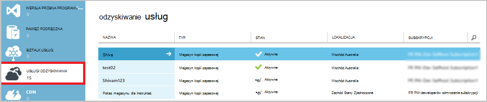

Po zaznaczeniu opcji u góry strony Szybki Start, są wyświetlane zadania zarządzania dostępne.

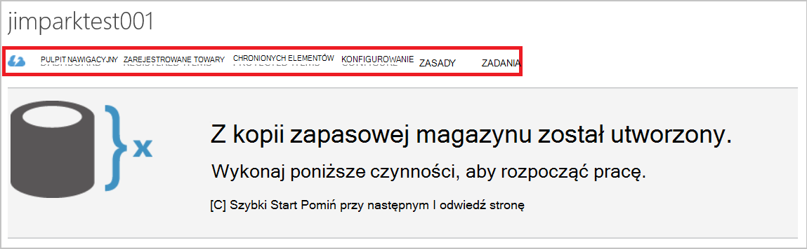

### Pulpit nawigacyjny
Wybierz pozycję **pulpit nawigacyjny** przejrzeć zastosowania na serwerze. Zawiera **Omówienie zastosowania** :

- Liczba serwerów Windows zarejestrowanych w chmurze
- Liczba Azure maszyn wirtualnych chronione w chmurze
- Całkowitą ilość przestrzeni dyskowej zużyte platformy Azure
- Stan zadań ostatnio używane

W dolnej części pulpitu nawigacyjnego można wykonywać następujące zadania:

- **Zarządzanie certyfikat** - Jeśli certyfikatu użytego do zarejestrować serwer, a następnie zaktualizuje certyfikatu. Jeśli korzystasz z magazynu poświadczeń, nie należy używać **certyfikatu Zarządzaj**.
- **Usuwanie** - usuwa bieżącego magazynu kopii zapasowej. Jeśli jest już używana magazynu kopii zapasowej, możesz usunąć go, aby zwolnić miejsce. **Usuwanie** jest dostępne tylko po usunięciu wszystkich serwerów zarejestrowanych z magazynu.

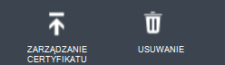

## Zarejestrowane towary
Wybierz pozycję **Registered elementy** , aby wyświetlać nazwy serwerów, które są zarejestrowane do tego magazynu.

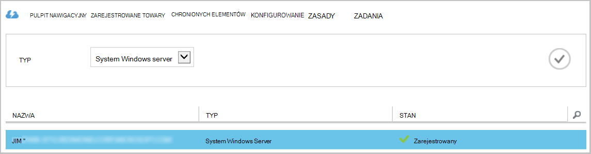

Domyślnie filtr **typu** do maszyn wirtualnych Azure. Aby wyświetlić nazwy serwerów, które są zarejestrowane do tego magazynu, wybierz **Serwer systemu Windows** z menu rozwijanego.

W tym miejscu można wykonywać następujące zadania:

- **Zezwalaj ponownej rejestracji** — po wybraniu tej opcji na serwerze umożliwia **Kreator rejestracji** w agenta firmy Microsoft Azure kopii zapasowej lokalnej zarejestrować serwer z kopii zapasowej magazynu po raz drugi. Konieczne może być ponownie zarejestrować z powodu błędu certyfikatu lub jeśli serwer musiał odbudowany.
- **Usuwanie** - usuwa serwer z kopii zapasowej magazynu. Wszystkie przechowywane dane skojarzone z serwerem zostanie natychmiast usunięta.

    

## Chronionych elementów
Zaznacz **Chronionych elementów** , wyświetlanie elementów, które zostały kopii zapasowej z serwerów.

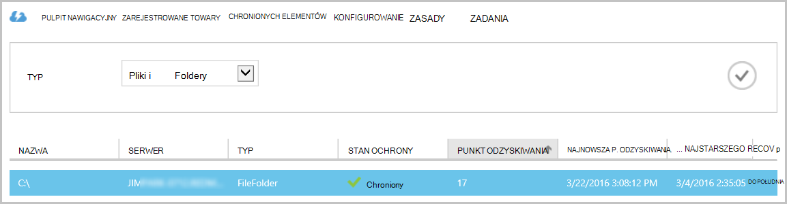

## Konfigurowanie

Na karcie **Konfigurowanie** można wybrać opcję nadmiarowości odpowiednie miejsca do magazynowania. Po utworzeniu magazynu i przed ani komputerów są rejestrowane do niego odpowiada najlepszej godziny, aby wybrać opcję nadmiarowości miejsca do magazynowania.

>[AZURE.WARNING] Po zarejestrowaniu elementu do magazyn opcja nadmiarowości magazynowania jest zablokowane i nie można modyfikować.

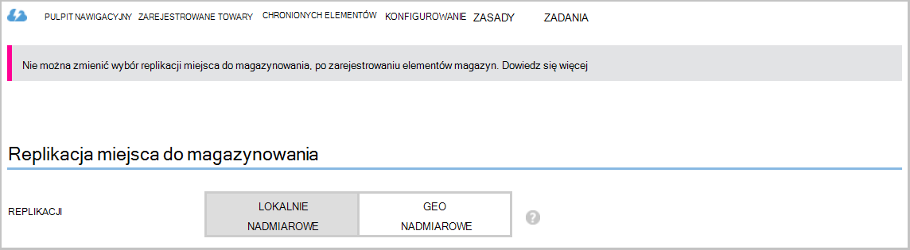

Zobacz ten artykuł, aby uzyskać więcej informacji na temat [nadmiarowości miejsca do magazynowania](../storage/storage-redundancy.md).

## Kopia zapasowa Microsoft Azure agenta zadania

### Konsoli

Otwórz **agenta kopia zapasowa Microsoft Azure** (można znaleźć go, wyszukując *Kopia zapasowa Microsoft Azure*komputera).

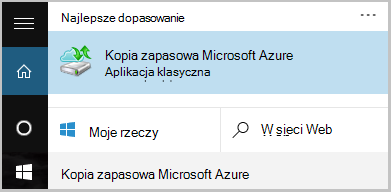

Z **Akcje** dostępne po prawej stronie konsoli agenta kopii zapasowej można wykonywać następujące zadania zarządzania:

- Rejestrowanie serwera
- Planowanie kopii zapasowej
- Wykonaj kopię zapasową teraz
- Zmienianie właściwości

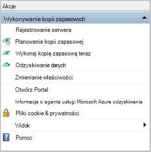

>[AZURE.NOTE] **Odzyskiwanie danych**zobacz [Przywracanie plików do programu Windows server lub komputer kliencki systemu Windows](backup-azure-restore-windows-server.md).

### Modyfikowanie istniejącą kopię zapasową

1. W kopii zapasowej Microsoft Azure agenta kliknij pozycję **Harmonogram tworzenia kopii zapasowych**.

    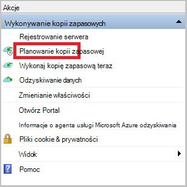

2. **Kreator kopii zapasowych harmonogram** pozostaw wybraną opcję **Wprowadź zmiany w celu elementy kopii zapasowej lub godziny** , a następnie kliknij przycisk **Dalej**.

    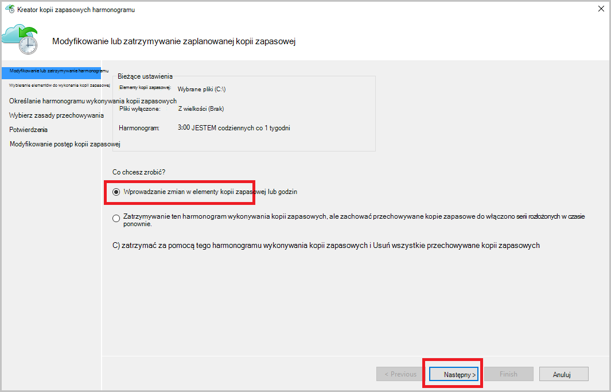

3. Jeśli chcesz dodać lub zmienić elementy, na ekranie, **Wybieranie elementów do wykonania kopii zapasowej** , kliknij pozycję **Dodaj elementy**.

    Można także ustawić **Wykluczeń ustawień** na tej stronie kreatora. Jeśli chcesz wykluczyć pliki lub procedura dodawania [Ustawienia wykluczeń](#exclusion-settings)więcej typów plików.

4. Zaznacz pliki i foldery, które chcesz wykonać kopię zapasową i kliknij **rekord**.

    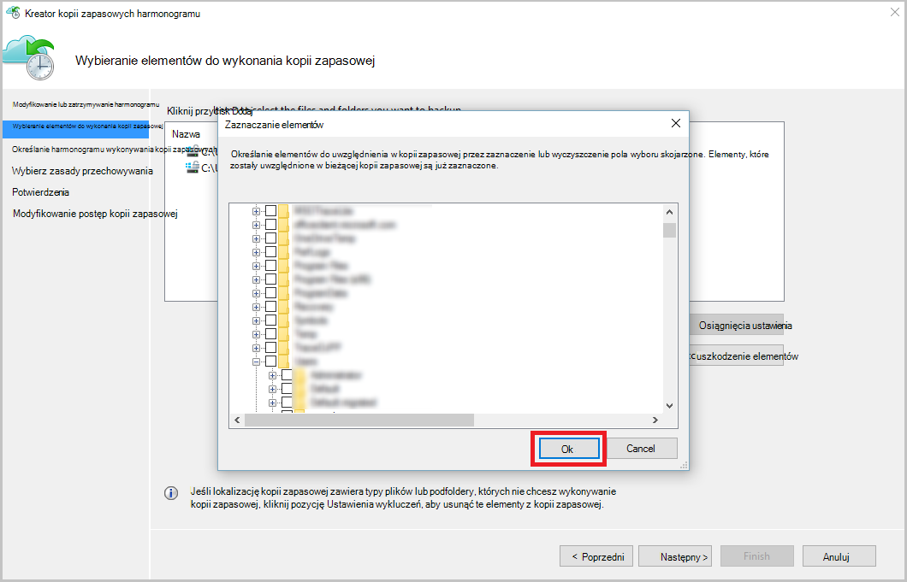

5. Określ **Harmonogram wykonywania kopii zapasowych** i kliknij przycisk **Dalej**.

    Można zaplanować dziennego (maksymalnie 3 razy dziennie) lub tygodniowy kopie zapasowe.

    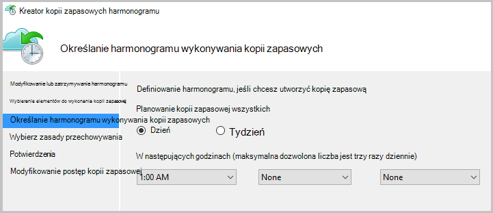

    >[AZURE.NOTE] Określanie harmonogramu wykonywania kopii zapasowych jest szczegółowo omówiono w tym [artykule](backup-azure-backup-cloud-as-tape.md).

6. Wybierz **Zasady przechowywania** kopii zapasowej, a następnie kliknij przycisk **Dalej**.

    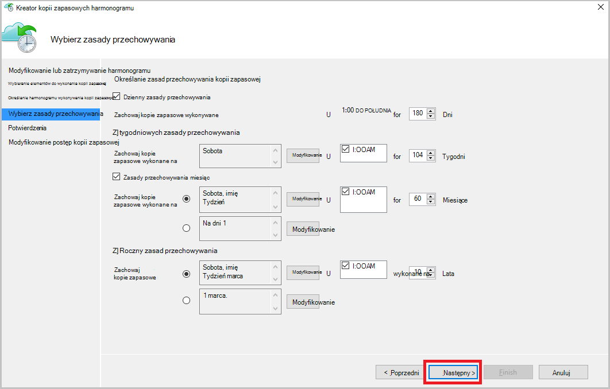

7. Na ekranie **potwierdzenia** Przejrzyj informacje i kliknij przycisk **Zakończ**.

8. Po zakończeniu pracy Kreator tworzenia **harmonogramu wykonywania kopii zapasowych**, kliknij przycisk **Zamknij**.

    Po zmodyfikowaniu ochrony, możesz upewnij się, że kopie zapasowe są poprawnie powodujące po przejściu do karty **zadania** i potwierdzenia, że zmiany są odzwierciedlane w zadań kopii zapasowej.

### Włącz ograniczanie przepustowości sieci  
Agent Azure Backup zawiera kartę Throttling, która pozwala na kontrolowanie sposobu użycia przepustowości sieci podczas przesyłania danych. Tego formantu może być przydatne, jeśli chcesz wykonać kopię zapasową danych podczas godziny pracy, ale nie chcesz wykonywania kopii zapasowej zakłócać pozostały ruch internetowy. Ograniczanie danych termicznego dotyczy wykonywanie kopii zapasowych i przywracanie działania.  

Aby włączyć ograniczania:

1. **Agent kopii zapasowej**kliknij pozycję **Zmień właściwości**.

2. Zaznacz pole wyboru **Włącz wykorzystania przepustowości internetowej ograniczania dla kopii zapasowych** .

    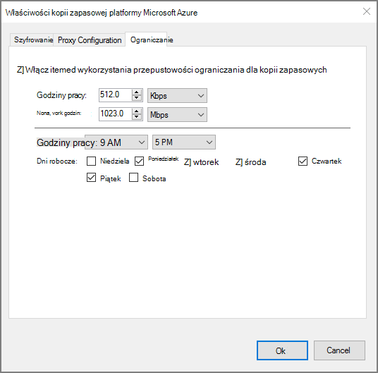

3. Po włączeniu ograniczania określić dozwolone przepustowość przesyłania danych z kopii zapasowej podczas **godzin pracy** i **godzin pracy nie**.

    Wartości przepustowości rozpoczynały 512 kilobajtów (KB/s) i można przejść do 1023 megabajtów na sekundę (MB/s). Można także określić rozpoczęcia i zakończenia dla **godzin pracy**i dni tygodnia są traktowane jako praca dni. Czas poza wyznaczonych godzin pracy jest uważany za wartością pracy.

4. Kliknij **przycisk OK**.

## Ustawienia wykluczeń

1. Otwórz **agenta kopia zapasowa Microsoft Azure** (można znaleźć go, wyszukując *Kopia zapasowa Microsoft Azure*komputera).

    

2. W kopii zapasowej Microsoft Azure agenta kliknij pozycję **Harmonogram tworzenia kopii zapasowych**.

    

3. W Kreatorze kopii zapasowej harmonogram pozostaw wybraną opcję **Wprowadź zmiany w celu elementy kopii zapasowej lub godziny** , a następnie kliknij przycisk **Dalej**.

    

4. Kliknij pozycję **Ustawienia wyłączenia**.

    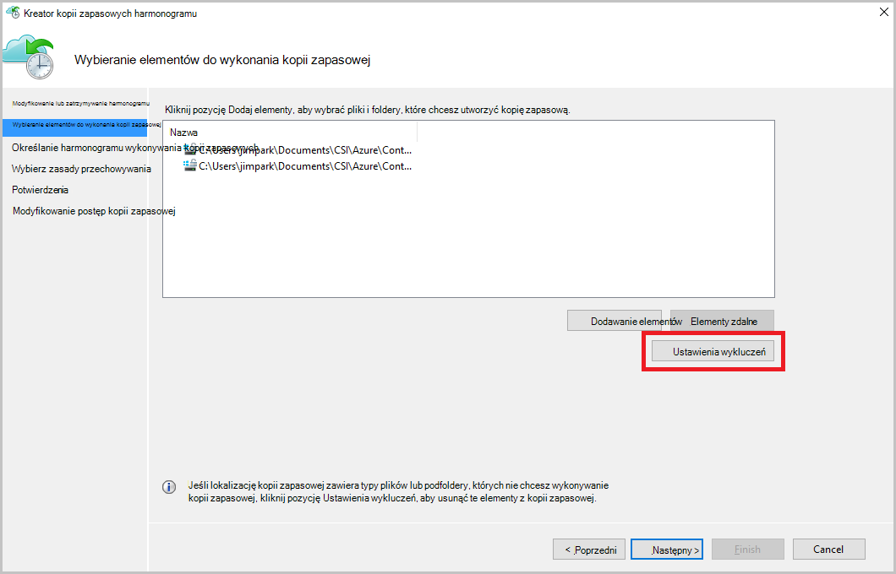

5. Kliknij przycisk **Dodaj wykluczeń**.

    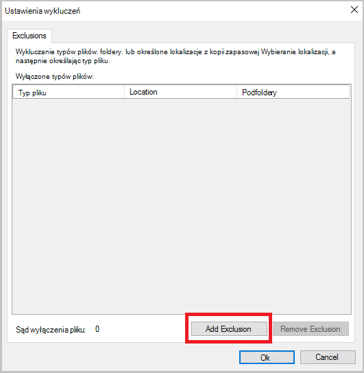

6. Wybierz lokalizację, a następnie kliknij **przycisk OK**.

    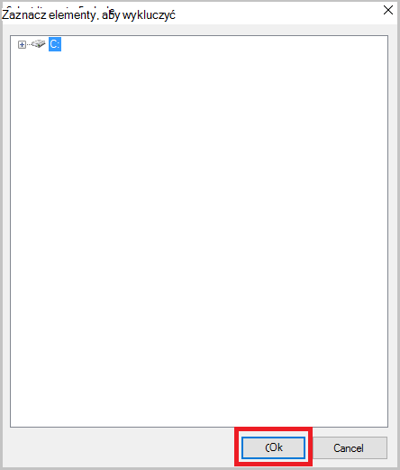

7. Dodawanie rozszerzenia pliku w polu **Typ pliku** .

    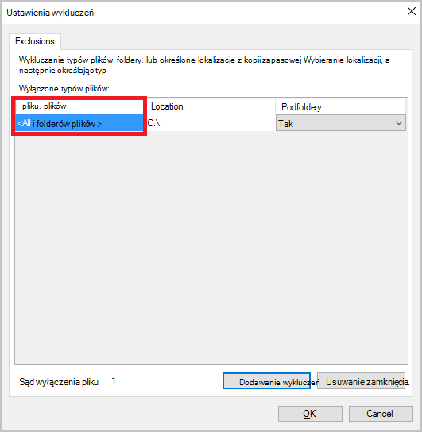

    Dodawanie rozszerzenia MP3

    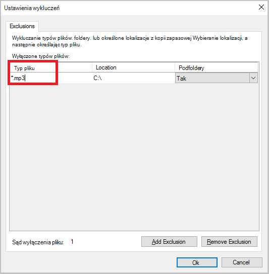

    Aby dodać inne rozszerzenie, kliknij pozycję **Dodaj wykluczanie** i wprowadź inną rozszerzenie typu pliku (Dodawanie rozszerzeniem JPEG).

    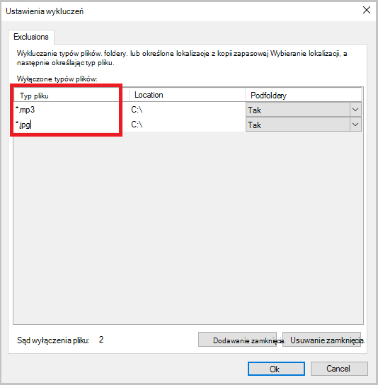

8. Po dodaniu wszystkich rozszerzeń, kliknij **przycisk OK**.

9. Kontynuuj korzystanie z Kreatora kopii zapasowej harmonogram, klikając przycisk **Dalej** aż do **strony potwierdzenia**, a następnie kliknij przycisk **Zakończ**.

    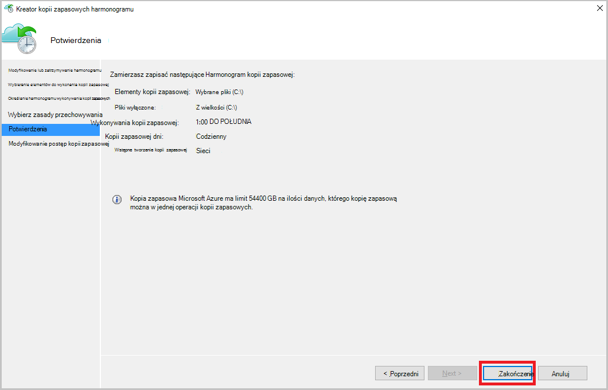

## Następne kroki
- [Przywracanie systemu Windows Server lub klienta w systemie Windows z platformy Azure](backup-azure-restore-windows-server.md)
- Aby dowiedzieć się więcej na temat kopii zapasowej Azure, zobacz [Omówienie kopii zapasowej Azure](backup-introduction-to-azure-backup.md)
- Odwiedź [Forum kopii zapasowej Azure](http://go.microsoft.com/fwlink/p/?LinkId=290933)
