<properties
    pageTitle="Zarządzanie magazynami usług Azure odzyskiwania i serwery | Microsoft Azure"
    description="Użyj tego samouczka, aby dowiedzieć się, jak do zarządzania magazynami usług Azure odzyskiwania i serwerów."
    services="backup"
    documentationCenter=""
    authors="markgalioto"
    manager="cfreeman"
    editor="tysonn"/>

<tags
    ms.service="backup"
    ms.workload="storage-backup-recovery"
    ms.tgt_pltfrm="na"
    ms.devlang="na"
    ms.topic="article"
    ms.date="10/19/2016"
    ms.author="jimpark; markgal"/>


# <a name="monitor-and-manage-azure-recovery-services-vaults-and-servers-for-windows-machines"></a>Monitorowanie i Zarządzanie magazynami usług Azure odzyskiwania serwerów w przypadku komputerów z systemem Windows

> [AZURE.SELECTOR]
- [Menedżer zasobów](backup-azure-manage-windows-server.md)
- [Klasyczny](backup-azure-manage-windows-server-classic.md)

W tym artykule znajdziesz Omówienie zadań zarządzania kopii zapasowej dostępne za pośrednictwem portalu Azure i agenta firmy Microsoft Azure kopii zapasowej.

[AZURE.INCLUDE [learn-about-deployment-models](../../includes/learn-about-deployment-models-rm-include.md)]model klasyczny wdrożenia.

## <a name="management-portal-tasks"></a>Zadania związane z zarządzaniem portalu

### <a name="access-your-recovery-services-vaults"></a>Uzyskiwanie dostępu do magazynów usługi odzyskiwania

1. Zaloguj się do [Azure Portal](https://portal.azure.com/) , korzystając ze swojej subskrypcji Azure.

2. W menu Centrum kliknij przycisk **Przeglądaj** , a następnie na liście zasobów, wpisz **Usługi odzyskiwania**. Po rozpoczęciu wpisywania, będzie filtrować listę według dane wejściowe. Kliknij pozycję **magazynów usługi odzyskiwania**.

    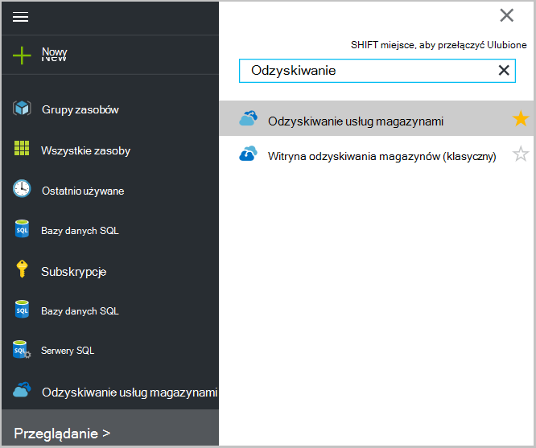 <br/>

2. Wybierz nazwę magazynu, które mają być wyświetlane na liście, aby otworzyć karta Pulpit nawigacyjny magazynu usługi odzyskiwania.

    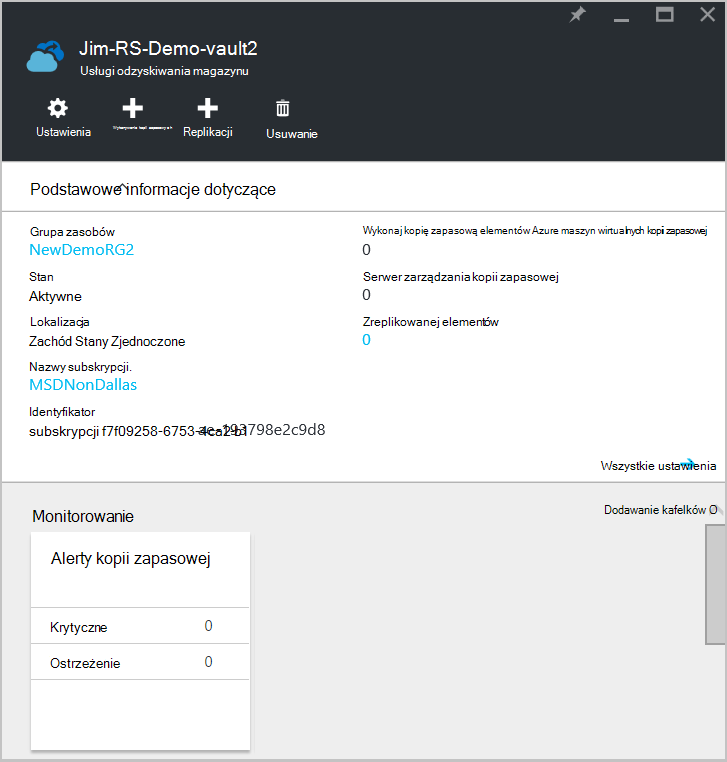 <br/>

## <a name="monitor-jobs-and-alerts"></a>Monitorowanie zadań i alertów
Możesz monitorować zadania i alerty z pulpitu nawigacyjnego magazynu usługi odzyskiwania, której wyświetlane:

- Szczegóły kopii zapasowej alertów
- Pliki i foldery, a także Azure maszyn wirtualnych chronione w chmurze
- Całkowite miejsce w magazynie zużyte platformy Azure
- Stan zadania wykonywania kopii zapasowej

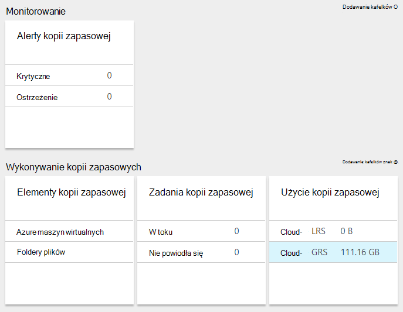

Kliknięcie informacje znajdujące się w każdej z tych tabliczek spowoduje otwarcie karta skojarzone, gdzie możesz zarządzać zadania pokrewne.

U góry pulpitu nawigacyjnego:

- Ustawienia zapewnia dostęp dostępnych zadań kopii zapasowej.
- Baza danych — ułatwia, których kopię zapasową nowych plików i folderów (lub maszyny wirtualne Azure) do magazynu usługi odzyskiwania.
- Usuń — Jeśli magazynu usługi odzyskiwania jest już używana, możesz go usunąć w celu zwolnienia miejsca. Usuń jest dostępne tylko po usunięciu wszystkich Serwery chronione z magazynu.

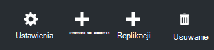
## <a name="alerts-for-backups-using-azure-backup-agent"></a>Alerty kopii zapasowych przy użyciu Azure agenta kopii zapasowej:
| Poziom alertów  | Wysyłania alertów |
| ------------- | ------------- |
| Krytyczne | Błąd kopii zapasowej, niepowodzenie odzyskiwania  |
| Ostrzeżenie  | Wykonywanie kopii zapasowych wypełnione ostrzeżeń (gdy mniej niż sto nie kopii zapasowej plików z powodu problemów z uszkodzenia i pomyślnie kopii zapasowej plików więcej niż miliona)  |
| Przedstawienie informacji  | Brak  |
## <a name="manage-backup-alerts"></a>Zarządzanie alertami kopii zapasowej
Kliknij Kafelek **Alertów kopii zapasowej** , aby otworzyć karta **Alertów kopii zapasowej** alertów i zarządzanie nimi.


Kafelków alerty kopii zapasowej zawiera numer:

- krytyczne ostrzeżenia nieokreślony w ostatnich 24 godzin
- Ostrzeżenie dotyczące alertów nieokreślony w ostatnich 24 godzin

Klikając pozycję na każde z tych łączy przejście do karta **Alertów kopia zapasowa** z widoku filtrowanego tych alertów (krytyczne lub ostrzeżenie).

Z karta alertów kopii zapasowej możesz:

- Wybierz odpowiednie informacje, które chcesz dołączyć alertów.

    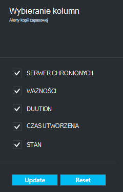

- Filtrowanie alerty czas ważności, stanu i rozpoczęcia i zakończenia.

    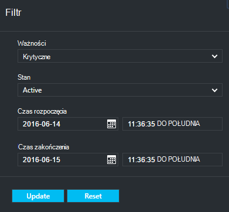

- Konfigurowanie powiadomień dla ważności, częstotliwość i adresatów, a także włączenie lub wyłączanie alertów.

    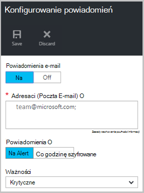

Jeśli **Na Alert** jest wybrany częstotliwość **powiadamiania** występuje nie grupowania lub zmniejszenie w wiadomościach e-mail. Każdym alertem wynikiem 1 powiadomienie. Jest to ustawienie domyślne i rozdzielczości wiadomości e-mail jest wysyłana także natychmiast.

Zaznaczenie **Szyfrowane godzinę** jako **powiadamiania** częstotliwość poczty e-mail są wysyłane do użytkownika informacją o tym, czy nierozpoznane alerty o nowym wygenerowane w ostatniej godziny. Wiadomość e-mail z rozdzielczości zostaną wysłane na końcu godzinę.

Alerty mogą być wysyłane następujące poziomu ważności:

- krytyczne
- Ostrzeżenie
- informacje o

Wyłączenie alertu przycisk **Dezaktywuj** w Karta Szczegóły zadania. Po kliknięciu przycisku dezaktywowanie, umożliwiają rozdzielczość notatki.

Możesz wybrać kolumny, które mają być wyświetlane jako część alert przy użyciu przycisku **Wybierz kolumny** .

>[AZURE.NOTE] Z karta **Ustawienia** zarządzania kopii zapasowej alertów, wybierając pozycję **monitorowania i Raporty > Alerty i zdarzeń > Alerty kopii zapasowej** , a następnie klikając polecenie **Filtr** lub **Skonfigurować powiadomienia**.

## <a name="manage-backup-items"></a>Zarządzanie elementami kopii zapasowej
Zarządzanie lokalnych kopii zapasowych jest teraz dostępny w portalu zarządzania. W sekcji Backup pulpitu nawigacyjnego kafelków **Elementy kopii zapasowej** zawiera liczbę kopii zapasowej elementów chronione magazyn.

Kliknij pozycję **Foldery plików** kafelku elementy kopii zapasowej.

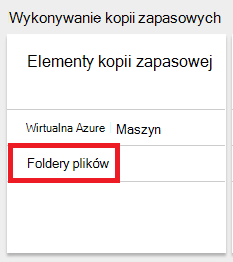

Karta elementy kopii zapasowej zostanie otwarta przy użyciu filtru zestawu do folderu plików, której wyświetlane każdej kopii zapasowej elementu na liście.

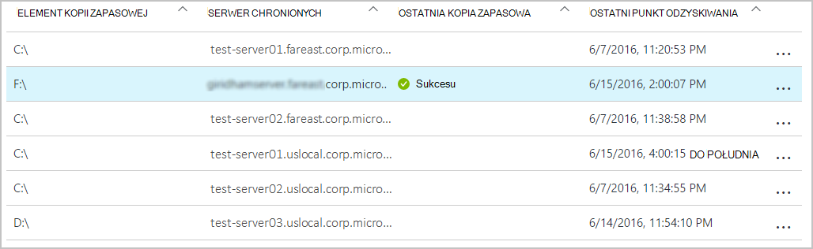

Po wybraniu określonego elementu kopii zapasowej na liście pojawi się podstawowych informacji dla tego elementu.

>[AZURE.NOTE] Z karta **Ustawienia** zarządzania pliki i foldery, wybierając pozycję **chronionych elementów > elementy kopii zapasowej** , a następnie wybierając z menu rozwijanego **Folderów plików** .

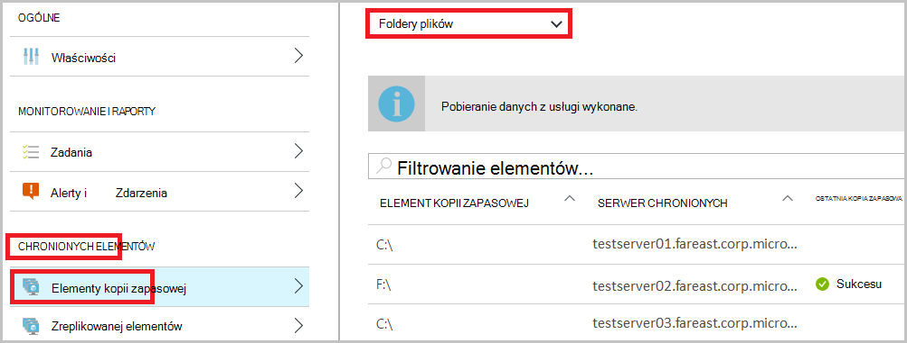

## <a name="manage-backup-jobs"></a>Zarządzanie zadaniami kopii zapasowej
Kopia zapasowa zadania dla obu lokalnego (podczas lokalnego serwera wykonuje kopię zapasową Azure) i Azure kopie zapasowe są widoczne na pulpicie nawigacyjnym.

W sekcji Backup pulpitu nawigacyjnego kafelków zadania kopii zapasowej pokazuje liczbę zadań:

- w toku
- Nie można w ciągu ostatnich 24 godzin.

Aby zarządzać zadań kopii zapasowych, kliknij opcję **Zadania kopii zapasowej** zostanie wyświetlona karta zadania kopii zapasowej.

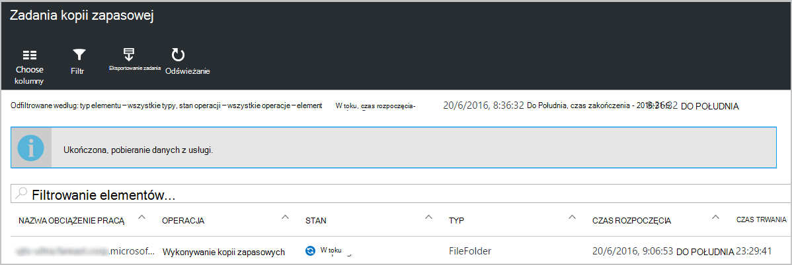

Modyfikowanie informacji dostępnych w karta zadaniami kopii zapasowej przy użyciu przycisku **Wybierz kolumny** w górnej części strony.

Przycisk **Filtr** umożliwia wybranie plików i folderów z kopii zapasowej Azure maszyn wirtualnych.

Jeśli nie widzisz kopie zapasowe plików i folderów, kliknij przycisk **Filtr** w górnej części strony, a następnie wybierz z menu Typ elementu **plików i folderów** .

>[AZURE.NOTE] Z karta **Ustawienia** Zarządzanie zadaniami kopii zapasowej, wybierając pozycję **monitorowania i Raporty > zadania > zadania kopii zapasowej** , a następnie wybierając z menu rozwijanego **Folderów plików** .

## <a name="monitor-backup-usage"></a>Monitorowanie użycia kopii zapasowej
W sekcji Backup pulpitu nawigacyjnego kafelków zastosowania kopii zapasowej wyświetlić magazynowania zużyte platformy Azure. Użycie magazynu jest przeznaczone dla:
- Użycie magazynu LRS skojarzone z magazynu w chmurze
- Użycie magazynu GRS skojarzone z magazynu w chmurze

## <a name="production-servers"></a>Serwerów produkcyjnych
Aby zarządzać publicznie serwerach, kliknij przycisk **Ustawienia**. W obszarze Zarządzanie kliknij pozycję **infrastruktury kopii zapasowej > serwerów produkcyjnych**.

Karta serwerów produkcyjnych listy wszystkich serwerów produkcyjnych. Kliknij na serwerze, na liście Otwórz szczegóły serwera.

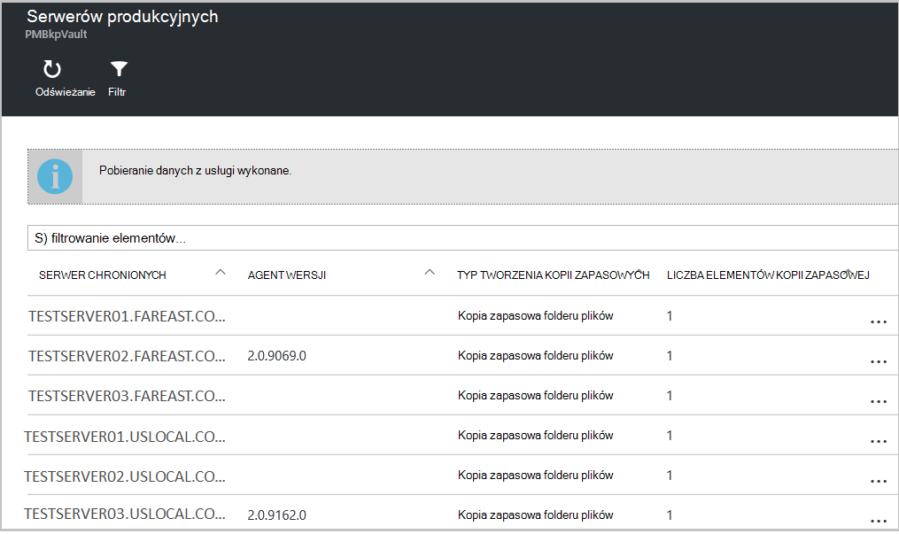

## <a name="microsoft-azure-backup-agent-tasks"></a>Kopia zapasowa Microsoft Azure agenta zadania

## <a name="open-the-backup-agent"></a>Otwórz agenta kopii zapasowej

Otwórz **agenta kopia zapasowa Microsoft Azure** (możesz je znaleźć, wyszukując *Kopia zapasowa Microsoft Azure*komputera).


Z **Akcje** dostępne po prawej stronie konsoli agenta kopii zapasowej, należy wykonać następujące zadania zarządzania:

- Rejestrowanie serwera
- Planowanie kopii zapasowej
- Wykonaj kopię zapasową teraz
- Zmienianie właściwości

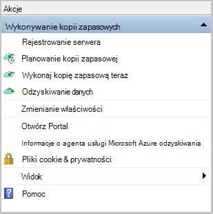

>[AZURE.NOTE] **Odzyskiwanie danych**zobacz [Przywracanie plików do programu Windows server lub komputer kliencki systemu Windows](backup-azure-restore-windows-server.md).

## <a name="modify-an-existing-backup"></a>Modyfikowanie istniejącą kopię zapasową

1. W kopii zapasowej Microsoft Azure agenta kliknij pozycję **Harmonogram tworzenia kopii zapasowych**.

    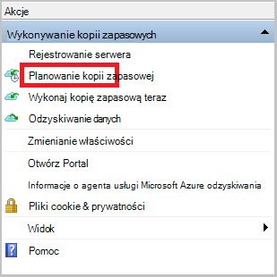

2. **Kreator kopii zapasowych harmonogram** pozostaw wybraną opcję **Wprowadź zmiany w celu elementy kopii zapasowej lub godziny** , a następnie kliknij przycisk **Dalej**.

    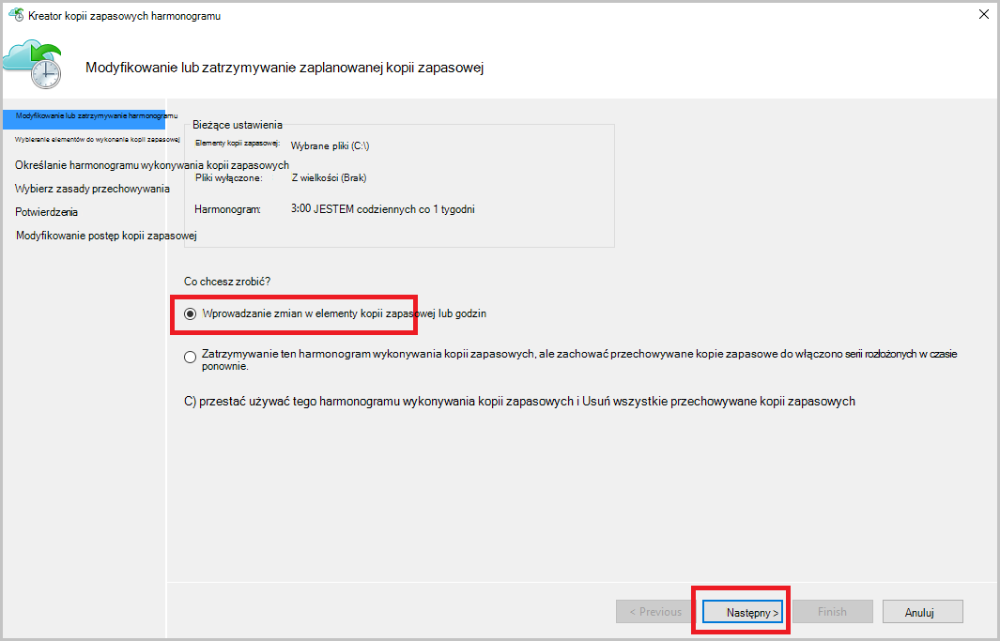

3. Jeśli chcesz dodać lub zmienić elementy, na ekranie, **Wybieranie elementów do wykonania kopii zapasowej** , kliknij pozycję **Dodaj elementy**.

    Można także ustawić **Wykluczeń ustawień** na tej stronie kreatora. Jeśli chcesz wykluczyć pliki lub procedura dodawania [Ustawienia wykluczeń](#exclusion-settings)więcej typów plików.

4. Zaznacz pliki i foldery, które chcesz wykonywanie kopii zapasowej, a następnie kliknięcie **pozycji rekord**.

    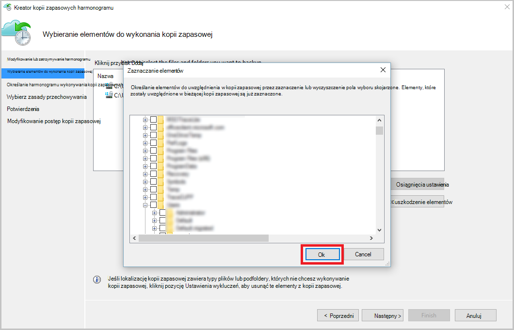

5. Określ **Harmonogram wykonywania kopii zapasowych** i kliknij przycisk **Dalej**.

    Można zaplanować dziennego (maksymalnie 3 razy dziennie) lub tygodniowy kopie zapasowe.

    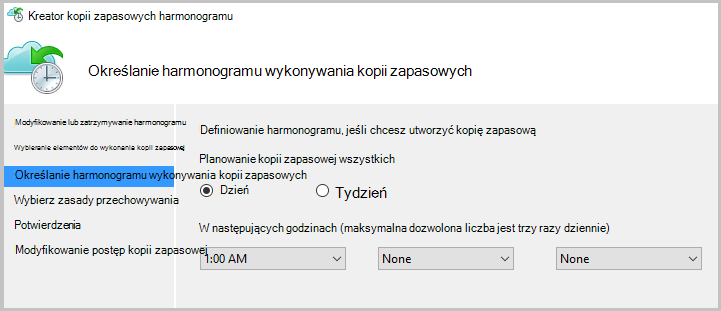

    >[AZURE.NOTE] Określanie harmonogramu wykonywania kopii zapasowych jest szczegółowo omówiono w tym [artykule](backup-azure-backup-cloud-as-tape.md).

6. Wybierz **Zasady przechowywania** kopii zapasowej, a następnie kliknij przycisk **Dalej**.

    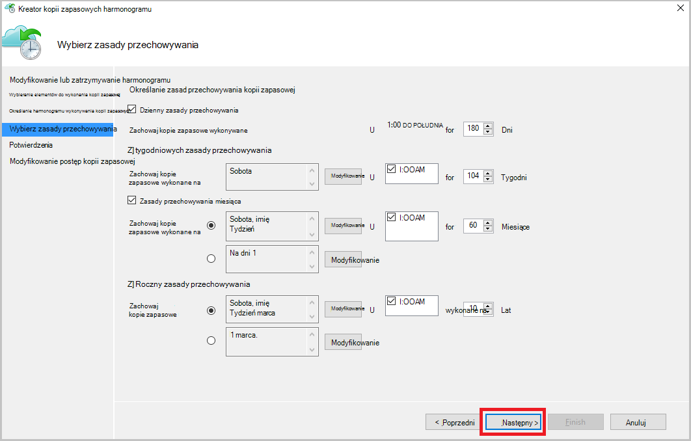

7. Na ekranie **potwierdzenia** Przejrzyj informacje i kliknij przycisk **Zakończ**.

8. Po zakończeniu pracy Kreator tworzenia **harmonogramu wykonywania kopii zapasowych**, kliknij przycisk **Zamknij**.

    Po zmodyfikowaniu ochrony, możesz upewnij się, że kopie zapasowe są poprawnie powodujące po przejściu do karty **zadania** i potwierdzenia, że zmiany są odzwierciedlane w zadań kopii zapasowej.

## <a name="enable-network-throttling"></a>Włącz ograniczanie przepustowości sieci  
Agent Azure Backup zawiera kartę Throttling, która pozwala na kontrolowanie sposobu użycia przepustowości sieci podczas przesyłania danych. Tego formantu może być przydatne, jeśli chcesz wykonać kopię zapasową danych podczas godziny pracy, ale nie chcesz wykonywania kopii zapasowej zakłócać pozostały ruch internetowy. Ograniczanie danych transfer dotyczy wykonywanie kopii zapasowych i przywracanie działania.  

Aby włączyć ograniczania:

1. **Agent kopii zapasowej**kliknij pozycję **Zmień właściwości**.

2. Na **ograniczania karta, wybierz pozycję **Włącz wykorzystania przepustowości internetowej ograniczania dla kopii zapasowej operacje **.

    

    Po włączeniu ograniczania określić dozwolone przepustowość przesyłania danych z kopii zapasowej podczas **godzin pracy** i **godzin pracy nie**.

    Wartości przepustowości rozpoczynały 512 kilobajtów (KB/s) i można przejść do 1023 megabajtów na sekundę (MB/s). Można także określić rozpoczęcia i zakończenia dla **godzin pracy**i dni tygodnia są traktowane jako praca dni. Czas poza wyznaczonych godzin pracy jest uważany za wartością pracy.

3. Kliknij **przycisk OK**.

## <a name="manage-exclusion-settings"></a>Zarządzanie ustawieniami wykluczeń

1. Otwórz **agenta kopia zapasowa Microsoft Azure** (można znaleźć go, wyszukując *Kopia zapasowa Microsoft Azure*komputera).

    

2. W kopii zapasowej Microsoft Azure agenta kliknij pozycję **Harmonogram tworzenia kopii zapasowych**.

    

3. W Kreatorze kopii zapasowej harmonogram pozostaw wybraną opcję **Wprowadź zmiany w celu elementy kopii zapasowej lub godziny** , a następnie kliknij przycisk **Dalej**.

    

4. Kliknij pozycję **Ustawienia wyłączenia**.

    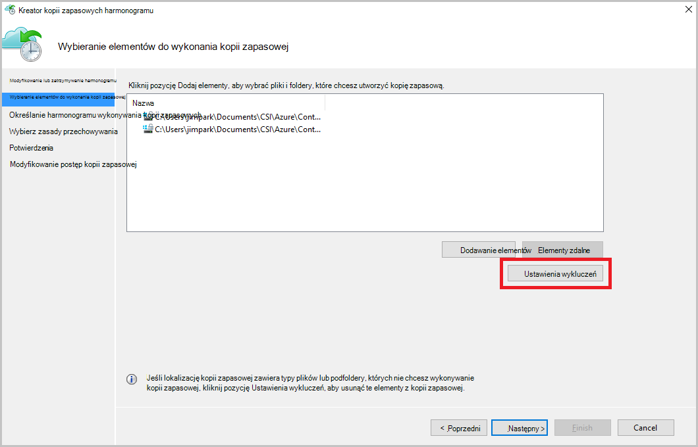

5. Kliknij przycisk **Dodaj wykluczeń**.

    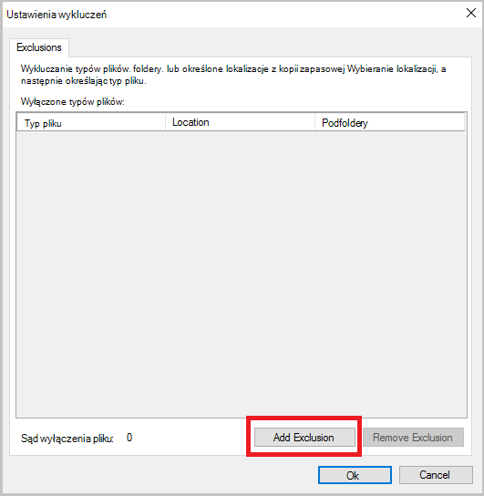

6. Wybierz lokalizację, a następnie kliknij **przycisk OK**.

    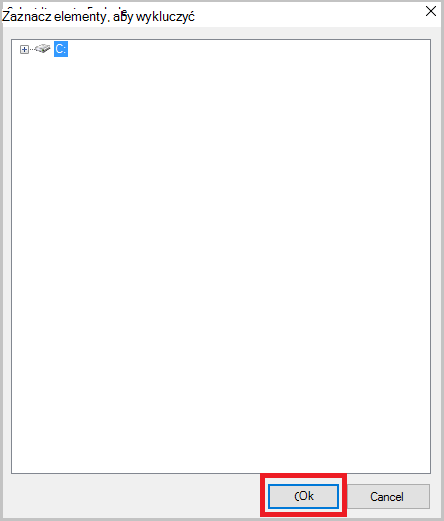

7. Dodawanie rozszerzenia pliku w polu **Typ pliku** .

    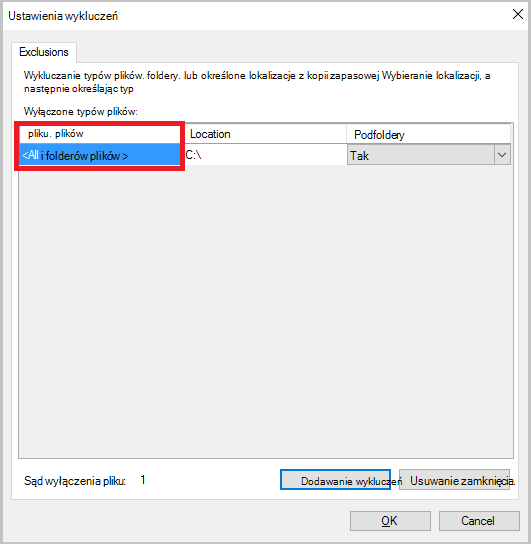

    Dodawanie rozszerzenia MP3

    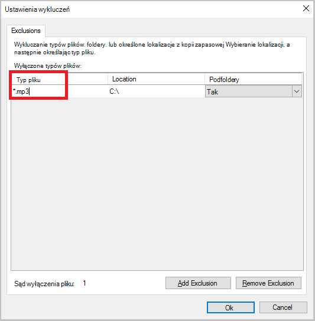

    Aby dodać inne rozszerzenie, kliknij pozycję **Dodaj wykluczanie** i wprowadź inną rozszerzenie typu pliku (Dodawanie rozszerzeniem JPEG).

    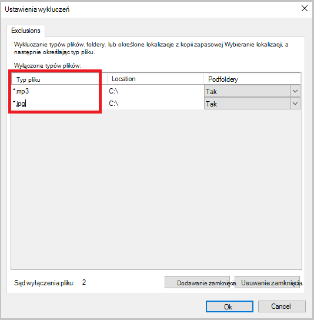

8. Po dodaniu wszystkich rozszerzeń, kliknij **przycisk OK**.

9. Kontynuuj korzystanie z Kreatora kopii zapasowej harmonogram, klikając przycisk **Dalej** aż do **strony potwierdzenia**, a następnie kliknij przycisk **Zakończ**.

    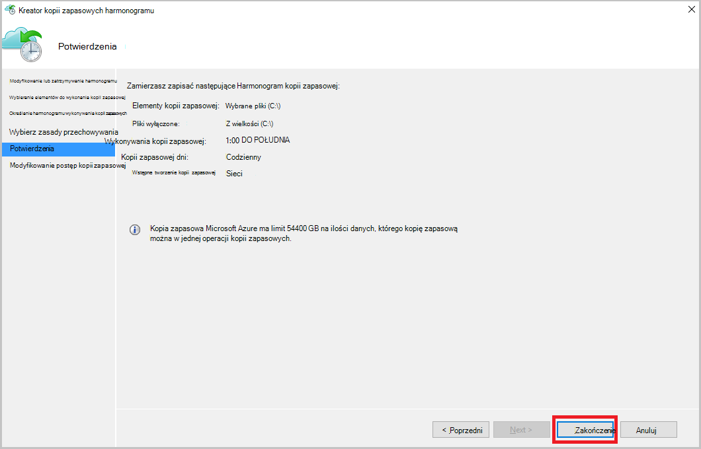

## <a name="frequently-asked-questions"></a>Często zadawane pytania
**K1. Zadania wykonywania kopii zapasowej stan jest wyświetlany jako ukończone w Azure agenta kopii zapasowej, dlaczego nie uzyskać odzwierciedlane bezpośrednio w portalu?**

A1. Jest w Maksymalne opóźnienie w ciągu 15 minut między stanu zadania wykonywania kopii zapasowej odzwierciedlane w Azure agent kopii zapasowej i Azure portal.

**Q.2, gdy zadanie kopii zapasowej nie powiedzie się, jak długo trwa lepszego alertu?**

A.2 alert jest uruchamiany w 20 minutach Azure niepowodzeniu wykonywania kopii zapasowej.

**K3. Czy istnieje sprawy miejsce, w którym nie zostaną wysłane wiadomości e-mail Jeśli skonfigurowano powiadomienia?**

A3. Poniżej są przypadkach, gdy nie zostaną wysłane powiadomienie w celu zmniejszenia hałasu alert:

   - Jeśli powiadomienia są skonfigurowane co godzinę i alert jest uruchamiany i rozwiązany w ciągu godziny
   - Zadanie zostało anulowane.
   - Druga zadania wykonywania kopii zapasowej nie powiodło się, ponieważ oryginalny zadania wykonywania kopii zapasowej jest w toku.

## <a name="troubleshooting-monitoring-issues"></a>Rozwiązywanie problemów z konfiguracją monitorowania

**Problem:** Zadania i/lub alerty agenta kopii zapasowej Azure nie jest wyświetlana w portalu.

**Czynności rozwiązywania problemów:** Proces, ```OBRecoveryServicesManagementAgent```, wysyła dane zadanie i alert z usługą Azure kopii zapasowej. Czasami zawiesić się ten proces lub zamknięcia.

1. Aby sprawdzić, proces nie jest uruchomiony, otwórz **Menedżera zadań** i sprawdź, czy ```OBRecoveryServicesManagementAgent``` jest uruchomiony proces.

2. Przy założeniu, że proces nie jest uruchomiony, otwórz **Panel sterowania** i przejdź na liście usług. Uruchom lub uruchom ponownie **Program Microsoft Azure odzyskiwania usług zarządzania Agent**.

    Aby uzyskać więcej informacji możesz przeglądać dzienniki na:<br/>
`<AzureBackup_agent_install_folder>\Microsoft Azure Recovery Services Agent\Temp\GatewayProvider*`. Na przykład:<br/> `C:\Program Files\Microsoft Azure Recovery Services Agent\Temp\GatewayProvider0.errlog`.

## <a name="next-steps"></a>Następne kroki
- [Przywracanie systemu Windows Server lub klienta w systemie Windows z platformy Azure](backup-azure-restore-windows-server.md)
- Aby dowiedzieć się więcej na temat kopii zapasowej Azure, zobacz [Omówienie kopii zapasowej Azure](backup-introduction-to-azure-backup.md)
- Odwiedź [Forum kopii zapasowej Azure](http://go.microsoft.com/fwlink/p/?LinkId=290933)
